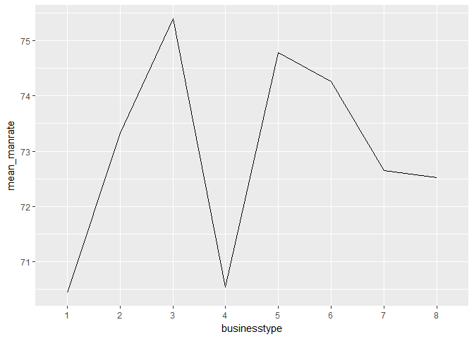
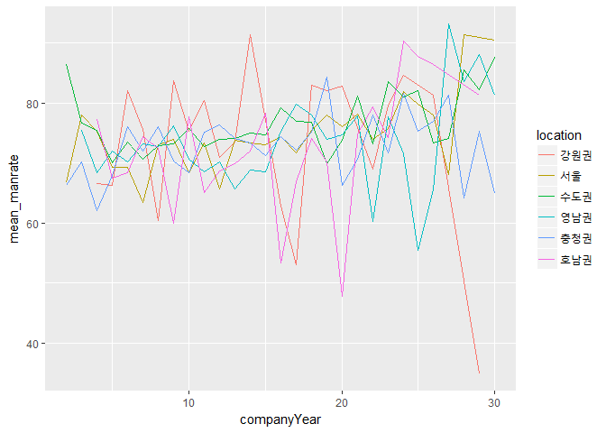

벤처기업 사내 성비 관련 분석
================

###### 조사팀 : 송민기 김세미 김은정 백다혜 안은영

1 요약
------

벤처기업의 성비는 대부분 남초이다. 설립한 지 오래 된 벤처 기업일수록 남성 비율이 더 높은 경향이 있다. 기계/제조/자동차업종의 평균적으로 설립된 지 가장 오래되었으며, 실제로 기계/제조/자동차업종은 성비가 높은 것으로 드러났다. 즉 설립된 지 오래될 수록 성비가 높은 업종이 많이 분포하여 남성 비율이 높아지는 인과 관계가 있는 것이다. 이러한 회사 연수에 따른 성비 변화를 지역별로 살펴보면, 지역 별 약간의 차이는 있으나 오래 될 수록 남성 비율이 높아지는 경향성을 비슷하게 보인다. 또한 대표 이사가 남성인 회사는 사내 남성 비율이 더 높게 분포하는 반면, 대표 이사가 여성인 기업은 그보다 낮은 사내 남성 비율을 보인다.

2 분석 주제
-----------

벤처 기업 사내 성비 관련 조사 - 벤처기업 설립 후 기간(년수)에 따른 성비 변화 - 업종과 설립 년수의 관계(업종 별 평균 설립 년수) - 업종에 따른 성비 - 설립 후 년수에 따른 성비 변화가 모든 지역에서 동일하게 일어나는가? - 대표 이사의 성별에 따라 사내 성비가 차이나는가?

시사저널 e \[2017 사업보고서-직원\] 30대 기업 남녀성비 불균형 심각 &lt; <http://www.sisajournal-e.com/biz/article/166951> &gt; 의 자료에 따르면 30대 기업 10명 중 8명이 남성일 정도로 성비 불균형이 심각하다고 한다. 본 팀은 이에 문제의식을 갖고, 벤처기업에서도 같은 현상이 나타나는지에 대해 알아보고자 했다. 또한 어떤 요인들이 성비에 영향을 주는지 조사하고자 이 주제를 선정하게 되었다.

3 데이터 선정
-------------

데이터 : 2016년 벤처기업정밀실태조사

### 데이터 선정 이유

취업에 관심도가 높은 대학생의 신분으로서, 벤처 기업에 취업할 가능성이 충분히 있으므로 분석할 가치가 있다고 판단했다. 대학생 및 취준생에게 참고가 될 수 있는 분석이며, 벤처 기업 여건 개선의 근거가 될 여지가 있다고 생각한다. 젠더 문제로 여러 이슈가 끊이지 않고 있는 지금, 기업의 성비에 대한 분석은 높은 시의성을 가진다. 같은 주제에 대한 2017년 분석 데이터는 내년에 발표되므로, 분석 데이터인 '2016년 벤처기업정밀실태조사'가 가장 최근 데이터이다.

### 데이터 소개(출처, 특성, 구성)

출처 - 공공데이터포털 - <https://www.data.go.kr/dataset/3043469/fileData.do>

특성 - 본 통계는 2015년 12월말 기준 벤처확인기업의 일반현황과 경영성과 등에 관한 기초 통계자료를 조사․분석한 것임 - 본 보고서는 2,049개 벤처확인기업의 표본조사 결과를 모수(31,189개, 예비벤처제외) 추정한 결과임

구성 - 매출규모나 기술, 브랜드 등 벤처 기업과 관련된 255개의 변수가 있는 데이터이나, 분석에 필요한 설립년도, 남성 종사자 수, 여성 종사자 수, 지역, 대표이사 성별 등의 변수를 이용하였다.

4 분석(코드, 표, 그래프, 해석 포함)
-----------------------------------

### 분석 목적 및 방법

'2016년 벤처기업정밀실태조사' 데이터를 이용해 기업의 연수에 따른 성비 변화를 분석할 것이다. 위의 분석 주제에서도 언급했듯 대기업에서도 성비 불균형이 심각하다고 한다. 필자는 대기업이 아닌 벤처 기업에서도 이러한 성비 불균형 현상이 나타날 것이라 추측했고, 어떤 변수들이 성비에 영향을 미치는지 알아보고 싶었다. 이 보고서는 설립한 지 오래된 회사일수록 성비 불균형 현상이 크게 나타날 것이라 예측하고 분석한 결과이다.

회사 연수에 따른 남성 비율 변화 - 데이터의 설립년도를 통해 얼마나 오래된 회사인지를 나타내는 변수를 새로 만든다. - 데이터의 남성과 여성 종사자 수를 이용해 성비 변수를 구한다. - 위의 두 변수의 상관관계를 찾아 시각화한다.

업종에 따른 설립년수 분포 - 업종별로 그룹화해 설립년수의 평균을 구한다.

업종에 따른 성비 - 업종별로 그룹화해 성비를 계산한다.

회사 연수에 따른 성비 변화가 각 지역별로 동일하게 나타나는가 - 각 지역별로 데이터를 나누어 각각의 수치들이 어떤 경향을 드러내는지 파악한다.

대표이사 성별에 따른 성비 - 대표이사가 남자인 경우와 여자인 경우의 성비의 분포를 비교한다.

### 변수 검토 및 전처리

##### 라이브러리 불러오기

``` r
library(dplyr)
library(ggplot2)
```

##### 데이터 불러오기

변수명이 매우 긴 한글 및 기호 변수여서, `header = F`처리해 임시 변수(`V`)로 변환했다. 첫 줄로 내려온 원래의 한글 변수명들을 제거한다.

``` r
raw<-read.csv("teamraw.csv", header = F)
data<-raw[-1,]
```

##### 데이터 파악

데이터의 기본 특성을 파악한다. (보고서가 너무 길어져 임시로 비활성화)

``` r
#head(data)
#tail(data)
#View(data)
dim(data)
```

    ## [1] 2049  256

``` r
#str(data)
#summary(data)
```

##### 필요한 변수 생성

경과년수 변수 생성

``` r
#1년 단위
data<- data %>% mutate(companyYear = as.integer(format(Sys.Date(),"%Y")) - strtoi(data$V11)) 
```

-   '설립한 지 얼마나 됐는가'를 수치화 한 변수를 만든다.

성비 및 기타 변수 생성

``` r
#사내 남성 수 변수 생성
data<-data %>% mutate(man=strtoi(data$V89)) 

#사내 여성 수 변수 생성(아래 결측치 확인 단계에서 결측치 검출되어 필터링)
data<-data %>% mutate(woman=strtoi(data$V90)) %>% filter(!is.na(woman)) 

#총 사원 수 변수 생성
data<-data %>% mutate(gendertotal=(man+woman)) 

#성비 (1:1일경우 50%인 기준, 최대 100%)
data<-data %>% mutate(manrate=(man/gendertotal*100))

#세분화된 지역을 권역으로 묶은 변수를 만든다.
data <- data %>% mutate(location = ifelse(V6 %in% c("서울"), "서울",
                        ifelse(V6 %in% c("경기","인천"), "수도권",
                               ifelse(V6 %in% c("충남","대전","세종","충북"), "충청권",
                                      ifelse(V6 %in% c("강원"), "강원권",
                                             ifelse(V6 %in% c("대구","부산","경남", "경북","울산"), "영남권",
                                                    ifelse(V6 %in% c("전북", "전남","광주","제주"), "호남권","기타")))))))

#업종 변수 이름 변경
data<-rename(data,businesstype=V3)

#대표이사 성별 변수 이름 변경
data<-rename(data,ceosex=V26)
```

-   남성 수, 여성 수, 사원 수, 성비 변수를 만든다.

##### 결측치 구하기

결측치 있는지 확인

``` r
table(is.na(data$companyYear))
```

    ## 
    ## FALSE 
    ##  2048

``` r
table(is.na(data$man))
```

    ## 
    ## FALSE 
    ##  2048

``` r
table(is.na(data$woman))
```

    ## 
    ## FALSE 
    ##  2048

``` r
table(is.na(data$businesstype))
```

    ## 
    ## FALSE 
    ##  2048

``` r
table(is.na(data$ceosex))
```

    ## 
    ## FALSE 
    ##  2048

##### 데이터가 유효한지

``` r
ggplot(data=data, aes(x=companyYear)) + geom_bar()
```


-   30년 이상 된 벤처기업들이 거의 없어 평균의 의미가 변질된다고 판단된다. 그래서 분석 범위를 좁히기로 했다.

``` r
data <- data %>% filter(companyYear<=30)
ggplot(data=data, aes(x=companyYear)) + geom_bar()
```


-   표본이 풍부한 30년 이전 기업들로 범위를 축소했다.

``` r
#5년단위 그룹 - 그래프 단순화해서 보기 위함
data_group5y<-data %>% mutate(companyYearBy5=ifelse(companyYear<5,"00~05",     
                                            ifelse(companyYear<10,"06~10",
                                                   ifelse(companyYear<15,"11~15",
                                                          ifelse(companyYear<20,"16~20",
                                                                 ifelse(companyYear<25,"21~25","26~30"))))))
```

-   이후 가공된 데이터를 직관적으로 시각화하기 위해 미리 5년으로 묶인 변수를 만든다.

### 분석 및 해석

회사 연수에 따른 남성 비율 변화

``` r
test<- data %>% group_by(companyYear) %>% summarise(mean_manrate=mean(manrate)) %>% arrange(companyYear)
ggplot(data=test, aes(x=companyYear,y=mean_manrate)) + geom_line()
```


-   회사 연수에 따른 남성 비율 변화 그래프이다. 먼저, Y축인 `mean_manrate`변수는 사내 남성의 비율을 평균화한것이고, X축인 `companyYear`는 회사가 몇 년 됐는지 알려주는 변수이다.
-   그래프 상에서 가장 낮은 남성 비율 수치가 무려 69 이상이다. 대부분의 회사가 남초라는 의미이다.
-   매년 요동치는 형태의 그래프지만, 전체적인 흐름은 회사가 오래될 수록 남성의 비율이 높아지고 있음을 보인다.

------------------------------------------------------------------------

회사 연수 (5년으로 그룹) 증가당 남성 비율 변화

``` r
test_5year<- data_group5y %>% group_by(companyYearBy5) %>% summarise(mean_manrate=mean(manrate)) %>% arrange(companyYearBy5) 
ggplot(data=test_5year, aes(x=companyYearBy5,y=mean_manrate, group=1)) + geom_line()
```


-   더욱 직관적으로 보기 위해 5년 단위로 묶어 평균을 내 보았다. 오래된 회사일 수록 남성의 비율이 높아지고 있음이 더욱 확고하게 드러난다.

그렇다면 왜 이러한 결과가 나오는 것인가? 본 팀은 업종과 성비의 인과관계가 있다고 추측하였고, 오래된 회사일수록 남초 업종인 경우가 많을 것이라는 가설을 세웠다.

그래서 이번엔 업종에 따른 회사의 년수를 비교해 보았다.

------------------------------------------------------------------------

``` r
a<- data %>% group_by(businesstype) %>% summarise(mean_companyYear=mean(companyYear)) %>% arrange(desc(mean_companyYear))
ggplot(data=a, aes(x=businesstype,y=mean_companyYear,group=1)) + geom_col()
```


businesstype의 각 숫자가 뜻하는 바는 다음과 같다. 1 에너지/의료/정밀 2 컴퓨터/반도체/전자부품 3 통신기기/방송기기 4 음식료/섬유/(비)금속 5 기계/제조/자동차 6 소프트웨어 개발 7 정보통신/방송서비스 8 기타

분석 결과 5번인 기계/제조/자동차 업종이 평균적으로 가장 오래되었다는 결과를 얻었다. 그렇다면 예측대로 기계/제조/자동차 업종의 남성 비율 또한 다른 업종에 비해 높은 편일까?

------------------------------------------------------------------------

``` r
b<- data %>% group_by(businesstype) %>% summarise(mean_manrate=mean(manrate)) %>% arrange(desc(mean_manrate))
ggplot(data=b, aes(x=businesstype,y=mean_manrate,group=1)) + geom_line()
```



추측했던 대로 기계/제조/자동차 산업인 5번의 남성 비율은 상당히 높았다.
반드시 그렇다고 확정짓기는 어려우나, 회사 년수별 성비 변화의 원인 중 하나가 될 수도 있는 것이다.

이번에는 지역별로 이런 현상이 동일하게 나타나는지 알아보았다.

------------------------------------------------------------------------

``` r
c <- data %>% group_by(companyYear,location) %>% summarise(mean_manrate=mean(manrate)) %>% arrange(companyYear)

ggplot(data=c, aes(x=companyYear,y=mean_manrate,colour=location,group=location)) + geom_line()
```



지역별로 그룹화해 회사의 설립 년수별 남성 비율을 알아본 결과, 지역마다 어느 정도의 차이는 있으나 대부분 오래된 회사일수록 남성 비율이 높아지는 패턴을 동일하게 갖고 있었다.

------------------------------------------------------------------------

``` r
d <- data_group5y %>% group_by(companyYearBy5,location) %>% summarise(mean_manrate=mean(manrate)) %>% arrange(companyYearBy5)

ggplot(data=d, aes(x=companyYearBy5,y=mean_manrate,colour=location,group=location)) + geom_line()
```


5년 단위로 그룹화 한 그래프를 보면 더욱 직관적으로 알 수 있다. 강원권을 제외하고 대부분 우상향 곡선을 그리는 그래프를 그린다. 이는 회사가 오래될수록 남초현상이 심화된다는 것을 드러낸다.

------------------------------------------------------------------------

이렇듯 여성이 취업이나 직장생활을 하기 불리할 수 있는 환경이 드러나는데, 그렇다면 여성에게 조금이나마 도움이 될 수 있는 환경은 어떤 환경일까? 본 팀은 대표이사의 성별을 바탕으로 분석해 보기로 했다. 대표이사가 여성인 기업일수록, 여성의 취업 등에 호의적일 것이라는 생각을 기반으로 대표이사의 성별에 따른 사내 성비를 분석했다.

``` r
ggplot(data = data, aes(x = ceosex, y = manrate, col = ceosex)) + geom_boxplot()
```


결과는 예상과 같았다. 대표이사의 성별이 남성인 경우(1)와 여성인 경우(2)를 비교했을 때 남성이 대표이사인 경우 남초 현상이 더 심하게 나타난 것이다. 반면에 여성이 대표이사인 경우 그보다 낮은 남성 비율을 보였다. 결과적으로 남성이 대표이사일 때보다 여성이 대표이사일 때 여성이 일자리를 갖기 좀 더 수월한 것이다.

5 논의
------

본 팀 내에서도 여러 의견들이 나왔다.

대부분의 벤처 기업이 여성보다는 남성을 더 선호하는 것이 그래프 상에서 보인다. - 벤처 기업은 기술 위주인 경우가 많기 때문에 이공계 인원이 많이 분포한 남성의 성비가 높게 나타나는 것인가?(추측)

오래된 회사일수록 남성의 비율이 더 높은 것으로 나타났다. - 오래된 회사일수록 성 고정관념이 두드러져 남성을 선호하는 것인가? (추측) - 오래된 회사일수록 여성의 임신 등으로 인한 경력 단절 지원에 대해 비 호의적 입장을 보이는 것인가?(추측) - 여초 회사는 알 수 없는 어떤 이유로 인해 기간이 지날수록 생존에 불리한 영향을 받는가? 혹은 남성이 많은 회사가 생존에 유리한 이유가 있는가?(추측) - 여건이 열악한 벤처 기업에서 좀더 오래 일하는 성별은 군대식 문화에 익숙한 남성인가?(추측)

지역에 관계없이 같은 경향성을 보였다. - 다만 강원도는 오래된 회사일수록 성비가 떨어지는 경향을 보였는데, 강원도의 벤처기업 자체가 거의 없는 관계로 데이터가 요동치는 것 같다.

대표이사가 여자면 왜 상대적으로 여성 비율이 좀더 높은 것인가? - 같은 성별이 더 대하기 편하기 때문에 채용시 선호하는 경향이 있다?(추측) - 남초현상에 대응하기 위해 여성들 또한 뭉치지 않았을까 추측해본다. 남초현상의 사회 속에서 여성의 입지를 굳히기 위해 더욱 능력을 쌓고 커리어를 쌓아보지만 이미 굳어진 남성사회 속에서 여성들을 유리장벽을 느끼며 이러한 고충을 털어놓고 대응하기 위해 그들만의 동질감으로 뭉쳐 이러한 현상이 일어나않았을까 생각해본다.(추측)

### 한계점, 비판점

-   여러 데이터를 비교했다면 벤처 기업의 문제인지, 한국 전체의 문제인지 알 수 있었을 것이다.
-   왜 오래된 회사일 수록 남성의 비율이 높은지에 대한 정확한 이유를 콕 집어 알 수 없었다.
-   또한 왜 대표이사가 여성일 경우 남성의 비율이 낮은지에 대한 이유도 확실히 알 수 없었다. 조사된 변수 이외에 다른 이유가 있을 수 있다.
-   사내에서 여성보다 남성을 선호하는 경향이 데이터 상에서 보이는데, 그에 대한 이유가 기업 내부적 이유인지, 사회적 편견에 의해서인지, 구성원(사원, 지원자 등)의 문제인지 파악할 수 없다.

### 추후 분석 방향

-   회사의 연수와 성비 변화에 대한 데이터를 더 수집하여, 정확한 원인을 분석해보고 싶다.
-   개인적으로 회사의 여성 복지 관련 변수도 성비에 영향을 미칠 것이라고 추측했는데, 데이터를 더 얻을 수 있다면 해당 변수로도 분석을 해보고싶다.
-   이러한 결과가 다른 요인에 있어서도 동일하게 나타나는지 더 많은 변수들을 통해 알아보고 싶다.
