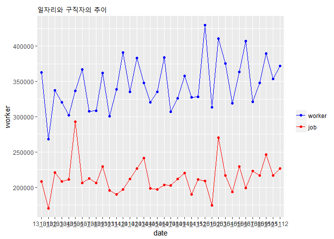
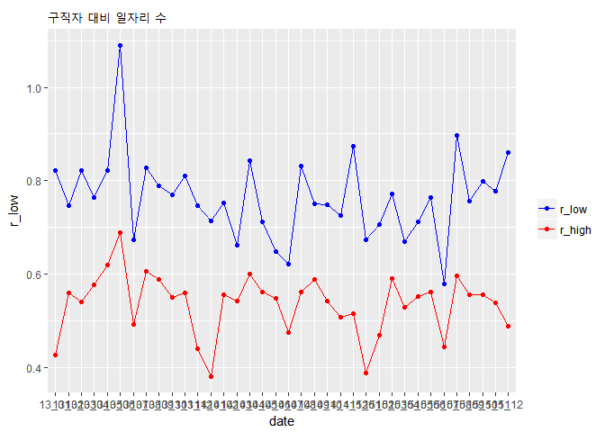

임금별 구인구직 3개년 비교
================
이가영
2017년 11월 29일

### 1. 요약(초록)

노동시장을 다각도로 살펴보기 위해 임금별로 어떻게 구성되어있는지 알아보았다. 워크넷 고용시장 데이터를 사용해 분석을 하기로 결정했고, 3년치 임금별 구직, 구인 데이터를 활용하였다.

임금별로 노동시장을 나눠서 조망하여 내가 원하는 임금대의 일자리는 얼마나 있는지, 나의 경쟁자는 얼마나 되는지 확인하려고 하였다. 기존의 데이터는 정규직, 성별, 학력과 붙어있기 때문에 따로 분리하고 세분화되어있는 항목을 최저생계비 이상 이하로 통합하였다.

결과를 살펴보면 전체적으로 노동에 참여하고자하는 구직자는 증가하는 추세지만 일자리는 전과 비슷한 양상을 띈다. 그 중 150 이상의 일자리는 증가하는 것으로 보이는데 이는 비록 3년이지만 매년 물가가 상승하면서 그에 대한 명목임금도 상승하기 때문이라고 여겨진다. 저임금 일자리는 구직자 대비 일자리가 0.8정도 인것에 반해 고임금 일자리는 구직자 대비 일자리가 0.5정도로 상대적으로 경쟁률이 높다는 것을 알 수 있다.

### 2. 분석 주제

2013~2015 3년 간의 구인구직 통계를 이용하여, 임금별 일자리 수요와 공급을 알아보고 변동 추이를 알아본다.

### 3. 데이터 선정

데이터는 워크넷의 노동데이터를 사용하였다. 출처 : 서울연구소데이터서비스(<http://data.si.re.kr/node/38>)

특성 : 본 데이터는 매월 말~초에 워크넷에 구인 및 구직을 신청한 구인업체 및 구직자로서 등록이 마감된 자들을 대상으로 한다. 또한 명확한 항목분류를 바탕으로 인문계열의 일자리 질과 양을 평가하기에 적합하다. 워크넷 구인자는 대체로 전문직 자격증이나 대학, 대학원 같은 고학력 구직자들만을 요구하지 않는다. 그러므로 이 데이터는 일반적인 서민들의 노동시장과 밀접한 연관을 가진다고 볼 수 있다.

구성 구인인원: 학력대별, 규모별, 산업별, 직종별, 근무지역별 구인인원

구직건수: 성별, 연령별, 학력대별, 희망직종별, 희망근무지역별 구직건수 및 취업건수

임금관련: 학력별, 종사상지위별, 직종별 제시임금 및 희망임금

### 4. 분석(코드, 표, 그래프, 해석 포함)

#### 분석 목적 및 방법

원본데이터의 월별, 연도별 구직수와 구인수를 분석하여 개괄적인 ‘임금별 노동시장 동향’을 평가한다. 내가 원하는 임금대의 일자리는 얼마나 있는지, 나의 경쟁자는 얼마나 되는지 확인하려고 하였다.

#### 변수 검토 및 전처리

임금 별 노동시장의 동향을 살펴봐야하기 때문에, 임금, 일자리라는 변수를 택한다.

### 분석 전 패키지 불러오기

그래프를 그리기 위한 ggplot2와 분석의 편의를 도울 dplyr을 로드한다

### 데이터 불러오기

##### 임금별 구인구직 3년 자료 (2013~2015)

``` r
w13_raw<- read.csv("13_w.csv")
w14_raw <- read.csv("14_w.csv")
w15_raw <- read.csv("15_w.csv")
```

#### 이용할 행만 선택

#### 변수 이름 통일

#### 응용할 변수 추가

``` r
w13 <- w13_raw %>%
  select(date,un150D, up150D, un150, totD, up150, tot) %>% 
  rename(lowjob=un150D, highjob=up150D, lw=un150, job=totD, hw=up150, worker=tot) %>% 
  mutate(rate=job/worker, r_low = lowjob/lw, r_high = highjob/hw)

w14 <- w14_raw %>%
  select(date, T150dwD, T150upD, TD, T150dw, T150up, T) %>% 
  rename(lowjob=T150dwD, highjob=T150upD, job=TD, lw=T150dw, hw=T150up, worker=T) %>% 
  mutate(rate=job/worker, r_low = lowjob/lw, r_high = highjob/hw)

w15 <- w15_raw %>%
  select(date, dlw_m, dhw__m, dW_to, slw_m, shw__m, sW_to) %>% 
  rename(lowjob=dlw_m, highjob=dhw__m, job=dW_to, lw=slw_m, hw=shw__m, worker=sW_to) %>% 
  mutate(rate=job/worker, r_low = lowjob/lw, r_high = highjob/hw)
```

### 1년치 데이터들 3개년 데이터로 통합

``` r
w <- rbind(w13, w14, w15)
```

#### 분석 및 해석

#### 1.총 일자리와 구직자의 추이

``` r
ggplot(w,aes(x=date)) +
geom_line(aes(y=worker, group=2,colour = "worker")) +
  geom_line(aes(y=job,group=1, colour = "job")) +
  geom_point(aes(y=worker, colour = "worker")) +
  geom_point(aes(y=job, colour = "job")) +
  scale_colour_manual("",
                      breaks = c("worker", "job"),
                      values = c("red", "blue")) +
  ggtitle("일자리와 구직자의 추이")
```



위 그래프를 보면 항상 일자리에 비해 구직자가 많은 것을 알 수 있다.

임금에 따른 일자리는 어떻게 되는지 궁금증이 생겨 추가적으로 임금별 일자리와 구직자의 추이를 알아보았다.

``` r
ggplot(w,aes(x=date)) +
  geom_line(aes(y=hw, group=2,colour = "hw")) +
  geom_line(aes(y=highjob,group=1, colour = "highjob")) +
  geom_point(aes(y=hw, colour = "hw")) +
  geom_point(aes(y=highjob, colour = "highjob")) +
  scale_colour_manual("",
                      breaks = c("hw", "highjob"),
                      values = c("red", "blue")) +
  ggtitle("임금이 150 이상일 때 일자리와 구직자의 추이")
```


위 그래프를 보면 구직자는 점점 증가하는 반면, 일자리는 그보다 낮은 기울기로 증가하는 것이 보인다.

구직자가 눈에 띄게 증가하는 모습을 보이는데, 그렇다면 150미만의 임금에 대한 구직자는 감소할까?

### 임금이 150미만일 때 일자리와 구직자의 추이

``` r
ggplot(w,aes(x=date)) +
  geom_line(aes(y=lw, group=2,colour = "lw")) +
  geom_line(aes(y=lowjob,group=1, colour = "lowjob")) +
  geom_point(aes(y=lw, colour = "lw")) +
  geom_point(aes(y=lowjob, colour = "lowjob")) +
  scale_colour_manual("",
                      breaks = c("lw", "lowjob"),
                      values = c("red", "blue")) +
  ggtitle("임금이 150 미만일 때 일자리와 구직자의 추이")
```


위 그래프를 보면 임금이 150 이상일 때와는 다르게 일자리와 구직자의 차이가 많이 줄어든 것을 볼 수 있다. 특히 13년 6월에는 일자리가 더 많은 모습을 나타낸다. 이는 기업들의 구인량 역시 작고 구직자 또한 저임금 노동시장에 적게 진입하는 것을 알 수 있다.

마지막으로 일자리의 공급정도를 알아보기 위하여 구직자 대비 일자리수를 계산해보았다.

``` r
ggplot(w,aes(x=date)) +
  geom_line(aes(y=r_low, group=2,colour = "r_low")) +
  geom_line(aes(y=r_high, group=1, colour = "r_high")) +
  geom_point(aes(y=r_low, colour = "r_low")) +
  geom_point(aes(y=r_high, colour = "r_high")) +
  scale_colour_manual("",
                      breaks = c("r_low", "r_high"),
                      values = c("red", "blue")) +
  ggtitle("구직자 대비 일자리 수")
```

 구직자 대비 일자리의 역수는 구직 시의 경쟁률이다. 저임금의 일자리는 일자리를 쉽게 구할 수 있지만 고임금의 경우 일자리가 많이 부족한 것을 알 수 있다.

### 5. 논의 : 한계점, 비판점, 추후 분석 방향

이 분석의 한계로는 데이터 자체가 전체 노동시장을 포괄할 수 없다는 점을 들 수 있다. 또한 데이터에 임금자료밖에 없기 때문에 노동강도를 알 수 없다. 그리고 임금정보와 더불어 직종데이터가 있었으면 우리가 속한 문과의 방향도 알 수 있었을 것 갔다.

##### 추후 분석 방향

월 단위로 쪼개져있어 매 달마다 유의미한 변화를 보기는 어렵다는 느낌을 받았다. 따라서 분기 혹은 년도를 더 늘려서 추이를 보면 더 좋을 것 같다.
