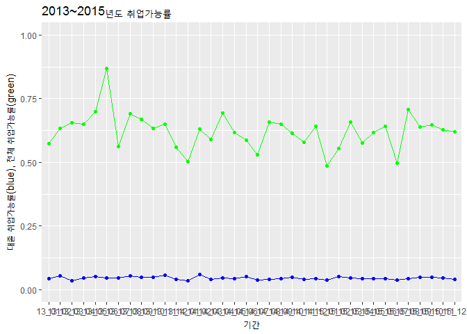

personal report: 워크넷노동시장에서의 대졸자 구인구직 특징 분석 및 해석
================

1.초록
======

정책과 직업설정에 중요한 노동시장의 특성과 전망은 그 노동시장의 참여자들의 특성과 연관된다.그러므로 워크넷 노동시장을 평가함에 있어 고용별, 임금별, 계열별과 함께 세부요소인 대졸 구인구직 수와 그 증감을 분석 및 해석할 필요가 있다.

데이터 분석결과에 따르면 대졸 일자리에 대한 과잉공급현상이 나타난다. 이는 워크넷 노동시장의 일자리를 고학력을 요하지 않는 생산직이나 비숙련일자리로 해석할 수 있으며 우리나라의 고질적인 과잉교육문제가 현상화되었다고도 볼수있다. 이에 따라 대졸자들은 자신의 적성과 맞지 않는 직업을 가질 확률이 높으며, 이들에 대한 국가적차원의 재교육과 고질적인 교육과잉문제에 대한 정책입안이 시급하다.

2. 분석 주제
============

해당기간 2013년~2015년 동안의 워크넷 노동시장에서 대졸 구인구직 수를 분석하여 워크넷 노동시장의 특성을 평가하며 워크넷 노동시장 내에서 대졸 구인구직 특성과 전망을 평가한다.

3. 데이터 선정
==============

서울연구소데이터서비스의 산업경제 일자리 구인구직 및 취업현황의 2013년~2015년 자료 중 대졸 구인구직 관련 자료.

데이터 선정 이유
----------------

한국고용정보원이라는 국가공인기관의 자료로서 조사과정과 분류항목을 비교적 신뢰할 수 있으며, 대중의 접근성이 확보된 ‘워크넷’이라는 홈페이지의 측정량을 데이터 출처로 하기 때문에 데이터가 비교적 균질하다고 할 수 있다. 월 단위 조사자료를 바탕으로 연도별 동향분석과 월별 동향분석이 가능하다. 주제와 관련하여 워크넷 노동시장의 특성과 세부요소의 특성과 전망을 정확하고 세밀하게 평가하는 데 적합하다.

데이터 소개
-----------

### 출처

서울연구소데이터서비스(<http://data.si.re.kr/node/38>)

### 특성

전처리된 데이터 중 대졸 구인구직과 관련된 한정데이터이다.

### 구성

대졸구인인원 대졸구직건수

4. 분석
=======

분석 목적 및 방법
-----------------

워크넷 노동시장의 특성과 관련된 노동시장 참여자들의 특성을 알기 위해 세부요소인 대졸 구인구직 수를 중점분석한다.

변수 검토 및 전처리
-------------------

전처리된 데이터를 기반으로 대졸(u)의 구인구직 관련자료를 선택한다.

``` r
#종합보고서의 rename,na.omit 등 전처리 및 파생변수생성을 전제합니다.

#수요공급종합 자료 불러들이기
library(ggplot2)
library(dplyr)
library(readxl)

a <- read.csv("13_U_All.csv")
a1 <- read.csv("141ALL.u.csv")
a2 <- read.csv("15_labor_all.csv")

#변수통일
a <- a %>% 
  select(date, UD, US, TD, TS)%>% 
  mutate(employ=UD/US, u.employ=TD/TS)

a1 <- a1 %>% 
  select(date, UD, U, TD, T) %>%
  rename(US=U,TS=T) %>% 
  mutate(employ=UD/US, u.employ=TD/TS)

a2 <- a2 %>% 
  select(date, uni_to, S_uni, edu_to, S_edu) %>%
  rename(UD=uni_to, US=S_uni, TD=edu_to, TS=S_edu) %>% 
  mutate(employ=UD/US, u.employ=TD/TS)

all<-rbind(a,a1,a2)
```

분석 및 해석
------------

### 대졸 구인구직

#### 1)대졸 구인구직 3년 그래프(2013~2015)

##### (1)대졸 구인(red), 구직(blue) 수 시계열

``` r
ggplot(all, aes(x=date,y=US,group=1))+geom_line(colour="blue")+geom_point(colour="blue")+geom_line(aes(x=date,y=TS),colour="green")+geom_point(aes(x=date,y=TS,group=1),colour="green") + ylim(0, 550000) + xlab('기간') +
  ylab('대졸 구직 수(blue), 전체구직 수(green)') +
  ggtitle('2013~2015년도 전체구직 대졸구직')
```


``` r
ggplot(all, aes(x=date,y=UD,group=1))+geom_line(colour="red")+geom_point(colour="red")+geom_line(aes(x=date, y=US),colour="blue")+geom_point(aes(x=date,y=US,group=1),colour="blue")+ ylim(0, 110000) + xlab('기간') +
  ylab('대졸 구인 수(red), 대졸 구직 수(blue), 전체구직 수(green)') +
  ggtitle('2013~2015년도 대졸 구인구직 대비')
```


##### (2)전체취업률(구인/구직자 비율) = employ(green), 대졸취업률(대졸 구인/대졸구직자 비율) = re.employ(blue)

``` r
ggplot(all, aes(x=date,y=employ, group=1))+geom_line(colour="blue")+geom_point(colour="blue")+geom_line(aes(x=date, y=u.employ), colour="green", )+geom_point(aes(x=date,y=u.employ, group=1),colour="green")+ylim(0,1) + xlab('기간') +
  ylab('대졸 취업가능률(blue), 전체 취업가능률(green)') +
  ggtitle('2013~2015년도 취업가능률')
```



#### 2.대졸 구인구직 3년 분석 및 해석(2013~2015)

구직자 중에 대졸자가 평균 약 10만명으로 전체 구직자의 25%가량을 차지함에도 대졸 구인수는 약 3000~5000에 머문다. 이는 종합보고서의 전체 구인수가 평균 약 20만개인 것을 감안하면 절대적으로 작다고 할 수 있다. 또한 전체 취업률은 50% to 70%에 분포한데 반해 대졸취업률은 3 to 5%에 머문다. 현재 워크넷 노동시장에서 대졸 일자리에 대한 심각한 공급과잉현상이 발생하고 있다.

이는 워크넷 노동시장의 일자리가 대졸이상의 고학력 일자리보단 생산직이나 비숙련일자리임을 의미한다고 해석할 수 있다. 한편 우리나라의 교육인플레 문제가 이러한 노동시장에서 대졸자 과잉공급현상으로 드러났다고 해석할 수 있다. 산업의 자동화, 4차산업의 시작과 같은 시대적 흐름 속에서 해석하면 근본적으로 과잉인간공급이 문제라고 해석할 수 있다.

이러한 해석에 기반하여 앞으로의 노동시장을 전망하면 워크넷 노동시장에서의 대졸 구직자 과잉공급은 쉽게 해소되지 않을 것이며 이에 따라 개인은 자신의 적성과 먼 직장을 가질 확률이 높아진다고 할 수 있다. 이에 따라 국가의 과잉교육현상을 줄일 수 있는 정책입안이 시급하며 현 대졸 구직자들에 대한 국가적 차원의 재교육이 필요하다고 볼 수 있다.

5. 논의
=======

한계점과 비판점
---------------

국가임용직이나 대기업, 중견기업의 공채는 워크넷을 통해서만 이루지지 않는다. 즉, 시장 특성상 핵심적인 대졸 구인 수가 시장에서 제외되있다고 볼 수 있다. 이에 따라 대졸자의 취업률이 과도하게 평가절하되었을 수도 있다. 여전히 3년이라는 짧은 기간동안의 계측량으로서 보다 장기적이고 본질적인 시장의 특성과 전망을 알기 위해서는 긴 기간의 노동시장 정보가 요구된다.

추후분석방향
------------

국가임용 수와 대기업,중견기업의 구인 수를 포함한 보다 다각적인 표본을 바탕으로 더욱 현실적인 대졸 취업률을 유추해야한다. 보다 오랜 시간의 정보추합을 통해 본질적이고 장기적인 시장 특성과 전망을 평가해야한다.
