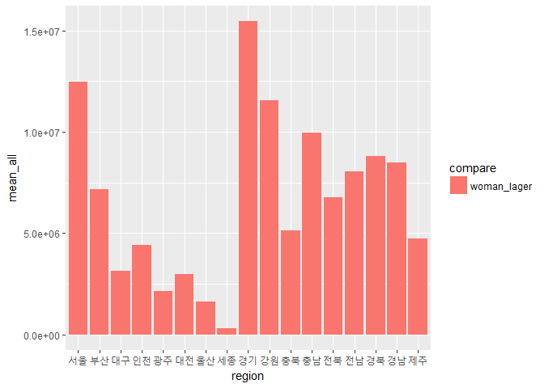
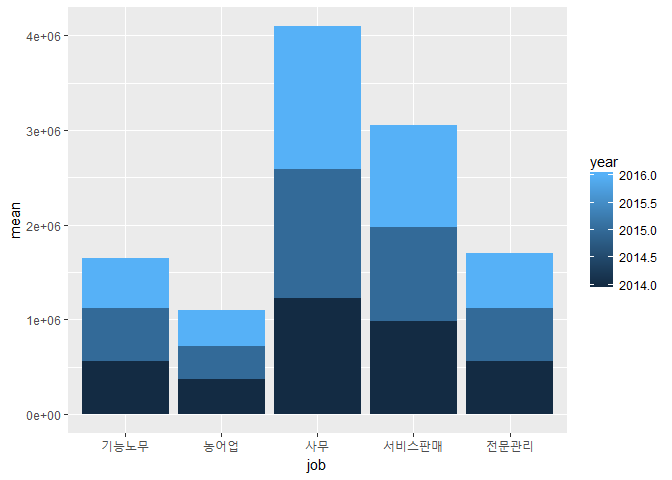

2014-2016년 여행지별 국내여행 참여자 수
================

### <서론>

#### 초록

근래의 국내 여행 시장 약화 추세로 인해 국내 여행 진흥을 위한 다양한 시도가 이루어지고 있다. 그만큼 실질적인 국내 여행 참가자들의 데이터의 중요성도 높아졌기에 이를 알아봄으로써 국내 여행자들의 특성에 대해 파악을 할 수 있다. 본 보고서는 국내의 여러 지역으로 여행하는 여행자들은 어떤 특성이 있는지 알아보고, 다양한 특성들에 따른 여행자의 수와의 관계를 분석하고자 한다. 모든 분석은 "연도 및 지역별"을 기준으로 하였고, "성별-여행자 수의 관계", "연령-여행자 수의 관계", "직업-여행자 수의 관계", "가구소득-여행자 수의 관계 ", "학력-여행자 수의 관계"의 순서로 분석하였다.

성별 비교에서는 대체로 모든 연도에서 여성이 국내 여행 참가가 압도적으로 많다고 볼 수 있다는 결과가 나왔다. 연령에서는 연도별로 연령이 높을수록 국내 여행 참여가 많은 것으로 나타났다. 소득 측면에서도 연도별로 보았을 때, 대체로 소득이 높을수록 여행자의 수가 높았지만, 세종의 경우 다른 지역에 비해 `300~400만 원 미만`의 가구소득에 해당하는 여행자 수가 많았다. 직업에서는 연도별로는, 전문직인 여행자가 많이 나타났고, 광주의 경우 다른 지역에 비해 `농어업`직업군이 높은 비율로 나타났다. 학력 측면에서는 연도별로는, 고등학교를 졸업한 학력의 여행자 수와 대학교를 졸업한 학력의 여행자 수가 다른 학력에 비해 현저히 높은 수치를 보였고, 세종시를 방문한 사람들의 비율에서는 전문대학을 졸업한 사람들의 비율이 2번째로 높게 나타났다.

결론적으로 본 보고서에서는, 성별의 특징에서는 어떤 년도 및 어떤 지역에서 남성의 수가 많은지 여성의 수가 많은지 파악할 수 있다. 소득과 연령 같은 수치가 있는 변수들에서는 대체로 값이 커질수록 여행자의 수가 많이 나타났지만, 직업이나 학력 같은 경우는 특정 분야에서의 여행자의 수가 많이 나타났다는 것을 알아볼 수 있다.

#### 데이터

-   선정 이유 : 해외여행 데이터에 비교했을 때 국내 여행은 상대적으로 통계 내용이 국민들에게 잘 알려지지 않았기 때문에 해당 데이터를 선정했다. 또한, 해당 데이터에는 성별, 지역, 가구 소득 등과 같은 다양한 내용이 들어있기 때문에 선정하게 되었다.

-   출처 : 국가통계포털(KOSIS) 제공(국내통계-기관별 통계-중앙행정기관-문화체육관광부-국민여행 실태조사-여행 경험률 및 여행참가 횟수-여행지별 국내여행 참가자 수(2014~2016))

-   구성 : 2014년부터 2016년까지의 국내여행 참가자들을 대상으로 한 데이터이다. 대한민국 전국 시도별 국내 여행 참가자 수를 통계분류(1)와 그 하위항목 분류인 통계분류(2)로 자세히 나누었다.

1.  국내 여행지(17곳) : 서울, 부산, 대구, 인천, 광주, 대전, 울산, 세종, 경기, 강원, 충북, 충남, 전북, 전남, 경북, 경남, 제주
2.  성별 (남자, 여자)
3.  연령(15세~19세, 20대, 30대, 40대, 50대, 60대 이상)
4.  직업(전문관리, 사무, 서비스판매, 농어업, 기능 노무)
5.  가구소득(50만 원 미만, 50만~100만 원 미만, 100만~200만 원 미만, 200만~300만 원 미만, 300만~400만 원 미만, 400만~500만 원 미만, 500만~600만 원 미만, 600만 원 이상)
6.  학력(초졸 이하, 중학교(재/졸), 고등학교(재/졸), 전문대(재/졸), 대학교(재/졸), 대학원(재/졸)

-   조사대상 범위 및 지역 : 가구 내 만 15세 이상 모든 가구원 조사 / 전국

-   조사주기 : 1년

### <본론_분석>

데이터 불러오기
---------------

먼저 분석에 필요한 패키지를 로드한다. 데이터를 불러오기 위한 `readxl` 패키지와 구문 작성 및 그래프 작성에 필요한 `dplyr`, `ggplot2` 패키지를 로드한다.

``` r
library(ggplot2)
```

    ## Warning: package 'ggplot2' was built under R version 3.4.2

``` r
library(dplyr)
```

    ## 
    ## Attaching package: 'dplyr'

    ## The following objects are masked from 'package:stats':
    ## 
    ##     filter, lag

    ## The following objects are masked from 'package:base':
    ## 
    ##     intersect, setdiff, setequal, union

``` r
library(readxl)
```

    ## Warning: package 'readxl' was built under R version 3.4.2

다음으로 데이터를 불러온다. `read_excel()`을 이용해 데이터를 불러온 뒤, 데이터 sheet를 사용하고, 첫 번째 행이 변수명이었으므로 `col_names`는 `T`로 입력한다.

``` r
travel <- read_excel("travel2.xlsx", sheet=1, col_names = T)
travel
```

    ## # A tibble: 476 x 6
    ##    `통계분류(1)` `통계분류(2)`  항목   `2014`   `2015`   `2016`
    ##            <chr>         <chr> <chr>    <dbl>    <dbl>    <dbl>
    ##  1          전체          소계  서울 12580581 12451891 13237854
    ##  2          <NA>          <NA>  부산  6665173  7158553  7414157
    ##  3          <NA>          <NA>  대구  3554687  3163161  3137687
    ##  4          <NA>          <NA>  인천  4464192  4407063  5420706
    ##  5          <NA>          <NA>  광주  2263117  2135332  2401244
    ##  6          <NA>          <NA>  대전  3123627  2984929  3497887
    ##  7          <NA>          <NA>  울산  1787673  1632410  2043956
    ##  8          <NA>          <NA>  세종   366885   333329   740710
    ##  9          <NA>          <NA>  경기 15283727 15451755 16826706
    ## 10          <NA>          <NA>  강원 12282959 11559005 11683223
    ## # ... with 466 more rows

불러온 데이터가 어떤 속성을 가지고 있는지, 결측치가 있는지 `str()`함수와 `table(is.na())`를 이용하여 확인한 후 데이터 훼손을 막기 위해 복사한다.

``` r
str(travel)
```

    ## Classes 'tbl_df', 'tbl' and 'data.frame':    476 obs. of  6 variables:
    ##  $ 통계분류(1): chr  "전체" NA NA NA ...
    ##  $ 통계분류(2): chr  "소계" NA NA NA ...
    ##  $ 항목       : chr  "서울" "부산" "대구" "인천" ...
    ##  $ 2014       : num  12580581 6665173 3554687 4464192 2263117 ...
    ##  $ 2015       : num  12451891 7158553 3163161 4407063 2135332 ...
    ##  $ 2016       : num  13237854 7414157 3137687 5420706 2401244 ...

``` r
travel_new1 <- travel
```

### \[1\] 연도 및 지역별 성별-여행자 수의 관계 분석

분석에 앞서 필요없는 행과 열을 정리한 뒤 `View()` 함수를 이용해 데이터를 확인한다.

``` r
travel_new1 <- travel_new1[c(1:4),]
travel_new1 <- travel_new1[,-c(1)]            
View(travel_new1)                     
```

`c()`함수를 이용해 성별, 지역 및 연도 데이터를 입력한다.

``` r
man <- c(5679692,3186234,1704851,2085968,1158819,1508478,830784,209194,7186353,5990236,2368343,4799826,3622001,3445811,4684999,4670726,1651470,5936500,3480070,1507886,1990424,985757,1433309,781214,94068,7334898,5663455,2322692,4783462,3230798,3834223,4191480,4148802,2074122,6153648,3481215,1600432,2566923,1163528,1682066,995151,362288,7985308,5747317,2583590,4865165,3501966,4232213,3961299,4538624,2208882)

woman <- c(6900889,3478939,1849836,2378224,1104298,1615149,956889,157691,8097374,6292723,2843721,4958422,4209072,3884633,4943875,5018457,2026254,6515391,3678483,1655275,2416639,1149575,1551620,851196,239261,8116857,5895550,2818418,5161154,3530032,4229315,4630721,4330765,2658372,7084206,3932941,1537255,2853783,1237716,1815821,1048806,378422,8841398,5935906,2995599,5327268,4209060,4847903,4698537,4943734,2621070)

region <- c("서울","부산","대구","인천","광주","대전","울산","세종","경기","강원","충북","충남","전북","전남","경북","경남","제주","서울","부산","대구","인천","광주","대전","울산","세종","경기","강원","충북","충남","전북","전남","경북","경남","제주","서울","부산","대구","인천","광주","대전","울산","세종","경기","강원","충북","충남","전북","전남","경북","경남","제주")

year <- c("2014","2014","2014","2014","2014","2014","2014","2014","2014","2014","2014","2014","2014","2014","2014","2014","2014","2015","2015","2015","2015","2015","2015","2015","2015","2015","2015","2015","2015","2015","2015","2015","2015","2015","2016","2016","2016","2016","2016","2016","2016","2016","2016","2016","2016","2016","2016","2016","2016","2016","2016")
```

위에서 생성한 변수들을 `data.frame()` 함수를 이용하여 새로운 데이터 프레임을 만든다. 제대로 만들어졌는지 확인하기 위해 `head()` 함수를 이용한다.

``` r
df_travel <- data.frame(man,woman,region,year)      
df_travel
```

    ##        man   woman region year
    ## 1  5679692 6900889   서울 2014
    ## 2  3186234 3478939   부산 2014
    ## 3  1704851 1849836   대구 2014
    ## 4  2085968 2378224   인천 2014
    ## 5  1158819 1104298   광주 2014
    ## 6  1508478 1615149   대전 2014
    ## 7   830784  956889   울산 2014
    ## 8   209194  157691   세종 2014
    ## 9  7186353 8097374   경기 2014
    ## 10 5990236 6292723   강원 2014
    ## 11 2368343 2843721   충북 2014
    ## 12 4799826 4958422   충남 2014
    ## 13 3622001 4209072   전북 2014
    ## 14 3445811 3884633   전남 2014
    ## 15 4684999 4943875   경북 2014
    ## 16 4670726 5018457   경남 2014
    ## 17 1651470 2026254   제주 2014
    ## 18 5936500 6515391   서울 2015
    ## 19 3480070 3678483   부산 2015
    ## 20 1507886 1655275   대구 2015
    ## 21 1990424 2416639   인천 2015
    ## 22  985757 1149575   광주 2015
    ## 23 1433309 1551620   대전 2015
    ## 24  781214  851196   울산 2015
    ## 25   94068  239261   세종 2015
    ## 26 7334898 8116857   경기 2015
    ## 27 5663455 5895550   강원 2015
    ## 28 2322692 2818418   충북 2015
    ## 29 4783462 5161154   충남 2015
    ## 30 3230798 3530032   전북 2015
    ## 31 3834223 4229315   전남 2015
    ## 32 4191480 4630721   경북 2015
    ## 33 4148802 4330765   경남 2015
    ## 34 2074122 2658372   제주 2015
    ## 35 6153648 7084206   서울 2016
    ## 36 3481215 3932941   부산 2016
    ## 37 1600432 1537255   대구 2016
    ## 38 2566923 2853783   인천 2016
    ## 39 1163528 1237716   광주 2016
    ## 40 1682066 1815821   대전 2016
    ## 41  995151 1048806   울산 2016
    ## 42  362288  378422   세종 2016
    ## 43 7985308 8841398   경기 2016
    ## 44 5747317 5935906   강원 2016
    ## 45 2583590 2995599   충북 2016
    ## 46 4865165 5327268   충남 2016
    ## 47 3501966 4209060   전북 2016
    ## 48 4232213 4847903   전남 2016
    ## 49 3961299 4698537   경북 2016
    ## 50 4538624 4943734   경남 2016
    ## 51 2208882 2621070   제주 2016

``` r
head(df_travel)
```

    ##       man   woman region year
    ## 1 5679692 6900889   서울 2014
    ## 2 3186234 3478939   부산 2014
    ## 3 1704851 1849836   대구 2014
    ## 4 2085968 2378224   인천 2014
    ## 5 1158819 1104298   광주 2014
    ## 6 1508478 1615149   대전 2014

`group_by()`를 이용해 지역과 연도를 중심으로 분리한 뒤 `summarise()`를 통해 성별에 따른 여행자수 평균값을 구한다.

``` r
a <- df_travel %>%
  group_by(region, year) %>%  
  summarise(mean_man = mean(man), mean_woman = mean(woman))      
```

`mutate()`를 이용해 평균값이 큰 성별(man\_larger, woman\_larger), 성별 평균값 합(mean\_all)을 뜻하는 파생변수를 추가한다. 제대로 생성되었는지 확인하기 위해 `View()`를 이용한다.

``` r
b <- a %>% 
  mutate(compare = ifelse(mean_man>mean_woman, "man_larger", "woman_lager"), mean_all = (mean_man+mean_woman)) ##위 데이터에서 파생변수 추가(평균값이 큰 성별, 성별 평균값 합)
View(b)
```

연도별 변화를 알아보기 위해 `filter()`를 이용해 연도를 분리한다.

``` r
year_compare2014 <- b %>% 
  filter(year == "2014")   ##2014년

year_compare2015 <- b %>% 
  filter(year == "2015")   ##2015년

year_compare2016 <- b %>% 
  filter(year == "2016")   ##2016년
```

연도별로 분리한 데이터를 시각화 위해 막대그래프로 생성한다. `x축`은 지역, `y축`은 성별 평균합, `fill`은 성별로 지정한다.

``` r
ggplot(data=year_compare2014, aes(x=region, y=mean_all, fill=compare))+
  geom_col()+
  scale_x_discrete(limits=c("서울","부산","대구","인천","광주","대전","울산","세종","경기","강원","충북","충남","전북","전남","경북","경남","제주"))
```


``` r
ggplot(data=year_compare2015, aes(x=region, y=mean_all, fill=compare))+
  geom_col()+
  scale_x_discrete(limits=c("서울","부산","대구","인천","광주","대전","울산","세종","경기","강원","충북","충남","전북","전남","경북","경남","제주"))
```



``` r
ggplot(data=year_compare2016, aes(x=region, y=mean_all, fill=compare))+
  geom_col()+
  scale_x_discrete(limits=c("서울","부산","대구","인천","광주","대전","울산","세종","경기","강원","충북","충남","전북","전남","경북","경남","제주"))
```


지역별 성별에 따른 여행자 차이를 각 연도별로 비교해 본 결과는 다음과 같다. 어떤지역에서 어떤 성별의 사람이 많이 방문했는지를 나타낸 결과이다.

2014년 지역별 성별에 따른 여행자 차이 남성 우위 지역 : 광주, 세종 여성 우위 지역 : 경기, 서울, 강원, 충남, 경북, 경남, 전북, 전남, 부산, 충북, 인천, 제주, 대구, 대전, 울산

2015년 지역별 성별에 따른 여행자 차이 남성 우위 지역 : 없음 여성 우위 지역 : 경기, 서울, 강원, 충남, 경북, 경남, 전남, 부산, 전북, 충북, 제주, 인천, 대구, 대전, 광주, 울산, 세종

2016년 지역별 성별에 따른 여행자 차이 남성 우위 지역 : 대구 여성 우위 지역 : 경기, 서울, 강원, 충남, 경남, 전남, 경북, 전북, 부산, 충북, 인천, 제주, 대전, 광주, 울산, 세종

이 결과는 모든 연도에서 경기, 서울, 강원, 충남 지역의 경우 국내 여성 여행자 순위가 고정되어 있는 지역이고, 대체로 모든 연도에서 여성이 국내 여행 참가가 압도적으로 많다고 볼 수 있다.

### \[2\] 연도 및 지역별 연령-여행자 수의 관계 분석

새로운 분석을 위해 raw 데이터를 새로 복사한 뒤 `table(is.na())`를 이용해 결측치가 있는지 확인한다.

``` r
travel_new2 <- travel

table(is.na(travel$`2014`))
```

    ## 
    ## FALSE 
    ##   476

``` r
table(is.na(travel$`2015`))
```

    ## 
    ## FALSE 
    ##   476

``` r
table(is.na(travel$`2016`))
```

    ## 
    ## FALSE 
    ##   476

출력 결과 결측치가 없다는 것을 알 수 있다. `c()`함수를 이용해 필요한 행을 추출한 뒤

``` r
age <- travel_new2[c(52:153),]

teens <- age[c(1:17),] #15~10세
twenty <- age[c(18:34),] #20대
thirty <- age[c(35:51),] #30대
forty <- age[c(52:68),] #40대
fifty <- age[c(69:85),] #50대
over_sixty <- age[c(86:102),] #60대 이상
```

추출한 행에서 `select()`함수를 통해 연도를 추출하고 `sum`을 이용해 연령별 여행자 수 합을 구한다.

``` r
teens <- teens %>%
  select('2014', '2015', '2016') %>% 
  sum
twenty <- twenty %>% 
  select('2014', '2015', '2016') %>% 
  sum
thirty <- thirty %>% 
  select('2014', '2015', '2016') %>% 
  sum
forty <- forty %>%
  select('2014', '2015', '2016') %>% 
  sum
fifty <- fifty %>% 
  select('2014', '2015', '2016') %>% 
  sum
over_sixty <- over_sixty %>% 
  select('2014', '2015', '2016') %>% 
  sum
```

`c()`함수를 이용해 `population`변수를 추가한 뒤 `data.frame()`함수를 통해 새로운 데이터 프레임을 만든다.

``` r
population <- c(teens, twenty, thirty, forty, fifty, over_sixty) #population 변수 추가하기
age <- rep(c('teens', 'twenty', 'thirty', 'forty', 'fifty', 'over_sixty'), each=1)

df <- data.frame(population, age)
df
```

    ##   population        age
    ## 1   21855374      teens
    ## 2   42862942     twenty
    ## 3   58548930     thirty
    ## 4   78713779      forty
    ## 5   75487239      fifty
    ## 6   73192789 over_sixty

새로 만든 데이터 프레임을 시각화 하기 위해 `x축`은 age, `y축`은 population으로 지정한 막대그래프를 생성한다. `ggtitle()`함수를 이용해 그래프 제목을 넣어준다.

``` r
ggplot(data = df, aes(x= reorder(age, -population), y= population, fill = population)) +
  geom_col() +
  ggtitle("연령별 국내 여행자 수")
```


그래프에서 살펴볼 수 있듯이 연령이 높을수록 국내 여행 참여가 많은 것으로 나타났다. 반면에 연령이 낮은 나이는 연령은 상대적으로 나이가 높은 연령보다 국내 여행자 수가 적게 나왔다. 이는 연령이 높아질수록 소득이 증가하는 보편적인 경향을 띄고 있다는 속설을 잘 증명해 주고, 소득이 높아질수록 여행자 수도 역시 함께 보여주고 있다.

### \[3\] 연도 및 지역별 직업-여행자 수의 관계 분석

위와 같이 데이터를 새로 복사한 뒤 `rename()`함수를 이용해 데이터의 변수명을 영어 변수명으로 바꾼다.

``` r
travel_new3 <- travel

travel_new3 <- rename(travel_new3, sta1="통계분류(1)",
                     sta2="통계분류(2)",
                     area="항목",
                     year_2014="2014",
                     year_2015="2015",
                     year_2016="2016")

str(travel_new3)
```

    ## Classes 'tbl_df', 'tbl' and 'data.frame':    476 obs. of  6 variables:
    ##  $ sta1     : chr  "전체" NA NA NA ...
    ##  $ sta2     : chr  "소계" NA NA NA ...
    ##  $ area     : chr  "서울" "부산" "대구" "인천" ...
    ##  $ year_2014: num  12580581 6665173 3554687 4464192 2263117 ...
    ##  $ year_2015: num  12451891 7158553 3163161 4407063 2135332 ...
    ##  $ year_2016: num  13237854 7414157 3137687 5420706 2401244 ...

다음은 `NA`으로 처리된 공간에 대해 그에 알맞는 내용을 지정해주고자 한다. `sta1` 변수에서는 대분류 통계로 총합, 성별, 연령, 직업, 소득, 학업에 대해 분류가 되어 있다. `NA`부분에 각 통계 분류에 맞는 내용을 할당한다. \`sta2'변수에서는 소분류 통계로 총합 대분류에 소계 소분류가 이뤄지고, 성별 대분류에 남,여 소분류, 연령대분류에 6가지의 연령 소분류, 직업 대분류에는 5가지의 소분류, 소득 대분류에는 8가지 소분류, 학업 대분류에 6가지의 소분류가 이뤄지고 있다. 그에 맞춰 각 부분에 맞는 내용을 할당한다.

``` r
travel_new3$sta1[1:17] <- "total"
travel_new3$sta1[18:51] <- "sex"
travel_new3$sta1[52:153] <- "age"
travel_new3$sta1[154:238] <- "job"
travel_new3$sta1[239:374] <- "money"
travel_new3$sta1[375:476] <- "school"

travel_new3$sta2[1:17] <- "subtotal"
travel_new3$sta2[18:34] <- "male"
travel_new3$sta2[35:51] <- "female"
travel_new3$sta2[52:68] <- "15-19"
travel_new3$sta2[69:85] <- "20's"
travel_new3$sta2[86:102] <- "30's"
travel_new3$sta2[103:119] <- "40's"
travel_new3$sta2[120:136] <- "50's"
travel_new3$sta2[137:153] <- "60's"
travel_new3$sta2[154:170] <- "전문관리"
travel_new3$sta2[171:187] <- "사무"
travel_new3$sta2[188:204] <- "서비스판매"
travel_new3$sta2[205:221] <- "농어업"
travel_new3$sta2[222:238] <- "기능노무"
travel_new3$sta2[239:255] <- "50"
travel_new3$sta2[256:272] <- "50-100"
travel_new3$sta2[273:289] <- "100-200"
travel_new3$sta2[290:306] <- "200-300"
travel_new3$sta2[307:323] <- "300-400"
travel_new3$sta2[324:340] <- "400-500"
travel_new3$sta2[341:357] <- "500-600"
travel_new3$sta2[358:374] <- "600"
travel_new3$sta2[375:391] <- "초졸이하"
travel_new3$sta2[392:408] <- "중학교(재/졸)"
travel_new3$sta2[409:425] <- "고등학교(재/졸)"
travel_new3$sta2[426:442] <- "전문대(재/졸)"
travel_new3$sta2[443:459] <- "대학교(재/졸)"
travel_new3$sta2[460:476] <- "대학원(재/졸)"
```

데이터를 수정한 결과는 아래와 같다.

``` r
str(travel_new3)
```

    ## Classes 'tbl_df', 'tbl' and 'data.frame':    476 obs. of  6 variables:
    ##  $ sta1     : chr  "total" "total" "total" "total" ...
    ##  $ sta2     : chr  "subtotal" "subtotal" "subtotal" "subtotal" ...
    ##  $ area     : chr  "서울" "부산" "대구" "인천" ...
    ##  $ year_2014: num  12580581 6665173 3554687 4464192 2263117 ...
    ##  $ year_2015: num  12451891 7158553 3163161 4407063 2135332 ...
    ##  $ year_2016: num  13237854 7414157 3137687 5420706 2401244 ...

``` r
head(travel_new3,10)
```

    ## # A tibble: 10 x 6
    ##     sta1     sta2  area year_2014 year_2015 year_2016
    ##    <chr>    <chr> <chr>     <dbl>     <dbl>     <dbl>
    ##  1 total subtotal  서울  12580581  12451891  13237854
    ##  2 total subtotal  부산   6665173   7158553   7414157
    ##  3 total subtotal  대구   3554687   3163161   3137687
    ##  4 total subtotal  인천   4464192   4407063   5420706
    ##  5 total subtotal  광주   2263117   2135332   2401244
    ##  6 total subtotal  대전   3123627   2984929   3497887
    ##  7 total subtotal  울산   1787673   1632410   2043956
    ##  8 total subtotal  세종    366885    333329    740710
    ##  9 total subtotal  경기  15283727  15451755  16826706
    ## 10 total subtotal  강원  12282959  11559005  11683223

``` r
View(travel_new3)
```

#### 1. 직업별 연도에 따른 국내 여행자수 평균 비교

직업별 데이터를 중심으로 `여행지별 국내여행 횟수(2014~)` 데이터를 분석하고자 한다. 이 데이터 안에는 2014년부터 2016년까지의 데이터를 수록하고 있다. 이를 바탕으로 년도별로 어느 직업군의 여행자가 여행을 많이하고 있는지 파악하고자 한다. 또한 너무 큰 수를 제한하고, 평균적인 여행 횟수를 파악하기 위해 여행자 수는 평균 여행자수를 이용한다.

##### 데이터 가공하기

직업을 중심으로 하는 제한된 데이터를 사용하고, 평균 여행자 수를 사용하기 때문에 그에 맞는 데이터로 가공해야한다. `dplyr`패키지를 이용하여 데이터를 가공하고자 한다. 우선 `sta1`변수에서 `job`이 포함된 내용만 추출하기 위해 `filter()`함수를 이용한다. 그 뒤 `sta2`를 이용하여 직업군별로 묶고 `summarise()`함수를 이용하여 년도별 여행 횟수 총합과 평균을 구한다.

``` r
library(dplyr)

job <- travel_new3 %>% 
filter(sta1 == "job") %>% 
group_by(sta2) %>% 
select(sta2, year_2014, year_2015, year_2016) %>% 
summarise(sum_2014=sum(year_2014),
sum_2015=sum(year_2015),
sum_2016=sum(year_2016),
mean_2014=mean(year_2014),
mean_2015=mean(year_2015),
mean_2016=mean(year_2016))
```

데이터를 가공한 결과는 아래와 같다.

``` r
job
```

    ## # A tibble: 5 x 7
    ##         sta2 sum_2014 sum_2015 sum_2016 mean_2014 mean_2015 mean_2016
    ##        <chr>    <dbl>    <dbl>    <dbl>     <dbl>     <dbl>     <dbl>
    ## 1   기능노무  9511177  9494216  8971218  559481.0  558483.3  527718.7
    ## 2     농어업  6270613  5860472  6601336  368859.6  344733.6  388313.9
    ## 3       사무 20872978 23108019 25680678 1227822.2 1359295.2 1510628.1
    ## 4 서비스판매 16667801 16992868 18204393  980458.9  999580.5 1070846.6
    ## 5   전문관리  9481899  9629263  9849370  557758.8  566427.2  579374.7

위의 결과에서 확인할 수 있듯이 `job`데이터는 `x`축 직업군을 기준으로 `y`축에 각각의 년도별 평균값을 넣는 그래프로 사용할 수 있다. 하지만 2014~2016년의 결과를 한번에 볼 수 있는 그래프를 만들기 원하기 때문에 아래와 같은 새로운 데이터를 가공하고자 한다. `job_year`데이터는 직업, 년도, 총합, 평균 4가지의 변수로 구성하며, 각각의 벡터는 `job`데이터를 이용한다.

``` r
job_year <- data.frame(job= c("기능노무","농어업","사무","서비스판매","전문관리","기능노무","농어업","사무","서비스판매","전문관리","기능노무","농어업","사무","서비스판매","전문관리"),
year= c(2014,2014,2014,2014,2014,2015,2015,2015,2015,2015,2016,2016,2016,2016,2016),
sum= c(9511177,6270613,20872978,16667801,9481899,9494216,5860472,23108019,16992868,9629263,8971218,6601336,25680678,18204393,9849370),
mean= c(559481.0,368859.6,1227822.2,980458.9,557758.8,558483.3,344733.6,1359295.2,999580.5,566427.2,527718.7,388313.9,1510628.1,1070846.6,579374.7))
```

결과는 다음과 같다.

``` r
job_year
```

    ##           job year      sum      mean
    ## 1    기능노무 2014  9511177  559481.0
    ## 2      농어업 2014  6270613  368859.6
    ## 3        사무 2014 20872978 1227822.2
    ## 4  서비스판매 2014 16667801  980458.9
    ## 5    전문관리 2014  9481899  557758.8
    ## 6    기능노무 2015  9494216  558483.3
    ## 7      농어업 2015  5860472  344733.6
    ## 8        사무 2015 23108019 1359295.2
    ## 9  서비스판매 2015 16992868  999580.5
    ## 10   전문관리 2015  9629263  566427.2
    ## 11   기능노무 2016  8971218  527718.7
    ## 12     농어업 2016  6601336  388313.9
    ## 13       사무 2016 25680678 1510628.1
    ## 14 서비스판매 2016 18204393 1070846.6
    ## 15   전문관리 2016  9849370  579374.7

##### 그래프로 나타내기

위에서 가공한 데이터를 한눈에 파악하기 위해 `ggplot2`패키지를 이용하여 그래프를 만들고자 한다. 직업별 평균를 파악하기 위해 `geom_col()`형태의 평균빈도막대그래프를 사용한다.

``` r
library(ggplot2)
ggplot(data = job_year, aes(x=job, y=mean, fill=year)) + geom_col()
```



위의 그래프에서는 직업별 년도에 따른 평균 여행자 수를 파악할 수 있다. 전체적으로 그래프로 보았을 때, "사무", "서비스판매", " 전문관리", "기능노무", "농어업" 순으로 평균 여행자의 수가 크게 나타났다. 그 안에서 년도별로 파악했을 때, 년도에 따라 여행자 수가 증가하지는 않으며 대체적으로 비슷한 크기의 평균 여행자 수가 나타난다는 것을 파악할 수 있었다. 결과적으로 이 그래프를 통해 전문직인 여행자가 많으며 단순 노동과 농어업의 여행자의 수는 적다는 사실을 파악할 수 있었다.

#### 2. 직업별 여행지에 따른 국내 여행자 수의 비율 비교

직업별 데이터를 중심으로 `여행지별 국내여행 횟수(2014~)` 데이터를 분석하고자 한다. 이 데이터 안에는 17개의 시, 도의 여행지가 수록되어 있으며 그에 따른 여행 횟수가 나타나 있다. 이를 바탕으로 여행지별로 어느 직업군의 여행자가 여행을 많이하고 있는지 파악하고자 한다. 여기서는 한 지역의 여행 횟수를 100%로 하는 직업별 여행지에 따른 국내 여행자 수의 비율을 비교하고자 한다.

##### 데이터 가공하기

직업을 중심으로 하는 제한된 데이터를 사용하고, 지역에 따른 여행 횟수의 비율를 사용하기 때문에 그에 맞는 데이터로 가공해야한다. `dplyr`패키지를 이용하여 데이터를 가공하고자 한다. 우선 `sta1`변수에서 `job`이 포함된 내용만 추출하기 위해 `filter()`함수를 이용한다. 그 뒤 `group_by()`를 이용해 지역별로 묶은 뒤 `mutate()`함수를 이용하여 지역별 총 여행 횟수를 나타내는 `tot_area`와 지역별 여행 횟수 비율을 나타내는 `ratio` 두 변수를 생성한다.

``` r
library(dplyr)

job2 <- travel_new3 %>% 
filter(sta1 == "job") %>% 
group_by(area) %>% 
select(area,sta2, year_2014, year_2015, year_2016) %>% 
mutate(tot_area=sum(year_2014,year_2015,year_2016),
ratio=(year_2014+year_2015+year_2016)/tot_area*100) %>% 
arrange(area)
```

데이터 가공 결과, 지역을 중심으로하여 지역별 총합과 지역별 여핼 횟수 비율을 나타내는 변수가 생성됐음을 확인할 수 있다.

``` r
job2
```

    ## # A tibble: 85 x 7
    ## # Groups:   area [17]
    ##     area       sta2 year_2014 year_2015 year_2016 tot_area     ratio
    ##    <chr>      <chr>     <dbl>     <dbl>     <dbl>    <dbl>     <dbl>
    ##  1  강원   전문관리    971986    843097    925180 19555768 14.012556
    ##  2  강원       사무   2500430   2850268   2815579 19555768 41.758917
    ##  3  강원 서비스판매   1581702   1734768   1649393 19555768 25.393342
    ##  4  강원     농어업    452428    472436    414140 19555768  6.847105
    ##  5  강원   기능노무    870346    786508    687507 19555768 11.988079
    ##  6  경기   전문관리   1172266   1138064   1282558 25747708 13.954205
    ##  7  경기       사무   2979533   3451624   3562040 25747708 38.811987
    ##  8  경기 서비스판매   2043061   2456897   2487244 25747708 27.137181
    ##  9  경기     농어업    589496    545427    806358 25747708  7.539626
    ## 10  경기   기능노무   1114156   1035519   1083465 25747708 12.557001
    ## # ... with 75 more rows

##### 그래프로 나타내기

위에서 가공한 데이터를 한눈에 파악하기 위해 `ggplot2`패키지를 이용하여 그래프를 만들고자 한다. `x`축에는 지역, `y`축에는 비율을 나타내고, 직업에 따라 색깔을 다르게 표현할 수 있는`fill`파라미터를 이용한다. 추가적으로 비율 그래프를 더 깔끔하게 보이게 하기 위해 `x`축과 `y`축의 위치를 변경하는 `coor_flip()`를 이용한다.

``` r
ggplot(data = job2, aes(x=area, y=ratio, fill=sta2)) + geom_col() + coord_flip()
```


나타난 결과 그래프를 보면 지역에 따라 대체적으로 비숫한 직업별 여행 비율이 나타난 다는 것을 확인할 수 있었다. 그중 광주의 경우 다른 지역에 비해 `농어업`직업군이 높은 비율로 나타났다. 그에 따라 광주의 위치지도와 특징을 살펴볼 때 이 지역의 경우 주변에 농경지가 많이 위치해 있는 호남지방에 위치한 것으로 보아 주변 농어업 종사자들이 여행을 많이 오기 때문에 높은 것으로 파악할 수 있었다.

### \[4\] 연도 및 지역별 가구소득-여행자 수의 관계 분석

위에서 사용한 `travel_new3`을 이용한 새로운 분석을 시작한다. 이번에는 가구소득이 여행자 수와 관련이 있는지 확인하기 위한 분석이다.

#### 1. 가구소득별 연도에 따른 국내 여행자수 평균 비교

가구소득 데이터를 중심으로 `여행지별 국내여행 횟수(2014~2016)` 데이터를 분석하고자 한다. 연도별로 가구소득이 국내 여행자 수에 영향을 미치는지 확인하고자 한다. 극단치를 제외하고 평균적인 인원을 파악하기 위해 여행자 수는 평균 여행자 수를 이용한다.

##### 데이터 가공하기

가구소득을 중심으로 하는 제한된 데이터를 사용하고, 평균 여행자 수를 사용해야 하므로 `filter()`함수를 이용해 `sta1`에서 income`을 추출한다. 이후 가구소득별로 묶고`summarise()\`함수를 이용하여 연도별 여행자 수 총합과 평균을 구한다.

``` r
income <- travel_new3 %>% 
  filter(sta1 == "income") %>% 
  group_by(sta2) %>% 
  select(sta2, year_2014, year_2015, year_2016) %>% 
  summarise(sum_2014=sum(year_2014),
            sum_2015=sum(year_2015),
            sum_2016=sum(year_2016),
            mean_2014=mean(year_2014),
            mean_2015=mean(year_2015),
            mean_2016=mean(year_2016))

income
```

    ## # A tibble: 0 x 7
    ## # ... with 7 variables: sta2 <chr>, sum_2014 <dbl>, sum_2015 <dbl>,
    ## #   sum_2016 <dbl>, mean_2014 <dbl>, mean_2015 <dbl>, mean_2016 <dbl>

출력된 결과에서 확인할 수 있듯이 `income`데이터는 `x`축 가구소득을 기준으로 `y`축에 각각의 연도별 평균값을 넣는 그래프로 사용할 수 있다. 하지만 2014~2016년의 결과를 한번에 볼 수 있는 그래프를 만들기 위해 아래와 같은 새로운 데이터를 가공한다.

``` r
income_year <- data.frame(income= rep(c("50만원미만", "50-100만원미만", "100-200만원미만", "200-300만원미만", "300-400만원미만", "400-500만원미만", "500-600만원미만", "600만원이상"), 3),
                          year= rep(c(2014,2015,2016), each=8),
                          sum= c(2208871,3562220,11044824,21130463,20176370,19686333,18438357,19252793,1785478,3296903,12238329,20118824,18003502,19872386,18799445,19106917,1314418,4171032,11034636,20082014,24345996,21158481,18960888,20871578),
                          mean= c(129933.6,129933.6,649695.5,1242968.4,1186845.3,1158019.6,1084609.2,1132517.2,105028.1,193935.5,719901.7,1183460.2,1059029.5,1168963.9,1105849.7,1123936.3,77318.71,245354.82,649096.24,1181294.94,1432117.41,1244616.53,1115346.35,1227739.88))

income_year
```

    ##             income year      sum       mean
    ## 1       50만원미만 2014  2208871  129933.60
    ## 2   50-100만원미만 2014  3562220  129933.60
    ## 3  100-200만원미만 2014 11044824  649695.50
    ## 4  200-300만원미만 2014 21130463 1242968.40
    ## 5  300-400만원미만 2014 20176370 1186845.30
    ## 6  400-500만원미만 2014 19686333 1158019.60
    ## 7  500-600만원미만 2014 18438357 1084609.20
    ## 8      600만원이상 2014 19252793 1132517.20
    ## 9       50만원미만 2015  1785478  105028.10
    ## 10  50-100만원미만 2015  3296903  193935.50
    ## 11 100-200만원미만 2015 12238329  719901.70
    ## 12 200-300만원미만 2015 20118824 1183460.20
    ## 13 300-400만원미만 2015 18003502 1059029.50
    ## 14 400-500만원미만 2015 19872386 1168963.90
    ## 15 500-600만원미만 2015 18799445 1105849.70
    ## 16     600만원이상 2015 19106917 1123936.30
    ## 17      50만원미만 2016  1314418   77318.71
    ## 18  50-100만원미만 2016  4171032  245354.82
    ## 19 100-200만원미만 2016 11034636  649096.24
    ## 20 200-300만원미만 2016 20082014 1181294.94
    ## 21 300-400만원미만 2016 24345996 1432117.41
    ## 22 400-500만원미만 2016 21158481 1244616.53
    ## 23 500-600만원미만 2016 18960888 1115346.35
    ## 24     600만원이상 2016 20871578 1227739.88

##### 그래프로 나타내기

가구소득별 평균 국내 여행자 수를 파악하기 위해 `ggplot2`를 로드한 뒤 `geom_col()` 함수를 이용해 평균빈도막대그래프를 만든다. `x축`에는 가구소득(income), `y축`에는 평균 국내 여행자 수(mean)을 지정하고 `fill` 파라미터를 사용하여 연도별로 색이 다르게 표현되게 한다. 또한 `scale_x_discrete(limits=c())`를 이용해 income의 순서를 바꾼다. 마지막으로 `ggtitle()`을 이용해 그래프 제목을 넣어준다.

``` r
library(ggplot2) 
ggplot(data = income_year, aes(x=income, y=mean, fill=year)) + geom_col()+ scale_x_discrete(limits=c("50만원미만", "50-100만원미만", "100-200만원미만", "200-300만원미만", "300-400만원미만", "400-500만원미만", "500-600만원미만", "600만원이상"))+ ggtitle('연도에 따른 소득-평균 여행자 수')
```


#### 2. 가구소득별 여행지에 따른 국내 여행자 수의 비율 비교

##### 데이터 가공하기

`filter()`함수를 이용해 `sta1`에서 `가구소득(income)`을 추출한다. 그 뒤 `group_by()`를 이용해 지역(area)별로 묶은 뒤 `mutate()`함수를 이용하여 지역별 총 여행자 수를 나타내는 `tot_area`와 지역별 여행자 수 비율을 나타내는 `ratio` 두 변수를 생성한다.

``` r
income2 <- travel_new3 %>% 
  filter(sta1 == "income") %>% 
  group_by(area) %>% 
  select(area,sta2, year_2014, year_2015, year_2016) %>% 
  mutate(tot_area=sum(year_2014,year_2015,year_2016),
         ratio=(year_2014+year_2015+year_2016)/tot_area*100) %>% 
  arrange(area)

income2
```

    ## # A tibble: 0 x 7
    ## # Groups:   area [0]
    ## # ... with 7 variables: area <chr>, sta2 <chr>, year_2014 <dbl>,
    ## #   year_2015 <dbl>, year_2016 <dbl>, tot_area <dbl>, ratio <dbl>

#### 그래프로 나타내기

`x`축에 지역, `y`축에 여행자 수 비율을 나타내고, 가구소득에 따라 색깔을 다르게 표현할 수 있는`fill`파라미터를 사용한다. 또한 `scale_fill_discrete(limits=c())`를 이용해 income의 순서를 바꾼다. 마지막으로 `y축`에 비해 `x축` 변수가 많으므로 `x`축과 `y`축의 위치를 변경하는 `coor_flip()`함수와 `ggtitle()`을 이용해 그래프 제목을 넣어준다.

``` r
ggplot(data = income2, aes(x=area, y=ratio, fill=sta2)) + 
  geom_col() +
  scale_fill_discrete(limits=c("50만원미만", "50-100만원미만", "100-200만원미만", "200-300만원미만", "300-400만원미만", "400-500만원미만", "500-600만원미만", "600만원이상"))+
  coord_flip()+
  ggtitle('소득별 여행지-여행자 수')
```


출력된 그래프를 보면 지역에 따라 대체적으로 비슷한 모양의 비율 분포가 나타난다는 것을 확인할 수 있었다. 다만 세종의 경우 다른 지역에 비해 '300~400만원미만'의 가구소득에 해당하는 여행자 수가 많았다.

### \[5\] 연도 및 지역별 학력-여행자 수의 관계 분석

#### 1. 학력별 연도에 따른 국내 여행자수 평균 비교

새로운 분석을 위해 데이터 복사 후 필요한 항목들만 추출해 새로운 변수를 만든다.

``` r
travel_new4 <- travel

total <- travel_new4[1:17,3:6]

man <- travel_new4[18:34,3:6]

woman <- travel_new4[35:51, 3:6]

elementary <- travel_new4[375:391, 3:6]

middle <- travel_new4[392:408, 3:6]

high <- travel_new4[409:425, 3:6]

college <- travel_new4[426:442, 3:6]        ##전문대 재/졸

university <- travel_new4[443:459, 3:6]     ##대학교 재/졸

graduate <- travel_new4[460:476, 3:6]    ##대학원 재/졸
```

`cbind()`를 이용해 각 항목에서 연도별 데이터를 추출해서 합친다.

``` r
#2014년 데이터 
school_2014 <- cbind(man[,c(1,2)], woman[,2], elementary[,2], middle[,2], high[,2], college[,2], university[,2], graduate[,2])
school_2014
```

    ##    항목    2014    2014    2014    2014    2014    2014    2014   2014
    ## 1  서울 5679692 6900889  909563 1192116 4037674 1383303 4464100 593825
    ## 2  부산 3186234 3478939  356630  776539 2244970  601823 2424072 261139
    ## 3  대구 1704851 1849836  241968  254429 1315601  321217 1253267 168205
    ## 4  인천 2085968 2378224  380649  519750 1417499  561373 1447582 137339
    ## 5  광주 1158819 1104298  276381  231901  785654  199995  698658  70528
    ## 6  대전 1508478 1615149  206209  255856  955981  396924 1120097 188560
    ## 7  울산  830784  956889   99799  184725  710560  123221  622894  46474
    ## 8  세종  209194  157691   22309   31096  110208   85268  101560  16444
    ## 9  경기 7186353 8097374 1024549 1463648 5106450 1960861 5094471 633748
    ## 10 강원 5990236 6292723  737541 1038769 4020030 1475777 4481816 529026
    ## 11 충북 2368343 2843721  441024  633695 1808258  589276 1615261 124550
    ## 12 충남 4799826 4958422  785716 1009643 3024432 1429567 3058462 450428
    ## 13 전북 3622001 4209072  624407  782041 2515914  902871 2674081 331759
    ## 14 전남 3445811 3884633  801291  749418 2541055  837386 2125310 275984
    ## 15 경북 4684999 4943875  590924 1019150 3540494  926838 3222662 328806
    ## 16 경남 4670726 5018457  826095  820776 3395200  892694 3439108 315310
    ## 17 제주 1651470 2026254  207310  357735 1174346  365683 1332486 240164

``` r
names(school_2014) <- c("city", "man", "woman", "elementary", "middle", "high", "college", "university", "graduate")
school_2014   ##칼럼 이름 설정
```

    ##    city     man   woman elementary  middle    high college university
    ## 1  서울 5679692 6900889     909563 1192116 4037674 1383303    4464100
    ## 2  부산 3186234 3478939     356630  776539 2244970  601823    2424072
    ## 3  대구 1704851 1849836     241968  254429 1315601  321217    1253267
    ## 4  인천 2085968 2378224     380649  519750 1417499  561373    1447582
    ## 5  광주 1158819 1104298     276381  231901  785654  199995     698658
    ## 6  대전 1508478 1615149     206209  255856  955981  396924    1120097
    ## 7  울산  830784  956889      99799  184725  710560  123221     622894
    ## 8  세종  209194  157691      22309   31096  110208   85268     101560
    ## 9  경기 7186353 8097374    1024549 1463648 5106450 1960861    5094471
    ## 10 강원 5990236 6292723     737541 1038769 4020030 1475777    4481816
    ## 11 충북 2368343 2843721     441024  633695 1808258  589276    1615261
    ## 12 충남 4799826 4958422     785716 1009643 3024432 1429567    3058462
    ## 13 전북 3622001 4209072     624407  782041 2515914  902871    2674081
    ## 14 전남 3445811 3884633     801291  749418 2541055  837386    2125310
    ## 15 경북 4684999 4943875     590924 1019150 3540494  926838    3222662
    ## 16 경남 4670726 5018457     826095  820776 3395200  892694    3439108
    ## 17 제주 1651470 2026254     207310  357735 1174346  365683    1332486
    ##    graduate
    ## 1    593825
    ## 2    261139
    ## 3    168205
    ## 4    137339
    ## 5     70528
    ## 6    188560
    ## 7     46474
    ## 8     16444
    ## 9    633748
    ## 10   529026
    ## 11   124550
    ## 12   450428
    ## 13   331759
    ## 14   275984
    ## 15   328806
    ## 16   315310
    ## 17   240164

``` r
#2015년 데이터
school_2015 <- cbind(man[,c(1,3)], woman[,3], elementary[,3], middle[,3], high[,3], college[,3], university[,3], graduate[,3])

names(school_2015) <- c("city", "man", "woman", "elementary", "middle", "high", "college", "university", "graduate")
school_2015
```

    ##    city     man   woman elementary  middle    high college university
    ## 1  서울 5936500 6515391     792923 1084871 3736953 1607589    4612037
    ## 2  부산 3480070 3678483     465601  456272 2334988  787368    2891224
    ## 3  대구 1507886 1655275     231858  241007 1276014  330049     983759
    ## 4  인천 1990424 2416639     323815  376882 1553712  605234    1389756
    ## 5  광주  985757 1149575     296543  147531  663647  134717     794544
    ## 6  대전 1433309 1551620     265163  228277 1009265  433292     938939
    ## 7  울산  781214  851196     109191  157185  689420  109094     524485
    ## 8  세종   94068  239261       3980    8626  117947   84049      96907
    ## 9  경기 7334898 8116857    1119285 1185164 4800301 2152311    5553566
    ## 10 강원 5663455 5895550     620481 1010486 3578682 1683112    4130685
    ## 11 충북 2322692 2818418     320340  536646 1585478  645895    1784890
    ## 12 충남 4783462 5161154     847986  914330 3398760 1386878    3066999
    ## 13 전북 3230798 3530032     643980  665065 2157609  785134    2280672
    ## 14 전남 3834223 4229315     880238  719751 2596413  879574    2707903
    ## 15 경북 4191480 4630721     618508  754952 3283174  956098    2960158
    ## 16 경남 4148802 4330765     724508  651469 2752229  788830    3240968
    ## 17 제주 2074122 2658372     221336  281540 1437805  579718    1863308
    ##    graduate
    ## 1    617518
    ## 2    223100
    ## 3    100474
    ## 4    157664
    ## 5     98350
    ## 6    109993
    ## 7     43035
    ## 8     21820
    ## 9    641128
    ## 10   535559
    ## 11   267861
    ## 12   329663
    ## 13   228370
    ## 14   279659
    ## 15   249311
    ## 16   321563
    ## 17   348787

``` r
#2016년 데이터
school_2016 <- cbind(man[,c(1,4)], woman[,4], elementary[,4], middle[,4], high[,4], college[,4], university[,4], graduate[,4])

names(school_2016) <- c("city", "man", "woman", "elementary", "middle", "high", "college", "university", "graduate")
school_2016
```

    ##    city     man   woman elementary  middle    high college university
    ## 1  서울 6153648 7084206     584814  982458 4993175 1598282    4601552
    ## 2  부산 3481215 3932941     249218  556956 2787763  851490    2710281
    ## 3  대구 1600432 1537255     121981  293940 1281150  323791    1014026
    ## 4  인천 2566923 2853783     257725  519754 2078446  621790    1715958
    ## 5  광주 1163528 1237716     131004  231437 1030666  231711     688799
    ## 6  대전 1682066 1815821     161870  293537 1084069  484112    1296526
    ## 7  울산  995151 1048806      47338  178753 1047914  173053     553827
    ## 8  세종  362288  378422      24424   98701  294546  141046     142485
    ## 9  경기 7985308 8841398     695309 1185643 6434884 2226997    5702575
    ## 10 강원 5747317 5935906     352344  936762 4160171 1506372    4233534
    ## 11 충북 2583590 2995599     256895  497745 2227586  657304    1727715
    ## 12 충남 4865165 5327268     562498  904596 4091917 1275852    2994257
    ## 13 전북 3501966 4209060     470828  713939 2954739  897754    2424823
    ## 14 전남 4232213 4847903     562489  836969 3642815 1044901    2757855
    ## 15 경북 3961299 4698537     370032  894413 3381974  933230    2818818
    ## 16 경남 4538624 4943734     448106  803200 3691254  957025    3321922
    ## 17 제주 2208882 2621070     181580  315809 1681889  608686    1861651
    ##    graduate
    ## 1    477572
    ## 2    258448
    ## 3    102799
    ## 4    227033
    ## 5     87628
    ## 6    177772
    ## 7     43072
    ## 8     39508
    ## 9    581298
    ## 10   494040
    ## 11   211943
    ## 12   363313
    ## 13   248944
    ## 14   235087
    ## 15   261368
    ## 16   260852
    ## 17   180337

`mutate()`함수를 이용해 위에서 만든 연도별 데이터에 "연도" 변수 추가한 뒤 `bind_rows()`를 이용해 다시 합쳐준다.

``` r
school_2014 <- school_2014 %>% 
  mutate(year="2014")

school_2015 <- school_2015 %>% 
  mutate(year="2015")

school_2016 <- school_2016 %>% 
  mutate(year="2016")

school <- bind_rows(school_2014, school_2015, school_2016)
school
```

    ##    city     man   woman elementary  middle    high college university
    ## 1  서울 5679692 6900889     909563 1192116 4037674 1383303    4464100
    ## 2  부산 3186234 3478939     356630  776539 2244970  601823    2424072
    ## 3  대구 1704851 1849836     241968  254429 1315601  321217    1253267
    ## 4  인천 2085968 2378224     380649  519750 1417499  561373    1447582
    ## 5  광주 1158819 1104298     276381  231901  785654  199995     698658
    ## 6  대전 1508478 1615149     206209  255856  955981  396924    1120097
    ## 7  울산  830784  956889      99799  184725  710560  123221     622894
    ## 8  세종  209194  157691      22309   31096  110208   85268     101560
    ## 9  경기 7186353 8097374    1024549 1463648 5106450 1960861    5094471
    ## 10 강원 5990236 6292723     737541 1038769 4020030 1475777    4481816
    ## 11 충북 2368343 2843721     441024  633695 1808258  589276    1615261
    ## 12 충남 4799826 4958422     785716 1009643 3024432 1429567    3058462
    ## 13 전북 3622001 4209072     624407  782041 2515914  902871    2674081
    ## 14 전남 3445811 3884633     801291  749418 2541055  837386    2125310
    ## 15 경북 4684999 4943875     590924 1019150 3540494  926838    3222662
    ## 16 경남 4670726 5018457     826095  820776 3395200  892694    3439108
    ## 17 제주 1651470 2026254     207310  357735 1174346  365683    1332486
    ## 18 서울 5936500 6515391     792923 1084871 3736953 1607589    4612037
    ## 19 부산 3480070 3678483     465601  456272 2334988  787368    2891224
    ## 20 대구 1507886 1655275     231858  241007 1276014  330049     983759
    ## 21 인천 1990424 2416639     323815  376882 1553712  605234    1389756
    ## 22 광주  985757 1149575     296543  147531  663647  134717     794544
    ## 23 대전 1433309 1551620     265163  228277 1009265  433292     938939
    ## 24 울산  781214  851196     109191  157185  689420  109094     524485
    ## 25 세종   94068  239261       3980    8626  117947   84049      96907
    ## 26 경기 7334898 8116857    1119285 1185164 4800301 2152311    5553566
    ## 27 강원 5663455 5895550     620481 1010486 3578682 1683112    4130685
    ## 28 충북 2322692 2818418     320340  536646 1585478  645895    1784890
    ## 29 충남 4783462 5161154     847986  914330 3398760 1386878    3066999
    ## 30 전북 3230798 3530032     643980  665065 2157609  785134    2280672
    ## 31 전남 3834223 4229315     880238  719751 2596413  879574    2707903
    ## 32 경북 4191480 4630721     618508  754952 3283174  956098    2960158
    ## 33 경남 4148802 4330765     724508  651469 2752229  788830    3240968
    ## 34 제주 2074122 2658372     221336  281540 1437805  579718    1863308
    ## 35 서울 6153648 7084206     584814  982458 4993175 1598282    4601552
    ## 36 부산 3481215 3932941     249218  556956 2787763  851490    2710281
    ## 37 대구 1600432 1537255     121981  293940 1281150  323791    1014026
    ## 38 인천 2566923 2853783     257725  519754 2078446  621790    1715958
    ## 39 광주 1163528 1237716     131004  231437 1030666  231711     688799
    ## 40 대전 1682066 1815821     161870  293537 1084069  484112    1296526
    ## 41 울산  995151 1048806      47338  178753 1047914  173053     553827
    ## 42 세종  362288  378422      24424   98701  294546  141046     142485
    ## 43 경기 7985308 8841398     695309 1185643 6434884 2226997    5702575
    ## 44 강원 5747317 5935906     352344  936762 4160171 1506372    4233534
    ## 45 충북 2583590 2995599     256895  497745 2227586  657304    1727715
    ## 46 충남 4865165 5327268     562498  904596 4091917 1275852    2994257
    ## 47 전북 3501966 4209060     470828  713939 2954739  897754    2424823
    ## 48 전남 4232213 4847903     562489  836969 3642815 1044901    2757855
    ## 49 경북 3961299 4698537     370032  894413 3381974  933230    2818818
    ## 50 경남 4538624 4943734     448106  803200 3691254  957025    3321922
    ## 51 제주 2208882 2621070     181580  315809 1681889  608686    1861651
    ##    graduate year
    ## 1    593825 2014
    ## 2    261139 2014
    ## 3    168205 2014
    ## 4    137339 2014
    ## 5     70528 2014
    ## 6    188560 2014
    ## 7     46474 2014
    ## 8     16444 2014
    ## 9    633748 2014
    ## 10   529026 2014
    ## 11   124550 2014
    ## 12   450428 2014
    ## 13   331759 2014
    ## 14   275984 2014
    ## 15   328806 2014
    ## 16   315310 2014
    ## 17   240164 2014
    ## 18   617518 2015
    ## 19   223100 2015
    ## 20   100474 2015
    ## 21   157664 2015
    ## 22    98350 2015
    ## 23   109993 2015
    ## 24    43035 2015
    ## 25    21820 2015
    ## 26   641128 2015
    ## 27   535559 2015
    ## 28   267861 2015
    ## 29   329663 2015
    ## 30   228370 2015
    ## 31   279659 2015
    ## 32   249311 2015
    ## 33   321563 2015
    ## 34   348787 2015
    ## 35   477572 2016
    ## 36   258448 2016
    ## 37   102799 2016
    ## 38   227033 2016
    ## 39    87628 2016
    ## 40   177772 2016
    ## 41    43072 2016
    ## 42    39508 2016
    ## 43   581298 2016
    ## 44   494040 2016
    ## 45   211943 2016
    ## 46   363313 2016
    ## 47   248944 2016
    ## 48   235087 2016
    ## 49   261368 2016
    ## 50   260852 2016
    ## 51   180337 2016

연도별로 학력 대비 여행자 수의 평균을 비교해보려 한다. `group_by()`를 이용해 year을 나누고 각 학력 별 평균을 구해 새로운 변수를 생성한다.

``` r
school_year <- school %>% 
  group_by(year) %>% 
  summarise(mean_e = mean(elementary),
            mean_m = mean(middle),
            mean_h = mean(high),
            mean_c = mean(college),
            mean_u = mean(university),
            mean_g = mean(graduate)) 

school_year
```

    ## # A tibble: 3 x 7
    ##    year   mean_e   mean_m  mean_h   mean_c  mean_u   mean_g
    ##   <chr>    <dbl>    <dbl>   <dbl>    <dbl>   <dbl>    <dbl>
    ## 1  2014 501903.8 665958.1 2276725 767886.9 2304464 277193.5
    ## 2  2015 499160.9 554120.8 2174847 820526.0 2342400 269050.3
    ## 3  2016 322262.1 602624.2 2756762 854905.6 2386271 250059.6

그래프를 만들기 위한 데이터 구성을 변경한다. 학력별 데이터를 추출한 뒤 `mutate()`와 `names()` 함수를 이용해 변수명을 새로 설정하고 `bind_rows()`를 이용해 데이터를 추가한다.

``` r
school_yearE <- school_year[,1:2]
school_yearE <- school_yearE %>% 
  mutate(meanType="E")
names(school_yearE) <- c("year",  "mean",   "meanType")
school_yearE  ##초등학교를 졸업한 사람들의 연도별 평균 
```

    ## # A tibble: 3 x 3
    ##    year     mean meanType
    ##   <chr>    <dbl>    <chr>
    ## 1  2014 501903.8        E
    ## 2  2015 499160.9        E
    ## 3  2016 322262.1        E

``` r
school_yearM <- school_year[,c(1,3)]
school_yearM <- school_yearM %>% 
  mutate(meanType="M")
names(school_yearM) <- c("year",  "mean",   "meanType")
school_yearM  ##중학교를 졸업한 사람들의 연도별 평균
```

    ## # A tibble: 3 x 3
    ##    year     mean meanType
    ##   <chr>    <dbl>    <chr>
    ## 1  2014 665958.1        M
    ## 2  2015 554120.8        M
    ## 3  2016 602624.2        M

``` r
school_yearH <- school_year[,c(1,4)]
school_yearH <- school_yearH %>% 
  mutate(meanType="H")
names(school_yearH) <- c("year",  "mean",   "meanType")
school_yearH  ##고등학교를 졸업한 사람들의 연도별 평균
```

    ## # A tibble: 3 x 3
    ##    year    mean meanType
    ##   <chr>   <dbl>    <chr>
    ## 1  2014 2276725        H
    ## 2  2015 2174847        H
    ## 3  2016 2756762        H

``` r
school_yearC <- school_year[,c(1,5)]
school_yearC <- school_yearC %>% 
  mutate(meanType="C")
names(school_yearC) <- c("year",  "mean",   "meanType")
school_yearC  ##전문대학을 졸업한 사람들의 연도별 평균
```

    ## # A tibble: 3 x 3
    ##    year     mean meanType
    ##   <chr>    <dbl>    <chr>
    ## 1  2014 767886.9        C
    ## 2  2015 820526.0        C
    ## 3  2016 854905.6        C

``` r
school_yearU <- school_year[,c(1,6)]
school_yearU <- school_yearU %>% 
  mutate(meanType="U")
names(school_yearU) <- c("year",  "mean",   "meanType")
school_yearU  ##대학교를 졸업한 사람들의 연도별 평균
```

    ## # A tibble: 3 x 3
    ##    year    mean meanType
    ##   <chr>   <dbl>    <chr>
    ## 1  2014 2304464        U
    ## 2  2015 2342400        U
    ## 3  2016 2386271        U

``` r
school_yearG <- school_year[,c(1,7)]
school_yearG <- school_yearG %>% 
  mutate(meanType="G")
names(school_yearG) <- c("year",  "mean",   "meanType")
school_yearG  ##대학원을 졸업한 사람들의 연도별 평균
```

    ## # A tibble: 3 x 3
    ##    year     mean meanType
    ##   <chr>    <dbl>    <chr>
    ## 1  2014 277193.5        G
    ## 2  2015 269050.3        G
    ## 3  2016 250059.6        G

``` r
totalYear <- bind_rows(school_yearE, school_yearM, school_yearH, school_yearC, school_yearU, school_yearG)  ##데이터 합치기 
totalYear
```

    ## # A tibble: 18 x 3
    ##     year      mean meanType
    ##    <chr>     <dbl>    <chr>
    ##  1  2014  501903.8        E
    ##  2  2015  499160.9        E
    ##  3  2016  322262.1        E
    ##  4  2014  665958.1        M
    ##  5  2015  554120.8        M
    ##  6  2016  602624.2        M
    ##  7  2014 2276725.1        H
    ##  8  2015 2174846.9        H
    ##  9  2016 2756762.2        H
    ## 10  2014  767886.9        C
    ## 11  2015  820526.0        C
    ## 12  2016  854905.6        C
    ## 13  2014 2304463.9        U
    ## 14  2015 2342400.0        U
    ## 15  2016 2386270.8        U
    ## 16  2014  277193.5        G
    ## 17  2015  269050.3        G
    ## 18  2016  250059.6        G

위에서 만든 데이터를 이용한 막대그래프를 만든다. `x축`은 meanType, `y축`은 mean으로 설정하고 `scale_x_discrete(limits=c())` 함수를 이용해 `x축` 변수의 순서를 설정해준다.

``` r
##막대그래프 만들어서 비교하기 
ggplot(data=totalYear, aes(x=meanType, y= mean, fill=year)) +
  geom_col()+
  scale_x_discrete(limits=c("E", "M","H","C","U","G"))
```


위의 그래프는 학력별 년도에 따른 평균 여행자 수를 파악할 수 있다. 전체 그래프의 순서대로는 "고등학교", "대학교", "전문대", "중학교", "초등학교","대학원" 졸업 순으로 여행자 수가 많은 것으로 나타났다. 그 안에서 연도별로 파악했을때, 대체적으로 비슷한 크기의 평균 여행 횟수가 나타난다는 것을 파악할 수 있었다. 결과적으로 이 그래프를 통해서는 고등학교를 졸업한 학력의 여행자수와 대학교를 졸업한 학력의 여행자의 수가 다른 학력에 비해 현저히 높은 수치를 보이고 있다는 것을 알수있으며, 가장 높은 사람의 수는 고등학교를 졸업한 학력의 여행자였고, 가장 낮은 사람의 수는 대학원을 졸업한 학력의 여행자이다.

#### 2. 학력별 여행지에 따른 국내 여행자수 평균 비교

지역별로 각 학력을 졸업한 사람의 수의 합을 구한다. `group_by()`를 이용해 `city`를 분류하고 `mutate()`를 통해 남녀 수를 합한 `total` 변수를 생성한다. 이후 총 인원 및 각 학력별 여행자 수의 총합을 구한 뒤 `arrange()`를 이용해 오름차순으로 정렬한다.

``` r
##1. 지역별로 각 학력을 졸업한 사람의 수의 합계 구하기
school_sum <- school %>% 
  group_by(city) %>% 
  mutate(total=man+woman) %>% 
  summarise(sum_t=sum(total),
            sum_e=sum(elementary),
            sum_m=sum(middle),
            sum_h=sum(high),
            sum_c=sum(college),
            sum_u=sum(university),
            sum_g=sum(graduate)) %>% 
  arrange((city)) 

school_sum
```

    ## # A tibble: 17 x 8
    ##     city    sum_t   sum_e   sum_m    sum_h   sum_c    sum_u   sum_g
    ##    <chr>    <dbl>   <dbl>   <dbl>    <dbl>   <dbl>    <dbl>   <dbl>
    ##  1  강원 35525187 1710366 2986017 11758883 4665261 12846035 1558625
    ##  2  경기 47562188 2839143 3834455 16341635 6340169 16350612 1856174
    ##  3  경남 27651108 1998709 2275445  9838683 2638549 10001998  897725
    ##  4  경북 27110911 1579464 2668515 10205642 2816166  9001638  839485
    ##  5  광주  6799693  703928  610869  2479967  566423  2182001  256506
    ##  6  대구  9855535  595807  789376  3872765  975057  3251052  371478
    ##  7  대전  9606443  633242  777670  3049315 1314328  3355562  476325
    ##  8  부산 21237882 1071449 1789767  7367721 2240681  8025577  742687
    ##  9  서울 38270326 2287300 3259445 12767802 4589174 13677689 1688915
    ## 10  세종  1440924   50713  138423   522701  310363   340952   77772
    ## 11  울산  5464040  256328  520663  2447894  405368  1701206  132581
    ## 12  인천 14291961  962189 1416386  5049657 1788397  4553296  522036
    ## 13  전남 24474098 2244018 2306138  8780283 2761861  7591068  790730
    ## 14  전북 22302929 1739215 2161045  7628262 2585759  7379576  809073
    ## 15  제주 13240170  610226  955084  4294040 1554087  5057445  769288
    ## 16  충남 29895297 2196200 2828569 10515109 4092297  9119718 1143404
    ## 17  충북 15932363 1018259 1668086  5621322 1892475  5127866  604354

지역별로 각 학력을 졸업한 사람의 비율을 구한다. 위에서 구한 `school_sum`을 이용해 지역별로 분류하고 각 학력별 인원의 비율을 구한 뒤 오름차순으로 정렬한다.

``` r
school_ratio <- school_sum %>% 
  group_by(city) %>% 
  summarise(ratio_e = sum_e/sum_t*100,
            ratio_m = sum_m/sum_t*100,
            ratio_h = sum_h/sum_t*100,
            ratio_c = sum_c/sum_t*100,
            ratio_u = sum_u/sum_t*100,
            ratio_g = sum_g/sum_t*100) %>% 
  arrange((city)) 

school_ratio
```

    ## # A tibble: 17 x 7
    ##     city   ratio_e   ratio_m  ratio_h   ratio_c  ratio_u  ratio_g
    ##    <chr>     <dbl>     <dbl>    <dbl>     <dbl>    <dbl>    <dbl>
    ##  1  강원  4.814517  8.405352 33.10013 13.132263 36.16036 4.387380
    ##  2  경기  5.969328  8.061982 34.35846 13.330272 34.37733 3.902625
    ##  3  경남  7.228314  8.229128 35.58151  9.542290 36.17214 3.246615
    ##  4  경북  5.825935  9.842956 37.64404 10.387574 33.20301 3.096484
    ##  5  광주 10.352350  8.983773 36.47175  8.330126 32.08970 3.772317
    ##  6  대구  6.045405  8.009469 39.29533  9.893496 32.98707 3.769232
    ##  7  대전  6.591847  8.095296 31.74239 13.681734 34.93033 4.958391
    ##  8  부산  5.044990  8.427239 34.69141 10.550398 37.78897 3.496992
    ##  9  서울  5.976693  8.516899 33.36215 11.991468 35.73967 4.413119
    ## 10  세종  3.519478  9.606544 36.27540 21.539165 23.66204 5.397370
    ## 11  울산  4.691181  9.528902 44.80007  7.418833 31.13458 2.426428
    ## 12  인천  6.732379  9.910368 35.33215 12.513307 31.85914 3.652655
    ## 13  전남  9.168951  9.422770 35.87582 11.284833 31.01674 3.230885
    ## 14  전북  7.798146  9.689512 34.20296 11.593809 33.08792 3.627654
    ## 15  제주  4.608899  7.213533 32.43191 11.737667 38.19773 5.810258
    ## 16  충남  7.346306  9.461585 35.17312 13.688765 30.50553 3.824695
    ## 17  충북  6.391136 10.469797 35.28241 11.878182 32.18522 3.793248

그래프를 만들기 위한 데이터 구성을 변경한다. 지역별 데이터를 추출한 뒤 `mutate()`와 `names()` 함수를 이용해 변수명을 새로 설정하고 `bind_rows()`를 이용해 데이터를 추가한다.

``` r
school_ratioE <- school_ratio[,1:2]
school_ratioE <- school_ratioE %>% 
  mutate(ratio="ratio_e")
names(school_ratioE) <- c("city",  "ratio",   "ratioType")
school_ratioE
```

    ## # A tibble: 17 x 3
    ##     city     ratio ratioType
    ##    <chr>     <dbl>     <chr>
    ##  1  강원  4.814517   ratio_e
    ##  2  경기  5.969328   ratio_e
    ##  3  경남  7.228314   ratio_e
    ##  4  경북  5.825935   ratio_e
    ##  5  광주 10.352350   ratio_e
    ##  6  대구  6.045405   ratio_e
    ##  7  대전  6.591847   ratio_e
    ##  8  부산  5.044990   ratio_e
    ##  9  서울  5.976693   ratio_e
    ## 10  세종  3.519478   ratio_e
    ## 11  울산  4.691181   ratio_e
    ## 12  인천  6.732379   ratio_e
    ## 13  전남  9.168951   ratio_e
    ## 14  전북  7.798146   ratio_e
    ## 15  제주  4.608899   ratio_e
    ## 16  충남  7.346306   ratio_e
    ## 17  충북  6.391136   ratio_e

``` r
school_ratioM <- school_ratio[,c(1,3)]
school_ratioM <- school_ratioM %>% 
  mutate(ratio="ratio_m")
names(school_ratioM) <- c("city",  "ratio",   "ratioType")
school_ratioM
```

    ## # A tibble: 17 x 3
    ##     city     ratio ratioType
    ##    <chr>     <dbl>     <chr>
    ##  1  강원  8.405352   ratio_m
    ##  2  경기  8.061982   ratio_m
    ##  3  경남  8.229128   ratio_m
    ##  4  경북  9.842956   ratio_m
    ##  5  광주  8.983773   ratio_m
    ##  6  대구  8.009469   ratio_m
    ##  7  대전  8.095296   ratio_m
    ##  8  부산  8.427239   ratio_m
    ##  9  서울  8.516899   ratio_m
    ## 10  세종  9.606544   ratio_m
    ## 11  울산  9.528902   ratio_m
    ## 12  인천  9.910368   ratio_m
    ## 13  전남  9.422770   ratio_m
    ## 14  전북  9.689512   ratio_m
    ## 15  제주  7.213533   ratio_m
    ## 16  충남  9.461585   ratio_m
    ## 17  충북 10.469797   ratio_m

``` r
school_ratioH <- school_ratio[,c(1,4)]
school_ratioH <- school_ratioH %>% 
  mutate(ratio="ratio_h")
names(school_ratioH) <- c("city",  "ratio",   "ratioType")
school_ratioH
```

    ## # A tibble: 17 x 3
    ##     city    ratio ratioType
    ##    <chr>    <dbl>     <chr>
    ##  1  강원 33.10013   ratio_h
    ##  2  경기 34.35846   ratio_h
    ##  3  경남 35.58151   ratio_h
    ##  4  경북 37.64404   ratio_h
    ##  5  광주 36.47175   ratio_h
    ##  6  대구 39.29533   ratio_h
    ##  7  대전 31.74239   ratio_h
    ##  8  부산 34.69141   ratio_h
    ##  9  서울 33.36215   ratio_h
    ## 10  세종 36.27540   ratio_h
    ## 11  울산 44.80007   ratio_h
    ## 12  인천 35.33215   ratio_h
    ## 13  전남 35.87582   ratio_h
    ## 14  전북 34.20296   ratio_h
    ## 15  제주 32.43191   ratio_h
    ## 16  충남 35.17312   ratio_h
    ## 17  충북 35.28241   ratio_h

``` r
school_ratioC <- school_ratio[,c(1,5)]
school_ratioC <- school_ratioC %>% 
  mutate(ratio="ratio_c")
names(school_ratioC) <- c("city",  "ratio",   "ratioType")
school_ratioC
```

    ## # A tibble: 17 x 3
    ##     city     ratio ratioType
    ##    <chr>     <dbl>     <chr>
    ##  1  강원 13.132263   ratio_c
    ##  2  경기 13.330272   ratio_c
    ##  3  경남  9.542290   ratio_c
    ##  4  경북 10.387574   ratio_c
    ##  5  광주  8.330126   ratio_c
    ##  6  대구  9.893496   ratio_c
    ##  7  대전 13.681734   ratio_c
    ##  8  부산 10.550398   ratio_c
    ##  9  서울 11.991468   ratio_c
    ## 10  세종 21.539165   ratio_c
    ## 11  울산  7.418833   ratio_c
    ## 12  인천 12.513307   ratio_c
    ## 13  전남 11.284833   ratio_c
    ## 14  전북 11.593809   ratio_c
    ## 15  제주 11.737667   ratio_c
    ## 16  충남 13.688765   ratio_c
    ## 17  충북 11.878182   ratio_c

``` r
school_ratioU <- school_ratio[,c(1,6)]
school_ratioU <- school_ratioU %>% 
  mutate(ratio="ratio_u")
names(school_ratioU) <- c("city",  "ratio",   "ratioType")
school_ratioU
```

    ## # A tibble: 17 x 3
    ##     city    ratio ratioType
    ##    <chr>    <dbl>     <chr>
    ##  1  강원 36.16036   ratio_u
    ##  2  경기 34.37733   ratio_u
    ##  3  경남 36.17214   ratio_u
    ##  4  경북 33.20301   ratio_u
    ##  5  광주 32.08970   ratio_u
    ##  6  대구 32.98707   ratio_u
    ##  7  대전 34.93033   ratio_u
    ##  8  부산 37.78897   ratio_u
    ##  9  서울 35.73967   ratio_u
    ## 10  세종 23.66204   ratio_u
    ## 11  울산 31.13458   ratio_u
    ## 12  인천 31.85914   ratio_u
    ## 13  전남 31.01674   ratio_u
    ## 14  전북 33.08792   ratio_u
    ## 15  제주 38.19773   ratio_u
    ## 16  충남 30.50553   ratio_u
    ## 17  충북 32.18522   ratio_u

``` r
school_ratioG <- school_ratio[,c(1,7)]
school_ratioG <- school_ratioG %>% 
  mutate(ratio="ratio_g")
names(school_ratioG) <- c("city",  "ratio",   "ratioType")
school_ratioG
```

    ## # A tibble: 17 x 3
    ##     city    ratio ratioType
    ##    <chr>    <dbl>     <chr>
    ##  1  강원 4.387380   ratio_g
    ##  2  경기 3.902625   ratio_g
    ##  3  경남 3.246615   ratio_g
    ##  4  경북 3.096484   ratio_g
    ##  5  광주 3.772317   ratio_g
    ##  6  대구 3.769232   ratio_g
    ##  7  대전 4.958391   ratio_g
    ##  8  부산 3.496992   ratio_g
    ##  9  서울 4.413119   ratio_g
    ## 10  세종 5.397370   ratio_g
    ## 11  울산 2.426428   ratio_g
    ## 12  인천 3.652655   ratio_g
    ## 13  전남 3.230885   ratio_g
    ## 14  전북 3.627654   ratio_g
    ## 15  제주 5.810258   ratio_g
    ## 16  충남 3.824695   ratio_g
    ## 17  충북 3.793248   ratio_g

``` r
totalRatio <- bind_rows(school_ratioE, school_ratioM, school_ratioH, school_ratioC, school_ratioU, school_ratioG)

totalRatio
```

    ## # A tibble: 102 x 3
    ##     city     ratio ratioType
    ##    <chr>     <dbl>     <chr>
    ##  1  강원  4.814517   ratio_e
    ##  2  경기  5.969328   ratio_e
    ##  3  경남  7.228314   ratio_e
    ##  4  경북  5.825935   ratio_e
    ##  5  광주 10.352350   ratio_e
    ##  6  대구  6.045405   ratio_e
    ##  7  대전  6.591847   ratio_e
    ##  8  부산  5.044990   ratio_e
    ##  9  서울  5.976693   ratio_e
    ## 10  세종  3.519478   ratio_e
    ## # ... with 92 more rows

위에서 만든 데이터를 이용한 막대그래프를 만든다. `x축`은 city, `y축`은 ratio, `fill`은 ratioType으로 설정한다.

``` r
ggplot(data=totalRatio, aes(x=city, y=ratio, fill=ratioType )) +
  geom_col()+
  coord_flip()
```


결과 그래프를 보면 지역에 따라 대체적으로 비숫한 학력별 여행 비율이 나타난다는 것을 확인할 수 있었다. 전체적인 모양은 고등학교를 졸업한사람과 대학교를 졸업한 사람들이 여행의 비율이 높은것으로 나타났다. 이러한 결과는 앞서 분석하였던 연도별과 유사한 결과이다. 세종시를 방문한 사람들의 비율에서는 전문대학을 졸업한 사람들의 비율이 2번째로 높게 나타났다. 이는 다른 지역과 비교해보았을때 높은 비율이라고 볼 수 있다.

### <결론_논의(한계점, 비판점), 추후 분석 방향>

지금까지의 데이터 분석으로 우리는 2014~2016년 국내 여행지별 국내여행 참가자 수의 특징들을 살펴볼 수 있었다. 분석의 특징은 성별측면에서는 대체적으로 여성의 여행자 수가 남성에 비해 많다는 것을 알수 있다. 연령, 소득측면에서는 대체적으로 높아질수록 여행을 참가하는 수는 증가한다는 것을 목격할 수 있었다. 이는 연령, 소득이 높은 사람의 경우 여행에 대한 선호가 매우 높다는 것을 방증하고 있다. 특히 60대 이상의 모집단 경우 여행에 대한 선호가 가장 높은 것으로 밝혀졌다. 이는 일반적으로 “은퇴 후 자신이 쌓아놓았던 소득을 여행을 통해 소비하는 성향이 있다”라는 명제를 사실로 증명해주고 있다. 직업이나 학력같은경우는 연도별, 지역별에 따라 특정 분야에서의 여행자의 수가 많이 나타났다는 것을 알아 볼 수 있다. 하지만 이번 데이터 분석에는 한계점이 분명히 존재한다.

첫 째, 본 데이터는 국내여행 참가자 수를 기록만 있고 해외여행 참가자 수 기록은 빠져있다. 해외여행 참가자 수가 국내여행 참가자 수와는 다른 성향을 보여줄 수도 있기 때문에 완전한 데이터를 구축하고 있지 않고 있다.

둘 째, 연령, 소득이 대체적으로 높아질수록 여행을 참가하는 수는 증가한다고 볼 수 있지만 이는 국내여행 참가자 수의 특징을 완벽하게 설명해내지는 않는다. 한가지 예로, 이번 분석에서 연령별로 20대와 30대의 국내 여행자의 수가 적다는 것을 파악할 수 있었다. 20대와 30대의 사람들은 국내여행보다는 해외여행을 더 선호한다는 등의 다른 변수들이 있을 수 있기 때문에 나타난 결과일 수도 있다. 즉 '해외여행 수치'라는 다른 변수가 포함될 경우 결과값이 크게 달라질 수도 있다. 즉 여행자 수는 다양한 요인에 의해서 변동할 수 있기 때문에 쉽게 결론지을 수 없다.

그러므로 추후에 국내여행자 참가자와 더불어 해외여행 참가자의 데이터를 함께 분석함으로써 조금 더 다양하고 명확한 결론을 추론할 수 있을 것이다. 국내 여행자 수와 해외 여행자 수를 서로 비교해 봄으로써 전반적으로 최근에 유행을 하고 있는 해외여행에 대한 수치 그리고 연령별 해외여행 수치 등 폭 넓은 주제로 이어질 수 있다.
