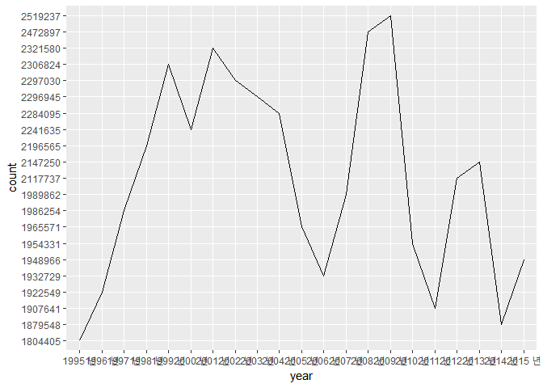
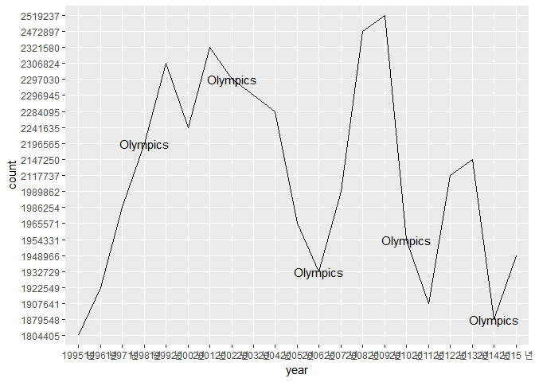
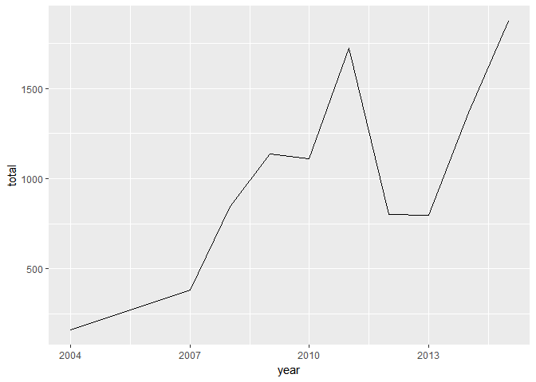
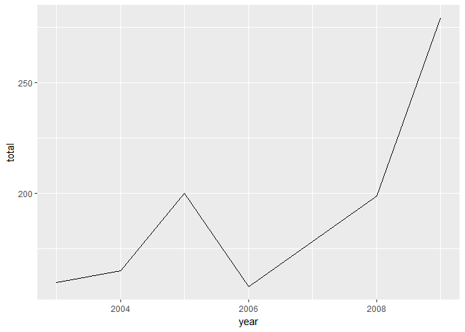
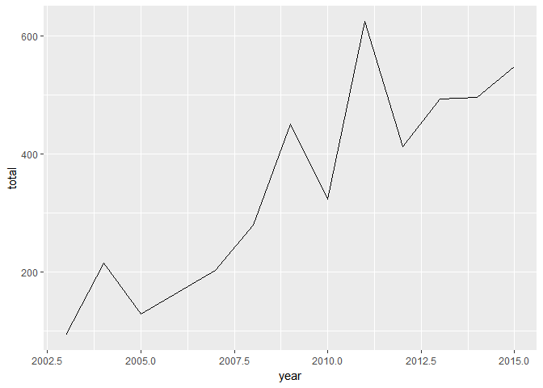
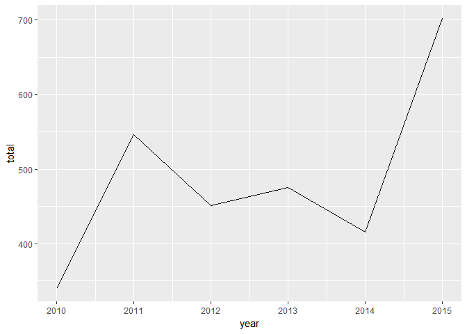

범죄발생에 관한 연구
================

``` r
library(readxl)
```

    ## Warning: package 'readxl' was built under R version 3.4.2

``` r
library(ggplot2)
library(dplyr)
```

    ## 
    ## Attaching package: 'dplyr'

    ## The following objects are masked from 'package:stats':
    ## 
    ##     filter, lag

    ## The following objects are masked from 'package:base':
    ## 
    ##     intersect, setdiff, setequal, union

요약(초록):
-----------

#### 전국에서 발생한 범죄 건수의 추이를 보면 2006년과 2010년,2014년에 급격하게 하락하는 추이를 보인다. 이 범죄 건수의 하락에 기여한 원인이 무엇인지 알아보기 위해서 연구를 진행했다. 이 연구에서 사용된 자료는 경찰청에서 제공한 국적별 범죄통계자료와 공공데이터포털에 제공된 올림픽 실적자료이다. 이 데이터를 바탕으로 우선 범죄 발생 추이를 그래프로 나타내어 2006년과 2010년,2014년에 눈에 띄게 감소하는 추이를 확인했다. 이 그래프 위에 올림픽 발생 년도를 표시하여 올림픽이 발생한 년도에 범죄율이 감소하고 있는 것을 확인했다. 후에 우리나라의 년도별 올림픽의 실적을 그래프로 나타내었고, 세 년도에서 우리나라가 올림픽에서 좋은 실적을 거두었다는 것을 파악했다. 이러한 분석을 통해 올림픽에서 좋은 실적을 얻은 것이 사람들의 심리에 긍정적인 영향을 끼쳐 범죄율이 감소했다는 결론을 도출해 내었다.

데이터 선정
-----------

### 1. 데이터 소개

#### 연구에 사용된 데이터는 통계청과 공공데이터포털에 공개된 국적별 범죄자통계, 역대올림픽 목록이다. 국적별 범죄자의 수, 전국 범죄 발생 건수, 우리나라의 동계올림픽 개최년도, 우리나라의 동계올림픽 실적데이터를 활용하였다.

### 2.데이터를 선정한 이유:

#### 올림픽의 개최와 그 해의 실적이 사람들의 심리에 영향을 미칠 것이라고 판단하고 범죄의 발생과 올림픽 개최의 연관성 여부를 파악하고자 한다.

분석
----

##### 전국에서 발생한 범죄 건수의 추이를 파악하기 위해 전국 범죄 발생 건수를 그래프로 표현했다.

`r   crime<-read_excel("crime_c.xlsx")   head(crime)`

`## # A tibble: 6 x 4   ##   범죄별 국적별    year   count   ##    <chr>  <chr>   <chr>   <chr>   ## 1   합계   합계 1995 년 1804405   ## 2   합계   합계 1996 년 1922549   ## 3   합계   합계 1997 년 1986254   ## 4   합계   합계 1998 년 2196565   ## 5   합계   합계 1999 년 2306824   ## 6   합계   합계 2000 년 2241635`

`r   crime<-crime %>% filter(범죄별=="합계"&국적별=="합계")   ggplot(data=crime,aes(x=year,y=count,group=1))+   geom_line()`



##### 위 그래프에서는 2006년, 2010년, 2014년을 기점으로 급감하는 추이를 보인다.

##### 위 그래프에 동계올림픽이 개최된 년도를 표시하면 아래와 같다.

``` r
ggplot(data=crime,aes(x=year,y=count,group=1))+
  geom_line()+
  annotate("text",x=4,y=13,label="Olympics")+
  annotate("text",x=8,y=17,label="Olympics")+
  annotate("text",x=12,y=5,label="Olympics")+
  annotate("text",x=16,y=7,label="Olympics")+
  annotate("text",x=20,y=2,label="Olympics")
```



``` r
library(stringr)
```

    ## Warning: package 'stringr' was built under R version 3.4.2

##### 우리나라의 연도별 올림픽 실적을 확인해 보았다.

``` r
fes_k<-read.csv("fes_ct.csv")
head(fes_k)
```

    ##   대회코드                                대회명   개최국       개최도시
    ## 1      131 31회 브라질 리우데자네이루 하계올림픽   브라질 리우데자네이루
    ## 2      222           22회 러시아 소치 동계올림픽   러시아           소치
    ## 3      221         21회 캐나다 밴쿠버 동계올림픽   캐나다         밴쿠버
    ## 4      220       20회 이탈리아 토리노 동계올림픽 이탈리아         토리노
    ## 5      219   19회 미국 솔트레이크시티 동계올림픽     미국 솔트레이크시티
    ## 6      218           18회 일본 나가노 동계올림픽     일본         나가노
    ##     개막일   폐막일 대한민국.순위
    ## 1 20160805 20160821           8위
    ## 2 20140207 20140223          13위
    ## 3 20100212 20100228           5위
    ## 4 20060210 20060226           7위
    ## 5 20020208 20020224          14위
    ## 6 19980207 19980222           9위
    ##                            대한민국.획득메달         올림픽.규모
    ## 1                                 금메달 : 9                    
    ## 2  금메달 : 3 은메달 : 3 동메달 : 2 합계 : 8 88개국, 3000(여)명 
    ## 3 금메달 : 6 은메달 : 6 동메달 : 2 합계 : 14  82개국, 5558(여)명
    ## 4 금메달 : 6 은메달 : 3 동메달 : 2 합계 : 11  80개국, 2500(여)명
    ## 5  금메달 : 2 은메달 : 2 동메달 : 0 합계 : 4  77개국, 2399(여)명
    ## 6  금메달 : 3 은메달 : 1 동메달 : 2 합계 : 6  72개국, 2176(여)명
    ##                                        대한민국.참가규모
    ## 1                                                       
    ## 2 대한민국 임원49명, 선수 71명 (참가국 전체 약 3000명)  
    ## 3   대한민국 임원37명, 선수 46명 (참가국 전체 약 5558명)
    ## 4   대한민국 임원29명, 선수 40명 (참가국 전체 약 2500명)
    ## 5   대한민국 임원27명, 선수 48명 (참가국 전체 약 2399명)
    ## 6   대한민국 임원25명, 선수 38명 (참가국 전체 약 2176명)

``` r
fes_k<-rename(fes_k,rank="대한민국.순위")
fes_k$개막일<-str_sub(fes_k$개막일,start=1,end=4)
fes_k$rank<-gsub("위","",fes_k$rank)
fes_rank<-fes_k %>%
  filter(rank!="불참"& rank!="무산"&rank!="메달없음")
fes_rank$rank<- as.numeric(fes_rank$rank)
fes_rank %>%
  select(개막일,rank) %>%
  ggplot(aes(x=reorder(개막일,-rank),y=rank)) + geom_col()
```


##### 위의 그래프를 확인해보면 2006년과 2010년에 우리나라의 올림픽 순위가 10위 이내로 높은 순위를 기록하고 있고 2014년 역시 비교적 높은 순위를 기록하고 있는 것을 파악할 수 있다.

#### 이를 통해 올림픽의 실적과 범죄 건수의 감소가 상관관계가 있다는 것을 알 수 있었는데, 올림픽의 좋은 실적이 사람들의 심리에 긍정적인 영향을 주어 범죄의 건수를 감소시켰다고 추측할 수 있다.

논의
----

#### 범죄율의 감소에 영향을 미치는 요인은 한가지로 단정지을 수 없기 때문에 시기가 유사하다는 이유만으로 올림픽의 개최가 범죄율의 감소에 영향을 주었을 것이라는 주장은 추측에 불과하다. 추후에 분석을 진행한다면 국민의 심리상태나 행복의 척도를 객관화시켜놓은 데이터를 활용하여 올림픽과 연관성이 있는지 조사해볼 것이다.

=====================================

### (참고)외국인 국적별 범죄 건수 추이

##### 외국인의 국적별 범죄 건수의 추이를 확인하고 내국인의 범죄 건수 추이와 비교하여 범죄 건수의 급감에 영향을 끼치는 요인을 파악하고자 한다.

``` r
library(dplyr)
library(ggplot2)
country<-read.csv("c_country.csv")
country_p<-country %>% 
  group_by(country) %>% 
  filter(kind=="외국인") %>% 
  summarise(total=mean(total)) %>% 
  arrange(desc(total))
  
ggplot(data=country_p,aes(x=reorder(country,-total),y=total))+geom_col()
```


``` r
중국<-country %>% filter(country=="중국")
베트남<-country %>% filter(country=="베트남")
몽골<-country %>% filter(country=="몽골")
미국<-country %>% filter(country=="미국")
태국<-country %>% filter(country=="태국")
우즈베키스탄<-country %>% filter(country=="우즈베키스탄")
스리랑카<-country %>% filter(country=="스리랑카")
대만<-country %>% filter(country=="대만")
필리핀<-country %>% filter(country=="필리핀")
러시아<-country %>% filter(country=="러시아")
방글라데시<-country %>% filter(country=="방글라데시")
파키스탄<-country %>% filter(country=="파키스탄")
일본<-country %>% filter(country=="일본")
인도네시아<-country %>% filter(country=="인도네시아")
캐나다<-country %>% filter(country=="캐나다")
```

##### 데이터 상에 2개 이상의 연도가 나타나 있는 국가만을 대상으로 그래프상에 나타내보았다.

``` r
ggplot(data=중국,aes(x=year,y=total,group=1))+geom_line()
```


``` r
ggplot(data=우즈베키스탄,aes(x=year,y=total,group=1))+geom_line()
```


``` r
ggplot(data=태국,aes(x=year,y=total,group=1))+geom_line()
```



``` r
ggplot(data=파키스탄,aes(x=year,y=total,group=1))+geom_line()
```



``` r
ggplot(data=필리핀,aes(x=year,y=total,group=1))+geom_line()
```



``` r
ggplot(data=대만,aes(x=year,y=total,group=1))+geom_line()
```


``` r
ggplot(data=러시아,aes(x=year,y=total,group=1))+geom_line()
```


``` r
ggplot(data=몽골,aes(x=year,y=total,group=1))+geom_line()
```


``` r
ggplot(data=미국,aes(x=year,y=total,group=1))+geom_line()
```


``` r
ggplot(data=베트남,aes(x=year,y=total,group=1))+geom_line()
```


``` r
ggplot(data=스리랑카,aes(x=year,y=total,group=1))+geom_line()
```



#### 그래프를 확인해보면 모든 국적의 외국인의 범죄 건수가 내국인의 범죄 건수와 같이 대체적으로 2006년, 2010년 두 지점에서 눈에 띄게 감소하고 있는 것을 확인할 수 있다. 우리나라에서 발생한 범죄의 건수의 추이는 내국인과 외국인 모두 비슷한 양상을 띄고 있으며 범죄 건수의 급감에 영향을 끼친 요인이 외국인, 내국인이 공유할 수 있는 문화에 있다고 추측해볼 수 있다.
