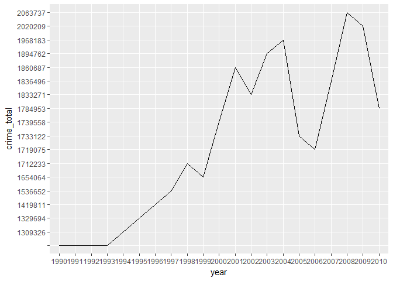
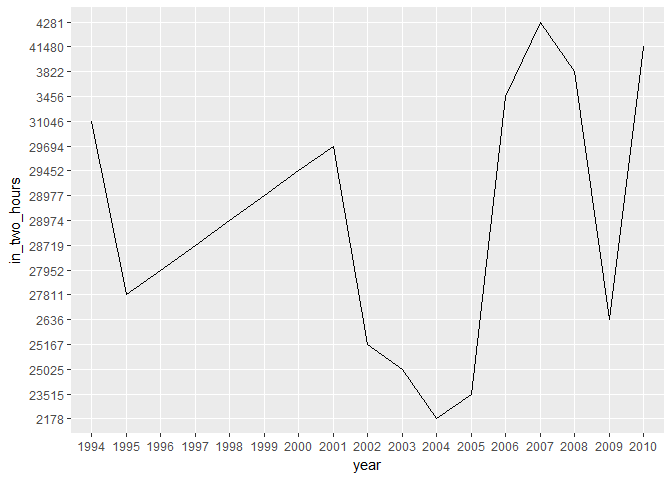
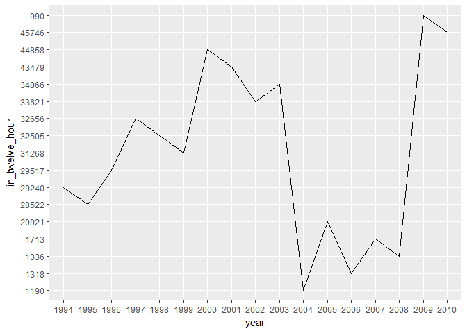
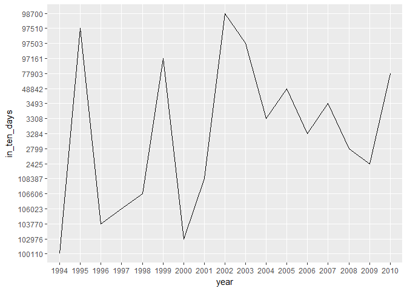
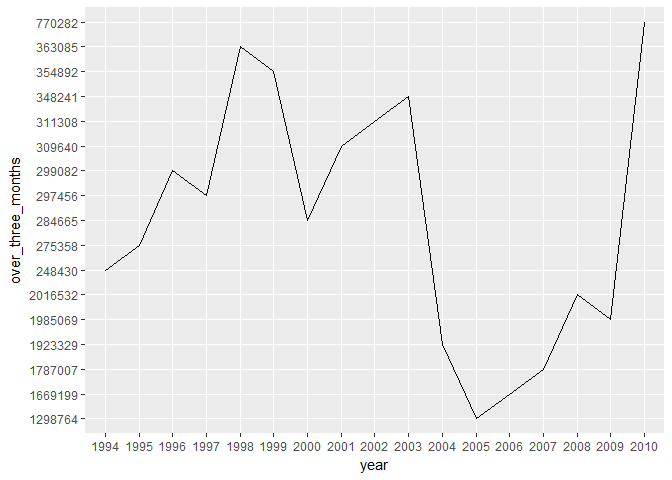

60161162\_정다운\_개인과제
================

### 1. 요약(초록)

경찰의 역할은 범죄자를 체포하는 것이 전부가 아니다. 경찰은 종래 발생한 범죄로 비춰 미래 발생할 범죄를 예방하고, 범죄자를 교화하며, 대국민서비스인 민원 사무를 처리하는 것 등을 모두 망라한다. 무엇보다도 범죄를 예방하는 것은 범죄자를 검거하는 것 이상으로 중요하다 할진대, 기왕에 벌어진 범죄라면 그 사건에 빠르게 대처하는 것이야 말로 경찰력의 바로미터가 될 것이다.

과연 우리 경찰은 사건 발생으로부터 그 인지까지 얼마나 많은 시간이 걸리는지, 그래서 그 역량이 어떻게 될지 궁금해졌다. 이를 위해 통계청을 통해 경찰청에서 1990년부터 매년 집계한 범죄 발생으로부터 사건의 인지까지 걸리는 기간을 사건별과 범죄별로 정리하여 통계 낸 데이터를 활용하였다.

가설을 수립하여 그 가설들이 맞는지 확인하였고, 분석과정에서 알 수 있었던 내용들에 비춰 무엇을 결론지을 수 있는지 논하였다. 끝으로 이 분석의 한계와 비판을 달아 내용을 마쳤다.

------------------------------------------------------------------------

### 2. 분석주제

#### 문제의식

지난겨울, 광장에 모인 시민들의 함성과 뜨겁게 타오르던 촛불이 의미하는 것은 기실 거창한 것은 아니었다. 그저, 나라가 이럴 순 없다는 갑갑함, 정상일 것도 없고 그저 일상으로 되돌아가자는 희망. 그뿐이었다. 냉혹한 겨울날씨에도 필부필부들이 광장에 나선 이유가 마치 준엄한 국민의 명령인양 앞세우는 정치권의 작태는 차치하고, 우리는 광장에서 질서정연한 시민사회를 보았으며 그 안에서 아직 이 사회에는 미래가 있구나, 하는 위안을 얻었다.

광장에서 일상으로 되돌아온 오늘날, 뉴스 사회면을 가득 채우는 것은 적폐청산에 대한 논란이다. 구시대와 결별하고 정말 나라다운 나라로 향해가자는 여망이, 엄정한 법 앞에 모두가 평등하다는 우리 헌법의 원칙이 그르지 않았음을 보여주고 있다. 그것에 정치적 프레임을 덧씌우고자 하는 세력들과의 결별이야 말로, 새로운 시대의 시작이 되지 않을까?

그러나 우리 사회가 갖는 문제란, 그저 기득권 세력의 부패 따위에만 결부되지 않는다. **범죄란 법률에 저촉되어야만 그 행위의 범죄여부를 논할 것인 바, 아무리 나쁜 행위라도 법에서 범죄라 이르지 않는 행위는 범죄가 아니다.** 기실 우리 사회는 그런 행위들이 너무도 많다는 것이 문제이다. 치안에 있어 세계 구급의 지위를 자랑한다지만, **치안은 범죄를 예방하고 처벌하는 데에만 천착할 것은 아니다.** 범죄까지는 아니지만, 미풍양속이나 상식에 기해 건전한 사회를 만들어 내는 것이야 말로 치안의 핵심이다. 결국 수렴되는 것은 치안을 담당하는 경찰의 역량 문제이다.

#### 알아보고자 하는 것

팀프로젝트의 주제가 **범죄 발생에 관한 연구**로 귀결되면서, 그 기저에 있는 *경찰관 수가 증가하면 범죄 발생도 줄어들지 않을까* 라는 생각에 좀 더 천착해보기로 하였다. 와중에 우리 경찰의 역량에 대해 궁금해졌다. 경찰의 역량은 오직 검거율로 징표되는 것은 아니다. 사건이 발생하고 그것을 인지하기까지 소요되는 시간이야 말로 범죄예방이나 경찰서비스 차원에서 중요한 지점이다. 따라서 **경찰이 사건 발생이후 인지하기까지 얼마나 많은 시간들이 걸렸는지** 알아보고자 한다.

------------------------------------------------------------------------

### 3. 데이터 선정

#### 데이터 소개

선정한 데이터의 표제는 "범죄 발생부터 인지까지의 기간"이다.

수사기관에서는 범죄분석을 통해 **범죄통계원표**를 작성하고, 여기에는 발생통계원표, 검거통계원표, 피의자통계원표가 있다. 검거통계원표는 범죄발생에 기한 검거율 등의 통계이고, 피의자통계원표는 검거된 피의자들의 신상에 대한 통계이다.

발생통계원표는 사건이 발생하고 수사기관이 인지(내사 또는 수사를 하기 위해서는 수사기관이 사건이 발생하였음을 알아야 한다. 그걸 범죄를 인지한다, 라고 표현한다.)하기까지 걸리는 시간 등에 대한 통계이다. 그 통계가 곧, 여기서 선정한 데이터이다.

#### 데이터 선정 이유

경찰력은 사건이 발생하여 그를 해결하는 것 뿐만아니라, 대국민 서비스일 일종인 민원업무와 범죄 예방과 단속의 일로 적정히 배분돼 있다.

이중에서도 사건을 인지하여 얼마나 빠르게 초동수사로 대처하였는지는 범인검거 못질않게 중요하다.

이 데이터를 선정한 이유는 각 범죄별과 연도별로 사건을 인지하기까지 걸린 시간을 정연하게 정리되어 있음에 있다.

##### 출처

`범죄 발생부터 인지까지의 기간` 데이터는 통계청(KOSIS)에서 받을 수 있었으며, 원데이터는 경찰청의 `경찰청범죄통계`에 수록되어 있다.

##### 특성

범죄발생 현황 분석 및 범죄추세를 파악하여 형사정책및 사회 치안정책 수립의 기초자료로 활용하기 위해, 경찰청 수사국과 수사기획과가 조사 전담하였다.

이 데이터는 전국 단위로 1년마다 조사갱신하였고, 1990년부터 2010년까지 조사되었다. 2011년부터 2016년까지의 조사는 이전과의 조사와 범죄의 분류 체계가 달라 이 데이터에서는 배제하였다.

``` r
# 먼저 전처리를 위해 dplyr 함수를 불러온다.
library(dplyr)
```

``` r
# 다음으로 csv 파일을 불러오기 위해 readxl 함수를 불러온다.
library(readxl)
```

다음으로 데이터를 불러와 분석을 위한 복사본까지 만들기로 한다.

``` r
crime_rw <- read.csv("범죄발생부터 인지까지의 기간(1990~2010).csv")
crime <- crime_rw
```

분석할 데이터는 대략 이렇게 생겼다.

``` r
head(crime)
```

    ##   죄종별     기간별 항목 단위 X1990.년 X1991.년 X1992.년 X1993.년 X1994.년
    ## 1 총범죄         계 범죄   건       NA       NA       NA       NA  1309326
    ## 2 총범죄  1시간이내 범죄   건       NA       NA       NA       NA   331535
    ## 3 총범죄  2시간이내 범죄   건       NA       NA       NA       NA    31046
    ## 4 총범죄  5시간이내 범죄   건       NA       NA       NA       NA    26873
    ## 5 총범죄 12시간이내 범죄   건       NA       NA       NA       NA    29240
    ## 6 총범죄 24시간이내 범죄   건       NA       NA       NA       NA    61607
    ##   X1995.년 X1996.년 X1997.년 X1998.년 X1999.년 X2000.년 X2001.년 X2002.년
    ## 1  1329694  1419811  1536652  1712233  1654064  1739558  1860687  1833271
    ## 2   364751   418712   513878   593228   586330   685172   765626   784277
    ## 3    27811    27952    28719    28974    28977    29452    29694    25167
    ## 4    25105    24537    25123    28497    30987    33643    31436    25507
    ## 5    28522    29517    32656    32505    31268    44858    43479    33621
    ## 6    53160    55857    62914    63756    59679    67080    64821    57679
    ##   X2003.년 X2004.년 X2005.년 X2006.년 X2007.년 X2008.년 X2009.년 X2010.년
    ## 1  1894762  1968183  1733122  1719075  1836496  2063737  2020209  1784953
    ## 2   791732    16249    57744    18892    16762    18460    10845   355750
    ## 3    25025     2178    23515     3456     4281     3822     2636    41480
    ## 4    25338     1596    21234     2104     2152     1886     1467    43201
    ## 5    34866     1190    20921     1318     1713     1336      990    45746
    ## 6    58799     1042    21991     1448     1651     1298     1079    44977

데이터의 속성을 파악해보자.

``` r
# 먼저 dim 함수를 통해 몇 행, 몇 열로 구성되어 있는지 확인한다.
dim(crime)
```

    ## [1] 2257   25

이 데이터는 `2257개의 행`과 `25개의 열`로 이뤄졌다.

``` r
# 다음으로 str 함수를 통해 변수들의 속성을 파악한다.
str(crime)
```

    ## 'data.frame':    2257 obs. of  25 variables:
    ##  $ 죄종별  : Factor w/ 199 levels "가정의례에 관한 법률",..: 167 167 167 167 167 167 167 167 167 167 ...
    ##  $ 기간별  : Factor w/ 12 levels "10일이내","12시간이내",..: 12 4 6 10 2 5 7 11 1 3 ...
    ##  $ 항목    : Factor w/ 1 level "범죄": 1 1 1 1 1 1 1 1 1 1 ...
    ##  $ 단위    : Factor w/ 1 level "건": 1 1 1 1 1 1 1 1 1 1 ...
    ##  $ X1990.년: int  NA NA NA NA NA NA NA NA NA NA ...
    ##  $ X1991.년: int  NA NA NA NA NA NA NA NA NA NA ...
    ##  $ X1992.년: int  NA NA NA NA NA NA NA NA NA NA ...
    ##  $ X1993.년: int  NA NA NA NA NA NA NA NA NA NA ...
    ##  $ X1994.년: int  1309326 331535 31046 26873 29240 61607 54412 108756 100110 173159 ...
    ##  $ X1995.년: int  1329694 364751 27811 25105 28522 53160 51728 113892 97510 158641 ...
    ##  $ X1996.년: int  1419811 418712 27952 24537 29517 55857 55817 118319 103770 158825 ...
    ##  $ X1997.년: int  1536652 513878 28719 25123 32656 62914 58673 119472 106023 163992 ...
    ##  $ X1998.년: int  1712233 593228 28974 28497 32505 63756 66321 128736 106606 163130 ...
    ##  $ X1999.년: int  1654064 586330 28977 30987 31268 59679 58932 110928 97161 162316 ...
    ##  $ X2000.년: int  1739558 685172 29452 33643 44858 67080 62335 115948 102976 174257 ...
    ##  $ X2001.년: int  1860687 765626 29694 31436 43479 64821 59548 114896 108387 182629 ...
    ##  $ X2002.년: int  1833271 784277 25167 25507 33621 57679 50639 102209 98700 184312 ...
    ##  $ X2003.년: int  1894762 791732 25025 25338 34866 58799 50778 102117 97503 192107 ...
    ##  $ X2004.년: int  1968183 16249 2178 1596 1190 1042 1489 3109 3308 6801 ...
    ##  $ X2005.년: int  1733122 57744 23515 21234 20921 21991 26535 54015 48842 85297 ...
    ##  $ X2006.년: int  1719075 18892 3456 2104 1318 1448 1865 3401 3284 7194 ...
    ##  $ X2007.년: int  1836496 16762 4281 2152 1713 1651 2146 3536 3493 6721 ...
    ##  $ X2008.년: int  2063737 18460 3822 1886 1336 1298 1705 2939 2799 5841 ...
    ##  $ X2009.년: int  2020209 10845 2636 1467 990 1079 1479 2617 2425 5021 ...
    ##  $ X2010.년: int  1784953 355750 41480 43201 45746 44977 45251 83531 77903 140088 ...

`str 함수`를 통해, 25개의 변수에는 `4개의 요소변수`와 `21개의 정수변수`가 있음을 확인할 수 있다. 즉, 21년치의 각 범죄를 기간별로 분류해 놓았음이다.

`죄종별`에는 199개의 범죄 분류가 있고, `기간별`의 분류는 12가지 임을 알 수 있다. 1990년부터 1994년은 결측치로 시작하고 있음을 알 수 있다.

``` r
# 변수들의 요약 통계량을 summary 함수로 파악해본다.
summary(crime)
```

    ##                   죄종별            기간별       항목      단위     
    ##  가정의례에 관한 법률:  12   계        : 199   범죄:2257   건:2257  
    ##  간통                :  12   1시간이내 : 196                        
    ##  강간                :  12   3개월초과 : 196                        
    ##  강도                :  12   3개월이내 : 194                        
    ##  강력범              :  12   1개월이내 : 192                        
    ##  개항질서법          :  12   24시간이내: 191                        
    ##  (Other)             :2185   (Other)   :1089                        
    ##     X1990.년         X1991.년         X1992.년           X1993.년       
    ##  Min.   :     1   Min.   :     1   Min.   :     1.0   Min.   :     1.0  
    ##  1st Qu.:     9   1st Qu.:     9   1st Qu.:     7.0   1st Qu.:     8.0  
    ##  Median :    40   Median :    41   Median :    37.0   Median :    41.0  
    ##  Mean   :  3326   Mean   :  3361   Mean   :  3333.5   Mean   :  3647.9  
    ##  3rd Qu.:   285   3rd Qu.:   288   3rd Qu.:   273.5   3rd Qu.:   306.5  
    ##  Max.   :628837   Max.   :623439   Max.   :643084.0   Max.   :683071.0  
    ##  NA's   :556      NA's   :527      NA's   :465        NA's   :486       
    ##     X1994.년            X1995.년          X1996.년          X1997.년      
    ##  Min.   :      1.0   Min.   :      1   Min.   :      1   Min.   :      1  
    ##  1st Qu.:     16.8   1st Qu.:     13   1st Qu.:     16   1st Qu.:     15  
    ##  Median :    179.5   Median :    161   Median :    168   Median :    191  
    ##  Mean   :  16282.5   Mean   :  16757   Mean   :  18014   Mean   :  19563  
    ##  3rd Qu.:   1297.5   3rd Qu.:   1155   3rd Qu.:   1256   3rd Qu.:   1466  
    ##  Max.   :1309326.0   Max.   :1329694   Max.   :1419811   Max.   :1536652  
    ##  NA's   :1873        NA's   :1876      NA's   :1877      NA's   :1882     
    ##     X1998.년          X1999.년            X2000.년       
    ##  Min.   :      1   Min.   :      1.0   Min.   :1.00e+00  
    ##  1st Qu.:     15   1st Qu.:     17.5   1st Qu.:2.48e+01  
    ##  Median :    168   Median :    170.0   Median :2.15e+02  
    ##  Mean   :  21102   Mean   :  20497.0   Mean   :2.24e+04  
    ##  3rd Qu.:   1367   3rd Qu.:   1516.0   3rd Qu.:1.70e+03  
    ##  Max.   :1712233   Max.   :1654064.0   Max.   :1.74e+06  
    ##  NA's   :1868      NA's   :1862        NA's   :1877      
    ##     X2001.년          X2002.년          X2003.년        
    ##  Min.   :      1   Min.   :      1   Min.   :      1.0  
    ##  1st Qu.:     16   1st Qu.:     17   1st Qu.:     18.2  
    ##  Median :    175   Median :    167   Median :    187.5  
    ##  Mean   :  22842   Mean   :  22779   Mean   :  24217.1  
    ##  3rd Qu.:   1364   3rd Qu.:   1371   3rd Qu.:   1661.8  
    ##  Max.   :1860687   Max.   :1833271   Max.   :1894762.0  
    ##  NA's   :1856      NA's   :1864      NA's   :1871       
    ##     X2004.년            X2005.년          X2006.년      
    ##  Min.   :      1.0   Min.   :      1   Min.   :      1  
    ##  1st Qu.:      6.0   1st Qu.:     17   1st Qu.:      7  
    ##  Median :     30.5   Median :    136   Median :     36  
    ##  Mean   :  31144.3   Mean   :  22905   Mean   :  27982  
    ##  3rd Qu.:    811.8   3rd Qu.:   1810   3rd Qu.:    905  
    ##  Max.   :1968183.0   Max.   :1733122   Max.   :1719075  
    ##  NA's   :1949        NA's   :1880      NA's   :1948     
    ##     X2007.년            X2008.년          X2009.년          X2010.년      
    ##  Min.   :      1.0   Min.   :      1   Min.   :      1   Min.   :      1  
    ##  1st Qu.:      6.0   1st Qu.:      8   1st Qu.:      7   1st Qu.:     15  
    ##  Median :     31.0   Median :     32   Median :     30   Median :    246  
    ##  Mean   :  29052.8   Mean   :  33969   Mean   :  33967   Mean   :  23379  
    ##  3rd Qu.:    967.5   3rd Qu.:   1074   3rd Qu.:    990   3rd Qu.:   2274  
    ##  Max.   :1836496.0   Max.   :2063737   Max.   :2020209   Max.   :1784953  
    ##  NA's   :1942        NA's   :1957      NA's   :1956      NA's   :1864

요약 통계량을 통해 결측치가 있음을 알 수 있다. 다른 정보는 원데이터가 정리되지 않아 정확하게 파악하기 어렵다.

``` r
table(is.na(crime))
```

    ## 
    ## FALSE  TRUE 
    ## 22189 34236

위에서 발견한 결측치를 확인하기 위해, 다음의 함수를 활용하였다. 결과 `34236개의 결측치`를 확인하였다. 결측치가 상당한 바, 유의하여 데이터를 분석하여야 한다.

##### 구성

``` r
head(crime)
```

    ##   죄종별     기간별 항목 단위 X1990.년 X1991.년 X1992.년 X1993.년 X1994.년
    ## 1 총범죄         계 범죄   건       NA       NA       NA       NA  1309326
    ## 2 총범죄  1시간이내 범죄   건       NA       NA       NA       NA   331535
    ## 3 총범죄  2시간이내 범죄   건       NA       NA       NA       NA    31046
    ## 4 총범죄  5시간이내 범죄   건       NA       NA       NA       NA    26873
    ## 5 총범죄 12시간이내 범죄   건       NA       NA       NA       NA    29240
    ## 6 총범죄 24시간이내 범죄   건       NA       NA       NA       NA    61607
    ##   X1995.년 X1996.년 X1997.년 X1998.년 X1999.년 X2000.년 X2001.년 X2002.년
    ## 1  1329694  1419811  1536652  1712233  1654064  1739558  1860687  1833271
    ## 2   364751   418712   513878   593228   586330   685172   765626   784277
    ## 3    27811    27952    28719    28974    28977    29452    29694    25167
    ## 4    25105    24537    25123    28497    30987    33643    31436    25507
    ## 5    28522    29517    32656    32505    31268    44858    43479    33621
    ## 6    53160    55857    62914    63756    59679    67080    64821    57679
    ##   X2003.년 X2004.년 X2005.년 X2006.년 X2007.년 X2008.년 X2009.년 X2010.년
    ## 1  1894762  1968183  1733122  1719075  1836496  2063737  2020209  1784953
    ## 2   791732    16249    57744    18892    16762    18460    10845   355750
    ## 3    25025     2178    23515     3456     4281     3822     2636    41480
    ## 4    25338     1596    21234     2104     2152     1886     1467    43201
    ## 5    34866     1190    20921     1318     1713     1336      990    45746
    ## 6    58799     1042    21991     1448     1651     1298     1079    44977

데이터의 일부분을 추출해본 결과, 이 데이터는 전체 `25개의 열`로 구성되어 있음을 알 수 있다. `죄종별`은 범죄의 종류를 구분하는 변수이고, `기간별`은 경찰이 범죄 발생으로부터 인지하기까지 걸린 시간을 구분한다. `항목`은 그것이 범죄인지 아닌지 기재한 것이며, `단위`는 각 연도별 측정치들이 범죄 건수에 해당함을 알려준다. 데이터 분석상 `항목`과 `단위`는 중요하지 않을 것으로 보인다.

`행은 2257개`이다. 총범죄부터 형법범과 특별범, 형법범의 각 범죄와 특별범의 각 범죄를 망라하고 있다.

------------------------------------------------------------------------

### 4. 분석

#### 분석 목적과 방법

이 데이터를 분석하여 범죄 발생부터 경찰이 인지하기까지 걸린 기간을 확인하고자 한다. 범죄는 예방이 최선이지만 그것이 어렵다면, 발생이후 초동 대응이 매우 중요하다. 그것은 경찰의 역량과 직결된다. **인지 기간으로 우리 경찰의 역량을 단정할 수는 없지만**, 다만 가추의 사례로 확인해볼 수 있을 것이다. 즉, 인지 기간으로 미루어 경찰의 역량에 대해 생각해볼 수 있다는 것이다.

분석 방법은 아래와 같이 설계하였다.

``` r
# 데이터가 방대하므로 확인하고자 하는 데이터만으로 분류한다.
# 어떤 결론이 도출될 것 인지, 가설을 수립한다.
# 데이터 분석을 통해 가설의 그름 여부를 확인한다.
# 결론을 도출한다.
```

#### 변수검토 및 전처리

모든 범죄의 종류를 다 확인하긴 어렵다. 따라서 총범죄를 확인하고, 범죄 큰 두 종인 형법범과 특별범을 분석해본다. 또한 특정범죄는 가장 많이 거론되는 강력범, 절도범, 폭력범, 지능범 등을 확인하도록 한다. 분류한 데이터들을 보기좋게 정리하여 새로운 데이터 프레임을 구축하도록 한다.

``` r
# 총범죄 데이터
total <- crime %>% filter(죄종별 == "총범죄")
total_new <- data.frame(year = c('1990', '1991', '1992', '1993', '1994', '1995', '1996', '1997', '1998', '1999', '2000', '2001', '2002', '2003', '2004', '2005', '2006', '2007', '2008', '2009', '2010'), crime_total = c("", "", "", "", 1309326, 1329694, 1419811, 1536652, 1712233, 1654064, 1739558, 1860687, 1833271, 1894762, 1968183, 1733122, 1719075, 1836496, 2063737, 2020209, 1784953), in_an_hour = c('', '', '', '', 331535, 364751, 418712, 513878, 593228, 586330, 685172, 765626, 784277, 791732, 16249, 57744, 18892, 16762, 18460, 10845, 355750), in_two_hours = c('', '', '', '', 31046, 27811, 27952, 28719, 28974, 28977, 29452, 29694, 25167, 25025, 2178, 23515, 3456, 4281, 3822, 2636, 41480), in_five_hours = c('', '', '', '', 26873, 25105, 24537, 25123, 28497, 30987, 33643, 31436, 25507, 25338, 1596, 21234, 2104, 2152, 1886, 1467, 43201), in_twelve_hour = c('', '', '', '', 29240, 28522, 29517, 32656, 32505, 31268, 44858, 43479, 33621, 34866, 1190, 20921, 1318, 1713, 1336, 990, 45746), in_a_day = c('', '', '', '', 61607, 53160, 55857, 62914, 63756, 59679, 67080, 64821, 57679, 58799, 1042, 21991, 1448, 1651, 1298, 1079, 44977), in_two_days = c('', '', '', '', 54412, 51728, 55817, 58673, 66321, 58932, 62335, 59548, 50639, 50778, 1489, 26535, 1865, 2146, 1705, 1479, 45251), in_five_days = c('', '', '', '', 108756, 113892, 118319, 119472, 128736, 110928, 115948, 114896, 102209, 102117, 3109, 54015, 3401, 3536, 2939, 2617, 83531), in_ten_days = c('', '', '', '', 100110, 97510, 103770, 106023, 106606, 97161, 102976, 108387, 98700, 97503, 3308, 48842, 3284, 3493, 2799, 2425, 77903), in_one_month = c('', '', '', '', 173159, 158641, 158825, 163992, 163130, 162316, 174257, 182629, 184312, 192107, 6801, 85297, 7194, 6721, 5841, 5021, 140088), in_three_months = c('', '', '', '', 144158, 133216, 127423, 127746, 137395, 132594, 139172, 150531, 159852, 168256, 7892, 74264, 6914, 7034, 7119, 6581, 136744), over_three_months = c('', '', '', '', 248430, 275358, 299082, 297456, 363085, 354892, 284665, 309640, 311308, 348241, 1923329, 1298764, 1669199, 1787007, 2016532, 1985069, 770282))
str(total_new)
```

    ## 'data.frame':    21 obs. of  13 variables:
    ##  $ year             : Factor w/ 21 levels "1990","1991",..: 1 2 3 4 5 6 7 8 9 10 ...
    ##  $ crime_total      : Factor w/ 18 levels "","1309326","1329694",..: 1 1 1 1 2 3 4 5 7 6 ...
    ##  $ in_an_hour       : Factor w/ 18 levels "","10845","16249",..: 1 1 1 1 7 9 10 11 14 13 ...
    ##  $ in_two_hours     : Factor w/ 18 levels "","2178","23515",..: 1 1 1 1 14 7 8 9 10 11 ...
    ##  $ in_five_hours    : Factor w/ 18 levels "","1467","1596",..: 1 1 1 1 13 9 8 10 14 15 ...
    ##  $ in_twelve_hour   : Factor w/ 18 levels "","1190","1318",..: 1 1 1 1 8 7 9 12 11 10 ...
    ##  $ in_a_day         : Factor w/ 18 levels "","1042","1079",..: 1 1 1 1 14 9 10 15 16 13 ...
    ##  $ in_two_days      : Factor w/ 18 levels "","1479","1489",..: 1 1 1 1 12 11 13 14 18 15 ...
    ##  $ in_five_days     : Factor w/ 18 levels "","102117","102209",..: 1 1 1 1 4 6 9 10 11 5 ...
    ##  $ in_ten_days      : Factor w/ 18 levels "","100110","102976",..: 1 1 1 1 2 17 4 5 6 15 ...
    ##  $ in_one_month     : Factor w/ 18 levels "","140088","158641",..: 1 1 1 1 8 3 4 7 6 5 ...
    ##  $ in_three_months  : Factor w/ 18 levels "","127423","127746",..: 1 1 1 1 9 5 2 3 7 4 ...
    ##  $ over_three_months: Factor w/ 18 levels "","1298764","1669199",..: 1 1 1 1 8 9 12 11 17 16 ...

``` r
# 형법범 데이터
criminal <- crime %>% filter(죄종별 == "형법범")
criminal_new <- data.frame(year = c('1990', '1991', '1992', '1993', '1994', '1995', '1996', '1997', '1998', '1999', '2000', '2001', '2002', '2003', '2004', '2005', '2006', '2007', '2008', '2009', '2010'),
                           crime_total = c(628837, 623439, 643084, 683071, 467901, 497352, 545178, 553334, 633235, 689558, 773121, 802573, 754605, 827074, 803135, 790847, 818725, 828610, 885671, 980325, 934839),
                           in_an_hour = c(180341, 173916, 179391, 188252, 108052, 113435, 122822, 136070, 165556, 205559, 270862, 282050, 243970, 254493, 7208, 23247, 7418, 7043, 6304, 5072, 129158),
                           in_two_hours = c(28841, 24766, 25149, 22776, 8669, 8050, 7768, 7735, 8902, 10694, 14559, 15340, 12225, 12687, 1403, 13066, 1389, 1940, 1758, 1521, 26425),
                           in_five_hours = c(23250, 19255, 19162, 18208, 12245, 11408, 11077, 11145, 13083, 16521, 22045, 20886, 16029, 17350, 1218, 15578, 1411, 1479, 1386, 1161, 33659),
                           in_twelve_hour = c(23358, 19953, 19897, 17900, 14942, 14315, 15282, 16146, 16047, 17254, 31886, 30495, 22168, 24493, 1018, 15824, 1086, 1339, 1005, 790, 35843),
                           in_a_day = c(58285, 57704, 57601, 49986, 25996, 21274, 22056, 22594, 23431, 25975, 38412, 37478, 29448, 31833, 838, 14394, 1101, 1158, 866, 782, 32575),
                           in_two_days = c(40897, 38066, 36014, 35011, 21711, 20403, 21679, 20730, 21572, 23940, 31739, 29685, 23493, 24471, 1049, 14553, 1280, 1461, 1081, 971, 28492),
                           in_five_days = c(54539, 49673, 48149, 51812, 32625, 31190, 33255, 33643, 35441, 37653, 46958, 46310, 38846, 39869, 1921, 24351, 2124, 2219, 1684, 1581, 42304),
                           in_ten_days = c(38524, 35853, 38148, 43305, 22412, 21716, 23729, 24019, 24721, 27045, 33111, 33744, 30141, 31461, 1713, 17927, 1669, 1806, 1380, 1267, 34667),
                           in_one_month = c(58559, 62360, 61322, 68534, 33121, 32720, 33840, 35785, 37172, 40480, 47293, 49353, 52430, 55337, 2633, 26606, 2926, 2932, 2569, 2528, 58719),
                           in_three_months = c(39951,  42711,  46847,  46808,  39835,  41709,  43146,  45540,  49225,  49968,  52644,  58845, 70188,  74444,   3763,  32759,   3824,   3902,   3796,   4018,  73917),
                           over_three_months = c(82292,  98182, 111404, 140479, 148293, 181132, 210524, 199927, 238085, 234469, 183612, 198387, 215667, 260636, 780371, 592542, 794497, 803331, 863842, 960634, 439080))
str(criminal_new)
```

    ## 'data.frame':    21 obs. of  13 variables:
    ##  $ year             : Factor w/ 21 levels "1990","1991",..: 1 2 3 4 5 6 7 8 9 10 ...
    ##  $ crime_total      : num  628837 623439 643084 683071 467901 ...
    ##  $ in_an_hour       : num  180341 173916 179391 188252 108052 ...
    ##  $ in_two_hours     : num  28841 24766 25149 22776 8669 ...
    ##  $ in_five_hours    : num  23250 19255 19162 18208 12245 ...
    ##  $ in_twelve_hour   : num  23358 19953 19897 17900 14942 ...
    ##  $ in_a_day         : num  58285 57704 57601 49986 25996 ...
    ##  $ in_two_days      : num  40897 38066 36014 35011 21711 ...
    ##  $ in_five_days     : num  54539 49673 48149 51812 32625 ...
    ##  $ in_ten_days      : num  38524 35853 38148 43305 22412 ...
    ##  $ in_one_month     : num  58559 62360 61322 68534 33121 ...
    ##  $ in_three_months  : num  39951 42711 46847 46808 39835 ...
    ##  $ over_three_months: num  82292 98182 111404 140479 148293 ...

``` r
# 특별법범 데이터
particular <- crime %>% filter(죄종별 == "특별법범")
particular_new <- data.frame(year = c('1990', '1991', '1992', '1993', '1994', '1995', '1996', '1997', '1998', '1999', '2000', '2001', '2002', '2003', '2004', '2005', '2006', '2007', '2008', '2009', '2010'), 
                             crime_total = c(518896, 562209, 567702, 621278, 841425, 832342, 874633, 983318, 1078998, 964506, 966437, 1058114, 1078666, 1067688, 1165048, 942275, 900350, 1007886, 1178066, 1039884, 850114), 
                             in_an_hour = c(114251, 115242, 123126, 144456, 223483, 251316, 295890, 377808,  427672, 380771, 414310, 483576,  540307,  537239,    9041,  34497,  11474,    9719,   12156,    5773, 226592), 
                             in_two_hours = c(11865,  10293,  11342,  10976,  22377,  19761,  20184,  20984,   20072,  18283,  14893, 14354,   12942,   12338,     775,  10449,   2067,    2341,    2064,    1115,  15055), 
                             in_five_hours = c(8762,   7338,   7582,   7892,  14628,  13697,  13460,  13978,   15414,  14466,  11598, 10550,    9478,    7988,     378,   5656,    693,     673,     500,     306,   9542), 
                             in_twelve_hour = c(6993,   6211,   8901,   8788,  14298,  14207,  14235,  16510,   16458,  14014,  12972, 12984,   11453,   10373,     172,   5097,    232,     374,     331,     200,   9903), 
                             in_a_day = c(38232,  42699,  43833,  42961,  35611,  31886,  33801,  40320,   40325,  33704,  28668,  27343,   28231,   26966,     204,   7597,    347,     493,     432,     297,  12402), 
                             in_two_days = c(22948,  23361,  24452,  28970,  32701,  31325,  34138,  37943,   44749,  34992,  30596,  29863,   27146,   26307,     440,  11982,    585,     685,     624,     508,  16759), 
                             in_five_days = c(36021,  33662,  35173,  41903,  76131,  82702,  85064,  85829,   93295,  73275,  68990, 68586,   63363,   62248,    1188,  29664,   1277,    1317,    1255,    1036,  41227), 
                             in_ten_days = c(32891,  32716,  34300,  38845,  77698,  75794,  80041,  82004,   81885,  70116,  69865, 74643,   68559,   66042,    1595,  30915,   1615,    1687,    1419,    1158,  43236), 
                             in_one_month = c(75521,  82053,  77934,  88150, 140038, 125921, 124985, 128207,  125958, 121836, 126964, 133276,  131882,  136770,    4168,  58691,   4268,    3789,    3272,    2493,  81369), 
                             in_three_months = c(76324,  84422,  82982,  84037, 104323,  91507,  84277,  82206,   88170,  82626,  86528, 91686,   89664,   93812,    4129,  41505,   3090,    3132,    3323,    2563,  62827), 
                             over_three_months = c(95088, 124212, 118077, 124300, 100137,  94226,  88558,  97529,  125000, 120423, 101053, 111253,   95641,   87605, 1142958, 706222, 874702,  983676, 1152690, 1024435, 331202))
str(particular_new)
```

    ## 'data.frame':    21 obs. of  13 variables:
    ##  $ year             : Factor w/ 21 levels "1990","1991",..: 1 2 3 4 5 6 7 8 9 10 ...
    ##  $ crime_total      : num  518896 562209 567702 621278 841425 ...
    ##  $ in_an_hour       : num  114251 115242 123126 144456 223483 ...
    ##  $ in_two_hours     : num  11865 10293 11342 10976 22377 ...
    ##  $ in_five_hours    : num  8762 7338 7582 7892 14628 ...
    ##  $ in_twelve_hour   : num  6993 6211 8901 8788 14298 ...
    ##  $ in_a_day         : num  38232 42699 43833 42961 35611 ...
    ##  $ in_two_days      : num  22948 23361 24452 28970 32701 ...
    ##  $ in_five_days     : num  36021 33662 35173 41903 76131 ...
    ##  $ in_ten_days      : num  32891 32716 34300 38845 77698 ...
    ##  $ in_one_month     : num  75521 82053 77934 88150 140038 ...
    ##  $ in_three_months  : num  76324 84422 82982 84037 104323 ...
    ##  $ over_three_months: num  95088 124212 118077 124300 100137 ...

``` r
# 기타 데이터
others <- crime %>% filter(죄종별 == "기타")
others_new <- data.frame(year = c('1990', '1991', '1992', '1993', '1994', '1995', '1996', '1997', '1998', '1999', '2000', '2001', '2002', '2003', '2004', '2005', '2006', '2007', '2008', '2009', '2010'), 
                             crime_total = c(9642, 10277, 9756, 9908, '', '', '', '', '', '', '', '', '', '', 63, 68, 61, 299, 345, 10, 12), 
                             in_an_hour = c(2061,  2321, 2142, 2151, '', '', '', '', '', '', '', '', '', '', '',  1,  1,  '',   1, '',  1), 
                             in_two_hours = c(271,   251,  201,  212, '', '', '', '', '', '', '', '', '', '', '',  5, '',  '',  '', '', ''), 
                             in_five_hours = c(306,   230,  264,  220, '', '', '', '', '', '', '', '', '', '',  1,  1, '',  '',  '', '', ''), 
                             in_twelve_hour = c(321,   337,  336,  297, '', '', '', '', '', '', '', '', '', '', '', '', '',  '',  '', '', ''), 
                             in_a_day = c(767,   820,  824,  704, '', '', '', '', '', '', '', '', '', '', '', '', '',  '',  '', '', ''), 
                             in_two_days = c(788,   750,  719,  715, '', '', '', '', '', '', '', '', '', '', '',  1, '',  '',  '',  1,  1), 
                             in_five_days = c(966,  1008,  889,  892, '', '', '', '', '', '', '', '', '', '', '', '', '',   1,   1, '', ''), 
                             in_ten_days = c(783,   844,  732,  752, '', '', '', '', '', '', '', '', '', '', '',  2, '',   2,  '', '', ''), 
                             in_one_month = c(1326,  1446, 1313, 1466, '', '', '', '', '', '', '', '', '', '', '',  7, '',   1,  '', '', ''), 
                             in_three_months = c(999,  1011, 1054, 1133, '', '', '', '', '', '', '', '', '', '', '', 11,  2,  '',   3, '',  1), 
                             over_three_months = c(1054,  1259, 1282, 1366, '', '', '', '', '', '', '', '', '', '', 62, 40, 58, 295, 340,  9,  9))
str(others_new)
```

    ## 'data.frame':    21 obs. of  13 variables:
    ##  $ year             : Factor w/ 21 levels "1990","1991",..: 1 2 3 4 5 6 7 8 9 10 ...
    ##  $ crime_total      : Factor w/ 12 levels "","10","10277",..: 10 3 11 12 1 1 1 1 1 1 ...
    ##  $ in_an_hour       : Factor w/ 6 levels "","1","2061",..: 3 6 4 5 1 1 1 1 1 1 ...
    ##  $ in_two_hours     : Factor w/ 6 levels "","201","212",..: 5 4 2 3 1 1 1 1 1 1 ...
    ##  $ in_five_hours    : Factor w/ 6 levels "","1","220","230",..: 6 4 5 3 1 1 1 1 1 1 ...
    ##  $ in_twelve_hour   : Factor w/ 5 levels "","297","321",..: 3 5 4 2 1 1 1 1 1 1 ...
    ##  $ in_a_day         : Factor w/ 5 levels "","704","767",..: 3 4 5 2 1 1 1 1 1 1 ...
    ##  $ in_two_days      : Factor w/ 6 levels "","1","715","719",..: 6 5 4 3 1 1 1 1 1 1 ...
    ##  $ in_five_days     : Factor w/ 6 levels "","1","1008",..: 6 3 4 5 1 1 1 1 1 1 ...
    ##  $ in_ten_days      : Factor w/ 6 levels "","2","732","752",..: 5 6 3 4 1 1 1 1 1 1 ...
    ##  $ in_one_month     : Factor w/ 7 levels "","1","1313",..: 4 5 3 6 1 1 1 1 1 1 ...
    ##  $ in_three_months  : Factor w/ 9 levels "","1","1011",..: 9 3 4 6 1 1 1 1 1 1 ...
    ##  $ over_three_months: Factor w/ 11 levels "","1054","1259",..: 2 3 4 5 1 1 1 1 1 1 ...

``` r
# 강력범 데이터
violent <- crime %>% filter(죄종별 == "강력범")
violent_new <- data.frame(year = c('1990', '1991', '1992', '1993', '1994', '1995', '1996', '1997', '1998', '1999', '2000', '2001', '2002', '2003', '2004', '2005', '2006', '2007', '2008', '2009', '2010'), 
                         crime_total = c(10681, 8610, 8736, 10763, 12114, 9762, 10655, 11599, 13602, 13400, 14520, 14858, 14353, 16519, 15496, 15357, 16397, 15973, 17758, 19790, 25771), 
                         in_an_hour = c(2720, 2115, 2092,  2632,  3116, 2909,  3433,  3815,  4688,  4354,  5539,  5946,  5424,  6194, 129,   698,   165,   150,   148,   123,  5436), 
                         in_two_hours = c(359,  256,  248,   293,   338,  254,   288,   290,   346,   349,   382,   429,   347,   411, 45,   356,    49,    51,    45,    36,   948), 
                         in_five_hours = c(435,  317,  259,   370,   489,  427,   398,   478,   574,   521,   602,   569,   496,   558, 32,   486,    57,    35,    27,    20,  1325), 
                         in_twelve_hour = c(578,  413,  465,   537,   718,  579,   588,   615,   642,   602,   602,   581,   487,   557, 43,   427,    46,    52,    28,    23,  1263), 
                         in_a_day = c(1294,  999, 1025,  1084,  1111,  787,   831,   738,   876,   786,   767,   798,   761,   873, 24,   302,    37,    32,    23,    24,   885), 
                         in_two_days = c(1032,  765,  690,   892,   976,  858,   896,   687,   763,   730,   713,   660,   602,   673,  40,   374,    39,    29,    35,    30,   919), 
                         in_five_days = c(1065,  865,  847,  1091,  1223, 1003,  1096,  1248,  1367,  1358,  1379,  1306,  1192,  1342, 62,   590,    56,    70,    34,    49,  1236), 
                         in_ten_days = c(582,  431,  562,   647,   782,  591,   672,   796,   872,   874,   861,   877,   871,  1015, 40,   447,    33,    44,    31,    22,  1105), 
                         in_one_month = c(911,  691,  782,   926,  1146,  868,   895,   983,  1184,  1289,  1265,  1206,  1405,  1655, 81,   731,    79,    60,    57,    66,  1679), 
                         in_three_months = c(625,  618,  638,   810,   913,  755,   723,   864,  1030,  1154,  1083,  1072,  1264,  1463, 54,   593,    74,    57,    52,    49,  1646), 
                         over_three_months = c(1080, 1140, 1128,  1481,  1302,  731,   835,  1085,  1260,  1383,  1327,  1414,  1504,  1778, 14946, 10353, 15762, 15393, 17278, 19348,  9329))
str(violent_new)
```

    ## 'data.frame':    21 obs. of  13 variables:
    ##  $ year             : Factor w/ 21 levels "1990","1991",..: 1 2 3 4 5 6 7 8 9 10 ...
    ##  $ crime_total      : num  10681 8610 8736 10763 12114 ...
    ##  $ in_an_hour       : num  2720 2115 2092 2632 3116 ...
    ##  $ in_two_hours     : num  359 256 248 293 338 254 288 290 346 349 ...
    ##  $ in_five_hours    : num  435 317 259 370 489 427 398 478 574 521 ...
    ##  $ in_twelve_hour   : num  578 413 465 537 718 579 588 615 642 602 ...
    ##  $ in_a_day         : num  1294 999 1025 1084 1111 ...
    ##  $ in_two_days      : num  1032 765 690 892 976 ...
    ##  $ in_five_days     : num  1065 865 847 1091 1223 ...
    ##  $ in_ten_days      : num  582 431 562 647 782 591 672 796 872 874 ...
    ##  $ in_one_month     : num  911 691 782 926 1146 ...
    ##  $ in_three_months  : num  625 618 638 810 913 ...
    ##  $ over_three_months: num  1080 1140 1128 1481 1302 ...

``` r
# 절도범 데이터
theft <- crime %>% filter(죄종별 == "절도범")
theft_new <- data.frame(year = c('1990', '1991', '1992', '1993', '1994', '1995', '1996', '1997', '1998', '1999', '2000', '2001', '2002', '2003', '2004', '2005', '2006', '2007', '2008', '2009', '2010'), 
                          crime_total = c(95427, 87358, 77861, 61526, 60255, 62710, 70238, 83063, 91438, 89395, 173876, 180704, 178457, 187352, 155311, 188780, 192670, 212458, 223216, 256423, 269410), 
                          in_an_hour = c(23379, 19955, 17622, 14561, 14858, 16842, 19768, 24164, 27771, 24975,  53899,  53826,  41170, 46398,   1017,   3754,   1211,   1338,   1108,   1128,  37412), 
                          in_two_hours = c(4696,  3584,  3037,  2011,  1515,  1649,  1822,  2150,  2211,  2035,   4585,   4445,   3302, 3669,    254,   3013,    271,    373,    278,    236,   6077), 
                          in_five_hours = c(6783,  5157,  4144,  2693,  2517,  2995,  3285,  3849,  3948,  3556,   8948,   8903,   6030,  7318,    269,   5926,    353,    382,    288,    310,  11034), 
                          in_twelve_hour = c(10353,  8232,  6900,  4385,  4192,  5153,  6237,  7737,  7257,  6361,  17787,  17170,  11913, 14178,    394,   8914,    442,    536,    372,    325,  18336), 
                          in_a_day = c(9932,  9352,  8108,  5483,  5146,  5666,  6712,  8041,  8102,  7172,  16936,  16687,  12132, 14832,    378,   8090,    492,    518,    336,    328,  18395), 
                          in_two_days = c(7132,  6581,  5796,  4246,  4441,  5103,  5823,  6731,  6461,  5871,  12193,  11378,   8571, 9619,    373,   7041,    456,    528,    326,    340,  14250), 
                          in_five_days = c(7756,  7067,  6447,  5238,  5992,  6630,  7581,  8826,  9075,  8048,  15045,  14806,  12422, 13345,    625,   9954,    638,    769,    512,    586,  17677), 
                          in_ten_days = c(4251,  4233,  4073,  3559,  4247,  4403,  4686,  5287,  5718,  5134,   9140,   9810,   9331, 9633,    563,   6071,    540,    584,    381,    457,  12335), 
                          in_one_month = c(5807,  6588,  6074,  5750,  6118,  5646,  5757,  6368,  7628,  8087,  11917,  13548,  17446, 16901,    693,   7592,    878,    999,    736,    933,  19869), 
                          in_three_months = c(4358,  5084,  5910,  4784,  4955,  4227,  4131,  4586,  6171,  7875,  10388,  12850,  20632, 17466,    757,   7926,    748,   1021,    984,   1174,  20555), 
                          over_three_months = c(10980, 11525,  9750,  8816,  6274,  4396,  4436,  5324,  7096, 10281,  13038,  17281,  35508, 33993, 149988, 120499, 186641, 205410, 217895, 250606,  93470))
str(theft_new)
```

    ## 'data.frame':    21 obs. of  13 variables:
    ##  $ year             : Factor w/ 21 levels "1990","1991",..: 1 2 3 4 5 6 7 8 9 10 ...
    ##  $ crime_total      : num  95427 87358 77861 61526 60255 ...
    ##  $ in_an_hour       : num  23379 19955 17622 14561 14858 ...
    ##  $ in_two_hours     : num  4696 3584 3037 2011 1515 ...
    ##  $ in_five_hours    : num  6783 5157 4144 2693 2517 ...
    ##  $ in_twelve_hour   : num  10353 8232 6900 4385 4192 ...
    ##  $ in_a_day         : num  9932 9352 8108 5483 5146 ...
    ##  $ in_two_days      : num  7132 6581 5796 4246 4441 ...
    ##  $ in_five_days     : num  7756 7067 6447 5238 5992 ...
    ##  $ in_ten_days      : num  4251 4233 4073 3559 4247 ...
    ##  $ in_one_month     : num  5807 6588 6074 5750 6118 ...
    ##  $ in_three_months  : num  4358 5084 5910 4784 4955 ...
    ##  $ over_three_months: num  10980 11525 9750 8816 6274 ...

``` r
# 폭력범 데이터
violence <- crime %>% filter(죄종별 == "폭력범")
violence_new <- data.frame(year = c('1990', '1991', '1992', '1993', '1994', '1995', '1996', '1997', '1998', '1999', '2000', '2001', '2002', '2003', '2004', '2005', '2006', '2007', '2008', '2009', '2010'), 
                        crime_total = c(176829, 171817, 165556, 182041, 193047, 186490, 194891, 200675, 226409, 282274, 333630, 338045, 283930, 294893, 286464, 285363, 281969, 295156, 305508, 315747, 292347), 
                        in_an_hour = c(59975,  60931,  63291,  70895,  79426,  82565,  88359,  95295, 116247, 150959, 186610, 194236, 167116, 172402,   5123,  16540,   4747,   4256,   3709,   2685,  69577), 
                        in_two_hours = c(6916,   6165,   5576,   5561,   5728,   5159,   4800,   4404,   5267,   6876,   7937,   8462,   6836,  6971,    984,   8458,    931,   1276,   1175,   1021,  15629), 
                        in_five_hours = c(6451,   5504,   5226,   5389,   7707,   6593,   6126,   5495,   6575,   9348,  10049,   8770,   7102, 7163,    739,   7285,    808,    814,    832,    621,  15635), 
                        in_twelve_hour = c(7921,   7197,   7148,   7608,   8259,   7176,   7105,   6422,   6639,   8415,  11485,  10704,   7929,  7891,    476,   5338,    460,    548,    431,    321,  11525), 
                        in_a_day = c(20641,  18644,  18839,  17819,  16259,  12126,  11827,  11007,  11641,  14292,  17122,  16224,  13040, 12783,    359,   4598,    447,    458,    358,    307,   9480), 
                        in_two_days = c(15773,  14206,  12347,  12925,  13479,  11880,  12367,  11027,  11827,  14006,  15762,  14382,  11221, 11211,    537,   5536,    556,    636,    449,    385,   9463), 
                        in_five_days = c(18680,  17565,  15518,  16766,  20612,  19017,  19822,  18794,  19908,  22245,  24547,  23386,  18823, 19096,    982,  10565,    984,    915,    710,    590,  16624), 
                        in_ten_days = c(9274,   8986,   8434,   9934,  12326,  11929,  13274,  12986,  13010,  15183,  17019,  16391,  13230, 13938,    803,   7978,    668,    703,    578,    459,  13786), 
                        in_one_month = c(11342,  10528,   9723,  11533,  12816,  13080,  13656,  14961,  14594,  16924,  18830,  17755,  15712, 17546,    960,  10249,    905,    868,    810,    666,  19445), 
                        in_three_months = c(7640,   7395,   7626,   8664,   8011,   8570,   8982,  10229,  10234,  11608,  11550,  11872,  10598, 12350,    722,   7433,    635,    587,    569,    506,  14733), 
                        over_three_months = c(12216,  14696,  11828,  14947,   8424,   8395,   8573,  10055,  10467,  12418,  12719,  15863,  12323,  13542, 274779, 201383, 270828, 284095, 295887, 308186,  96450))
str(violence_new)
```

    ## 'data.frame':    21 obs. of  13 variables:
    ##  $ year             : Factor w/ 21 levels "1990","1991",..: 1 2 3 4 5 6 7 8 9 10 ...
    ##  $ crime_total      : num  176829 171817 165556 182041 193047 ...
    ##  $ in_an_hour       : num  59975 60931 63291 70895 79426 ...
    ##  $ in_two_hours     : num  6916 6165 5576 5561 5728 ...
    ##  $ in_five_hours    : num  6451 5504 5226 5389 7707 ...
    ##  $ in_twelve_hour   : num  7921 7197 7148 7608 8259 ...
    ##  $ in_a_day         : num  20641 18644 18839 17819 16259 ...
    ##  $ in_two_days      : num  15773 14206 12347 12925 13479 ...
    ##  $ in_five_days     : num  18680 17565 15518 16766 20612 ...
    ##  $ in_ten_days      : num  9274 8986 8434 9934 12326 ...
    ##  $ in_one_month     : num  11342 10528 9723 11533 12816 ...
    ##  $ in_three_months  : num  7640 7395 7626 8664 8011 ...
    ##  $ over_three_months: num  12216 14696 11828 14947 8424 ...

``` r
# 지능범 데이터
intellectual <- crime %>% filter(죄종별 == "지능범")
intellectual_new <- data.frame(year = c('1990', '1991', '1992', '1993', '1994', '1995', '1996', '1997', '1998', '1999', '2000', '2001', '2002', '2003', '2004', '2005', '2006', '2007', '2008', '2009', '2010'), 
                           crime_total = c(66555, 76333, 104279, 134026, 158399, 196845, 227064, 213445, 253297, 249769,  92574, 209364, 220719, 273867, 290643, 244680, 258705, 233213, 260327, 282106, 268191), 
                           in_an_hour = c(2748,  4737,   7292,   8237,   2958,   3048,   2716,   3094,   5539,  12593,   8919,  10839,  11844,  12612,    602,    888,    759,    785,    717,    674,   5932), 
                           in_two_hours = c(314,   281,    380,    321,    195,    205,    150,    190,    291,    568,    595,    838,    638, 704,     46,    361,     67,     99,    109,    103,   1310), 
                           in_five_hours = c(328,   387,    339,    305,    279,    279,    297,    300,    908,   1697,   1058,   1171,   1108,  1221,     81,    681,    112,    128,    119,    102,   2216), 
                           in_twelve_hour = c(219,   238,    490,    444,    289,    250,    251,    271,    344,    721,    663,    792,    703, 756,     59,    455,     72,    121,    112,     78,   2495), 
                           in_a_day = c(1075,  2444,   1395,   1230,    703,    503,    587,    735,    761,   1492,   1102,   1234,   1278, 1377,     40,    739,     63,     92,    105,     79,   2237), 
                           in_two_days = c(693,   785,    760,    804,    644,    639,    612,    601,    750,   1516,   1080,   1242,   1242, 1318,     59,    867,    156,    210,    197,    148,   2329), 
                           in_five_days = c(1386,  1371,   1319,   1288,   1458,   1437,   1532,   1659,   1835,   2585,   2202,   2762,   2786, 2984,    148,   1699,    281,    342,    305,    241,   4052), 
                           in_ten_days = c(1397,  1312,   1796,   1856,   2297,   2291,   2412,   2399,   2511,   2996,   2911,   3412,   3653, 4055,    184,   1957,    298,    357,    290,    248,   4809), 
                           in_one_month = c(4966,  5166,   5458,   7043,   7731,   8233,   8712,   8463,   8797,   8472,   9171,  10812,  12355, 13657,    664,   5166,    783,    791,    757,    676,  12509), 
                           in_three_months = c(9540,  9796,  12990,  14727,  19932,  22348,  23365,  23532,  25262,  21906,  22147,  25837,  31052, 36247,   1918,  12924,   2032,   1998,   1929,   1914,  29907), 
                           over_three_months = c(43889, 50816,  72060,  97771, 121913, 157612, 186430, 172201, 206299, 195223, 142726, 150425, 154060, 198936, 286842, 218943, 254082, 228290, 255687, 277843, 200395))
str(intellectual_new)
```

    ## 'data.frame':    21 obs. of  13 variables:
    ##  $ year             : Factor w/ 21 levels "1990","1991",..: 1 2 3 4 5 6 7 8 9 10 ...
    ##  $ crime_total      : num  66555 76333 104279 134026 158399 ...
    ##  $ in_an_hour       : num  2748 4737 7292 8237 2958 ...
    ##  $ in_two_hours     : num  314 281 380 321 195 205 150 190 291 568 ...
    ##  $ in_five_hours    : num  328 387 339 305 279 ...
    ##  $ in_twelve_hour   : num  219 238 490 444 289 250 251 271 344 721 ...
    ##  $ in_a_day         : num  1075 2444 1395 1230 703 ...
    ##  $ in_two_days      : num  693 785 760 804 644 ...
    ##  $ in_five_days     : num  1386 1371 1319 1288 1458 ...
    ##  $ in_ten_days      : num  1397 1312 1796 1856 2297 ...
    ##  $ in_one_month     : num  4966 5166 5458 7043 7731 ...
    ##  $ in_three_months  : num  9540 9796 12990 14727 19932 ...
    ##  $ over_three_months: num  43889 50816 72060 97771 121913 ...

``` r
# 사기 데이터
fraud <- crime %>% filter(죄종별 == "사기")
fraud_new <- data.frame(year = c('1990', '1991', '1992', '1993', '1994', '1995', '1996', '1997', '1998', '1999', '2000', '2001', '2002', '2003', '2004', '2005', '2006', '2007', '2008', '2009', '2010'), 
                               crime_total = c(44035, 52681, 74280, 99882, '', '', '', '', '', '', '', '', '', '', '', '', '', '', '', '', ''), 
                               in_an_hour = c(1882,  2968,  3885,  4431, '', '', '', '', '', '', '', '', '', '', '', '', '', '', '', '', ''), 
                               in_two_hours = c(235,   170,   198,   132, '', '', '', '', '', '', '', '', '', '', '', '', '', '', '', '', ''), 
                               in_five_hours = c(264,   276,   194,   194, '', '', '', '', '', '', '', '', '', '', '', '', '', '', '', '', ''), 
                               in_twelve_hour = c(145,   167,   321,   279, '', '', '', '', '', '', '', '', '', '', '', '', '', '', '', '', ''), 
                               in_a_day = c(700,   941,   862,   752, '', '', '', '', '', '', '', '', '', '', '', '', '', '', '', '', ''), 
                               in_two_days = c(437,   499,   451,   475, '', '', '', '', '', '', '', '', '', '', '', '', '', '', '', '', ''), 
                               in_five_days = c(826,   810,   734,   724, '', '', '', '', '', '', '', '', '', '', '', '', '', '', '', '', ''), 
                               in_ten_days = c(832,   776,  1098,  1157, '', '', '', '', '', '', '', '', '', '', '', '', '', '', '', '', ''), 
                               in_one_month = c(3243,  3334,  3614,  4792, '', '', '', '', '', '', '', '', '', '', '', '', '', '', '', '', ''), 
                               in_three_months = c(6274,  6704,  9359, 10885, '', '', '', '', '', '', '', '', '', '', '', '', '', '', '', '', ''), 
                               over_three_months = c(29197, 36036, 53564, 76061, '', '', '', '', '', '', '', '', '', '', '', '', '', '', '', '', ''))
str(fraud_new)
```

    ## 'data.frame':    21 obs. of  13 variables:
    ##  $ year             : Factor w/ 21 levels "1990","1991",..: 1 2 3 4 5 6 7 8 9 10 ...
    ##  $ crime_total      : Factor w/ 5 levels "","44035","52681",..: 2 3 4 5 1 1 1 1 1 1 ...
    ##  $ in_an_hour       : Factor w/ 5 levels "","1882","2968",..: 2 3 4 5 1 1 1 1 1 1 ...
    ##  $ in_two_hours     : Factor w/ 5 levels "","132","170",..: 5 3 4 2 1 1 1 1 1 1 ...
    ##  $ in_five_hours    : Factor w/ 4 levels "","194","264",..: 3 4 2 2 1 1 1 1 1 1 ...
    ##  $ in_twelve_hour   : Factor w/ 5 levels "","145","167",..: 2 3 5 4 1 1 1 1 1 1 ...
    ##  $ in_a_day         : Factor w/ 5 levels "","700","752",..: 2 5 4 3 1 1 1 1 1 1 ...
    ##  $ in_two_days      : Factor w/ 5 levels "","437","451",..: 2 5 3 4 1 1 1 1 1 1 ...
    ##  $ in_five_days     : Factor w/ 5 levels "","724","734",..: 5 4 3 2 1 1 1 1 1 1 ...
    ##  $ in_ten_days      : Factor w/ 5 levels "","1098","1157",..: 5 4 2 3 1 1 1 1 1 1 ...
    ##  $ in_one_month     : Factor w/ 5 levels "","3243","3334",..: 2 3 4 5 1 1 1 1 1 1 ...
    ##  $ in_three_months  : Factor w/ 5 levels "","10885","6274",..: 3 4 5 2 1 1 1 1 1 1 ...
    ##  $ over_three_months: Factor w/ 5 levels "","29197","36036",..: 2 3 4 5 1 1 1 1 1 1 ...

``` r
# 횡령 데이터
usurper <- crime %>% filter(죄종별 == "횡령")
usurper_new <- data.frame(year = c('1990', '1991', '1992', '1993', '1994', '1995', '1996', '1997', '1998', '1999', '2000', '2001', '2002', '2003', '2004', '2005', '2006', '2007', '2008', '2009', '2010'), 
                        crime_total = c(8478, 8612, 11095, 12226, '', '', '', '', '', '', '', '', '', '', '', '', '', '', '', '', ''), 
                        in_an_hour = c(250,  361,   428,   465, '', '', '', '', '', '', '', '', '', '', '', '', '', '', '', '', ''), 
                        in_two_hours = c(22,   10,     4,     5, '', '', '', '', '', '', '', '', '', '', '', '', '', '', '', '', ''), 
                        in_five_hours = c(14,   22,     3,     5, '', '', '', '', '', '', '', '', '', '', '', '', '', '', '', '', ''), 
                        in_twelve_hour = c(10,   10,    33,    35, '', '', '', '', '', '', '', '', '', '', '', '', '', '', '', '', ''), 
                        in_a_day = c(100,  128,   124,    89, '', '', '', '', '', '', '', '', '', '', '', '', '', '', '', '', ''), 
                        in_two_days = c(56,   42,    68,    75, '', '', '', '', '', '', '', '', '', '', '', '', '', '', '', '', ''), 
                        in_five_days = c(178,  146,   137,   154, '', '', '', '', '', '', '', '', '', '', '', '', '', '', '', '', ''), 
                        in_ten_days = c(190,  183,   239,   215, '', '', '', '', '', '', '', '', '', '', '', '', '', '', '', '', ''), 
                        in_one_month = c(673,  655,   748,   901, '', '', '', '', '', '', '', '', '', '', '', '', '', '', '', '', ''), 
                        in_three_months = c(1286, 1270,  1637,  1665, '', '', '', '', '', '', '', '', '', '', '', '', '', '', '', '', ''),
                        over_three_months = c(5699, 5785,  7674,  8617, '', '', '', '', '', '', '', '', '', '', '', '', '', '', '', '', ''))
str(usurper_new)
```

    ## 'data.frame':    21 obs. of  13 variables:
    ##  $ year             : Factor w/ 21 levels "1990","1991",..: 1 2 3 4 5 6 7 8 9 10 ...
    ##  $ crime_total      : Factor w/ 5 levels "","11095","12226",..: 4 5 2 3 1 1 1 1 1 1 ...
    ##  $ in_an_hour       : Factor w/ 5 levels "","250","361",..: 2 3 4 5 1 1 1 1 1 1 ...
    ##  $ in_two_hours     : Factor w/ 5 levels "","10","22","4",..: 3 2 4 5 1 1 1 1 1 1 ...
    ##  $ in_five_hours    : Factor w/ 5 levels "","14","22","3",..: 2 3 4 5 1 1 1 1 1 1 ...
    ##  $ in_twelve_hour   : Factor w/ 4 levels "","10","33","35": 2 2 3 4 1 1 1 1 1 1 ...
    ##  $ in_a_day         : Factor w/ 5 levels "","100","124",..: 2 4 3 5 1 1 1 1 1 1 ...
    ##  $ in_two_days      : Factor w/ 5 levels "","42","56","68",..: 3 2 4 5 1 1 1 1 1 1 ...
    ##  $ in_five_days     : Factor w/ 5 levels "","137","146",..: 5 3 2 4 1 1 1 1 1 1 ...
    ##  $ in_ten_days      : Factor w/ 5 levels "","183","190",..: 3 2 5 4 1 1 1 1 1 1 ...
    ##  $ in_one_month     : Factor w/ 5 levels "","655","673",..: 3 2 4 5 1 1 1 1 1 1 ...
    ##  $ in_three_months  : Factor w/ 5 levels "","1270","1286",..: 3 2 4 5 1 1 1 1 1 1 ...
    ##  $ over_three_months: Factor w/ 5 levels "","5699","5785",..: 2 3 4 5 1 1 1 1 1 1 ...

``` r
# 배임 데이터
malfeasance <- crime %>% filter(죄종별 == "배임")
malfeasance_new <- data.frame(year = c('1990', '1991', '1992', '1993', '1994', '1995', '1996', '1997', '1998', '1999', '2000', '2001', '2002', '2003', '2004', '2005', '2006', '2007', '2008', '2009', '2010'), 
                          crime_total = c(2313, 2272, 2635, 3091, '', '', '', '', '', '', '', '', '', '', '', '', '', '', '', '', ''), 
                          in_an_hour = c(56,   97,   87,  101, '', '', '', '', '', '', '', '', '', '', '', '', '', '', '', '', ''), 
                          in_two_hours = c(6,    3,    1,    3, '', '', '', '', '', '', '', '', '', '', '', '', '', '', '', '', ''), 
                          in_five_hours = c(2,    6,    4,   '', '', '', '', '', '', '', '', '', '', '', '', '', '', '', '', '', ''), 
                          in_twelve_hour = c(1,   '',   16,   11, '', '', '', '', '', '', '', '', '', '', '', '', '', '', '', '', ''), 
                          in_a_day = c(14,   24,   26,   30, '', '', '', '', '', '', '', '', '', '', '', '', '', '', '', '', ''), 
                          in_two_days = c(20,   10,   12,   17, '', '', '', '', '', '', '', '', '', '', '', '', '', '', '', '', ''), 
                          in_five_days = c(31,   28,   36,   31, '', '', '', '', '', '', '', '', '', '', '', '', '', '', '', '', ''), 
                          in_ten_days = c(40,   37,   54,   60, '', '', '', '', '', '', '', '', '', '', '', '', '', '', '', '', ''), 
                          in_one_month = c(150,  146,  181,  197, '', '', '', '', '', '', '', '', '', '', '', '', '', '', '', '', ''), 
                          in_three_months = c(266,  283,  358,  336, '', '', '', '', '', '', '', '', '', '', '', '', '', '', '', '', ''),
                          over_three_months = c(1727, 1638, 1860, 2305, '', '', '', '', '', '', '', '', '', '', '', '', '', '', '', '', ''))
str(malfeasance_new)
```

    ## 'data.frame':    21 obs. of  13 variables:
    ##  $ year             : Factor w/ 21 levels "1990","1991",..: 1 2 3 4 5 6 7 8 9 10 ...
    ##  $ crime_total      : Factor w/ 5 levels "","2272","2313",..: 3 2 4 5 1 1 1 1 1 1 ...
    ##  $ in_an_hour       : Factor w/ 5 levels "","101","56",..: 3 5 4 2 1 1 1 1 1 1 ...
    ##  $ in_two_hours     : Factor w/ 4 levels "","1","3","6": 4 3 2 3 1 1 1 1 1 1 ...
    ##  $ in_five_hours    : Factor w/ 4 levels "","2","4","6": 2 4 3 1 1 1 1 1 1 1 ...
    ##  $ in_twelve_hour   : Factor w/ 4 levels "","1","11","16": 2 1 4 3 1 1 1 1 1 1 ...
    ##  $ in_a_day         : Factor w/ 5 levels "","14","24","26",..: 2 3 4 5 1 1 1 1 1 1 ...
    ##  $ in_two_days      : Factor w/ 5 levels "","10","12","17",..: 5 2 3 4 1 1 1 1 1 1 ...
    ##  $ in_five_days     : Factor w/ 4 levels "","28","31","36": 3 2 4 3 1 1 1 1 1 1 ...
    ##  $ in_ten_days      : Factor w/ 5 levels "","37","40","54",..: 3 2 4 5 1 1 1 1 1 1 ...
    ##  $ in_one_month     : Factor w/ 5 levels "","146","150",..: 3 2 4 5 1 1 1 1 1 1 ...
    ##  $ in_three_months  : Factor w/ 5 levels "","266","283",..: 2 3 5 4 1 1 1 1 1 1 ...
    ##  $ over_three_months: Factor w/ 5 levels "","1638","1727",..: 3 2 4 5 1 1 1 1 1 1 ...

``` r
# 명예훼손 데이터
honor <- crime %>% filter(죄종별 == "명예훼손")
honor_new <- data.frame(year = c('1990', '1991', '1992', '1993', '1994', '1995', '1996', '1997', '1998', '1999', '2000', '2001', '2002', '2003', '2004', '2005', '2006', '2007', '2008', '2009', '2010'), 
                              crime_total = c(2512, 2385, 2598, 2896, '', '', '', '', '', '', '', '', '', '', '', '', '', '', '', '', ''), 
                              in_an_hour = c(54,   98,   76,   77, '', '', '', '', '', '', '', '', '', '', '', '', '', '', '', '', ''), 
                              in_two_hours = c(6,    6,    3,    2, '', '', '', '', '', '', '', '', '', '', '', '', '', '', '', '', ''), 
                              in_five_hours = c(7,   13,    8,    6, '', '', '', '', '', '', '', '', '', '', '', '', '', '', '', '', ''), 
                              in_twelve_hour = c(14,   13,   25,    9, '', '', '', '', '', '', '', '', '', '', '', '', '', '', '', '', ''), 
                              in_a_day = c(94,   91,  107,  101, '', '', '', '', '', '', '', '', '', '', '', '', '', '', '', '', ''), 
                              in_two_days = c(141,  111,  120,  122, '', '', '', '', '', '', '', '', '', '', '', '', '', '', '', '', ''), 
                              in_five_days = c(269,  212,  255,  251, '', '', '', '', '', '', '', '', '', '', '', '', '', '', '', '', ''), 
                              in_ten_days = c(240,  218,  206,  272, '', '', '', '', '', '', '', '', '', '', '', '', '', '', '', '', ''), 
                              in_one_month = c(583,  512,  550,  619, '', '', '', '', '', '', '', '', '', '', '', '', '', '', '', '', ''), 
                              in_three_months = c(495,  471,  550,  580, '', '', '', '', '', '', '', '', '', '', '', '', '', '', '', '', ''),
                              over_three_months = c(609,  640,  698,  857, '', '', '', '', '', '', '', '', '', '', '', '', '', '', '', '', ''))
str(honor_new)
```

    ## 'data.frame':    21 obs. of  13 variables:
    ##  $ year             : Factor w/ 21 levels "1990","1991",..: 1 2 3 4 5 6 7 8 9 10 ...
    ##  $ crime_total      : Factor w/ 5 levels "","2385","2512",..: 3 2 4 5 1 1 1 1 1 1 ...
    ##  $ in_an_hour       : Factor w/ 5 levels "","54","76","77",..: 2 5 3 4 1 1 1 1 1 1 ...
    ##  $ in_two_hours     : Factor w/ 4 levels "","2","3","6": 4 4 3 2 1 1 1 1 1 1 ...
    ##  $ in_five_hours    : Factor w/ 5 levels "","13","6","7",..: 4 2 5 3 1 1 1 1 1 1 ...
    ##  $ in_twelve_hour   : Factor w/ 5 levels "","13","14","25",..: 3 2 4 5 1 1 1 1 1 1 ...
    ##  $ in_a_day         : Factor w/ 5 levels "","101","107",..: 5 4 3 2 1 1 1 1 1 1 ...
    ##  $ in_two_days      : Factor w/ 5 levels "","111","120",..: 5 2 3 4 1 1 1 1 1 1 ...
    ##  $ in_five_days     : Factor w/ 5 levels "","212","251",..: 5 2 4 3 1 1 1 1 1 1 ...
    ##  $ in_ten_days      : Factor w/ 5 levels "","206","218",..: 4 3 2 5 1 1 1 1 1 1 ...
    ##  $ in_one_month     : Factor w/ 5 levels "","512","550",..: 4 2 3 5 1 1 1 1 1 1 ...
    ##  $ in_three_months  : Factor w/ 5 levels "","471","495",..: 3 2 4 5 1 1 1 1 1 1 ...
    ##  $ over_three_months: Factor w/ 5 levels "","609","640",..: 2 3 4 5 1 1 1 1 1 1 ...

``` r
# 권리행사방해 데이터
right <- crime %>% filter(죄종별 == "권리행사방해")
right_new <- data.frame(year = c('1990', '1991', '1992', '1993', '1994', '1995', '1996', '1997', '1998', '1999', '2000', '2001', '2002', '2003', '2004', '2005', '2006', '2007', '2008', '2009', '2010'), 
                              crime_total = c(1113, 1142, 1377, 1925, '', '', '', '', '', '', '', '', '', '', '', '', '', '', '', '', ''), 
                              in_an_hour = c(26,   66,   66,   70, '', '', '', '', '', '', '', '', '', '', '', '', '', '', '', '', ''), 
                              in_two_hours = c(4,    4,    3,    3, '', '', '', '', '', '', '', '', '', '', '', '', '', '', '', '', ''), 
                              in_five_hours = c(4,    3,    3,   3, '', '', '', '', '', '', '', '', '', '', '', '', '', '', '', '', ''), 
                              in_twelve_hour = c(7,    7,    9,    8, '', '', '', '', '', '', '', '', '', '', '', '', '', '', '', '', ''), 
                              in_a_day = c(17,   36,   22,   29, '', '', '', '', '', '', '', '', '', '', '', '', '', '', '', '', ''), 
                              in_two_days = c(28,   22,   23,   29, '', '', '', '', '', '', '', '', '', '', '', '', '', '', '', '', ''), 
                              in_five_days = c(51,   53,   51,   64, '', '', '', '', '', '', '', '', '', '', '', '', '', '', '', '', ''), 
                              in_ten_days = c(53,   58,   45,   68, '', '', '', '', '', '', '', '', '', '', '', '', '', '', '', '', ''), 
                              in_one_month = c(152,  158,  169,  242, '', '', '', '', '', '', '', '', '', '', '', '', '', '', '', '', ''), 
                              in_three_months = c(214,  175,  273,  325, '', '', '', '', '', '', '', '', '', '', '', '', '', '', '', '', ''),
                              over_three_months = c(557,  560,  713, 1084, '', '', '', '', '', '', '', '', '', '', '', '', '', '', '', '', ''))
str(right_new)
```

    ## 'data.frame':    21 obs. of  13 variables:
    ##  $ year             : Factor w/ 21 levels "1990","1991",..: 1 2 3 4 5 6 7 8 9 10 ...
    ##  $ crime_total      : Factor w/ 5 levels "","1113","1142",..: 2 3 4 5 1 1 1 1 1 1 ...
    ##  $ in_an_hour       : Factor w/ 4 levels "","26","66","70": 2 3 3 4 1 1 1 1 1 1 ...
    ##  $ in_two_hours     : Factor w/ 3 levels "","3","4": 3 3 2 2 1 1 1 1 1 1 ...
    ##  $ in_five_hours    : Factor w/ 3 levels "","3","4": 3 2 2 2 1 1 1 1 1 1 ...
    ##  $ in_twelve_hour   : Factor w/ 4 levels "","7","8","9": 2 2 4 3 1 1 1 1 1 1 ...
    ##  $ in_a_day         : Factor w/ 5 levels "","17","22","29",..: 2 5 3 4 1 1 1 1 1 1 ...
    ##  $ in_two_days      : Factor w/ 5 levels "","22","23","28",..: 4 2 3 5 1 1 1 1 1 1 ...
    ##  $ in_five_days     : Factor w/ 4 levels "","51","53","64": 2 3 2 4 1 1 1 1 1 1 ...
    ##  $ in_ten_days      : Factor w/ 5 levels "","45","53","58",..: 3 4 2 5 1 1 1 1 1 1 ...
    ##  $ in_one_month     : Factor w/ 5 levels "","152","158",..: 2 3 4 5 1 1 1 1 1 1 ...
    ##  $ in_three_months  : Factor w/ 5 levels "","175","214",..: 3 2 4 5 1 1 1 1 1 1 ...
    ##  $ over_three_months: Factor w/ 5 levels "","1084","557",..: 3 4 5 2 1 1 1 1 1 1 ...

데이터 프레임은 원데이터의 내용을 토대로 분석에 용이한 형태의 구조로 새롭게 만들었다.

새롭게 만든 데이터 프레임으로, 아래 수립한 가설을 증명해보도록 하겠다.

``` r
# 1. 매년 범죄 발생의 추이는 증가할 것
# 2. 매년 범죄 발생의 인지 시간은 줄어들 것
# 3. 범죄 발생건수가 높은 해는 인지 시간이 오래 걸리지 않을 것
```

#### 분석 및 해석

데이터를 본격적으로 분석하여, 가설이 맞는지 확인해보도록 하겠다.

1.  매년 범죄 발생의 추이는 증가할 것

``` r
# 위에서 전체 범죄(총범죄)만의 데이터를 추출하였다. total_new를 토대로 그 추이를 살펴보고자 한다.
# 앞서 str()을 통해 total_new 데이터의 모든 변수가 범주형 변수였다. 따라서 시계열 그래프를 그릴 때 group을 지정해주도록 한다.
library(ggplot2)
ggplot(total_new, aes(x = year, y = crime_total, group = 1)) + geom_line()
```



90년부터 93년까지의 데이터는 없기 때문에 94년부터 보자면, 매 해 범죄가 증가하는 추세를 보이고 있음을 알 수 있다. 다만, 99년, 02년, 05년, 06년, 09년, 10년에는 범죄발생건수가 감소하고 있음을 알 수 있다.

매년 범죄 발생은 증가하는 추세가 될 것이란 가설은 맞았지만, 부당한 결론이 되었다. 매 해 전부 증가한 것이 아니라, 특정 해에는 감소하는 폭을 보였기 때문이다. 특히 05년, 10년에는 이유는 알수 없지만 그 감소의 폭이 매우 크다.

1.  매년 범죄 발생의 인지 시간은 줄어들 것

``` r
# 매년 범죄 발생의 인지 시간을 확인하기 위해, 우선 각 년도별로 데이터를 한번 더 정리하기로 한다.
# 90년부터 93년까지는 전부 결측치이므로 따로 추출하지 않는다.
# crime_total 변수는 총범죄 발생 건수이므로 제외한다.
total_analysis <- total_new %>%
  filter(year %in% c(1994:2010)) %>% 
  select(-crime_total)

# 이제 시간대별 인지 건수가 많은 연도를 내림차순으로 정렬해본다. 결과값은 새로운 변수를 만들어 t()를 통해 한 눈에 볼 수 있도록 한다.
## in_an_hour 즉, 1시간 이내에 인지한 경우이다.
a <- total_analysis %>% select(year, in_an_hour) %>% arrange(desc(in_an_hour))
t(a)
```

    ##            [,1]     [,2]     [,3]     [,4]     [,5]     [,6]     [,7]   
    ## year       "2003"   "2002"   "2001"   "2000"   "1998"   "1999"   "2005" 
    ## in_an_hour "791732" "784277" "765626" "685172" "593228" "586330" "57744"
    ##            [,8]     [,9]     [,10]    [,11]    [,12]    [,13]   [,14]  
    ## year       "1997"   "1996"   "1995"   "2010"   "1994"   "2006"  "2008" 
    ## in_an_hour "513878" "418712" "364751" "355750" "331535" "18892" "18460"
    ##            [,15]   [,16]   [,17]  
    ## year       "2007"  "2004"  "2009" 
    ## in_an_hour "16762" "16249" "10845"

``` r
## in_two_hours 즉, 2시간 이내에 인지한 경우이다.
b <- total_analysis %>% select(year, in_two_hours) %>% arrange(desc(in_two_hours))
t(b)
```

    ##              [,1]   [,2]    [,3]   [,4]   [,5]    [,6]    [,7]    [,8]   
    ## year         "2007" "2010"  "2008" "2006" "1994"  "2001"  "2000"  "1999" 
    ## in_two_hours "4281" "41480" "3822" "3456" "31046" "29694" "29452" "28977"
    ##              [,9]    [,10]   [,11]   [,12]   [,13]  [,14]   [,15]  
    ## year         "1998"  "1997"  "1996"  "1995"  "2009" "2002"  "2003" 
    ## in_two_hours "28974" "28719" "27952" "27811" "2636" "25167" "25025"
    ##              [,16]   [,17] 
    ## year         "2005"  "2004"
    ## in_two_hours "23515" "2178"

``` r
## in_five_hours 즉, 5시간 이내에 인지한 경우이다.
c <- total_analysis %>% select(year, in_five_hours) %>% arrange(desc(in_five_hours))
t(c)
```

    ##               [,1]    [,2]    [,3]    [,4]    [,5]    [,6]    [,7]   
    ## year          "2010"  "2000"  "2001"  "1999"  "1998"  "1994"  "2002" 
    ## in_five_hours "43201" "33643" "31436" "30987" "28497" "26873" "25507"
    ##               [,8]    [,9]    [,10]   [,11]   [,12]  [,13]   [,14]  [,15] 
    ## year          "2003"  "1997"  "1995"  "1996"  "2007" "2005"  "2006" "2008"
    ## in_five_hours "25338" "25123" "25105" "24537" "2152" "21234" "2104" "1886"
    ##               [,16]  [,17] 
    ## year          "2004" "2009"
    ## in_five_hours "1596" "1467"

``` r
## in_twelve_hour 즉, 12시간 이내에 인지한 경우이다.
d <- total_analysis %>% select(year, in_twelve_hour) %>% arrange(desc(in_twelve_hour))
t(d)
```

    ##                [,1]   [,2]    [,3]    [,4]    [,5]    [,6]    [,7]   
    ## year           "2009" "2010"  "2000"  "2001"  "2003"  "2002"  "1997" 
    ## in_twelve_hour "990"  "45746" "44858" "43479" "34866" "33621" "32656"
    ##                [,8]    [,9]    [,10]   [,11]   [,12]   [,13]   [,14] 
    ## year           "1998"  "1999"  "1996"  "1994"  "1995"  "2005"  "2007"
    ## in_twelve_hour "32505" "31268" "29517" "29240" "28522" "20921" "1713"
    ##                [,15]  [,16]  [,17] 
    ## year           "2008" "2006" "2004"
    ## in_twelve_hour "1336" "1318" "1190"

``` r
## in_a_day 즉, 24시간 이내에 인지한 경우이다.
e <- total_analysis %>% select(year, in_a_day) %>% arrange(desc(in_a_day))
t(e)
```

    ##          [,1]    [,2]    [,3]    [,4]    [,5]    [,6]    [,7]    [,8]   
    ## year     "2000"  "2001"  "1998"  "1997"  "1994"  "1999"  "2003"  "2002" 
    ## in_a_day "67080" "64821" "63756" "62914" "61607" "59679" "58799" "57679"
    ##          [,9]    [,10]   [,11]   [,12]   [,13]  [,14]  [,15]  [,16] 
    ## year     "1996"  "1995"  "2010"  "2005"  "2007" "2006" "2008" "2009"
    ## in_a_day "55857" "53160" "44977" "21991" "1651" "1448" "1298" "1079"
    ##          [,17] 
    ## year     "2004"
    ## in_a_day "1042"

``` r
## in_two_days 즉, 2일 이내에 인지한 경우이다.
f <- total_analysis %>% select(year, in_two_days) %>% arrange(desc(in_two_days))
t(f)
```

    ##             [,1]    [,2]    [,3]    [,4]    [,5]    [,6]    [,7]   
    ## year        "1998"  "2000"  "2001"  "1999"  "1997"  "1996"  "1994" 
    ## in_two_days "66321" "62335" "59548" "58932" "58673" "55817" "54412"
    ##             [,8]    [,9]    [,10]   [,11]   [,12]   [,13]  [,14]  [,15] 
    ## year        "1995"  "2003"  "2002"  "2010"  "2005"  "2007" "2006" "2008"
    ## in_two_days "51728" "50778" "50639" "45251" "26535" "2146" "1865" "1705"
    ##             [,16]  [,17] 
    ## year        "2004" "2009"
    ## in_two_days "1489" "1479"

``` r
## in_five_days 즉, 5일 이내에 인지한 경우이다.
g <- total_analysis %>% select(year, in_five_days) %>% arrange(desc(in_five_days))
t(g)
```

    ##              [,1]    [,2]    [,3]   [,4]   [,5]   [,6]   [,7]   [,8]    
    ## year         "2010"  "2005"  "2007" "2006" "2004" "2008" "2009" "1998"  
    ## in_five_days "83531" "54015" "3536" "3401" "3109" "2939" "2617" "128736"
    ##              [,9]     [,10]    [,11]    [,12]    [,13]    [,14]   
    ## year         "1997"   "1996"   "2000"   "2001"   "1995"   "1999"  
    ## in_five_days "119472" "118319" "115948" "114896" "113892" "110928"
    ##              [,15]    [,16]    [,17]   
    ## year         "1994"   "2002"   "2003"  
    ## in_five_days "108756" "102209" "102117"

``` r
## in_ten_days 즉, 10일 이내에 인지한 경우이다.
h <- total_analysis %>% select(year, in_ten_days) %>% arrange(desc(in_ten_days))
t(h)
```

    ##             [,1]    [,2]    [,3]    [,4]    [,5]    [,6]    [,7]   [,8]  
    ## year        "2002"  "1995"  "2003"  "1999"  "2010"  "2005"  "2007" "2004"
    ## in_ten_days "98700" "97510" "97503" "97161" "77903" "48842" "3493" "3308"
    ##             [,9]   [,10]  [,11]  [,12]    [,13]    [,14]    [,15]   
    ## year        "2006" "2008" "2009" "2001"   "1998"   "1997"   "1996"  
    ## in_ten_days "3284" "2799" "2425" "108387" "106606" "106023" "103770"
    ##             [,16]    [,17]   
    ## year        "2000"   "1994"  
    ## in_ten_days "102976" "100110"

``` r
## in_one_month 즉, 1개월 이내에 인지한 경우이다.
i <- total_analysis %>% select(year, in_one_month) %>% arrange(desc(in_one_month))
t(i)
```

    ##              [,1]    [,2]   [,3]   [,4]   [,5]   [,6]   [,7]     [,8]    
    ## year         "2005"  "2006" "2004" "2007" "2008" "2009" "2003"   "2002"  
    ## in_one_month "85297" "7194" "6801" "6721" "5841" "5021" "192107" "184312"
    ##              [,9]     [,10]    [,11]    [,12]    [,13]    [,14]   
    ## year         "2001"   "2000"   "1994"   "1997"   "1998"   "1999"  
    ## in_one_month "182629" "174257" "173159" "163992" "163130" "162316"
    ##              [,15]    [,16]    [,17]   
    ## year         "1996"   "1995"   "2010"  
    ## in_one_month "158825" "158641" "140088"

``` r
## in_three_months 즉, 3개월 이내에 인지한 경우이다.
j <- total_analysis %>% select(year, in_three_months) %>% arrange(desc(in_three_months))
t(j)
```

    ##                 [,1]   [,2]    [,3]   [,4]   [,5]   [,6]   [,7]    
    ## year            "2004" "2005"  "2008" "2007" "2006" "2009" "2003"  
    ## in_three_months "7892" "74264" "7119" "7034" "6914" "6581" "168256"
    ##                 [,8]     [,9]     [,10]    [,11]    [,12]    [,13]   
    ## year            "2002"   "2001"   "1994"   "2000"   "1998"   "2010"  
    ## in_three_months "159852" "150531" "144158" "139172" "137395" "136744"
    ##                 [,14]    [,15]    [,16]    [,17]   
    ## year            "1995"   "1999"   "1997"   "1996"  
    ## in_three_months "133216" "132594" "127746" "127423"

``` r
## over_three_months 즉, 3개월을 초과해 인지한 경우이다.
k <- total_analysis %>% select(year, over_three_months) %>% arrange(desc(over_three_months))
t(k)
```

    ##                   [,1]     [,2]     [,3]     [,4]     [,5]     [,6]    
    ## year              "2010"   "1998"   "1999"   "2003"   "2002"   "2001"  
    ## over_three_months "770282" "363085" "354892" "348241" "311308" "309640"
    ##                   [,7]     [,8]     [,9]     [,10]    [,11]    [,12]    
    ## year              "1996"   "1997"   "2000"   "1995"   "1994"   "2008"   
    ## over_three_months "299082" "297456" "284665" "275358" "248430" "2016532"
    ##                   [,13]     [,14]     [,15]     [,16]     [,17]    
    ## year              "2009"    "2004"    "2007"    "2006"    "2005"   
    ## over_three_months "1985069" "1923329" "1787007" "1669199" "1298764"

``` r
# 이제 위의 변수를 활용해 범죄 인지에 걸린 시간별 추이를 확인해본다.
## in_an_hour
ggplot(data = a, aes(x = year, y = in_an_hour, group=1)) + geom_line()
```


``` r
## in_two_hours
ggplot(data = b, aes(x = year, y = in_two_hours, group=1)) + geom_line()
```



``` r
## in_five_hours
ggplot(data = c, aes(x = year, y = in_five_hours, group=1)) + geom_line()
```


``` r
## in_twelve_hour
ggplot(data = d, aes(x = year, y = in_twelve_hour, group=1)) + geom_line()
```



``` r
## in_a_day
ggplot(data = e, aes(x = year, y = in_a_day, group=1)) + geom_line()
```


``` r
## in_two_days
ggplot(data = f, aes(x = year, y = in_two_days, group=1)) + geom_line()
```


``` r
## in_five_days
ggplot(data = g, aes(x = year, y = in_five_days, group=1)) + geom_line()
```


``` r
## in_ten_days
ggplot(data = h, aes(x = year, y = in_ten_days, group=1)) + geom_line()
```



``` r
## in_one_month
ggplot(data = i, aes(x = year, y = in_one_month, group=1)) + geom_line()
```


``` r
## in_three_months
ggplot(data = j, aes(x = year, y = in_three_months, group=1)) + geom_line()
```


``` r
## over_three_months
ggplot(data = k, aes(x = year, y = over_three_months, group=1)) + geom_line()
```

 그래프를 통해 매 년 추이가 제각기 다름을 알 수 있다. 전반적으로 하락하는 추세로 보인다. 다만 재미있는 지점은 인지까지 시간이 많이 걸린 건수가 늘어나면, 시간이 적게 걸린 건수가 줄어들고, 그 역의 관계도 성립하고 있다. 또한 범죄가 급락하였던 05년과 10년의 경우를 보면, 하루 이내의 검거는 낮지만 외려 범죄인지까지 장기 걸린 경우로 갈수록 건수가 많이 집계되고 있다.

1.  범죄 발생건수가 높은 해는 인지 시간이 오래 걸리지 않을 것

``` r
# 총범죄 발생건수가 가장 높은 해 확인
total_new %>% 
  select(year, crime_total) %>% 
  arrange(desc(crime_total))
```

    ##    year crime_total
    ## 1  2008     2063737
    ## 2  2009     2020209
    ## 3  2004     1968183
    ## 4  2003     1894762
    ## 5  2001     1860687
    ## 6  2007     1836496
    ## 7  2002     1833271
    ## 8  2010     1784953
    ## 9  2000     1739558
    ## 10 2005     1733122
    ## 11 2006     1719075
    ## 12 1998     1712233
    ## 13 1999     1654064
    ## 14 1997     1536652
    ## 15 1996     1419811
    ## 16 1995     1329694
    ## 17 1994     1309326
    ## 18 1990            
    ## 19 1991            
    ## 20 1992            
    ## 21 1993

``` r
# 그 해의 범죄 발생 인지 시간 확인
total_new %>% 
  filter(year == '2008')
```

    ##   year crime_total in_an_hour in_two_hours in_five_hours in_twelve_hour
    ## 1 2008     2063737      18460         3822          1886           1336
    ##   in_a_day in_two_days in_five_days in_ten_days in_one_month
    ## 1     1298        1705         2939        2799         5841
    ##   in_three_months over_three_months
    ## 1            7119           2016532

총범죄 발생건수가 가장 많은 해는 모두 2063737건의 사건이 발생한 2008년이다. 가설은 범죄 발생건수가 높을 수록 경찰이 범죄를 인지하는 데에 걸리는 시간이 가장 적을 것이라고 하였다. 하지만 08년도에 범죄 인지까지 걸린 시간이 3개월을 초과하는 건수가 전체 범죄 발생건수와 맞먹는 것에 비추어보면, 범죄의 발생건수가 높은 해라고 인지 시간이 오래 걸리지 않는 것은 아니다. 아마 폭증하는 사건량이나 시국적인 문제로 경찰이 제대로된 즉각적인 대처를 하지 못했을 가능성이 높다.

**분석 결론** 위에서 세운 가설들이 수렴하는 바는 즉, 경찰이 초동수사에 얼마나 적극적이었는가, 이다. 전체 범죄 발생 건수에 비해, 매년 초동수사에 임하게 된 기간이 일정치 못한 것에는 특정한 이유가 있을 수 있다. 가령, 범죄가 가장 많이 발생한 2008년에는 대부분의 사건을 3개월 초과한 시간이 걸려서야 인지하였기 때문이다.

결론적으로 위에서 세울 가설들 중, *매년 범죄 발생 추이는 증가할 것* 이라는 것만 부당하게나마 적확했다. 그마저도 결론은 부당하고, 꾸준히 증가추세를 보인 것이 아니라 어느 기간에서는 큰 폭으로 감소하는 경우도 보였다. 또한 다른 가설들, 경찰이 얼마나 빠르게 사건을 인지하였는지도, 사실과 달라보인다.

------------------------------------------------------------------------

### 5. 논의

#### 한계와 비판

**한계** 전국단위라 경찰의 지역별 배치에 따른 범죄 인지까지 걸리는 시간을 파악할 수 없었다. 또한 모든 범죄를 다 분석한 것은 아니기 때문에, 결론에 성급한 일반화가 개입할 수 있다. 그래프를 적확히 표현하지 못해, 좀 더 정교하 분석이 불가능했다.

**비판** 한계의 후2항과 맥을 같이 한다.

#### 추후분석방향

각 범죄별로 경찰의 인지 시간을 파악해보는 것도 흥미로운 결과를 가져올 것이다. 통상 지능범과 같이 국가공무원에 연루된 사건들은 그 인지를 수사기관 스스로 하는 경우는 없는 례에 비춰, 아마도 인지까지 걸린 시간이 길지 않을까 추측해볼 수 있다. 또한 범죄발생건수가 이유없이 감소한 05년과 10년을 좀 더 중점적으로 파악해보는 것도 재미있는 결과를 도출해볼 수 있을 법하다.
