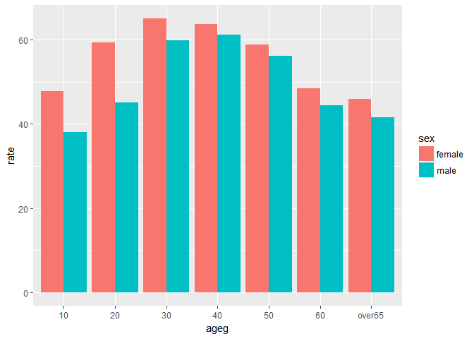
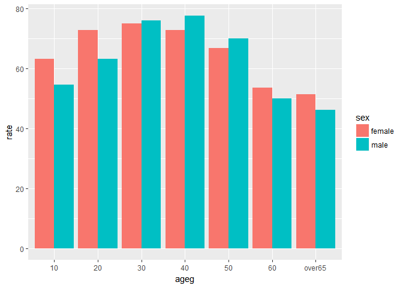
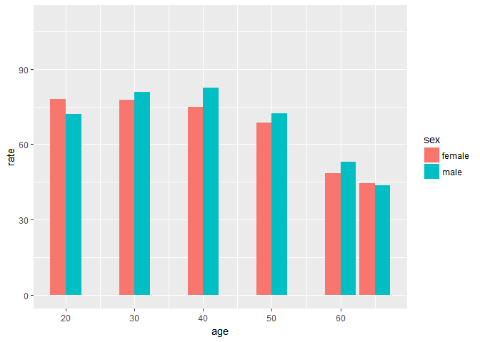

홍영화\_60160242
================

1. 요약(초록)
=============

우리나라의 전반적인 스트레스 인지율을 분석하고자 했다. 크게 년도별, 성별, 연령별로 나누어 분석하였다. 년도가 지날수록 점진적으로 모든 연령의 스트레스 정도가 낮아졌다. 성별로는 여자가 남성보다 대부분 스트레스 정도가 높지만, 모든 연령에서 그렇지는 않았다. 2012년 노년층의 스트레스 정도와 노년층의 자살률에 대한 상관관계를 발견하였지만, 2012년에만 해당되는 상관관계라는 한계점이 있다. 2014년 중년층의 스트레스 정도가 직장에서 받는 스트레스 사이의 상관관계는 있었지만, 이 또한 부분적인 상관관계라는 점에서 한계점이 있다.
------------------------------------------------------------------------------------------------------------------------------------------------------------------------------------------------------------------------------------------------------------------------------------------------------------------------------------------------------------------------------------------------------------------------------------------------------------------------------------------------------------------------------------

2. 분석 주제
============

우리나라의 전반적인 스트레스 인지율을 분석하고자 했다. 크게 년도별, 성별, 연령별로 나누어 분석하였다.
-----------------------------------------------------------------------------------------------------

3. 데이터 선정
==============

데이터 선정 이유: 조원들과 분석하고자 하는 하나의 메인 데이터를 먼저 선정하였다. 각자 원하는 변수를 통해 서로 다른 상관관계를 추출해보고, 모두가 연결되는 지점을 발견하고자 했다.
---------------------------------------------------------------------------------------------------------------------------------------------------------------------------------

데이터 소개: 메인 데이터는 KOSIS에서 제공하는 우리나라 사회조사로, 전반적인 생활 스트레스 정도에 관한 데이터이다. 전국을 대상으로 하며, 변수로는 지역, 성별, 연령, 교육정도, 혼인상태, 경제활동, 산업, 직업, 가구소득, 흡연량 등 매우 다양하게 존재한다. 서브 데이터는 KOSIS에서 제공하는 우리나라 사회조사로, 사망원인에 관한 데이터이다. 년도별, 사망원인별, 연령별, 성별 등 다양한 변수를 가지고 있어 2012년 노년층의 자살률을 추출하여 사용하였다. 또 다른 서브 데이터 또한 KOSIS에서 제공하는 우리나라 사회조사로, 직장에서 받는 스트레스 정도에 관한 데이터이다. 이 데이터 또한 다양한 변수를 가지고 있지만 2014년에 해당하는 데이터만을 추출하였다.
----------------------------------------------------------------------------------------------------------------------------------------------------------------------------------------------------------------------------------------------------------------------------------------------------------------------------------------------------------------------------------------------------------------------------------------------------------------------------------------------------------------------------------------------------------------------------------------------------------------------------------------------------------

4. 분석
=======

분석 목적 및 방법
-----------------

### 분석 목적: 스트레스는 주관적인 느낌이지만, 사회적 분위기에 영향을 받을 수 밖에 없으며, 성별이라는 유전적인 특성에 영향받을 수 있을 것이라는 추측을 시작으로, 스트레스 정도에 대한 규칙성을 발견하고자 하였다.

### 분석 방법

### 1. 연령별 + 연도별 스트레스 정도

### 2. 성별 + 연도별 스트레스 정도

### 3. 성별 + 연도별 + 연령별 스트레스 정도

변수 검토 및 전처리
-------------------

### KOSIS에서 제공하는 데이터는 변수명이 모두 한글로 되어있어서 혹시 모를 오류를 방지하고자 미리 엑셀 파일 상에서 임의로 영어로 변경하였다. 또한 내가 분석하는데에 필요없다고 생각되는 변수들이 많아서 엑셀 파일 상에서 제거하고 불러들였다.

``` r
library(ggplot2)
```

    ## Warning: package 'ggplot2' was built under R version 3.4.2

``` r
library(dplyr)
```

    ## Warning: package 'dplyr' was built under R version 3.4.2

    ## 
    ## Attaching package: 'dplyr'

    ## The following objects are masked from 'package:stats':
    ## 
    ##     filter, lag

    ## The following objects are masked from 'package:base':
    ## 
    ##     intersect, setdiff, setequal, union

``` r
library(readxl)
```

    ## Warning: package 'readxl' was built under R version 3.4.2

분석 및 해석
------------

연도별로 나누기
---------------

``` r
raw_stress12 <- read_excel("team_06_12.xlsx", col_names = T)
stress12 <- raw_stress12
```

``` r
raw_stress14 <- read_excel("team_06_14.xlsx", col_names = T)
stress14 <- raw_stress14
```

``` r
raw_stress16 <- read_excel("team_06_16.xlsx", col_names = T)
stress16 <- raw_stress16
```

### 연도별 + 연령별

``` r
age16 <- stress16 %>% filter(trait_1=="age_group")
age16$ageg <- c(10,20,30,40,50,60, "over_65")
ggplot(data=age16, aes(x=ageg, y=rate)) + geom_col() + ylim(0,100)
```

 \#\#\# 2016년에는 30대, 40대가 가장 높다. \#\#\#연령에 따른 차이가 2012년, 2014년에도 그러한가?

``` r
age12 <- stress12 %>% filter(trait_1=="age_group")
age12$ageg <- c(10,20,30,40,50,60, "over_65")
ggplot(data=age12, aes(x=ageg, y=rate)) + geom_col() + ylim(0,100)
```


``` r
age14 <- stress14 %>% filter(trait_1=="age_group")
age14$ageg <- c(10,20,30,40,50,60, "over_65")
ggplot(data=age14, aes(x=ageg, y=rate)) + geom_col() + ylim(0,100)
```

 \#\#\#2012, 2014년에도 30대, 40대가 가장 높다. 왜? 결혼? 가정? 가장 흥미로운 점은 모든 연령이 년도가 지날수록 스트레스 정도가 낮아진다는 것이다.

성별 + 연도별로 나누기
----------------------

``` r
sex16 <- stress16 %>% filter(trait_1=="sex")
ggplot(data=sex16, aes(x=trait_2, y=rate)) + geom_col() + ylim(0,60)
```


``` r
sex12 <- stress12 %>% filter(trait_1=="sex")
ggplot(data=sex12, aes(x=trait_2, y=rate)) + geom_col() + ylim(0,80)
```


``` r
sex14 <- stress14 %>% filter(trait_1=="sex")
ggplot(data=sex14, aes(x=trait_2, y=rate)) + geom_col()
```

 \#\#모든 연도에서 근소한 차이지만 여자의 스트레스 정도가 남자의 정도보다 높다. \#\#성별 + 연도별 + 연령별로 비교해보기

``` r
age_sex16 <- stress16 %>% filter(trait_1=="age_sex")
age_sex16$ageg <- c(10,10,20,20,30,30,40,40,50,50,60,60,"over65","over65")
age_sex16$sex <- c("male","female","male","female","male","female","male","female","male","female","male","female","male","female")

ggplot(data = age_sex16, aes(x = ageg, y = rate, fill = sex)) + geom_col(position = "dodge") 
```

 \#\#\# 2016년에는 모든 연령에서 여자의 스트레스 정도가 남자의 정도보다 높다. \#\#\#2012년, 2014년에도 그러한가?

``` r
age_sex12 <- stress12 %>% filter(trait_1=="age_sex")
age_sex12$ageg <- c(10,10,20,20,30,30,40,40,50,50,60,60,"over65","over65")
age_sex12$sex <- c("male","female","male","female","male","female","male","female","male","female","male","female","male","female")

ggplot(data = age_sex12, aes(x = ageg, y = rate, fill = sex)) + geom_col(position = "dodge") 
```


``` r
age_sex14 <- stress14 %>% filter(trait_1=="age_sex")

age_sex14$ageg <- c(10,10,20,20,30,30,40,40,50,50,60,60,"over65","over65")
age_sex14$sex <- c("male","female","male","female","male","female","male","female","male","female","male","female","male","female")

ggplot(data = age_sex14, aes(x = ageg, y = rate, fill = sex)) + geom_col(position = "dodge") 
```

 \#\#\#2012년과 2014년에도 대체적으로 여자의 스트레스 정도가 남자의 정도보다 높지만, 그렇지 않은 부분도 존재한다. 2012년의 노년층이 그 중 하나인데, 2012년의 노년층의 자살률 데이터를 추가적으로 분석해보고자 한다.

``` r
suicide_rate <- read_excel("suicide_rate.xlsx")
old_12 <- suicide_rate %>% filter(age %in% c(30, 40, 50,60, 65, 70)) %>% select("2012") 

old_12 <- rename(old_12, rate = "2012")
old_12$age <- c(30, 40, 50,60, 65, 70, 30, 40, 50,60, 65, 70)
old_12$sex <- c("male", "male","male", "male", "male","male", "female","female", "female", "female","female", "female")

ggplot(data = old_12, aes(x = age, y = rate, fill = sex)) + geom_col(position = "dodge") + ylim(0,110)
```

 \#\#\# 2012년에 60대, 65세, 70세 이상의 남자가 여자보다 훨씬 높은 자살률을 보일뿐더러 다른 연령의 남자보다 훨씬 높은 자살률을 보인다. 따라서 2012년 장년층의 스트레스 정도는 2012년 장년층의 자살률과 상관관계가 있다고 할 수 있다. \#\#\#하지만 자살률 데이터에 연령이나 연도에 상관없이 남자가 여자보다 높은 자살률을 보이기 때문에 전체적인 상관관계는 성립하지 않는다.

### 2014년의 30대, 40, 50대에서 남자의 스트레스 정도가 여자보다 높았는데, 상관관계를 추출하기 위해 직장에서 받는 스트레스 데이터를 추가적으로 분석해보고자 한다.

``` r
stress_work_14 <- read_excel("stress_work_14.xlsx")
```

``` r
stress_work_14 <- stress_work_14 %>% 
  filter(trait_2 %in% c("20_male", "30_male", "40_male", "50_male","60_male", "over_65_male", "20_female", "30_female", "40_female", "50_female", "60_female", "over_65_female"))

stress_work_14$age <- c(20,20,30,30,40,40,50,50,60,60,65,65)
stress_work_14$sex <- c("male","female", "male","female", "male","female", "male","female","male","female", "male","female")

ggplot(data = stress_work_14, aes(x = age, y = rate, fill = sex)) + geom_col(position = "dodge") + ylim(0,110)
```

 \#\#\#2014년에 직장에서 받는 스트레스는 30대, 40대, 50대의 남자가 여자보다 높았다. 따라서 2014년의 남자의 스트레스 정도는 직장에서 받는 스트레스 정도와 상관관계가 있다고 할 수 있다. 하지만 60대에 해당하는 데이터는 상관관계가 성립하지 않았다. 부분적인 상관관계는 있었지만 전체적인 상관관계는 성립하지 않는다.

5. 논의
=======

한계점, 비판점
--------------

### 1.연도별, 성별, 연령별이라는 적은 변수만을 추출하였다.

### 2.상관관계를 전체적으로 성립시키지 못하였다.

### 3.스트레스 정도라는 것 자체가 객관적, 과학적으로 검증할 수 없는 주관적인 느낌이다.

### 4.스트레 정도를 조사할 때, 최근 '2주' 동안 느낀 스트레스 정도였기 때문에 기간설정에 따라 결과 값이 달라질 수 있다.

추후 분석 방향
--------------

### 1. 나와 다른 변수를 추출한 다른 조원들의 분석을 참고한다.

### 2. 전체적인 규칙성을 발견하여 설득력 있는 상관관계를 추출해야 한다.
