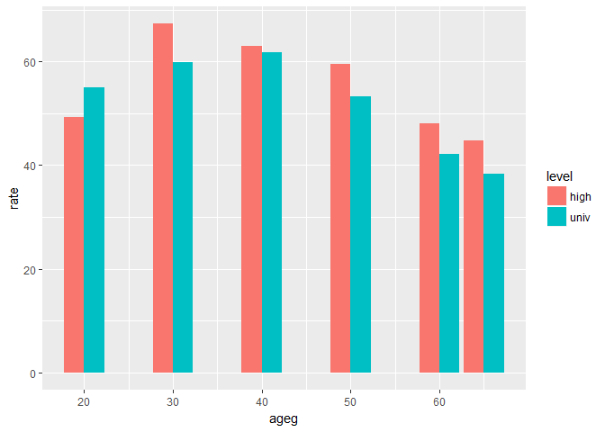

Team\_06\_Stress\_Bae
================

1. 요약(초록): 2012년부터 2016년까지 격년 동안의 스트레스 정도 자료에서 학력과 세대별로 스트레스 정도를 그래프 비교를 통해 특징을 찾아보고, 그러한 특징을 기반으로 어떤 요인들과 더 연관이 될지에 대해 생각해보는 과정이다. 20대부터 60대의 고졸자 및 대졸자 학력을 가진 사람들의 스트레스 정도를 비교분석한 결과, 2012, 2014, 2016년도 모두 대체로 고졸학력자의 스트레스를 느끼는 정도가 대졸학력자의 스트레스를 느끼는 정도보다 높은 것을 알 수 있다. 2012년에는 학력에 관계없이 20대의 스트레스를 느끼는 정도가 가장 높지만 2014년과 2016년에는 20대의 스트레스를 느끼는 정도가 낮다. 반면 30대와 40대의 스트레스를 느끼는 정도가 증가하고 다시 50대부터 줄어드는 경향을 보인다.
===================================================================================================================================================================================================================================================================================================================================================================================================================================================================================================================================================================================================================================================================================

2. 분석 주제: 우리나라 사람들의 학력 및 세대에 따른 스트레스 정도 파악해보기
============================================================================

3. 데이터 선정
==============

데이터 선정 이유: 본인이 판단하기에, 분석하고자 하는 주제에 알맞았으며, 대한민국 전국 시민 중에서 임의로 추출된 모집단 사이에 스트레스와 학력을 포함한 다양한 변수가 존재하여 데이터간 상관관계 분석에 용이하다고 판단하였다.
-----------------------------------------------------------------------------------------------------------------------------------------------------------------------------------------------------------------------------

데이터 소개: KOSIS에서 제공하는 우리나라 사회조사로, 전반적인 생활 스트레스 정도에 관한 데이터이다. 전국을 대상으로 하며, 변수로는 지역, 성별, 연령, 교육정도, 혼인상태, 경제활동, 산업, 직업, 가구소득, 흡연량 등 매우 다양하게 존재한다.
------------------------------------------------------------------------------------------------------------------------------------------------------------------------------------------------------------------------------------------

4. 분석
=======

분석 목적 및 방법 : 본인이 다음 분석을 하는 목적은 학벌주의가 만연한 대한민국 사회에서 학력이라는 부분이 우리나라 각 세대의 사람들에게 어떤 영향을 미칠까 궁금했다. 이 분석을 통해 각 세대별로 학력과 스트레스 사이의 연관성을 확인해보는데 그 목적이 있다. 분석 방법으로 주로 dplyr 함수로 변수를 만들고, ggplot을 통해 그래프로 구현하기로 하였다. 변수 검토 및 전처리는 KOSIS에서 제공하는 데이터가 변수명이 모두 한글로 되어있어서 혹시 모를 오류를 방지하고자 부득이하게 미리 엑셀 파일 상에서 임의로 영어로 변경하였고, 검토 외 전처리 과정 따로 추가하지 않는 점을 양해구하고자 한다.
--------------------------------------------------------------------------------------------------------------------------------------------------------------------------------------------------------------------------------------------------------------------------------------------------------------------------------------------------------------------------------------------------------------------------------------------------------------------------------------------------------------------------------------------------------------------------------------------

분석 내용.
----------

``` r
library(ggplot2) 
library(dplyr) 
```

    ## 
    ## Attaching package: 'dplyr'

    ## The following objects are masked from 'package:stats':
    ## 
    ##     filter, lag

    ## The following objects are masked from 'package:base':
    ## 
    ##     intersect, setdiff, setequal, union

``` r
library(readxl)
```

2016년 학력별 스트레스 정도는 어떠할까?
---------------------------------------

``` r
raw_stress <- read_excel("team_06_16.xlsx", col_names = T)
stress <- raw_stress
```

``` r
head(raw_stress) 
```

    ## # A tibble: 6 x 5
    ##     trait_1 trait_2        high_stress stress  rate
    ##       <chr>   <chr>              <chr>  <dbl> <dbl>
    ## 1       sex    male 4.0999999999999996   48.0  52.1
    ## 2       sex  female                5.7   51.6  57.3
    ## 3 age_group      10                2.4   40.4  42.8
    ## 4 age_group      20 4.9000000000000004   47.2  52.1
    ## 5 age_group      30                  5   57.4  62.4
    ## 6 age_group      40                5.2   57.2  62.4

``` r
tail(raw_stress)
```

    ## # A tibble: 6 x 5
    ##   trait_1        trait_2 high_stress stress  rate
    ##     <chr>          <chr>       <chr>  <dbl> <dbl>
    ## 1 age_adu      60_middle           6   40.9  46.9
    ## 2 age_adu        60_high         4.8   43.2  48.0
    ## 3 age_adu        60_univ         3.4   38.8  42.2
    ## 4 age_adu over_65_middle         6.2   38.6  44.8
    ## 5 age_adu   over_65_high         5.2   39.5  44.7
    ## 6 age_adu   over_65_univ         4.3   34.0  38.3

``` r
View(raw_stress)
dim(raw_stress)
```

    ## [1] 45  5

``` r
str(raw_stress)
```

    ## Classes 'tbl_df', 'tbl' and 'data.frame':    45 obs. of  5 variables:
    ##  $ trait_1    : chr  "sex" "sex" "age_group" "age_group" ...
    ##  $ trait_2    : chr  "male" "female" "10" "20" ...
    ##  $ high_stress: chr  "4.0999999999999996" "5.7" "2.4" "4.9000000000000004" ...
    ##  $ stress     : num  48 51.6 40.4 47.2 57.4 57.2 52.4 41.2 38.3 39.9 ...
    ##  $ rate       : num  52.1 57.3 42.8 52.1 62.4 62.4 57.5 46.6 44.1 45.8 ...

``` r
summary(raw_stress)
```

    ##    trait_1            trait_2          high_stress            stress     
    ##  Length:45          Length:45          Length:45          Min.   :34.00  
    ##  Class :character   Class :character   Class :character   1st Qu.:40.90  
    ##  Mode  :character   Mode  :character   Mode  :character   Median :50.10  
    ##                                                           Mean   :48.25  
    ##                                                           3rd Qu.:54.80  
    ##                                                           Max.   :61.00  
    ##       rate      
    ##  Min.   :38.00  
    ##  1st Qu.:46.00  
    ##  Median :55.00  
    ##  Mean   :53.43  
    ##  3rd Qu.:59.90  
    ##  Max.   :68.10

### 2016년 고졸 학력 세대별 스트레스 정도

``` r
stress_high <- stress %>% 
  select(-trait_1) %>%
  filter(trait_2 %in% c("20_high", "30_high", "40_high", "50_high", "60_high", "over_65_high"))
```

### 2016년 대졸 학력 세대별 스트레스 정도

``` r
stress_univ <- stress %>% 
  select(-trait_1) %>%
  filter(trait_2 %in% c("20_univ", "30_univ", "40_univ", "50_univ", "60_univ", "over_65_univ"))
```

2016년 (고졸+대졸)학력 세대별 스트레스 정도는 어떠할까?
-------------------------------------------------------

``` r
stress_adu <- stress %>% 
  select(-trait_1) %>%
  filter(trait_2 %in% c("20_high",
                        "30_high", 
                        "40_high", 
                        "50_high", 
                        "60_high", 
                        "over_65_high",
                        "20_univ", 
                        "30_univ", 
                        "40_univ", 
                        "50_univ", 
                        "60_univ",
                        "over_65_univ"))
stress_adu$ageg <- c(20, 20, 30, 30, 40, 40, 50, 50, 60, 60, 65, 65)
stress_adu$level <- c("high", "univ", "high", "univ", "high", "univ","high", "univ","high", "univ", "high", "univ")
ggplot(data = stress_adu, aes(x = ageg, y = rate, ylim(0, 90) , fill = level )) + 
  geom_col(position = "dodge") 
```

 \#\#\#\#그래프 단순 해석: 2016년 고졸자중에서는 30대, 대졸자중에서는 40대가 가장 높은 수치의 스트레스 정도를 기록하였다. 특히 20대를 제외한 30~65세대 모두 고졸자가 대졸자보다 스트레스 정도가 높았다. 고졸자 및 대졸자의 수치가 40대에서 근사치가 되었다.

2014년 학력별 스트레스 정도는 어떠할까?
---------------------------------------

``` r
raw_stress_14 <- read_excel("team_06_14.xlsx", col_names = T)
stress_14 <- raw_stress_14
```

``` r
head(raw_stress_14) 
```

    ## # A tibble: 6 x 5
    ##     trait_1 trait_2 high_stress stress  rate
    ##       <chr>   <chr>       <dbl>  <dbl> <dbl>
    ## 1       sex    male        10.5   55.9  66.4
    ## 2       sex  female        10.4   56.4  66.8
    ## 3 age_group      10         6.8   52.0  58.8
    ## 4 age_group      20        10.9   57.1  68.0
    ## 5 age_group      30        12.7   62.8  75.5
    ## 6 age_group      40        13.0   62.2  75.2

``` r
tail(raw_stress_14)
```

    ## # A tibble: 6 x 5
    ##   trait_1        trait_2 high_stress stress  rate
    ##     <chr>          <chr>       <dbl>  <dbl> <dbl>
    ## 1 age_adu      60_middle         7.9   44.9  52.8
    ## 2 age_adu        60_high         7.3   43.9  51.2
    ## 3 age_adu        60_univ         5.7   41.6  47.3
    ## 4 age_adu over_65_middle         8.3   42.2  50.5
    ## 5 age_adu   over_65_high         6.0   39.6  45.6
    ## 6 age_adu   over_65_univ         5.5   38.7  44.2

``` r
View(raw_stress_14)
dim(raw_stress_14)
```

    ## [1] 45  5

``` r
str(raw_stress_14)
```

    ## Classes 'tbl_df', 'tbl' and 'data.frame':    45 obs. of  5 variables:
    ##  $ trait_1    : chr  "sex" "sex" "age_group" "age_group" ...
    ##  $ trait_2    : chr  "male" "female" "10" "20" ...
    ##  $ high_stress: num  10.5 10.4 6.8 10.9 12.7 13 10.3 7.6 7.7 8.4 ...
    ##  $ stress     : num  55.9 56.4 52 57.1 62.8 62.2 58 44.4 41.4 46.4 ...
    ##  $ rate       : num  66.4 66.8 58.8 68 75.5 75.2 68.3 52 49.1 54.8 ...

``` r
summary(raw_stress_14)
```

    ##    trait_1            trait_2           high_stress        stress    
    ##  Length:45          Length:45          Min.   : 5.00   Min.   :38.7  
    ##  Class :character   Class :character   1st Qu.: 7.90   1st Qu.:45.4  
    ##  Mode  :character   Mode  :character   Median :10.40   Median :56.4  
    ##                                        Mean   :10.13   Mean   :53.9  
    ##                                        3rd Qu.:11.70   3rd Qu.:59.8  
    ##                                        Max.   :16.60   Max.   :63.9  
    ##       rate      
    ##  Min.   :44.20  
    ##  1st Qu.:53.50  
    ##  Median :67.60  
    ##  Mean   :64.02  
    ##  3rd Qu.:72.80  
    ##  Max.   :77.60

### 2014년 고졸 학력 스트레스 정도

``` r
stress_high_14 <- stress_14 %>% 
  select(-trait_1) %>%
  filter(trait_2 %in% c("20_high", "30_high", "40_high", "50_high", "60_high", "over_65_high"))
```

### 2014년 대졸 학력 스트레스 정도

``` r
stress_univ_14 <- stress_14 %>% 
  select(-trait_1) %>%
  filter(trait_2 %in% c("20_univ", "30_univ", "40_univ", "50_univ", "60_univ", "over_65_univ"))
```

2014년 학력별 + 연령별 스트레스 정도는 어떠할까?
------------------------------------------------

``` r
stress_adu_14 <- stress_14 %>% 
  select(-trait_1) %>%
  filter(trait_2 %in% c("20_high",
                        "30_high", 
                        "40_high", 
                        "50_high", 
                        "60_high", 
                        "over_65_high",
                        "20_univ", 
                        "30_univ", 
                        "40_univ", 
                        "50_univ", 
                        "60_univ",
                        "over_65_univ"))
stress_adu_14$ageg <- c(20, 20, 30, 30, 40, 40, 50, 50, 60, 60, 65, 65)
stress_adu_14$level <- c("high", "univ", "high", "univ", "high", "univ","high", "univ","high", "univ", "high", "univ")

ggplot(data = stress_adu_14, aes(x = ageg, y = rate, fill = level)) + 
  geom_col(position = "dodge") 
```

 \#\#\#\#그래프 단순 해석: 2014년 고졸자중에서는 30대, 대졸자중에서는 40대가 가장 높은 수치의 스트레스 정도를 기록하였다. 특히 20대를 제외한 30~65세대 모두 고졸자가 대졸자보다 스트레스 정도가 높았다. 고졸자 및 대졸자의 수치가 40대에서 근사치가 되었다.

2012년 학력별 스트레스 정도는 어떠할까?
---------------------------------------

``` r
raw_stress_12 <- read_excel("team_06_12.xlsx", col_names = T)
stress_12 <- raw_stress_12
```

``` r
head(raw_stress_12) 
```

    ## # A tibble: 6 x 5
    ##     trait_1 trait_2 high_stress stress  rate
    ##       <chr>   <chr>       <dbl>  <dbl> <dbl>
    ## 1       sex    male        10.9   57.9  68.8
    ## 2       sex  female        12.1   58.2  70.3
    ## 3 age_group      10         9.5   55.0  64.5
    ## 4 age_group      20        12.7   58.4  71.1
    ## 5 age_group      30        13.9   63.5  77.4
    ## 6 age_group      40        12.7   65.0  77.7

``` r
tail(raw_stress_12)
```

    ## # A tibble: 6 x 5
    ##   trait_1        trait_2 high_stress stress  rate
    ##     <chr>          <chr>       <dbl>  <dbl> <dbl>
    ## 1 age_adu      60_middle         5.9   43.0  48.9
    ## 2 age_adu        60_high         7.0   42.4  49.4
    ## 3 age_adu        60_univ         9.4   46.0  55.4
    ## 4 age_adu over_65_middle         9.0   45.0  54.0
    ## 5 age_adu   over_65_high         8.0   43.2  51.2
    ## 6 age_adu   over_65_univ         4.1   42.1  46.2

``` r
View(raw_stress_12)
dim(raw_stress_12)
```

    ## [1] 45  5

``` r
str(raw_stress_12)
```

    ## Classes 'tbl_df', 'tbl' and 'data.frame':    45 obs. of  5 variables:
    ##  $ trait_1    : chr  "sex" "sex" "age_group" "age_group" ...
    ##  $ trait_2    : chr  "male" "female" "10" "20" ...
    ##  $ high_stress: num  10.9 12.1 9.5 12.7 13.9 12.7 11.2 8.6 8.4 10 ...
    ##  $ stress     : num  57.9 58.2 55 58.4 63.5 65 58.8 46.6 44.5 49.4 ...
    ##  $ rate       : num  68.8 70.3 64.5 71.1 77.4 77.7 70 55.2 52.9 59.4 ...

``` r
summary(raw_stress_12)
```

    ##    trait_1            trait_2           high_stress        stress    
    ##  Length:45          Length:45          Min.   : 4.10   Min.   :42.1  
    ##  Class :character   Class :character   1st Qu.: 9.40   1st Qu.:47.4  
    ##  Mode  :character   Mode  :character   Median :11.50   Median :58.4  
    ##                                        Mean   :11.32   Mean   :55.7  
    ##                                        3rd Qu.:12.70   3rd Qu.:61.1  
    ##                                        Max.   :20.00   Max.   :66.2  
    ##       rate      
    ##  Min.   :46.20  
    ##  1st Qu.:57.20  
    ##  Median :70.30  
    ##  Mean   :67.01  
    ##  3rd Qu.:76.00  
    ##  Max.   :83.70

### 2012년 고졸 학력 스트레스 정도

``` r
stress_high_12 <- stress_12 %>% 
  select(-trait_1) %>%
  filter(trait_2 %in% c("20_high", "30_high", "40_high", "50_high", "60_high", "over_65_high"))
```

### 2012년 대졸 학력 스트레스 정도

``` r
stress_univ_12 <- stress_12 %>% 
  select(-trait_1) %>%
  filter(trait_2 %in% c("20_univ", "30_univ", "40_univ", "50_univ", "60_univ", "over_65_univ"))
```

2012년 학력별 + 연령별 스트레스 정도는 어떠할까?
------------------------------------------------

``` r
stress_adu_12 <- stress_12 %>% 
  select(-trait_1) %>%
  filter(trait_2 %in% c("20_high",
                        "30_high", 
                        "40_high", 
                        "50_high", 
                        "60_high", 
                        "over_65_high",
                        "20_univ", 
                        "30_univ", 
                        "40_univ", 
                        "50_univ", 
                        "60_univ",
                        "over_65_univ"))
stress_adu_12$ageg <- c(20, 20, 30, 30, 40, 40, 50, 50, 60, 60, 65, 65)
stress_adu_12$level <- c("high", "univ", "high", "univ", "high", "univ","high", "univ","high", "univ", "high", "univ")

ggplot(data = stress_adu_12, aes(x = ageg, y = rate, fill = level)) + 
  geom_col(position = "dodge") 
```

 \#\#\#\#그래프 단순 해석: 2012년 고졸자와 대졸자 모두에게서 20대가 가장 높은 수치의 스트레스 정도를 기록하였다. 특히 세대를 거듭할수록 점차적으로 스트레스 정도 수치가 감소하고 있음을 알 수 있다. 고졸자 및 대졸자의 수치가 그나마 20대에서 근사치가 되었다. 20대와 60대 이상 세대간 스트레스 정도 차이가 거의 반절에 가까울 정도로 차이가 있다.

전체 해석: 2012, 2014, 2016년도 모두 대체로 고졸학력자의 스트레스를 느끼는 정도가 대졸학력자의 스트레스를 느끼는 정도보다 높은 것을 알 수 있다. 2012년에는 학력에 관계없이 20대의 스트레스를 느끼는 정도가 가장 높지만 2014년과 2016년에는 20대의 스트레스를 느끼는 정도가 낮은 반면 30대와 40대의 스트레스를 느끼는 정도가 증가하고 다시 50대부터 줄어드는 경향을 보인다. 전체적으로 보자면 2012년부터 2016년까지 20대의 스트레스를 느끼는 정도가 점차 감소함을 알 수 있다. 이 분석에서는 20대에서 40대까지의 추이가 주로 눈 여겨볼만하다. 다른 변수(요인)와의 상관관계를 파악할 있는 분석이 더 진행되어야 될 것 같다.
-----------------------------------------------------------------------------------------------------------------------------------------------------------------------------------------------------------------------------------------------------------------------------------------------------------------------------------------------------------------------------------------------------------------------------------------------------------------------------------------------------------------------------------------------------------------------------------------------------------------------

해석
----

5. 논의
=======

한계점, 비판점 : 2012년도부터 2016년도까지 격년의 스트레스 정도 데이터에서 학력, 세대와 관련된 비교를 하면서, 우선 연속적이지 않은 연도의 데이터라는 점에서 가장 큰 한계가 있다고 생각하였다. 더불어 스트레스 정도를 측정한 모집단 또한 동일하지 않기에 이러한 비교가 과연 신뢰가 될만한 비교인지에 대한 비판이 있을 수 있다. 무엇보다 그래프 3개를 가지고 단순비교를 하면서 특징을 뽑아냈기 때문에 언급된 변수외의 다른 변수들과의 연계성, 연관성의 부분에서 아쉬운 분석이지 않을까 하는 생각이 들었다.
--------------------------------------------------------------------------------------------------------------------------------------------------------------------------------------------------------------------------------------------------------------------------------------------------------------------------------------------------------------------------------------------------------------------------------------------------------------------------------------------------------

추후 분석 방향 : 20대의 고졸자들과 대졸자들이 느끼는 스트레스 정도가 해가 갈수록 상대적으로 낮아지고, 반면 30,40대의 고졸자들과 대졸자들의 스트레스 정도가 고도화된다. 12,14,16년도의 그래프를 비교하면서 나온 가장 두드러지는 특징으로, 20대와 30,40대가 주로 생활하는 가정, 직장, 학교에서의 스트레스 정도와 연관지어 비교하여 인과관계를 파악해보는 방향으로 분석이 이루어진다면 좋을것 같다.
------------------------------------------------------------------------------------------------------------------------------------------------------------------------------------------------------------------------------------------------------------------------------------------------------------------------------------------------------------------------------------------------
