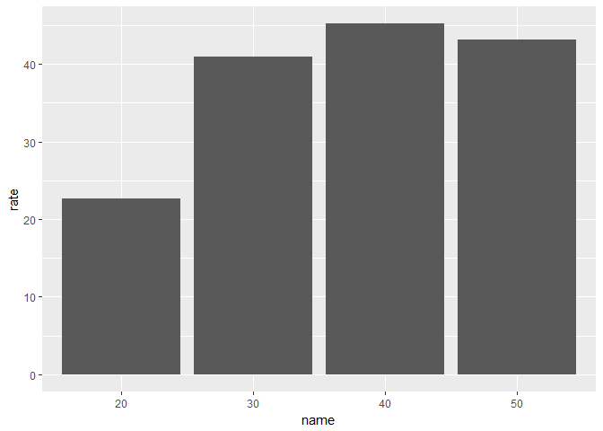
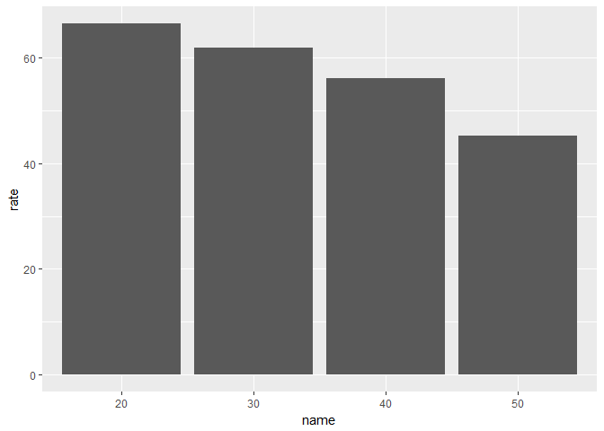

junghoyoon\_60160473\_famale'stress
================

1. 요약(초록): 팀 프로젝트로 알아본 성별, 연령별, 학력 별 스트레스 정도를 확인하여 보았는데, 연령 별 , 학력 별 스트레스 정도는 통일성이 다소 떨어졌으나, 성별에 관해선 전반적으로 남성보다 여성의 스트레스 정도가 일관되게 높게 나왔다. 이에 추가적으로 여성의 스트레스는 어떠한 요인으로 인해 스트레스를 받고 있는지에 대한 데이터를 분석할 수 있다면 그 원인을 밝힐 수 있다고 생각하였고, 이를 분석을 통해 확인하였다.
========================================================================================================================================================================================================================================================================================================================================================================================================================

2. 분석 주제: 1. 우리나라 사람은 성별과 연령에 따라 스트레스 정도가 다른가? 2. 여성이 스트레스를 더 받는다면, 어떤 원인으로 스트레스를 더 받을까?
=================================================================================================================================================

3. 데이터 선정
==============

데이터 선정 이유: 우리가 분석하고자 하는 주제에 알맞았으며, 매우 다양한 변수가 존재하여 데이터간 상관관계 분석에 용이하다고 판단하였다.
---------------------------------------------------------------------------------------------------------------------------------------

데이터 소개: KOSIS에서 제공하는 우리나라 사회조사로, 전반적인 생활 스트레스 정도에 관한 데이터이다. 전국을 대상으로 하며, 변수로는 지역, 성별, 연령, 교육정도, 혼인상태, 경제활동, 산업, 직업, 가구소득, 흡연량 등 매우 다양하게 존재한다. 이에 여성 스트레스 요인분석은 한국여성정책연구원 일가족정책연구실 통계패널센터에서 제공한 자료를 사용하였다.
-------------------------------------------------------------------------------------------------------------------------------------------------------------------------------------------------------------------------------------------------------------------------------------------------------------------------------------------------------

4. 분석
=======

분석 목적 및 방법
-----------------

### (1).성별 스트레스 정도

### (2).성별 + 연령별 스트레스 정도

### (3).여성의 스트레스 요인

### 변수 검토 및 전처리: KOSIS에서 제공하는 데이터는 변수명이 모두 한글로 되어있어서 혹시 모를 오류를 방지하고자 미리 엑셀 파일 상에서 임의로 영어로 변경하였다.

``` r
library(ggplot2) 
library(dplyr) 
```

    ## 
    ## Attaching package: 'dplyr'

    ## The following objects are masked from 'package:stats':
    ## 
    ##     filter, lag

    ## The following objects are masked from 'package:base':
    ## 
    ##     intersect, setdiff, setequal, union

``` r
library(readxl) 
```

분석 내용.
----------

(1).성별 스트레스 정도 - 2016년
-------------------------------

``` r
raw_stress16 <- read_excel("team_06_16.xlsx")
stress16 <- raw_stress16
```

``` r
sex16 <- stress16 %>% filter(trait_1=="sex")
ggplot(data=sex16, aes(x=trait_2, y=rate)) + geom_col() + ylim(0,80)
```


(2).성별 + 연령별 스트레스 정도 - 2016년
----------------------------------------

``` r
age_sex16 <- stress16 %>% filter(trait_1=="age_sex")
age_sex16$ageg <- c(10,10,20,20,30,30,40,40,50,50,60,60,"over65","over65")
age_sex16$sex <- c("male","female","male","female","male","female","male","female","male","female","male","female","male","female")

ggplot(data = age_sex16, aes(x = ageg, y = rate, fill = sex)) + geom_col(position = "dodge") + ylim(0, 85)
```


2012년에 성별 스트레스 정도는 어떨까?
-------------------------------------

``` r
raw_stress12 <- read_excel("team_06_12.xlsx", col_names = T)
stress12 <- raw_stress12

sex12 <- stress12 %>% filter(trait_1=="sex")
ggplot(data=sex12, aes(x=trait_2, y=rate)) + geom_col() + ylim(0,80)
```


2012년 성별 + 연령별 스트레스 정도는 어떨까?
--------------------------------------------

``` r
age_sex12 <- stress12 %>% filter(trait_1=="age_sex")
age_sex12$ageg <- c(10,10,20,20,30,30,40,40,50,50,60,60,"over65","over65")
age_sex12$sex <- c("male","female","male","female","male","female","male","female","male","female","male","female","male","female")

ggplot(data = age_sex12, aes(x = ageg, y = rate, fill = sex)) + geom_col(position = "dodge") 
```


2014년 성별 스트레스 정도는 어떨까?
-----------------------------------

``` r
raw_stress14 <- read_excel("team_06_14.xlsx", col_names = T)
stress14 <- raw_stress14

sex14 <- stress14 %>% filter(trait_1=="sex")
ggplot(data=sex14, aes(x=trait_2, y=rate)) + geom_col() + ylim(0,80)
```


2014년 성별 + 연령별 스트레스 정도는 어떨까?
--------------------------------------------

``` r
age_sex14 <- stress14 %>% filter(trait_1=="age_sex")
age_sex14$ageg <- c(10,10,20,20,30,30,40,40,50,50,60,60,"over65","over65")
age_sex14$sex <- c("male","female","male","female","male","female","male","female","male","female","male","female","male","female")

ggplot(data = age_sex14, aes(x = ageg, y = rate, fill = sex)) + geom_col(position = "dodge") 
```


해석 : 2012, 2014, 2016년도 모두 여자의 스트레스 정도가 남자의 정도보다 높다. 2016년에서는 모든 연령에서 여자의 정도가 남자의 정도보다 높다. 하지만 2012년과 2014년에서는 특정 연령에서 남자의 정도가 여자의 정도보다 높다. 우리의 능력으로는 이러한 결과의 원인을 정확하게 밝혀 낼 수 없다. 두드러지는 현상으로는 20대의 스트레스 정도가 연도별로 점차 떨어진다는 것이다.
--------------------------------------------------------------------------------------------------------------------------------------------------------------------------------------------------------------------------------------------------------------------------------------------------------------------------------------------------------------------------

(3). 여성의 스트레스 요인
-------------------------

1. 경제적인 문제로 스트레스를 받는다
------------------------------------

``` r
economics_raw <- read_excel("economics.xlsx")
economics <- economics_raw
eco <- economics %>% 
  mutate(rate = highest + high) %>% 
  select(name,rate)
```

### (1). 연령별 데이터

``` r
eco_ageg <- eco %>% 
  filter(name %in% c("20","30","40","50"))

ggplot(data = eco_ageg, aes(x = name, y = rate)) +geom_col()
```



### (2). 학력별 데이터

``` r
eco_level <- eco %>%
  filter(name %in% c("middle","high","univ"))
ggplot(data = eco_level, aes(x = name, y = rate)) +geom_col()
```


해석 : 연령이 높아질 수록 스트레스의 정도는 큰 폭으로 상승하며, 이는 취업과 결혼 등 여러가지 요인을 추정할 수 있다. 50대에서 다소 감소한 부분은 50대에서는 이전 연령까지의 경제적 환경과 관련한 스트레스의 요인이 일부분 해소되어 감소했을 수 있다고 유추할 수 있다. 전문대 졸 이상의 학위 소지자가 스트레스 정도가 눈에 띄게 낮아 학력이 경제활동이나 주변환경 여부에 영향을 주어 스트레스에 많은 영향을 미치게 됨을 알 수 있다.
---------------------------------------------------------------------------------------------------------------------------------------------------------------------------------------------------------------------------------------------------------------------------------------------------------------------------------------------------------------------------------------------------------------------------------

2. 사람들과의 관계 때문에 스트레스를 받는다
-------------------------------------------

``` r
relationship_raw <- read_excel("relationship.xlsx")
relationship <- relationship_raw
rela <- relationship %>%
  mutate(rate = highest + high) %>% 
  select(name,rate)
```

(1). 연령별 데이터
------------------

``` r
rela_ageg <- rela %>% 
  filter(name %in% c("20","30","40","50"))

ggplot(data = rela_ageg, aes(x = name, y = rate)) +geom_col()
```


(2). 학력별 데이터
------------------

``` r
rela_level <- rela %>%
  filter(name %in% c("middle","high","univ"))

ggplot(data = rela_level, aes(x = name, y = rate)) +geom_col()
```


해석 : 연령대가 높아질 수록 사람간의 관계에서 스트레스를 받는 일이 점진적으로 줄어듬을 알 수 있다. 학력에 따라서도 고졸 이하 학력자와 대졸 이상 학력자의 사람관계로 인한 스트레스 정도가 눈에 띄게 차이가 나는데, 이는 대졸학력자 이상의 대상자가 원만한 인간관계로 스트레스를 덜 받음을 확인할 수 있다.
--------------------------------------------------------------------------------------------------------------------------------------------------------------------------------------------------------------------------------------------------------------------------------------------------------

3. 직장이나 가정 또는 학교에서 스트레스를 받는다
------------------------------------------------

``` r
work_raw <- read_excel("work.xlsx")
work2 <- work_raw

work <- work2 %>%
  mutate(rate = highest + high) %>% 
  select(name,rate)
```

(1). 연령별 데이터
------------------

``` r
work_ageg <- work %>% 
  filter(name %in% c("20","30","40","50"))

ggplot(data = work_ageg, aes(x = name, y = rate)) +geom_col()
```



(2). 학력별 데이터
------------------

``` r
work_level <- work %>% 
  filter(name %in% c("middle","high","univ"))

ggplot(data = work_level, aes(x = name, y = rate )) +geom_col()
```


해석 : 마찬가지로 연령대가 높아질수록 스트레스 정도가 감소하는데, 학력별로 나타낸 데이터에서 고학력으로 갈 수록 스트레스 정도가 높아지는 점이 주목할 만 하다. 대졸 이상의 고학력자가 직장이나 가정 또는 학교에서 스트레스를 더 많이 받는 것은, 여성 고학력 직업군의 업무 강도나 근무환경 등에서 스트레스를 유발시키는 요인이 많음을 유추할 수 있다.
---------------------------------------------------------------------------------------------------------------------------------------------------------------------------------------------------------------------------------------------------------------------------------------------------------------------------------------------------

결론 및 정리 : 연령별로 보았을 때는, 연령대가 높아질 수록 경제적 상황에 더 스트레스를 많이 느끼고, 인간관계 및 직장 및 근무환경에서의 스트레스는 점점 감소함을 볼 수 있다. 이는 여성의 경제활동 여부와 관련이 있는 것이 아닐까? 라고 추측해 볼 수 있다. 학력별로 보았을 때는, 학력이 높을 수록 경제적 상황에는 스트레스 정도가 감소하긴 했지만 인간관계 및 직장 근무환경에서의 스트레스는 점진적으로 상승한다. 이는 여성의 고학력 직업군 근무환경과 관련이 있을 것으로 추측할 수 있고, 이에 나아가 남성의 고학력 직업군 스트레스와 비교하여 차이가 발생한다면 근무 환경에서의 성 차별이나 연봉 차이 등의 추가적 요인을 분석해 볼 수 있다.
-----------------------------------------------------------------------------------------------------------------------------------------------------------------------------------------------------------------------------------------------------------------------------------------------------------------------------------------------------------------------------------------------------------------------------------------------------------------------------------------------------------------------------------------------------------------------------------------------------------------------------------------

5. 논의
=======

한계점, 비판점
--------------

### ⅰ.서로 다른 성별의 차이에서 다른 변수와의 수많은 인과관계가 존재하므로 스트레스 정도가 성별에 왜 영향을 받았는지 명확하게 밝혀내지 못한다.

### ⅱ.연령 별 구간을 일률적으로 자른 데이터를 활용하여 각각 특정 연령에서의 스트레스 요인을 밝혀내지 못한다.

### ⅲ.연도 추이의 표본이 총 2012, 2014, 2016년으로, 시계열 분석을 하기에 타 데이터와 비교해 상대적으로 다소 적은 구간을 지닌다.

### ⅳ.가공할 수 있는 내재된 데이터 내에서 의미가 있을 수 있는 다양한 변수를 고려하지 않고 데이터를 선택적으로 추출하여 가공하였다.

### ⅴ.변수끼리 측정한 연령과 시점 등이 오차가 있을 수 있는 데이터이다.

### ⅵ.스트레스 정도는 객관적, 과학적으로 수치화 할 수 없기 때문에 개인의 주관적인 느낌에 영향을 받는다.

### ⅶ.년도 별 조사대상이 모든 구간에서 동일하지 않다.

### ⅷ.조사 시 '지난 2주일 동안의 스트레스 여부'를 조사한 것으로 기간설정에 따라 결과값이 달라질 수 있다.

### ⅸ. 남성에 대한 데이터가 존재하지 않아 정확한 요인 분석이 어렵다 .

추후 분석 방향
--------------

### ⅰ.상관관계가 있어 보이는 흡연률이나 결혼여부 등을 추가로 분석하여 완성도를 높일 수 있다.

### ⅱ.시계열 분석 시 결론의 완성도를 위해 구간을 더 넓게 설정하여 분석해 볼 수 있다.

### ⅲ.20대가 가정에서 받는 스트레스의 종류(결혼,취업,가정 내 불화 등)를 유추할 수 있는 데이터를 찾아볼 수 있다.

### ⅳ. 남성에 대한 스트레스 요인 데이터가 존재한다면 어떤 요인이 남녀차이를 가져왔는지 명확히 추정해 볼 수 있다.
