초혼 건수에 대한 다각적 접근
================
group7
2017년 11월 30일

초록
====

이 연구의 목적은 '초혼 건수를 연도별, 지역별, 연령별의 다양한 시각으로 접근'하는 것이다. 연구에 사용된 자료는 국가통계포털에 공개된 '시도/초혼연령별 혼인'자료이다. 실증분석자료는 8개의 광역시(서울특별시, 부산광역시, 인천광역시, 대구광역시, 대전광역시, 광주광역시, 울산광역시, 세종특별자치시)와 9개의 도(경기도, 경상남도, 경상북도, 충청남도, 충청북도, 전라남도, 전라북도, 강원도, 제주특별자치도)를 표본으로 2007년-2016년의 10개년 통계자료를 통합하여 구축되었다. 또한 지역별로 연도별, 연령별의 다양한 데이터를 사용했다. 서론에서는 연구를 위해 선택한 데이터의 선정 이유와 분석 주제가 무엇인지 알아볼 것이며, 또한 본격적인 분석에 들어가기 앞서 패키지를 로드하고 데이터 검토 및 전처리를 할 것이다. 이러한 데이터를 바탕으로 본론의 분석에서는 성별간 초혼 건이 제일 많은 연령대와 지역별 초혼 건이 제일 많은 연령대를 2016년 자료로 한정지어 분석할 것이다. 지역별은 더 세부적으로 들어가 수도권/비수도권과 읍면동별로 나누어 초혼 건이 제일 많은 연령대가 무엇인지 알아볼 것이며, 끝으로 앞서 분석한 내용들이 근 10년간 어떤 변화가 있었는지 확인할 것이다.

서론
====

분석 주제
---------

1인가구 증가로 인해 혼인율이 감소하는 추세인 현재, 근 10년간 연령별 혼인건수에 대해 어떤 변화가 있었는지에 대한 궁금증으로 데이터를 선정했다. 전국의 평균 혼인건수로 어떤 연령대에 혼인을 제일 많이 하는지를 알아보며 여기에 지역, 연도라는 변수를 추가하여 이들이 혼인연령에 어떠한 영향을 미치는가를 알아볼 것이다.

데이터 선정 이유
----------------

비용등의 여러 문제로 결혼을 기피하게 되는 현재에 남녀의 초혼 연령대가 지역별, 연도별로 어떻게 변화하는지에 대한 궁금증을 해소하기 위해 이를 분석하기로 결정했다. 그리고 이러한 분석에 필요한 변수로는 성별, 지역별, 연도, 연령대라는 변수가 들어가있는 초혼 건수 데이터가 필요했기 때문에 이 데이터를 선정하게 되었다.

데이터 분석 준비
----------------

### 패키지 로드

``` r
library(dplyr)
library(ggplot2)
library(gridExtra)
library(ggiraphExtra)
library(kormaps2014)
```

### 데이터 불러오기 및 복사본 생성

``` r
raw <- read.csv("marriage.csv")
marriage <- raw
```

### 데이터 검토

``` r
table(is.na(marriage))
```

    ## 
    ## FALSE 
    ## 17200

``` r
head(marriage)
```

    ##   시도별 연령별    시점   남편   아내
    ## 1   전국     계 2007 년 285413 280738
    ## 2   전국     계 2008 년 270236 264469
    ## 3   전국     계 2009 년 255751 250674
    ## 4   전국     계 2010 년 272972 268541
    ## 5   전국     계 2011 년 277369 272551
    ## 6   전국     계 2012 년 275897 270495

``` r
tail(marriage)
```

    ##      시도별 연령별    시점 남편 아내
    ## 3435   국외   미상 2011 년    0    0
    ## 3436   국외   미상 2012 년    0    0
    ## 3437   국외   미상 2013 년    0    0
    ## 3438   국외   미상 2014 년    0    0
    ## 3439   국외   미상 2015 년    0    0
    ## 3440   국외   미상 2016 년    0    0

``` r
View(marriage)
dim(marriage)
```

    ## [1] 3440    5

``` r
str(marriage)
```

    ## 'data.frame':    3440 obs. of  5 variables:
    ##  $ 시도별: Factor w/ 22 levels "강원도","경기도",..: 17 17 17 17 17 17 17 17 17 17 ...
    ##  $ 연령별: Factor w/ 16 levels "15 - 19세","15세 미만",..: 15 15 15 15 15 15 15 15 15 15 ...
    ##  $ 시점  : Factor w/ 10 levels "2007 년","2008 년",..: 1 2 3 4 5 6 7 8 9 10 ...
    ##  $ 남편  : int  285413 270236 255751 272972 277369 275897 273789 257906 256372 238054 ...
    ##  $ 아내  : int  280738 264469 250674 268541 272551 270495 268422 251477 249978 232446 ...

``` r
summary(marriage)
```

    ##         시도별           연령별          시점           남편       
    ##  강원도    : 160   15 - 19세: 215   2012 년: 352   Min.   :     0  
    ##  경기도    : 160   15세 미만: 215   2013 년: 352   1st Qu.:     1  
    ##  경상남도  : 160   20 - 24세: 215   2014 년: 352   Median :    51  
    ##  경상북도  : 160   25 - 29세: 215   2015 년: 352   Mean   :  4615  
    ##  광주광역시: 160   30 - 34세: 215   2016 년: 352   3rd Qu.:  1184  
    ##  국외      : 160   35 - 39세: 215   2007 년: 336   Max.   :285413  
    ##  (Other)   :2480   (Other)  :2150   (Other):1344                   
    ##       아내       
    ##  Min.   :     0  
    ##  1st Qu.:     1  
    ##  Median :    33  
    ##  Mean   :  4458  
    ##  3rd Qu.:  1052  
    ##  Max.   :280738  
    ## 

### 데이터 전처리

``` r
marriage <- rename(marriage,  city = 시도별, age = 연령별, year = 시점, m = 남편,  w = 아내)
marriage <- marriage %>% 
  filter(city != "국외" & age != "계")
```

본론
====

#### \[1\]전국적으로 남녀 혼인건이 제일 많은 연령대 구하기

``` r
marriage %>%
  filter(city == "전국" & year == "2016 년") %>% 
  arrange(desc(m)) %>% 
  head(1)
```

    ##   city       age    year      m     w
    ## 1 전국 30 - 34세 2016 년 106096 81130

``` r
marriage%>%
  filter(city == "전국" & year=="2016 년") %>%
  arrange(desc(w))%>%
  head(1)
```

    ##   city       age    year     m     w
    ## 1 전국 25 - 29세 2016 년 59845 97440

통합된 전국의 데이터에서 연도를 2016년으로 한정지어 남녀 혼인건수가 제일 많은 연령대를 구하였다. 전국적으로 남성은 30-34세에, 여성은 25-29세에 혼인건수가 제일 많은 것으로 나타났다.

#### \[2\]지역별로 남녀 혼인건이 제일 많은 연령대 구하기

#### 남성

``` r
marriage %>% 
  filter(city != "전국" & year == "2016 년" & city != "읍부" & city != "면부" & city != "동부" ) %>% 
  group_by(city) %>% 
  summarise(max_m = max(m)) %>%
  arrange(desc(max_m))
```

    ## # A tibble: 17 x 2
    ##              city max_m
    ##            <fctr> <dbl>
    ##  1         경기도 26511
    ##  2     서울특별시 25501
    ##  3     부산광역시  6699
    ##  4       경상남도  6280
    ##  5     인천광역시  5781
    ##  6     대구광역시  4856
    ##  7       경상북도  4502
    ##  8       충청남도  3977
    ##  9     대전광역시  3256
    ## 10     광주광역시  2850
    ## 11       충청북도  2701
    ## 12       전라북도  2686
    ## 13       전라남도  2661
    ## 14     울산광역시  2573
    ## 15         강원도  2199
    ## 16 제주특별자치도  1112
    ## 17 세종특별자치시   673

``` r
km1 <-  marriage %>% 
  select(city, age, m) %>% 
  filter(m == 26511 | m == 25501 | m == 6699 | m == 6280 | m == 5781 | m == 4856 | m == 4502 | m == 3977 | m == 3256 | m == 2850 | m == 2701 | m == 2686 | m == 2661 | m == 2573 | m == 2199 | m == 1112 | m == 673 & age!= "40 - 44세") %>% 
  filter(city != "읍부") %>% 
  arrange(desc(m))

table(km1$age)
```

    ## 
    ## 15 - 19세 15세 미만 20 - 24세 25 - 29세 30 - 34세 35 - 39세 40 - 44세 
    ##         0         0         0         0        17         0         0 
    ## 45 - 49세 50 - 54세 55 - 59세 60 - 64세 65 - 69세 70 - 74세 75세 이상 
    ##         0         0         0         0         0         0         0 
    ##        계      미상 
    ##         0         0

``` r
ggplot(data = km1, aes(x= reorder(city, -m), y = m)) + geom_col() + coord_flip()
```

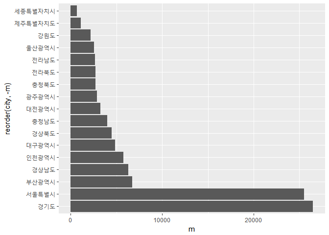

위에서 분석한 코드를 가독성을 위해 빈도표 및 그래프로 표현한다. 초혼연령대를 나타내는 빈도표에서는 위에서 분석했듯이 30-34세에 모든 지역이 초혼건수가 제일 많았던 것을 한 눈에 볼 수 있다. 초혼의 건수를 나타내는 막대그래프는 경기도와 서울이 초혼건수가 압도적으로 많다는 것을 보여준다.

``` r
km1[ ,1] <- c("Gyeonggi-do", "Seoul", "Busan", "Gyeongsangnam-do", "Incheon", "Daegu", "Gyeongsangbuk-do", "Chungcheongnam-do", "Daejeon", "Gwangju", "Chungcheongbuk-do", "Jeollabuk-do", "Jeollanam-do", "Ulsan", "Gangwon-do", "Jeju-do", "Sejong")

x <- data.frame(code = c(11, 21:26, 29, 31:39),
                city = c("Seoul", "Busan", "Daegu", "Incheon", "Gwangju", "Daejeon", "Ulsan", "Sejong", "Gyeonggi-do", "Gangwon-do", "Chungcheongbuk-do", "Chungcheongnam-do", "Jeollabuk-do", "Jeollanam-do", "Gyeongsangbuk-do", "Gyeongsangnam-do", "Jeju-do"))

art <- left_join(km1, x, by = "city")
```

    ## Warning: Column `city` joining character vector and factor, coercing into
    ## character vector

``` r
ggChoropleth(data = art,
             aes(fill = m,
                 map_id = code,
                 tooltip = city),
             map = kormap1,
             interactive = F)
```

 좀 더 가독성을 높이기 위해 대한민국 시도별 혼인건수 단계 구분도를 만든다.

#### 여성

``` r
regionwoman<-marriage%>%
  select(city,age,year,w)%>%
  filter(city!="전국"&city!="면부"&city!="동부"&city!="읍부"&year=="2016 년")%>%
  group_by(city)%>%
  summarise(new=max(w))

a<-marriage %>% select(city,age,year,w)%>%
  filter(w=="2167"|w=="23818"|w=="5643"|w=="4328"|w=="2577"|w== "4552"|w=="3209"|w== "6273"|w=="21433"|w=="501"|w=="2439"|w=="5475"|w=="2716"|w== "2666"|w== "1019"|w=="3642"|w== "2760")%>%
  arrange(desc(w))

table(a$age)
```

    ## 
    ## 15 - 19세 15세 미만 20 - 24세 25 - 29세 30 - 34세 35 - 39세 40 - 44세 
    ##         0         0         0        16         1         0         0 
    ## 45 - 49세 50 - 54세 55 - 59세 60 - 64세 65 - 69세 70 - 74세 75세 이상 
    ##         0         0         0         0         0         0         0 
    ##        계      미상 
    ##         0         0

``` r
cahi<-marriage%>%select(year,city,age,w)%>%
  filter(year=="2016 년" & city!="전국" & city!="면부" & city!="읍부" &  city!="동부")
ggplot(data=cahi,aes(x=city,y=w,fill=age))+geom_col() + coord_flip()
```


빈도표로 지역별로 어느 연령대에서 최대의 혼인 건수가 나왔는지 파악하였는데 25-29세가 16건, 30-34세가 1건 나왔다. 해당 지역을 알아보기 위해 크기순으로 정렬하는 ggplot 패키지를 활용하여 서울특별시만 30-34세에 아내 초혼 건수가 가장 많은 것을 확인할 수 있었다. 색깔의 구분이 힘들긴 하지만 각 지역의 혼인 건수 연령대별 비율 그래프를 통해 서울특별시 혼자 30-34세의 색깔 비율이 25-29세보다 많이 차지하고 있음을 알 수 있었다.

#### \[2-1\]수도권/비수도권으로 나눠서 남녀 혼인건이 제일 많은 연령대 구하기

#### 남성

수도권과 비수도권으로 나눠서 구해야하기 때문에 수도권은 서울,경기,인천 혼인건의 평균을 구했고, 비수도권은 그 외의 지역의 평균을 구했다.

``` r
cap <- marriage %>% 
  filter(city %in% c("서울특별시", "인천광역시", "경기도") & year == "2016 년" )
noncap <- marriage %>% 
  filter(city != "서울특별시" & city != "인천광역시" & city != "경기도" & city != "전국" & city != "읍부" & city != "면부" & city != "동부" & year == "2016 년")

cap_mean <- cap %>% 
  select(city, age, m) %>% 
  group_by(age) %>% 
  summarise(mean_m = mean(m)) %>% 
  arrange(desc(mean_m))

noncap_mean <- noncap %>% 
           select(city, age, m) %>% 
           group_by(age) %>% 
           summarise(mean_m2 = mean(m)) %>% 
           arrange(desc(mean_m2))

col_cap <- ggplot(data = cap_mean, aes(x = age, y = mean_m)) + geom_col() + coord_flip()
col_ncap <- ggplot(data = noncap_mean, aes(x = age, y = mean_m2)) + geom_col() + coord_flip()
grid.arrange(col_cap, col_ncap ,nrow=2)
```

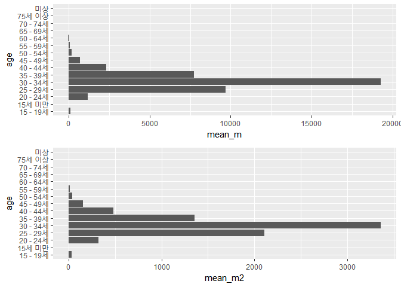 먼저 수도권 지역 남성의 경우 30-34세, 25-29세, 35-39세 순으로 많은 초혼 건수를 보였는데, 비수도권 지역 남성의 경우도 마찬가지로 같은 순을 나타냈다. 한편, 수도권과 비수도권 둘 다 초혼 건수가 많은 연령대 순서는 같지만, 그 연령대가 차지하는 비율은 다른 것 같아 파이 그래프를 만들어 비교해보기로 했다.

``` r
per1 <- round(cap_mean$mean_m/sum(cap_mean$mean_m)*100, 1)
lab1 <- paste(cap_mean$age, per1, "%")
pie(cap_mean$mean_m, col=rainbow(10), label=lab1)
```

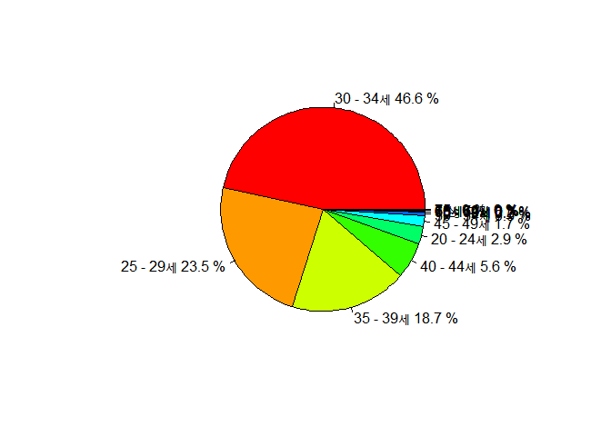

``` r
per2 <- round(noncap_mean$mean_m2/sum(noncap_mean$mean_m2)*100, 1)
lab2 <- paste(noncap_mean$age, per2, "%")
pie(noncap_mean$mean_m2, col=rainbow(10), label=lab2)
```


첫번째는 수도권 남성의 연령대 비율, 두번째는 비수도권 남성의 연령대 비율이다. 파이 그래프를 보면 알 수 있다시피 수도권은 30-34세의 초혼 건수가 거의 절반 가까이를 차지하고 있는 반면, 비수도권은 30-34세의 초혼 건수가 43% 정도를 차지하고 있다. 그리고 25-29세의 초혼 건수는 비수도권이 수도권보다 3.2% 더 높았으며, 35-39세의 초혼 건수는 수도권이 비수도권보다 1.5% 더 높았다. 이를 통해 2016년 수도권 지역 남성들의 초혼은 비수도권 지역 남성들의 초혼에 비해 연령대가 비교적 더 높았다고 볼 수 있다.

#### 여성

``` r
cap_w <- marriage %>% 
  filter(city %in% c('서울특별시', '경기도', '인천광역시', year == '2016 년')) %>% 
  filter(age != '계') %>% 
  group_by(age) %>% 
  summarise(meancity = mean(w)) %>% 
  arrange(desc(meancity))

noncap_w <- marriage %>% 
  filter(city != "서울특별시" & city != "경기도" & city != "인천광역시" & city != "읍부" & city != "동부" & city != "면부" & city != '전국' , year == '2016 년') %>% 
  filter(age != '계') %>% 
  group_by(age) %>% 
  summarise(meancoutry = mean(w)) %>% 
  arrange(desc(meancoutry))

graph_city <- ggplot(data = cap_w , aes(x = age, y = meancity)) + geom_col() + coord_flip()

graph_country <- ggplot(data = noncap_w , aes(x = age, y = meancoutry)) + geom_col() + coord_flip()

grid.arrange(graph_city, graph_country, nrow=2)
```

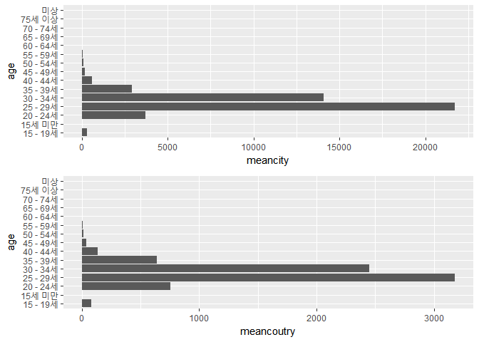

여성은 25-29세 경에 가장 많이 초혼을 했으며, 두번째로 많은 건수가 있는 연령대는 30-34세이다. 이는 수도권과 비수도권 모두 비슷하게 나타났다. 남성보다는 평균 혼인 건수가 가장 많은 연령대가 젊은 것으로 나타났다. 이는 즉 여성은 남성보다 비교적 일찍 결혼을 한다는 의미이다.

#### \[2-2\]읍면동별 남녀 혼인건이 제일 많은 연령대 구하기

#### 남성

``` r
up <- marriage %>% 
  filter(city == "읍부" & year == "2016 년" & age != "계")
myeon <- marriage %>% 
  filter(city == "면부" & year == "2016 년" & age != "계")
dong <- marriage %>% 
  filter(city == "동부" & year == "2016 년" & age != "계")

up_mean <- up %>% 
  select(city, age, m) %>% 
  group_by(age) %>% 
  summarise(mean_m1 = mean(m)) %>% 
  arrange(desc(mean_m1))

myeon_mean <- myeon %>% 
  select(city, age, m) %>% 
  group_by(age) %>% 
  summarise(mean_m2 = mean(m)) %>% 
  arrange(desc(mean_m2))

dong_mean <- dong %>% 
  select(city, age, m) %>% 
  group_by(age) %>% 
  summarise(mean_m3 = mean(m)) %>% 
  arrange(desc(mean_m3))

col_up <- ggplot(data = up_mean, aes(x = age, y = mean_m1)) + geom_col() + coord_flip()
col_myeon <- ggplot(data = myeon_mean, aes(x = age, y = mean_m2)) + geom_col() + coord_flip()
col_dong <- ggplot(data = dong_mean, aes(x = age, y = mean_m3)) + geom_col() + coord_flip()
grid.arrange(col_up, col_myeon, col_dong, nrow=3)
```

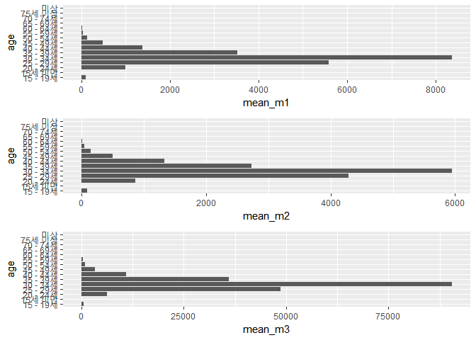

읍면동 남성 모두 30-34세, 25-29세, 35-39세 순으로 많은 초혼 건수를 보이며 수도권, 비수도권과 같은 양상을 나타냈다. 마찬가지로 읍면동 모두 초혼 건수가 많은 연령대 순서는 같지만, 그 연령대가 차지하는 비율이 다른 것 같아 파이 그래프를 만들어 비교해보기로 했다.

``` r
per3 <- round(up_mean$mean_m1/sum(up_mean$mean_m1)*100, 1)
lab3 <- paste(up_mean$age, per3, "%")
pie(up_mean$mean_m1, col=rainbow(10), label=lab3)
```

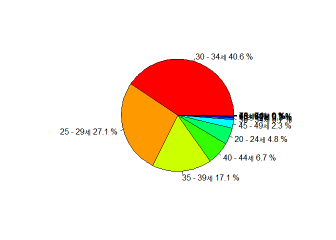

``` r
per4 <- round(myeon_mean$mean_m2/sum(myeon_mean$mean_m2)*100, 1)
lab4 <- paste(myeon_mean$age, per4, "%")
pie(myeon_mean$mean_m2, col=rainbow(10), label=lab4)
```

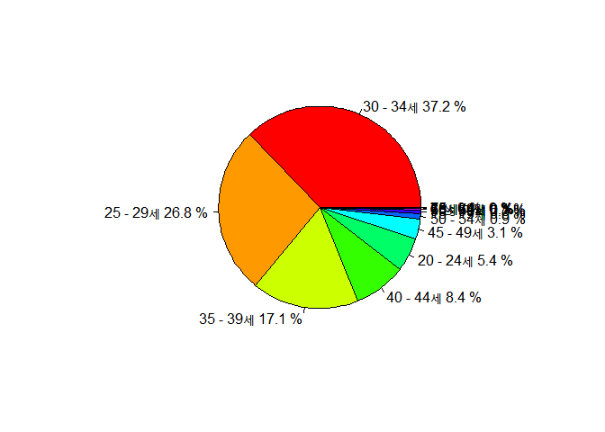

``` r
per5 <- round(dong_mean$mean_m3/sum(dong_mean$mean_m3)*100, 1)
lab5 <- paste(dong_mean$age, per5, "%")
pie(dong_mean$mean_m3, col=rainbow(10), label=lab5)
```

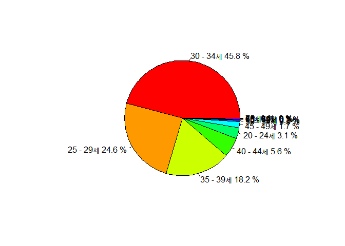

파이 그래프를 보면 앞서 수도권이 그랬던 것처럼 동부의 30-34세와 35-39세 비율이 나머지 둘에 비해 높으며, 젊은 연령대의 비율은 비교적 낮은 것으로 나타났다.

#### 여성

``` r
up_w <- marriage %>% 
  filter(city == '읍부' &  year == '2016 년') %>% 
  filter(age != '계') %>% 
  group_by(age) %>% 
  summarise(mean1 = mean(w))

myeon_w <- marriage %>% 
  filter(city == '면부' &  year == '2016 년') %>% 
  filter(age != '계') %>% 
  group_by(age) %>% 
  summarise(mean2 = mean(w))

dong_w <- marriage %>% 
  filter(city == '동부' &  year == '2016 년') %>% 
  filter(age != '계') %>% 
  group_by(age) %>% 
  summarise(mean3 = mean(w))

graph1 <- ggplot(data = up_w, aes(x = age, y = mean1)) + geom_col() + coord_flip()
graph2 <- ggplot(data = myeon_w, aes(x = age, y = mean2)) + geom_col() + coord_flip()
graph3 <- ggplot(data = dong_w, aes(x = age, y = mean3)) + geom_col() + coord_flip()
grid.arrange(graph1, graph2, graph3, nrow=3)
```


동/읍/면이라는 적은 범위에서도 수도권/비수도권과 다른 결과는 나오지 않았다. 마찬가지로 25-29세의 연령이 가장 혼인건수가 많은 것으로 나타났다. 특히 읍/면은 그래프 mean1, mean2를 보면 알 수 있듯이 거의 차이를 보이지 않았다.

#### \[3\]근 10년간 어떠한 양상으로 나타나는가

#### \[3-1\]

#### 남성

#### 근 10년간의 전국적인 남녀 혼인건이 제일 많은 연령대를 구하기

``` r
marriage %>% 
  filter(city == "전국") %>% 
  group_by(year) %>% 
  summarise(max_m = max(m)) %>%
  arrange(desc(max_m))
```

    ## # A tibble: 10 x 2
    ##       year  max_m
    ##     <fctr>  <dbl>
    ##  1 2013 년 128037
    ##  2 2012 년 125180
    ##  3 2014 년 119565
    ##  4 2011 년 118650
    ##  5 2015 년 117335
    ##  6 2007 년 115080
    ##  7 2010 년 111457
    ##  8 2016 년 106096
    ##  9 2008 년 105758
    ## 10 2009 년 101049

``` r
km2 <- marriage %>% 
  select(year, age, m) %>% 
  filter(m == 128037 | m == 125180 | m == 119565 | m == 118650 | m == 117335 | m == 115080 | m == 111457 | m == 106096 | m == 105758 | m == 101049) %>%
  arrange(desc(m))

table(km2$age)
```

    ## 
    ## 15 - 19세 15세 미만 20 - 24세 25 - 29세 30 - 34세 35 - 39세 40 - 44세 
    ##         0         0         0         2         8         0         0 
    ## 45 - 49세 50 - 54세 55 - 59세 60 - 64세 65 - 69세 70 - 74세 75세 이상 
    ##         0         0         0         0         0         0         0 
    ##        계      미상 
    ##         0         0

``` r
ggplot(data = km2, aes(x = year, y = age)) + geom_col()
```


통합된 전국의 데이터를 이번에는 연도를 한정짓지 않고 근 10년을 기준으로 남녀 혼인건수가 제일 많은 연령대를 구하였다. 근 10년간 전국적으로 혼인건수가 30-34세에 제일 많이 나타나는 현상이 8개년에서 나타났다. 2007년과 2008년에는 25-29세에 혼인건수가 제일 많은 것을 알 수 있다. 초혼연령대를 나타내는 빈도표에서는 위에서 분석했듯이 30-34세에 빈도가 8로 가장 많은 것을 볼 수 있고 25-29세에 빈도가 2임을 볼 수 있다.

#### 근 10년간 지역별 남녀 혼인건이 제일 많은 지역 구하기

``` r
marriage %>% 
  filter(city != "전국" ) %>% 
  group_by(year) %>% 
  summarise(max_m = max(m)) %>%
  arrange(desc(max_m))
```

    ## # A tibble: 10 x 2
    ##       year  max_m
    ##     <fctr>  <dbl>
    ##  1 2013 년 109699
    ##  2 2012 년 107037
    ##  3 2014 년 102082
    ##  4 2011 년 101013
    ##  5 2015 년 100578
    ##  6 2007 년  94622
    ##  7 2010 년  94180
    ##  8 2016 년  90500
    ##  9 2008 년  88106
    ## 10 2009 년  85526

``` r
km3 <- marriage %>% 
  select(year, city, age, m) %>% 
  filter(m == 31879 | m == 31540 | m == 30117 | m == 29525 | m == 29231 | m == 29047 | m == 28215 | m == 27134 | m == 26622 | m == 26511) %>% 
  arrange(desc(m))

table(km3$city)
```

    ## 
    ##         강원도         경기도       경상남도       경상북도     광주광역시 
    ##              0              1              0              0              0 
    ##           국외     대구광역시     대전광역시           동부           면부 
    ##              0              0              0              0              0 
    ##     부산광역시     서울특별시 세종특별자치시     울산광역시           읍부 
    ##              0              9              0              0              0 
    ##     인천광역시           전국       전라남도       전라북도 제주특별자치도 
    ##              0              0              0              0              0 
    ##       충청남도       충청북도 
    ##              0              0

연도를 한정짓지 않고 지역별로 근 10년을 기준으로 남녀 혼인건수가 제일 많은 지역을 구하였다. 근 10년간 서울특별시에서 30-34세에 혼인건수가 제일 많았고 2016년에만 경기도에서 30-34세에 혼인건수가 제일 많은 것을 확인 할 수 있다. 지역을 나타내는 빈도표에서는 위에서 분석했듯이 서울특별시에 빈도가 9로 가장 많은 것을 볼 수 있고 경기도에 빈도가 1임을 볼 수 있다.

#### 지역비교

``` r
marriage_2 <- marriage %>% 
  filter(city != "전국" & city != "동부" & city != "면부" & city != "읍부")
km4 <- aggregate(m~city+year, marriage_2, max)

ggplot(data = km4, aes(x= year, y = m)) + geom_boxplot()
```


``` r
ggplot(data = km4, aes(x= city, y = m)) + geom_boxplot()
```

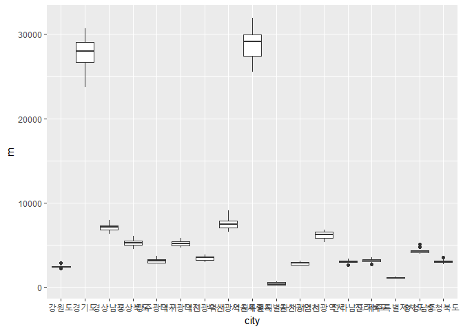

aggregate()함수를 사용하여 근 10년의 지역별 초혼건수가 제일 많은 지역을 차례대로 나열하였다. 세종특별자치시는 2012년에 출범하였기 때문에 총 165개의 데이터가 산출된다. 위에서 분석한 코드를 가독성을 위해 그래프로 표현한다. 상자그림을 통해 년도별, 지역별 분포 차이를 표현했다. 연도별로 표현된 상자그림에서는 서울특별시와 경기도가 인구가 다른 지역보다 많기 때문에 이상치로 나타난다 또한 중앙값은 연도별로 크게 차이가 없는 것을 볼 수 있다. 지역별로 표현된 상자그림에서는 위의 상자그림과 마찬가지로 경기도와 서울특별시가 혼인건수가 약 3배로 극단적으로 많기 때문에 상자그림자체가 다른 지역의 상자그림보다 위에 위치한 것을 확인 할 수 있다.

#### 여성

#### 10년 간 전국을 기준으로 어떤 연령대가 가장 다수를 차지했는지 구하기

``` r
nmarry<-marriage%>%
  select(city,age,year,w)%>%
  filter(city=="전국" & age!="계")%>%
  group_by(age)%>%
  arrange(desc(w))
nmarry
```

    ## # A tibble: 150 x 4
    ## # Groups:   age [15]
    ##      city       age    year      w
    ##    <fctr>    <fctr>  <fctr>  <int>
    ##  1   전국 25 - 29세 2007 년 161676
    ##  2   전국 25 - 29세 2008 년 150195
    ##  3   전국 25 - 29세 2010 년 142014
    ##  4   전국 25 - 29세 2009 년 139409
    ##  5   전국 25 - 29세 2011 년 137781
    ##  6   전국 25 - 29세 2012 년 128008
    ##  7   전국 25 - 29세 2013 년 120921
    ##  8   전국 25 - 29세 2014 년 108362
    ##  9   전국 25 - 29세 2015 년 106107
    ## 10   전국 25 - 29세 2016 년  97440
    ## # ... with 140 more rows

상위 10위 값이 해당 연도 최댓값이다. 그걸 바탕으로 연령대의 차이를 살펴보았으나 전부 25-29세에서 아내의 가장 많은 혼인 건수가 있었음을 확인할 수 있었다.

#### 10년 간 최대 아내 혼인 건수를 차지한 지역, 연령대 비교

``` r
regionmarry<- marriage%>%
  select(city,age,year,w)%>%
  filter(city!="전국"&city!="면부"&city!="동부"&city!="읍부")%>%
  group_by(year)%>%
  summarise(regionyear=max(w))

c<-marriage%>%select(city,age,year,w)%>%
  filter(w=="38126"|w=="33906"|w=="32282"|w=="32171"|w=="30935"|w== "29496"|w=="27988"|w== "25560"|w=="25432"|w=="23818")%>%
  arrange(year)


table(c$age)
```

    ## 
    ## 15 - 19세 15세 미만 20 - 24세 25 - 29세 30 - 34세 35 - 39세 40 - 44세 
    ##         0         0         0        10         0         0         0 
    ## 45 - 49세 50 - 54세 55 - 59세 60 - 64세 65 - 69세 70 - 74세 75세 이상 
    ##         0         0         0         0         0         0         0 
    ##        계      미상 
    ##         0         0

``` r
table(c$city)
```

    ## 
    ##         강원도         경기도       경상남도       경상북도     광주광역시 
    ##              0              6              0              0              0 
    ##           국외     대구광역시     대전광역시           동부           면부 
    ##              0              0              0              0              0 
    ##     부산광역시     서울특별시 세종특별자치시     울산광역시           읍부 
    ##              0              4              0              0              0 
    ##     인천광역시           전국       전라남도       전라북도 제주특별자치도 
    ##              0              0              0              0              0 
    ##       충청남도       충청북도 
    ##              0              0

10년간 여성의 연도별 최대 혼인 건수를 regionmarry로, 그 최대 혼인 건수로 지역과 연령대까지 끌고 온 것이 c이다. 따라서 c에서의 연령대 변수를 빈도표로 나타냈을 때 25-29세가 10년 간 꾸준히 최댓값으로 나왔고, c에서의 지역 변수를 빈도표로 나타냈을때 처음 4년은 서울이, 남은 6년은 경기도가 최대 아내 혼인 건수를 차지한 지역이었다. 이는 사람들이 차츰 서울 근교로 빠져나가 경기도에 많이 거주하며 서울엔 출퇴근을 하러 간다는 것을 뜻한다.

#### 10년 간 각 지역별로 구분한 최대 아닌 혼인 건수 양상 파악하기.

``` r
nnmarry<-marriage%>%filter(city!="전국"&city!="면부"&city!="동부"&city!="읍부")
final<-aggregate(w~city+year,nnmarry,max)

x<-ggplot(data=final,aes(x=year, y=w,col=city,group=city))+geom_line()+geom_point()
x
```

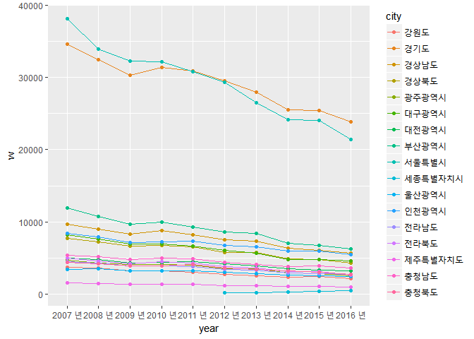

10년 간 세부 지역별 여성 혼인 건수만 계산된값 nnmarry에 시도별과 연도를 기준으로 nnmarry의 최댓값을 살펴본 변수가 final이다. final은 각 지역의 10년 동안의 최대 혼인 건수를 나타낸 값으로 전체 165행으로 구성된다. 지역별 최대 혼인 건수의 증감을 살펴보기 위해 꺾은 선 그래프를 사용하였고, 전체적으로 혼인 건수가 10년 간 감소하는 양상이었고, 2012년부터 정식 도시가 된 세종시는 계속되는 직장인들의 유입으로 최대혼인건수가 미미하게 늘어나고 있었다.

#### \[3-2\]

#### 남성

#### 수도권과 비수도권

``` r
cap_10 <- marriage %>% 
  filter(city %in% c("서울특별시", "인천광역시", "경기도") & age != "계")

a <- aggregate(m~age+year, cap_10, mean)
g <- ggplot(data=a, aes(x=age, y=m)) + geom_point()
g+geom_point(aes(color=year), size=2)
```

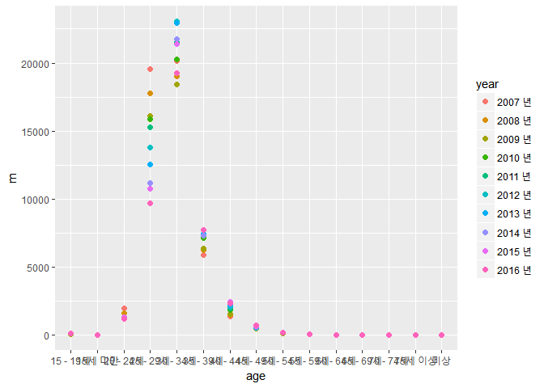

먼저 수도권 지역의 10년 간 양상을 살펴보자. 2007년인 붉은색 점이 가장 높이 있는 연령대를 보면 25-29세이다. 즉, 2007년에는 25-29세인 남성의 평균 초혼 건수가 가장 많았던 것이다. 하지만 2008년부터는 각각의 점들이 가장 높이 있는 연령대가 모두 30-34세이다. 2008년부터 2016년까지는 평균 초혼 건수가 가장 많은 연령대가 30-34세로 같은 양상을 보인 것이다. 다시 말해 2007년을 기점으로 남성의 평균 초혼 연령대가 높아졌다고 볼 수 있을 것 같다.

``` r
noncap_10 <- marriage %>% 
  filter(city != "서울특별시" & city != "인천광역시" & city != "경기도" & city != "전국" & city != "읍부" & city != "면부" & city != "동부" & age != "계")

b <- aggregate(m~age+year, noncap_10, mean)
gg <- ggplot(data=b, aes(x=age, y=m)) + geom_point()
gg+geom_point(aes(color=year), size=2)
```


다음으로 비수도권 지역의 10년 간 양상이다. 수도권과 마찬가지로 2007년인 붉은색 점이 가장 높이 있는 연령대가 25-29세인데, 2008년인 주황색 점 역시 가장 높은 위치에 있는 연령대가 25-29세이다. 이후 2009년부터는 각각의 점들이 가장 높이 있는 연령대가 모두 30-34세이므로, 평균 초혼 건수가 가장 많은 연령대인 30-34세와 같은 양상을 보였다. 비수도권 지역은 2008년을 기점으로 남성의 평균 초혼 연령대가 높아졌다고 볼 수 있다.

#### 읍면동

``` r
up_10 <- marriage %>% 
  filter(city == "읍부" & age != "계")
c <- aggregate(m~age+year, up_10, mean)
cg <- ggplot(data=c, aes(x=age, y=m)) + geom_point()
cg+geom_point(aes(color=year), size=2)
```


읍부의 10년간 양상이다. 앞서 본 수도권/비수도권의 양상과 달리 2007년부터 2010년까지의 점이 제일 높이 위치해 있는 연령대가 25-29세이다. 즉 읍부는 2010년까지만 해도 평균 초혼 연령대가 비교적 낮은 편이었으며, 2011년부터 그 연령대가 높아졌다고 볼 수 있다.

``` r
myeon_10 <- marriage %>% 
  filter(city == "면부" & age != "계")
d <- aggregate(m~age+year, myeon_10, mean)
dg <- ggplot(data=d, aes(x=age, y=m)) + geom_point()
dg+geom_point(aes(color=year), size=2)
```


면부의 10년간 양상이다. 읍부와 동일하게 2007년부터 2010년까지의 점들이 가장 높이 위치해 있는 연령대가 25-29세이다.

``` r
dong_10 <- marriage %>% 
  filter(city == "동부" & age != "계")
e <- aggregate(m~age+year, dong_10, mean)
eg <- ggplot(data=e, aes(x=age, y=m)) + geom_point()
eg+geom_point(aes(color=year), size=2)
```

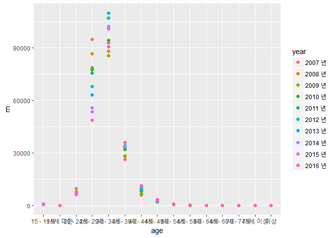

동부의 10년간 양상은 앞서 본 수도권의 양상처럼 2007년만 25-29세에 점이 가장 높이 위치해 있고, 나머지는 모두 30-34세에 가장 높이 위치해 있다.

정리하자면 수도권과 동부는 2008년부터 평균 초혼 건수가 가장 많은 연령대가 30-34세로 앞선 분석과 같은 양상을 보였으며, 비수도권은 2009년부터 같은 양상을 보였다. 비교적 비수도권에 위치한 읍부와 면부는 2010년까지는 평균 초혼 건수가 가장 많은 연령대가 25-29세로 젊은 연령대에 속해있었으나, 2011년부터는 앞선 분석과 같은 양상을 보였다.

#### 여성

#### 수도권과 비수도권

``` r
city1 <- marriage %>% 
  filter(city %in% c('서울특별시', '경기도', '인천광역시'))
city1 <- aggregate(w~year+age, city1, mean)
g <- ggplot(data = city1, aes(x = age, y=w)) +geom_point()
g1 <- g+geom_point(aes(color=year), size=2)
g1
```

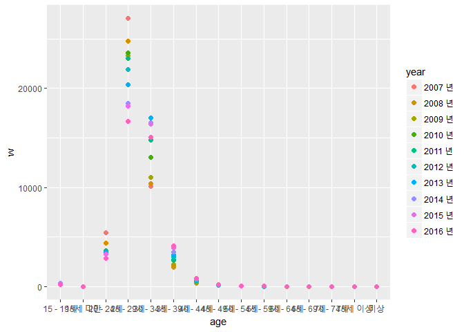

``` r
country1 <- marriage %>% 
  filter(city != "서울특별시" & city != "경기도" & city != "인천광역시" & city != "읍부" & city != "동부" & city != "면부" & city != '전국') 
country1 <- aggregate(w~year+age, country1, mean)
g2 <- ggplot(data = country1, aes(x = age, y=w)) +geom_point()
g22 <- g2+geom_point(aes(color=year), size=2)
g22
```


각 점은 연령에 따른 평균 건수를 나타내며, 각 점의 색은 각기 다른 연도를 나타낸다. =&gt; 두 그래프 모두 같은 색의 점끼리 비교를 해보았을 때, 모든 점이 25-29세 -&gt; 30-34세 순의 높이로 찍혀 있다. 이는 2016년과 같은 결과로 초혼을 하는 연령대는 10년간의 차이가 크게 없었음을 알 수 있다. 또한 두 그래프 모두 24-29세를 기준으로 2007년의 점이 가장 위에 있고, 2016년의 점은 가장 아래에 있어 십년 사이에 초혼 건수가 크게 줄었음을 알 수 있다. 뿐만 아니라 열개의 연도를 각각 2007년-2012년, 2013년-2016년으로 나누어 보았을 때 25-20세에는 전자의 점들이 위쪽에 찍혀있는 반면, 30-34세에는 후자의 점들이 위쪽의 찍혀있다. 이는 여성의 초혼 연령이 점점 낮아지고 있음을 의미한다. 이 외에도 2016년에는 2007년 존재하지 않던 40세 이후의 '황혼결혼' 사례가 생겼음을 볼 수 있다.

#### 읍면동

``` r
up_w1 <- marriage %>% 
  filter(city == '읍부')
myeon_w1 <- marriage %>% 
  filter(city == '면부')
dong_w1 <- marriage %>% 
  filter(city == '동부') 

up_w1 <- aggregate(w~year+age, up_w1, mean)
h <- ggplot(data = up_w1, aes(x = age, y=w)) +geom_point()
h+geom_point(aes(color=year), size=2)
```

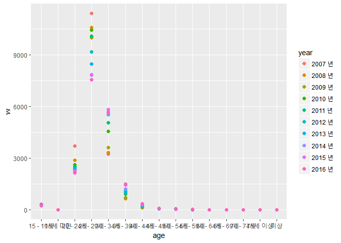

``` r
myeon_w1 <- aggregate(w~year+age, myeon_w1, mean)
h2 <- ggplot(data = myeon_w1, aes(x = age, y=w)) +geom_point()
h2+geom_point(aes(color=year), size=2)  
```


``` r
dong_w1 <- aggregate(w~year+age, dong_w1, mean)
h3 <- ggplot(data = dong_w1, aes(x = age, y=w)) +geom_point()
h3+geom_point(aes(color=year), size=2)
```


=&gt; 세 그래프에 찍혀있는 같은 색의 점을 비교해보았을 때, 모든 점이 25-29세에 가장 높은 위치에 있었으며, 두번째는 마찬가지로 30-34세가 차지했다. 2016년을 나타내는 점 역시 수도권/비수도권의 그래프와 마찬가지로 대부분의 연령대에 위치하고 있었다. 특히 눈여겨보아야할 점은 읍/면에서 20-24세에 초혼하는 건수가 동에 비해 높다는 점이다. 이를 보아 인구가 적은 지역일수록 일찍 결혼한다는 것을 알 수 있다.

결론
====

1.  이 분석에서 대체적으로 읍부와 면부는 비수도권 취급을 했는데, 사실상 읍부와 면부는 수도권인 경기도에도 속해있기 때문에 과잉일반화를 한 면이 있다.
2.  수도권/비수도권으로 묶어버리면서 세부적으로 어느 지역의 연령대가 높고 낮았는지는 분석하지 못했다.
3.  읍/면/동에서 평균값 대신 중간값을 구한다면 보다 최대/최솟값을 고려하는 분석이 됐을 것이다.
4.  연도 설정을 너무 짧게 잡아서 변화가 두드러지지 않았다. 연도를 10년보다 폭넓게 잡는다면 좀 더 뚜렷한 변화를 나타낼 수 있을 것이다.
5.  건수가 단순히 지역과 연도만으로 보여주기에는 너무 한정적이다. 혼인 건수가 줄어든 원인을 다른 변수를 써서 더 명확하게 규명했으면 좋았을 것이다.
6.  분석 기법을 더욱 다양하게 하지 못한 아쉬움이 남는다.
