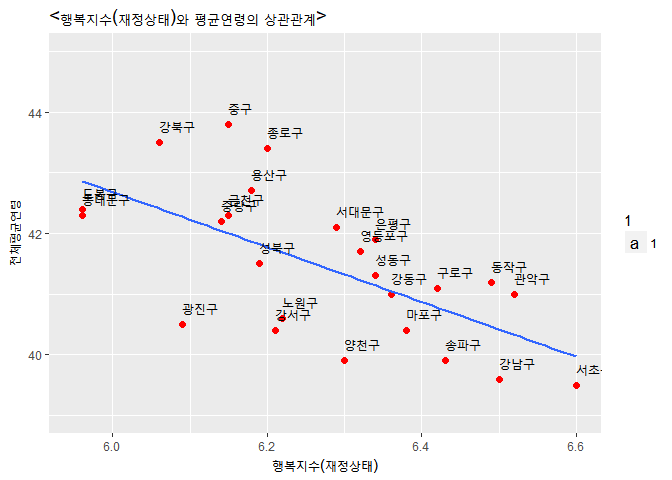

요약
----

1. 분석(연구)의 필요성
----------------------

재정상태와 재정상태에 따른 행복은 완전히 다른 개념이다. 행복은 반드시
‘삶의 질’ 또는 ‘소득(생활)수준’과 관련이 있는 것이 아니며, 사회에 따라
행복기준이 달리 나타나는 것으로 파악되고 있다는 분석이 보고된 바
있다.\[^1\] 우리나라(대한민국)의 경우에도 대체적으로 소득수준이
높을수록(월500만원 이상) 소득수준에 대한 행복지수가 대체적으로 높다는
것을 알 수 있다.\[^2\] 위 연구를 살펴보면 두 가지 궁금증이 생긴다.
"재정상태에 따른 **행복지수가 가장 높은 지역**은 어딜까?", "**재정상태에
따른 행복지수가 높은 지역은 평균연령**도 높을까?" 이 두 가지 궁금증을
해결하기 위해 실제로 데이터를 분석해보고자 한다. --- \[^1\]: 출처:
KIHASA 한국보건연구. \[^2\]: 「서울시민은 자신이 얼마나 행복하다고
느낄까?」, 『서울연구원 인포그래픽스 제25호』.

2. 데이터 선정
--------------

분석에 필요한 데이터로 **2016년도 행복지수에 관한 데이터**와 **2016년도
평균연령(구별)**에 관한 데이터를 사용하였다. 위와 같은 데이터를 선정한
이유는 각 구별(서울시)로 행복에 관한 항목별 행복지수를 따로 수치화 한
데이터가 있었고, 평균연령 또한 각 구별로 데이터를 산출한 결과가 있었기
때문에 사용하였다.

행복지수에 관한 데이터의 경우, 서울시민의 주관적인 행복정도로,
서울특별시 통계데이터담당관「서울서베이(도시정책지표조사)」에서
조사하였으며, 자신의 행복점수를 0부터 10까지 표시한 문항으로 측정하였다.
평균연령에 관한 데이터의 경우, 각 지방행정기관의 제반 행정사항의
기초자료로 활용하는 것을 목적으로 서울특별시
통계데이터담당관「서울서베이(도시정책지표조사)」에 의해 작성되었다.
평균연령의 계산 방법은 ‘평균연령 = {각 세 연령별 인구×(연령+0.5)}의
총합을 총인구로 나눈 값(외국인 제외)’으로 계산하였다.

3. 데이터 분석
--------------

### 3-1. 데이터 전처리(데이터 취합을 위한 작업)

    library(readxl)      #엑셀파일 불러들이기위한 패키지 장착

    #분석할 데이터(엑셀파일) 불러오기

    df_analysis <- read_excel("2016 자치구별 연령별 인구.xls") 
    df_analysis_1 <- read_excel("2016지방세징수.xls")
    df_analysis_2 <- read_excel("2016행복지수.xls")
    df_analysis_3 <- read_excel("2016평균연령(구별).xls")

    #데이터 복사본 만들기

    df_analysis_new <- df_analysis
    df_analysis_1_new <- df_analysis_1
    df_analysis_2_new <- df_analysis_2
    df_analysis_3_new <- df_analysis_3

    library(dplyr)                             #dplyr패키지 장착 

    #필요한 변수만 추출
    df_analysis_new <- df_analysis_new %>%  
      filter(`구분__1` != "남자") %>%       
      filter(`구분__1` != "여자") %>% 
      filter(`구분` != "합계") %>%      
      select(-`구분__1`)                  

    df_analysis_1_new <- df_analysis_1_new %>%  
      filter(`자치구별` != "서울시") %>%      
      filter(`자치구별` != "본청") %>% 
      filter(`자치구별` !="자치구별") %>%  
      select(`자치구별`,`보통세`)          

    #변수명 바꾸기_1

    df_analysis_1_new <- rename(df_analysis_1_new,  `구분` = `자치구별`)
    df_analysis_1_new <- rename(df_analysis_1_new,  `취득세` = `보통세`)

    #필요한 변수만 추출하기

    df_analysis_2_new <- df_analysis_2_new %>%  
      filter(`대분류` != "대분류") %>%    
      filter(`대분류` != "서울시") %>%    
      filter(`대분류` != "성별") %>%       
      filter(`대분류` != "연령별") %>% 
      filter(`대분류` != "학력별") %>% 
      filter(`대분류` != "소득별") %>% 
      filter(`대분류` != "혼인상태별") %>% 
      filter(`대분류` != "지역대분류") %>% 
      select(-`기간`, -`대분류`)          

    #변수명 바꾸기_2

    df_analysis_2_new <- rename(df_analysis_2_new,  `행복지수(건강상태)` = `항목별 행복지수`)
    df_analysis_2_new <- rename(df_analysis_2_new,  `행복지수(재정상태)` = `항목별 행복지수__1`)
    df_analysis_2_new <- rename(df_analysis_2_new,  `행복지수(관계상태)` = `항목별 행복지수__2`)
    df_analysis_2_new <- rename(df_analysis_2_new,  `행복지수(가정생활)` = `항목별 행복지수__3`)
    df_analysis_2_new <- rename(df_analysis_2_new,  `행복지수(사회생활)` = `항목별 행복지수__4`)
    df_analysis_2_new <- rename(df_analysis_2_new,  `구분` = `분류`)

    #필요한 변수만 추출하기

    df_analysis_3_new <- df_analysis_3_new %>% 
      filter(`지역` != "합계") %>%        
      select(-`기간`,-`남자`,-`여자`)     

    #변수명 바꾸기_3

    df_analysis_3_new <- rename(df_analysis_3_new,  `구분` = `지역`)

    #데이터 합치기

    df_a <- left_join(df_analysis_new, df_analysis_1_new, by = "구분")
    df_b <- left_join(df_analysis_2_new, df_analysis_3_new, by = "구분") 
    df_total <- left_join(df_a, df_b, by = "구분") 

### 3-2. 데이터 파악하기 & 클린징

    #결측치 확인
    colSums(is.na(df_total))

    ##               기간               구분                 계 
    ##                  0                  0                  0 
    ##              0~4세              5~9세            10~14세 
    ##                  0                  0                  0 
    ##            15~19세            20~24세            25~29세 
    ##                  0                  0                  0 
    ##            30~34세            35~39세            40~44세 
    ##                  0                  0                  0 
    ##            45~49세            50~54세            55~59세 
    ##                  0                  0                  0 
    ##            60~64세            65~69세            70~74세 
    ##                  0                  0                  0 
    ##            75~79세            80~84세            85~89세 
    ##                  0                  0                  0 
    ##            90~94세         95세 이상+             취득세 
    ##                  0                  0                  0 
    ##      종합 행복지수 행복지수(건강상태) 행복지수(재정상태) 
    ##                  0                  0                  0 
    ## 행복지수(관계상태) 행복지수(가정생활) 행복지수(사회생활) 
    ##                  0                  0                  0 
    ##       전체평균연령 
    ##                  0

    #데이터 파악하기
    str(df_total)

    ## Classes 'tbl_df', 'tbl' and 'data.frame':    25 obs. of  31 variables:
    ##  $ 기간              : chr  "2016" "2016" "2016" "2016" ...
    ##  $ 구분              : chr  "종로구" "중구" "용산구" "성동구" ...
    ##  $ 계                : num  157423 131145 234241 289789 357921 ...
    ##  $ 0~4세             : num  4995 4909 9469 12672 14074 ...
    ##  $ 5~9세             : num  4903 4017 8411 10548 12294 ...
    ##  $ 10~14세           : num  5539 3587 8221 9979 12889 ...
    ##  $ 15~19세           : num  7883 5160 10701 13447 18840 ...
    ##  $ 20~24세           : num  11580 8553 14650 20400 26883 ...
    ##  $ 25~29세           : num  14051 10936 18988 24985 35304 ...
    ##  $ 30~34세           : num  12263 11058 21088 26001 33756 ...
    ##  $ 35~39세           : num  11262 10274 19865 24710 29012 ...
    ##  $ 40~44세           : num  12180 9974 19557 23190 27862 ...
    ##  $ 45~49세           : num  13169 10884 19109 23278 29158 ...
    ##  $ 50~54세           : num  13062 11303 18623 23563 29279 ...
    ##  $ 55~59세           : num  12664 11664 18134 22962 27912 ...
    ##  $ 60~64세           : num  10007 8941 13878 17197 20535 ...
    ##  $ 65~69세           : num  7598 6754 10742 13055 14779 ...
    ##  $ 70~74세           : num  6280 5348 8897 10072 10821 ...
    ##  $ 75~79세           : num  5059 3853 7039 7373 7603 ...
    ##  $ 80~84세           : num  2924 2383 4159 3958 4176 ...
    ##  $ 85~89세           : num  1379 1067 1846 1699 1880 ...
    ##  $ 90~94세           : num  482 384 709 555 676 ...
    ##  $ 95세 이상+        : num  143 96 155 145 188 194 218 262 192 201 ...
    ##  $ 취득세            : chr  "137454" "243277" "213768" "149712" ...
    ##  $ 종합 행복지수     : chr  "6.88" "6.75" "6.69" "6.9" ...
    ##  $ 행복지수(건강상태): chr  "7.11" "6.95" "6.88" "7.02" ...
    ##  $ 행복지수(재정상태): chr  "6.2" "6.15" "6.18" "6.34" ...
    ##  $ 행복지수(관계상태): chr  "7.01" "6.86" "6.75" "6.98" ...
    ##  $ 행복지수(가정생활): chr  "7.16" "6.99" "6.83" "7.15" ...
    ##  $ 행복지수(사회생활): chr  "6.93" "6.79" "6.8" "7.03" ...
    ##  $ 전체평균연령      : num  43.4 43.8 42.7 41.3 40.5 42.3 42.2 41.5 43.5 42.4 ...

    #데이터 클린징
    df_total[, 25:30] <- sapply(df_total[, 25:30], function(`행복지수(재정상태)`){as.numeric(as.character(`행복지수(재정상태)`))})
    summary(df_total$`행복지수(재정상태)`)   #문자형을 수치형으로 변환 

    ##    Min. 1st Qu.  Median    Mean 3rd Qu.    Max. 
    ##   5.960   6.150   6.290   6.272   6.380   6.600

### 3-3. Question1. 평균연령이 높은 지역은 재정상태에 대한 행복지수가 높을까?(상관분석)

    cor.test(df_total$`행복지수(재정상태)`, df_total$전체평균연령)

    ## 
    ##  Pearson's product-moment correlation
    ## 
    ## data:  df_total$`행복지수(재정상태)` and df_total$전체평균연령
    ## t = -3.9456, df = 23, p-value = 0.0006438
    ## alternative hypothesis: true correlation is not equal to 0
    ## 95 percent confidence interval:
    ##  -0.8236869 -0.3207165
    ## sample estimates:
    ##        cor 
    ## -0.6353347

p-value가 0.05 미만(0.0006438)이므로 재정상태에 따른 행복지수와 평균연령
사이의 관계가 통계적으로 유의하다고 해석할 수 있다.  
cor은 상관계수를 의미하는데 -0.6353347이므로 서로 반비례관계라는 사실을
알 수 있다.

    library(ggplot2)
    ggplot(data = df_total, aes(x = `행복지수(재정상태)`, y = `전체평균연령`))+
      geom_point(shape=19, size = 2, colour = "red")+
      xlim(5.95, 6.6)+
      ylim(39, 45)+
      ggtitle( "<행복지수(재정상태)와 평균연령의 상관관계>")+
      stat_smooth(method=lm, se =FALSE)+ 
      geom_text(aes(label = `구분`, size = 1, vjust = -1, hjust = 0))

    df_total %>% arrange(desc(`행복지수(재정상태)`)) %>% 
      select(`구분`) %>% 
      head(3)

    ## # A tibble: 3 x 1
    ##     구분
    ##    <chr>
    ## 1 서초구
    ## 2 관악구
    ## 3 강남구

    df_total %>% arrange(`전체평균연령`) %>% 
      select(`구분`) %>% 
      head(3)

    ## # A tibble: 3 x 1
    ##     구분
    ##    <chr>
    ## 1 서초구
    ## 2 강남구
    ## 3 양천구

그래프 결과, 재정상태에 따른 행복지수가 높을수록 평균연령 낮다는 것을 일
수 있다. 행복지수가 높은 3개의 지역은 **서초구**, **관악구**,
**강남구**이고 평균연령 낮은 3개의 지역은 **서초구**, **강남구**,
**양천구**로 나타났다. 둘의 결과값에 따라 나타나는 구가 **거의
일치함**을 알 수 있다.

한계점
------

우선 첫 번째로 행복지수의 경우 구 사이의 행복지수의 차이가 크게
두드러지지 않다는 점이다. 두 번째는 2016년 한 시기만을 본 자료로
분석했기 때문에 시간에 따른 변화추이를 확인하기에는 어려움이 있다. 세
번째는 평균연령이라는 값을 사용해서 분석에 대한 오류가 클 것이라고
예상된다.

추후 분석 방향
--------------

위의 한계점을 보완하는 방법으로 2016년도 자료이외의 2015, 2014년도의
자료를 사용해서 행복지수의 변화추이를 알아낼 수 있을 것이다.

각 구별로 평균연령을 나타낸 값을 사용하지 말고 중간값을 나타낸 값을
사용하는 것이 극단치를 제거할 수 있는 좋은 방법으로 파악될 것이다.
