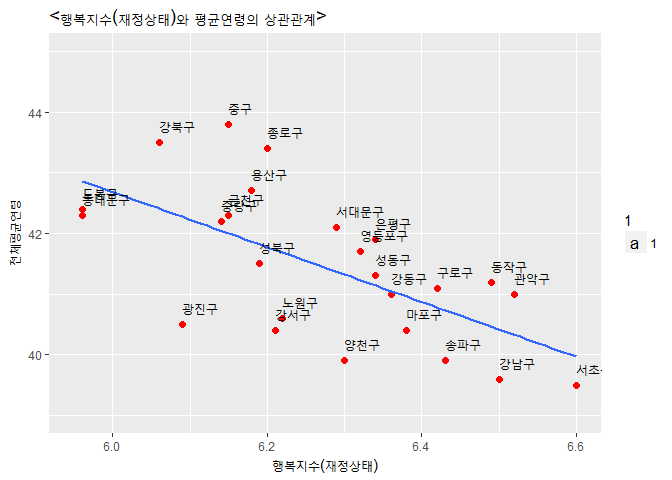

#### 1. 초록

이 연구의 목적은 '여러 변수에 따라 부와 행복 간의 상관관계가 어떻게
다르게 나타나는가'에 대한 답을 찾는 데 있다. 연구에 사용된 자료는 서울시
통계데이터에 공개된 서울시 자치구별로 조사된 평균연령데이터와 행복지수
데이터, 지방세징수(재산세) 데이터를 사용했다. 이러한 데이터들을
바탕으로, 2016년을 기준 횡단면 분석 및 시계열 분석을 시행하였다.
분석에서는 부와 행복 간의 상관관계에 대한 여러 가설을 세워 상관분석을
통해 가설을 검증하였으며 검증된 결론들과 함께 분석과정에서 나타난
한계점과 비판점을 찾아 다음 연구에 보완할 점들을 논할 것이다.

#### 2. 분석(연구)의 필요성

행복은 반드시 ‘삶의 질’ 또는 ‘소득(생활)수준’과 관련이 있는 것이 아니며,
사회에 따라 행복 기준이 달리 나타나는 것으로 보고된 바 있다. \[^1\]
하지만 '돈 많은 게 최고의 행복이다’라는 말은 사람들 누구나 공감하는 말일
것이다. 그래서 우리는 이러한 연구와 사회통념 중 어느 것이 사회에 더
적합한지 알아보고자 한다. 이에 다양한 방면으로 분석을 진행하기 위해 먼저
재정상태와 연령, 종합행복지수, 재정상태에 대한 행복지수를 통해 다양한
가설들을 세워 분석해보기로 하였다. 그렇게 나온 분석할 가설은 아래와
같다. **(가설1) 재정 수준이 높은 지역일수록 평균연령이 높을 것이다 **
**(가설2) 재정상태에 대한 행복지수가 높은 지역은 평균연령도 높을
것이다.** **(가설3) 재정 수준이 높은 지역일수록 종합행복지수가 높을
것이다** **(가설 4-1) 재정 수준이 높을수록 재정상태에 따른 행복지수도
높을 것이다.** **(가설 4-2) 재정 수준이 높은 사람들이 사는 지역과
재정상태에 대한 행복지수가 높은 사람이 사는 지역은 비슷할 것이다.**

#### 3. 데이터 선정

분석에 필요한 데이터로 구별 지방 재정의 계획수립 및 운용 현황을 파악하기
위해 작성된 서울특별시 세무과의 자료인 **2016 지방세 징수 데이터**와
지방행정기관의 제반 행정 사항의 기초자료로 활용하는 것을 목적으로
서울특별시 통계데이터담당관「서울 조사서울서베이(도시정책지표조사)」에
의해 작성된 **2016 평균연령 데이터**, 그리고 서울시민의 주관적인 행복
정도를 알기 위해 작성된 서울특별시 통계데이터담당관「서울
조사서울서베이(도시정책지표조사)」에 의해 작성된 **2016 행복지수
데이터**늘를 사용하였다.

재산세 중 구세를 뽑아 분석에 사용한 이유는 구별로 분석을 시행하기 때문에
시세보다 좀 더 정확한 세금 추이를 파악할 수 있기 때문이다. 재산은 서울시
각 자치구의 지방세 세목별·세입 단위별(시세·구세) 징수들이 있는
데이터에서 재산세 데이터를 사용했다. 평균연령의 계산 방법은 ‘평균연령 =
{각 세 연령별 인구×(연령+0.5)}의 총합을 총인구로 나눈 값(외국인
제외)’으로 계산하였다. 행복지수에 관한 데이터의 경우, 자신의 주관적인
행복점수를 0부터 10까지 표시한 문항으로 측정하였으며 그중에서도
행복지수와 재정상태 수준에 따른 행복지수를 추출해 분석하였다.
종합행복지수는 (건강상태에 따른 행복지수+재정상태에 따른
행복지수+관계상태에 따른 행복지수+가정생활에 따른 행복지수+사회생활에
따른 행복지수)를 모두 더하여 5로 나눈 값이다.

#### 4. 데이터 분석

##### 4-1. 데이터 전처리(데이터 취합을 위한 작업)

    library(readxl) #엑셀 파일 불러들이기 위한 패키지 장착 

    #분석할 데이터(엑셀파일) 불러오기
    df_analysis <- read_excel("2016 자치구별 연령별 인구.xls") 
    df_analysis_1 <- read_excel("2016지방세징수.xls")
    df_analysis_2 <- read_excel("2016행복지수.xls")
    df_analysis_3 <- read_excel("2016평균연령(구별).xls")

    #데이터 복사본 만들기
    df_analysis_new <- df_analysis
    df_analysis_1_new <- df_analysis_1
    df_analysis_2_new <- df_analysis_2
    df_analysis_3_new <- df_analysis_3

    library(dplyr)                             #dplyr패키지 장착 

    #필요한 변수만 추출
    df_analysis_new <- df_analysis_new %>%  
      filter(`구분__1` != "남자") %>%       
      filter(`구분__1` != "여자") %>% 
      filter(`구분` != "합계") %>%      
      select(-`구분__1`)                  

    df_analysis_1_new <- df_analysis_1_new %>%  
      filter(`자치구별` != "서울시") %>%      
      filter(`자치구별` != "본청") %>% 
      filter(`자치구별` !="자치구별") %>%  
      select(`자치구별`,`보통세`)          

    #변수명 바꾸기_1
    df_analysis_1_new <- rename(df_analysis_1_new,  `구분` = `자치구별`)
    df_analysis_1_new <- rename(df_analysis_1_new,  `취득세` = `보통세`)

    #필요한 변수만 추출하기
    df_analysis_2_new <- df_analysis_2_new %>%  
      filter(`대분류` != "대분류") %>%    
      filter(`대분류` != "서울시") %>%    
      filter(`대분류` != "성별") %>%       
      filter(`대분류` != "연령별") %>% 
      filter(`대분류` != "학력별") %>% 
      filter(`대분류` != "소득별") %>% 
      filter(`대분류` != "혼인상태별") %>% 
      filter(`대분류` != "지역대분류") %>% 
      select(-`기간`, -`대분류`)          

    #변수명 바꾸기_2
    df_analysis_2_new <- rename(df_analysis_2_new,  `행복지수(건강상태)` = `항목별 행복지수`)
    df_analysis_2_new <- rename(df_analysis_2_new,  `행복지수(재정상태)` = `항목별 행복지수__1`)
    df_analysis_2_new <- rename(df_analysis_2_new,  `행복지수(관계상태)` = `항목별 행복지수__2`)
    df_analysis_2_new <- rename(df_analysis_2_new,  `행복지수(가정생활)` = `항목별 행복지수__3`)
    df_analysis_2_new <- rename(df_analysis_2_new,  `행복지수(사회생활)` = `항목별 행복지수__4`)
    df_analysis_2_new <- rename(df_analysis_2_new,  `구분` = `분류`)

    #필요한 변수만 추출하기
    df_analysis_3_new <- df_analysis_3_new %>% 
      filter(`지역` != "합계") %>%        
      select(-`기간`,-`남자`,-`여자`)     

    #변수명 바꾸기_3
    df_analysis_3_new <- rename(df_analysis_3_new,  `구분` = `지역`)

    #데이터 합치기
    df_a <- left_join(df_analysis_new, df_analysis_1_new, by = "구분")
    df_b <- left_join(df_analysis_2_new, df_analysis_3_new, by = "구분") 
    df_total <- left_join(df_a, df_b, by = "구분") 

    tax <- read_excel("2016지방세징수.xls")
    tax<-tax %>% filter(`기간` != '기간' & `자치구별` != '서울시' & `자치구별` != '본청') %>% select(`보통세__11`)
    df_total <- cbind(df_total, tax)
    df_total<-rename(df_total, `재산세`=`보통세__11`)

##### 4-2. 데이터 파악하기 & 클린징

    colSums(is.na(df_total)) #결측치 확인 

    ##               기간               구분                 계 
    ##                  0                  0                  0 
    ##              0~4세              5~9세            10~14세 
    ##                  0                  0                  0 
    ##            15~19세            20~24세            25~29세 
    ##                  0                  0                  0 
    ##            30~34세            35~39세            40~44세 
    ##                  0                  0                  0 
    ##            45~49세            50~54세            55~59세 
    ##                  0                  0                  0 
    ##            60~64세            65~69세            70~74세 
    ##                  0                  0                  0 
    ##            75~79세            80~84세            85~89세 
    ##                  0                  0                  0 
    ##            90~94세         95세 이상+             취득세 
    ##                  0                  0                  0 
    ##      종합 행복지수 행복지수(건강상태) 행복지수(재정상태) 
    ##                  0                  0                  0 
    ## 행복지수(관계상태) 행복지수(가정생활) 행복지수(사회생활) 
    ##                  0                  0                  0 
    ##       전체평균연령             재산세 
    ##                  0                  0

    #데이터 파악하기
    str(df_total)  #24열부터 32열까지 수치형이 아닌 문자형으로 인식 

    ## 'data.frame':    25 obs. of  32 variables:
    ##  $ 기간              : chr  "2016" "2016" "2016" "2016" ...
    ##  $ 구분              : chr  "종로구" "중구" "용산구" "성동구" ...
    ##  $ 계                : num  157423 131145 234241 289789 357921 ...
    ##  $ 0~4세             : num  4995 4909 9469 12672 14074 ...
    ##  $ 5~9세             : num  4903 4017 8411 10548 12294 ...
    ##  $ 10~14세           : num  5539 3587 8221 9979 12889 ...
    ##  $ 15~19세           : num  7883 5160 10701 13447 18840 ...
    ##  $ 20~24세           : num  11580 8553 14650 20400 26883 ...
    ##  $ 25~29세           : num  14051 10936 18988 24985 35304 ...
    ##  $ 30~34세           : num  12263 11058 21088 26001 33756 ...
    ##  $ 35~39세           : num  11262 10274 19865 24710 29012 ...
    ##  $ 40~44세           : num  12180 9974 19557 23190 27862 ...
    ##  $ 45~49세           : num  13169 10884 19109 23278 29158 ...
    ##  $ 50~54세           : num  13062 11303 18623 23563 29279 ...
    ##  $ 55~59세           : num  12664 11664 18134 22962 27912 ...
    ##  $ 60~64세           : num  10007 8941 13878 17197 20535 ...
    ##  $ 65~69세           : num  7598 6754 10742 13055 14779 ...
    ##  $ 70~74세           : num  6280 5348 8897 10072 10821 ...
    ##  $ 75~79세           : num  5059 3853 7039 7373 7603 ...
    ##  $ 80~84세           : num  2924 2383 4159 3958 4176 ...
    ##  $ 85~89세           : num  1379 1067 1846 1699 1880 ...
    ##  $ 90~94세           : num  482 384 709 555 676 ...
    ##  $ 95세 이상+        : num  143 96 155 145 188 194 218 262 192 201 ...
    ##  $ 취득세            : chr  "137454" "243277" "213768" "149712" ...
    ##  $ 종합 행복지수     : chr  "6.88" "6.75" "6.69" "6.9" ...
    ##  $ 행복지수(건강상태): chr  "7.11" "6.95" "6.88" "7.02" ...
    ##  $ 행복지수(재정상태): chr  "6.2" "6.15" "6.18" "6.34" ...
    ##  $ 행복지수(관계상태): chr  "7.01" "6.86" "6.75" "6.98" ...
    ##  $ 행복지수(가정생활): chr  "7.16" "6.99" "6.83" "7.15" ...
    ##  $ 행복지수(사회생활): chr  "6.93" "6.79" "6.8" "7.03" ...
    ##  $ 전체평균연령      : num  43.4 43.8 42.7 41.3 40.5 42.3 42.2 41.5 43.5 42.4 ...
    ##  $ 재산세            : chr  "77699" "96793" "80559" "65107" ...

    #데이터 클린징
    df_total[, 24:32] <- sapply(df_total[, 24:32], function(`행복지수(재정상태)`){as.numeric(as.character(`행복지수(재정상태)`))})

    summary(df_total$`행복지수(재정상태)`)   #문자형을 수치형으로 변환 

    ##    Min. 1st Qu.  Median    Mean 3rd Qu.    Max. 
    ##   5.960   6.150   6.290   6.272   6.380   6.600

##### 4-3. 데이터 분석

**(가설1) 재정 수준이 높은 지역일수록 평균연령이 높을 것이다**

    cor.test(df_total$`재산세`, df_total$`전체평균연령`)  #지방소득세와 평균연령의 상관관계 분석

    ## 
    ##  Pearson's product-moment correlation
    ## 
    ## data:  df_total$재산세 and df_total$전체평균연령
    ## t = -2.6006, df = 23, p-value = 0.01599
    ## alternative hypothesis: true correlation is not equal to 0
    ## 95 percent confidence interval:
    ##  -0.7336326 -0.1004772
    ## sample estimates:
    ##       cor 
    ## -0.476683

p-value 값이 0.01599로 0.05보다 작기 때문에 두 변수는 통계적으로
유의미하다고 볼 수 있으며 상관계수는 -0.476683으로 음의 상관관계를
나타낸다. 따라서 우리가 세운 가설과 달리 대체로 재정상태가 높은
지역일수록 평균연령이 낮다는 사실을 알 수 있었다.

    library(ggplot2)

    ## Warning: package 'ggplot2' was built under R version 3.4.2

    ggplot(data = df_total, aes(x = `재산세`, y = `전체평균연령`)) + 
      geom_point(shape=19, size=2, colour = 'red') + 
      ggtitle('재산세와 평균연령의 관계') +
      stat_smooth(method=lm, level=0.95) +
      geom_text(aes(label = `구분`, size = 1, vjust = -1, hjust = 0))

    df_total %>% arrange(desc(`재산세`)) %>% 
      select(`구분`) %>% 
      head(3)

    ##     구분
    ## 1 강남구
    ## 2 서초구
    ## 3 송파구

    df_total %>% arrange(`전체평균연령`) %>% 
      select(`구분`) %>% 
      head(3)

    ##     구분
    ## 1 서초구
    ## 2 강남구
    ## 3 양천구

재산세를 가장 많이 거둬들인 세 지역은 강남구, 서초구, 송파구였고
전체평균연령이 가장 낮은 세 지역 서초구, 강남구, 양천구임을 알 수 있다.

**(가설2) 재정상태에 대한 행복지수가 높은 지역은 평균연령도 높을
것이다.**

    cor.test(df_total$`행복지수(재정상태)`, df_total$`전체평균연령`) #재정상태에 따른 행복지수와 전체평균연령 상관분석  

    ## 
    ##  Pearson's product-moment correlation
    ## 
    ## data:  df_total$`행복지수(재정상태)` and df_total$전체평균연령
    ## t = -3.9456, df = 23, p-value = 0.0006438
    ## alternative hypothesis: true correlation is not equal to 0
    ## 95 percent confidence interval:
    ##  -0.8236869 -0.3207165
    ## sample estimates:
    ##        cor 
    ## -0.6353347

p-value 값이 0.0006438로 0.05보다 작기 때문에 재정상태에 따른 행복지수와
평균연령 사이의 상관관계는 통계적으로 유의미하다고 볼 수 있으며
상관계수는 -0.6353347으로 음의 상관관계를 나타낸다. 따라서 서로 반비례
관계라는 사실을 알 수 있다.

    library(ggplot2)
    ggplot(data = df_total, aes(x = `행복지수(재정상태)`, y = `전체평균연령`))+
      geom_point(shape=19, size = 2, colour = "red")+
      xlim(5.95, 6.6)+
      ylim(39, 45)+
      ggtitle( "<행복지수(재정상태)와 평균연령의 상관관계>")+
      stat_smooth(method=lm, se =FALSE)+ 
      geom_text(aes(label = `구분`, size = 1, vjust = -1, hjust = 0))

    a <- df_total %>% arrange(desc(`행복지수(재정상태)`)) %>% 
      select(`구분`) %>% 
      head(3)
    a

    ##     구분
    ## 1 서초구
    ## 2 관악구
    ## 3 강남구

    b <-df_total %>% arrange(`전체평균연령`) %>% 
      select(`구분`) %>% 
      head(3)
    b

    ##     구분
    ## 1 서초구
    ## 2 강남구
    ## 3 양천구

그래프 결과, 재정상태에 따른 행복지수가 높을수록 평균연령 낮다는 것을 알
수 있다. 행복지수가 높은 3개의 지역은 서초구, 관악구, 강남구이고
평균연령 낮은 3개의 지역은 서초구, 강남구, 양천구로 나타났다. 둘의
결괏값에 따라 나타나는 구가 거의 일치함을 알 수 있다.

**(가설3) 재정 수준이 높은 지역일수록 종합행복지수가 높을 것이다.** 돈
많은 게 최고의 행복이다'라는 말은 사람들 누구나 공감하는 말일 것이다.
그렇다면 과연 부자들은 다 행복할까? 돈을 많이 벌면 누구나 다 행복할까?
라는 말들이 실제로 그런지 알아보고자 한다.

    moneyhappy <- df_total %>% select(`구분`,`재산세`,`종합 행복지수`) #필요한 데이터 추출 
    moneyhappy <- rename(moneyhappy, city = `구분`)                    #선택한 변수들을 작업하기 편하게 변수명 변경
    moneyhappy <- rename(moneyhappy, money = `재산세`)
    moneyhappy <- rename(moneyhappy, happy = `종합 행복지수`)

    cor.test(moneyhappy$money, moneyhappy$happy)  #재산세와 종합행복지수 사이의 상관분석   

    ## 
    ##  Pearson's product-moment correlation
    ## 
    ## data:  moneyhappy$money and moneyhappy$happy
    ## t = 1.6892, df = 23, p-value = 0.1047
    ## alternative hypothesis: true correlation is not equal to 0
    ## 95 percent confidence interval:
    ##  -0.07242925  0.64294338
    ## sample estimates:
    ##       cor 
    ## 0.3322092

p-value가 0.1047로 0.05 미만이므로 재정상태에 따른 행복지수와 평균연령
사이의 관계가 통계적으로 유의미하지 않다고 볼 수 있다.

    ggplot(data = moneyhappy, aes(x = money, y = happy)) + 
      geom_point() +
      geom_text(aes(label=city, size=0, vjust=1, hjust=0))+
       ggtitle("서울시별 재산에 따른 종합 행복지수")+
      stat_smooth(method=lm, level=0.95)

하지만, 그래프 결과 일부 극단 치들을 제외하고 봤을 때 재산세가 높을수록
행복지수가 높아지는 것을 볼 수 있다. 따라서 재산이 많을수록 행복지수가
높게 나온다는 것을 데이터를 통해 증명할 수 있다.

**(가설 4-1) 재정 수준이 높을수록 재정상태에 따른 행복지수도 높을
것이다.** **(가설 4-2) 재정 수준이 높은 사람들이 사는 지역과 재정상태에
대한 행복지수가 높은 사람이 사는 지역은 비슷할 것이다.** 앞에서 나타난
분석을 통해 대체로 재정상태가 좋을수록 행복지수가 높다는 점을 알 수
있었다. 그러면 돈이 많아도 행복하지 않다는 사람들의 말은 틀린 말일까
하는 의문과 함께 재정상태가 좋으면 진정으로 재정상태에 따른 행복지수가
높겠냐는 생각이 들어 분석하게 되었다. 그와 함께 재정 수준이 높은
사람들과 재정상태에 대한 행복지수가 높은 사람들은 서울시 어디 지역에
많이 분포해 살고 있을까 궁금증이 들어 분석을 하게 되었다.

    happiness1<- df_total %>% select(`구분`, `행복지수(재정상태)`, `재산세`)    #필요한 데이터 추출 

    cor.test(happiness1$`행복지수(재정상태)`, happiness1$`재산세`)       #재산세와 재정상태에 따른 행복지수의 상관관계 분석

    ## 
    ##  Pearson's product-moment correlation
    ## 
    ## data:  happiness1$`행복지수(재정상태)` and happiness1$재산세
    ## t = 2.7862, df = 23, p-value = 0.0105
    ## alternative hypothesis: true correlation is not equal to 0
    ## 95 percent confidence interval:
    ##  0.1337673 0.7488384
    ## sample estimates:
    ##       cor 
    ## 0.5023463

p-value 값이 0.0105로 0.05보다 작기 때문에 두 변수는 통계적으로
유의미하다고 볼 수 있으며 상관계수는 0.5023463으로 양의 상관관계를
나타낸다. 따라서 대체로 재정 수준이 높을수록 재정상태에 따른 행복지수도
높다는 가설이 검증되었다.

    ggplot(data=happiness1, aes(x=`재산세`, y=`행복지수(재정상태)`))+
      geom_point(shape=19, size = 2, colour = "red")+
      ggtitle("재정수준과 재정상태에 따른 행복지수 사이의 관계(95% 유의수준)")+
      stat_smooth(method=lm, level=0.95)+ 
      geom_text(aes(label = `구분`, size = 0, vjust = 1, hjust = 0))

그래프를 보면 강남구, 송파구, 서초구가 재정상태와 재정상태에 대한
행복지수가 월등히 높은 것을 볼 수 있다. 따라서 재정상태가 좋을수록 그에
따른 행복지수도 높다는 사실이 드러났다.

    ggplot(data=happiness1, aes(x=reorder(`행복지수(재정상태)`, -`재산세`), y=`재산세`))+ geom_col()+
      geom_point(shape=19, size = 2, colour = "red")+
      geom_text(aes(label = `구분`, size = 0, vjust = 1, hjust = 0))

재산세와 재정상태에 따른 행복지수가 높은 지역을 표로 나타내었더니 둘 다
강남구, 서초구, 송파구 순으로 월등히 높게 나타난다. 재산세가 가장 적은
강북구와 재산세가 가장 많은 강남구의 경우에는 4배 이상 재산세의 차이가
난다.

#### 5. 결론

'재정 수준이 높은 지역일수록 평균연령이 높을 것이다'라는 우리의 예측은
맞지 않았다. 4~50대의 재정 수준이 가장 좋은 것으로 결과가 나왔다. 오히려
그 지역의 평균연령이 낮을수록 재정 수준이 낮게 되었는데 이 부분은 구별
평균연령의 차이가 그렇게 크지 않다는 한계점으로 연결되어 드러났다.
'재정상태에 대한 행복지수가 높은 지역은 평균연령도 높을 것이다'라는 이
가설 또한 앞의 분석한 부분에 의해 기각되었음을 알 수 있었다. 한마디로
말하면 재정상태에 따른 행복지수가 높으면 높을수록 그 지역의 평균연령이
낮다는 것이다. '재정 수준이 높은 지역일수록 종합행복지수가 높을
것이다'라는 생각은 실제로 p-value 값이 유의한 수준에서 나오지 않았다.
이는 우리가 관계가 있을 것이라도 파악되는 그 항목에 재정 수준에 따른
항목이 종합행복지수와 중첩되어 값이 유의미하지 않게 나왔을 가능성이 매우
높다. 가설 4-1번과 4-2번의 경우 재정 수준이 높을수록 재정상태에 따른
행복지수가 높을 것이라는 게 실제로 p-value 값이 0.0105의 수준으로
유의하다는 것을 도출해 냈다. 따라서 대체로 서울시에서는 돈을 많이 벌면
벌수록 재정상태에 따른 행복지수가 높다는 결과를 도출해 냈다. 이 결과는
가설 1, 2번을 검증하면서 해석된 것을 실제로 분석한 값이다.

(가설1) 재정 수준이 높은 지역일수록 평균연령이 높을 것이다. -&gt;
0.01599 p-value 값으로 유의미하며 반비례를 그리는 그래프로 **가설 기각**
(가설2) 재정상태에 대한 행복지수가 높은 지역은 평균연령도 높을 것이다.
-&gt; 0.0006438 p-value 값으로 유의미하며 반비례를 그리는 그래프로
**가설 기각** (가설3) 재정 수준이 높은 지역일수록 종합행복지수가 높을
것이다. -&gt; 0.1047 p-value 값으로 유의미하지 않다. (가설 4-1)
재정수준이 높을수록 재정상태에 따른 행복지수도 높을 것이다-&gt;
0.0105p-value 값으로 유의미하며 정비례를 그리는 그래프로 **가설 채택**
(가설 4-2) 재정수준이 높은 사람들이 사는 지역과 재정상태에 대한
행복지수가 높은 사람이 사는 지역은 비슷할 것이다.-&gt; 강남구, 서초구,
송파구 세 지역이 재산세와 재정상태에 따른 행복지수가 모두 높은 것으로
보아 **가설 채택**

#### 6. 논의

한계점 1) 재산이 많더라도 탈세의 가능성이 있을 수 있기 때문에 재산세와
재정 수준을 동일시하는 것에 한계가 있다. 2) 시간이 지남에 따라 달라지는
시계열 자료가 아닌 횡단면 자료를 사용하여 2016년 서울시로 한정 지었기
때문에 일반화하기 어렵다. 3) 소득과 연령이 아닌 구별 재산세와 평균연령을
변수로 사용했기 때문에 결과가 정확하지 않을 수 있다. 4) 행복지수의 경우
구 사이의 행복지수의 차이가 크게 두드러지지 않는다. 5) 그래프에서 보이는
몇몇 극단이 값들에 대해서 논리적으로 설명할 방법이 부족하다. 6) (가설3)
이 유의미하지 않다고 나왔기 때문에 다음 분석에 사용하지 못하였다. 7)
(가설1) 에서 평균연령을 사용한 것은 정확도가 떨어진다. 또한, 가설에서
'평균연령이 높다'는 명확한 기준이 부족하다.

추후분석 방향 1) 자치구별로 1인당 평균 소득 자료를 구해 소득과
행복지수와의 상관관계를 분석하는 등 다양한 자료들을 분석하여 새로운
결론을 도출해 내면 좋을 것이다. 2) 극단 치들이 왜 그렇게 나왔는지 설명할
수 있는 분석을 하면 좋을 것이다. 3) 평균연령뿐만 아니라 연령의 중간값을
사용하여 분석한다면 분석의 정확도를 높일 수 있을 것이다. 4) 2016년도뿐만
아니라 과거의 자료를 수집하여 시계열 자료로 분석을 한다면 서울시 내의
행복지수 변화 추이 또한 알 수 있을 것이다.
