데이터사이언스개론-개별보고서
================

1.요약
------

영화흥행에 영향을 미치는 요소는 무엇일까? 라는 의문에서 시작된 분석으로 영화진흥원에서 다운받은 데이터 파일을 바탕으로 분석을 진행하였다. 개봉시기와 흥행의 상관관계를 조사하였더니 7월, 1월, 12월에 개봉한 영화가 흥행할 가능성이 더 높은 것으로 보여진다. 개봉시기에 따라 흥행하는 장르가 있을까 조사해보았으나 세부적으로 나뉘어져 있지 않은 장르 변수로 인해 유의미한 결과는 도출하지 못하였다. 또한 연령제한등급과 흥행의 상관관계가 있으리란 생각에 확인해보니 실제 관객의 수에 영향을 주어서인지 12세관람가, 15세관람가, 전체관람가, 청소년관람불가 순으로 흥행정도를 지니는 것을 확인할 수 있었다.

2. 분석주제 : 영화 흥행에 영향을 미치는 다양한 요소
---------------------------------------------------

### 1.문제의식

영화가 개봉되면 흥행여부에 대해서 논하는 자료를 쉽게 접할 수 있다. 보통 그 기준은 예매율이라든가, 관객수이다. 소위 말하는 대박이 난 영화들은 천만관객을 넘기는 걸 말하고 500만이나 100만을 돌파하여도 기사가 나곤 한다. 소위 스크린 쿼터제로 불리는 '자국영화 의무상영제도'를 축소하면 한국영화 산업이 망하지 않을까 걱정하던 예전과 다르게 한국영화는 한국영화시장의 절반 이상의 점유율을 보인다. 최근에는 스크린쿼터제가 아닌 스크린 독과점에 대한 문제가 제기되고 있는 것이 현실이다. 국내 대기업에서 지원한 영화의 배급을 밀어주어 다양한 영화의 컨텐츠를 누릴 수 없다는 것이다. 한국영화의 성장세는 긍정적인 신호지만 큰 규모의 배급사의 영향으로 빛을 발하지 못하는 영화가 많다는 어두운 측면을 간과할 수 없을 것이다. 외국에서 수입해오는 영화가 될 수도 있고 저예산영화나 독립영화도 그 예가 될 수 있을 것이다.

### 2. 알아보고자 하는 것

배급사의 규모가 커야 영화의 흥행을 바랄 수 있는 대한민국 영화문화의 현실에서 영화가 흥행하기 위해서는 어떠한 요소들이 고려야 하는지 분석함을 통해 독립영화나 저예산영화등의 활성화를 꾀할 방법을 찾아보고자 한다. 이 중 본 보고서에서는 개봉시기와 흥행관계 및 연령제한등급과 영화의 흥행관계에 대해 알아보고자 한다.

3. 데이터 선정 : 영화진흥위원회의 DB자료
----------------------------------------

### 1. 데이터 선정 이유

본 보고서에 사용된 데이터는 영화진흥위원회 DB자료다. 우선 데이터의 양이 방대하여 2006년부터 마무리가 된 2016년까지로 한정하였다. 영화 흥행 요인의 분석을 위해 영화와 관련된 다양한 자료가 필요하였다. 영화진흥위원회에서는 영화DB를 관리하고 있어 영화의 기본적인 정보(영화명, 감독, 개봉일, 배급사, 장르 등)를 포함하여 영화가 상영된 극장 및 영화제의 출품정보 등을 엑셀로 다운받을 수 있었다.

### 2. 데이터 소개

#### 데이터 불러오기

``` r
load("busanmovie.rda")
load("movietype.rda")
load("Cheongnyong.rda")
load("moviehit.rda")
load("movietheater.rda")
load("top.rda")
load("topl.rda")
load("dj.rda")
```

#### 데이터 구조 파악하기

``` r
str(bkm)
```

    ## Classes 'tbl_df', 'tbl' and 'data.frame':    530 obs. of  8 variables:
    ##  $ 연도    : num  2016 2016 2016 2016 2016 ...
    ##  $ 영화제  : chr  "부산 국제영화제" "부산 국제영화제" "부산 국제영화제" "부산 국제영화제" ...
    ##  $ 장르    : chr  "일반(종합)" "일반(종합)" "일반(종합)" "일반(종합)" ...
    ##  $ 출품작  : chr  "메리 크리스마스 미스터 모" "사랑하는 사람의 아이를 낳는다" "그물" "덕혜옹주" ...
    ##  $ 감독    : chr  "임대형" "정지윤" "김기덕" "허진호" ...
    ##  $ 출품분야: chr  "뉴 커런츠" "한국단편 경쟁" "한국영화의 오늘-파노라마" "한국영화의 오늘-파노라마" ...
    ##  $ 수상내역: chr  "아시아영화진흥기구(Netpac)상" NA NA NA ...
    ##  $ 수상인  : chr  "임대형" NA NA NA ...

``` r
str(mtype)
```

    ## Classes 'tbl_df', 'tbl' and 'data.frame':    19 obs. of  9 variables:
    ##  $ 지역        : chr  NA "서울시" "경기도" "강원도" ...
    ##  $ 영화상영관수: chr  NA "94" "108" "22" ...
    ##  $ 스크린수    : chr  NA "569" "650" "108" ...
    ##  $ 좌석수      : chr  NA "97,691" "100,828" "16,230" ...
    ##  $ 일반(필름)  : chr  NA "81" "26" "6" ...
    ##  $ Digital 2D  : chr  NA "524" "576" "86" ...
    ##  $ Digital 3D  : chr  NA "233" "192" "31" ...
    ##  $ Digital 4D  : chr  NA "15" "8" "0" ...
    ##  $ Digital IMAX: chr  NA "4" "4" "1" ...

``` r
str(cm)
```

    ## Classes 'tbl_df', 'tbl' and 'data.frame':    125 obs. of  8 variables:
    ##  $ 연도    : num  2016 2016 2016 2016 2016 ...
    ##  $ 영화제  : chr  "청룡영화상" "청룡영화상" "청룡영화상" "청룡영화상" ...
    ##  $ 장르    : chr  "일반(종합)" "일반(종합)" "일반(종합)" "일반(종합)" ...
    ##  $ 출품작  : chr  "부산행" "아수라" "아가씨" "동주" ...
    ##  $ 감독    : chr  "연상호" "김성수" "박찬욱" "이준익" ...
    ##  $ 출품분야: logi  NA NA NA NA NA NA ...
    ##  $ 수상내역: chr  "기술상" "촬영조명상" "미술상" "각본상" ...
    ##  $ 수상인  : chr  "곽태용" "이성환" "류성희" "신연식" ...

``` r
str(mhit)
```

    ## Classes 'tbl_df', 'tbl' and 'data.frame':    1912 obs. of  18 variables:
    ##  $ 순번        : num  1 2 3 4 5 6 7 8 9 10 ...
    ##  $ 영화명      : chr  "명량" "국제시장" "베테랑" "괴물" ...
    ##  $ 감독        : chr  "김한민" "윤제균" "류승완" "봉준호" ...
    ##  $ 제작사      : chr  "(주)빅스톤픽쳐스" "(주)제이케이필름,씨제이이앤엠(주)" "(주)외유내강" "영화사청어람(주)" ...
    ##  $ 수입사      : chr  NA NA NA NA ...
    ##  $ 배급사      : chr  "씨제이이앤엠(주)" "씨제이이앤엠(주)" "씨제이이앤엠(주)" "(주)쇼박스" ...
    ##  $ 개봉일      : chr  "2014-07-30" "2014-12-17" "2015-08-05" "2006-07-27" ...
    ##  $ 영화유형    : chr  "개봉영화" "개봉영화" "개봉영화" "개봉영화" ...
    ##  $ 영화형태    : chr  "장편" "장편" "장편" "장편" ...
    ##  $ 국적        : chr  "한국" "한국" "한국" "한국" ...
    ##  $ 전국스크린수: num  1587 966 1064 0 1072 ...
    ##  $ 전국매출액  : chr  "135748398910" "110828014630" "105024756250" "0" ...
    ##  $ 전국관객수  : num  17613682 14245998 13395400 13019740 12983330 ...
    ##  $ 서울매출액  : chr  "33121225810" "25842519330" "26766369950" "0" ...
    ##  $ 서울관객수  : num  4163666 3233946 3290366 3571254 3468906 ...
    ##  $ 장르        : chr  "사극" "드라마" "액션" "SF" ...
    ##  $ 등급        : chr  "15세이상관람가" "12세이상관람가" "15세이상관람가" "12세관람가" ...
    ##  $ 영화구분    : chr  "상업영화" "상업영화" "상업영화" "상업영화" ...

``` r
str(mt)
```

    ## Classes 'tbl_df', 'tbl' and 'data.frame':    951 obs. of  21 variables:
    ##  $ 광역단체      : chr  "부산시" "서울시" "인천시" "인천시" ...
    ##  $ 기초단체      : chr  "해운대구" "용산구" "남구" "남구" ...
    ##  $ 영화상영관코드: chr  "011038" "001088" "015058" "015022" ...
    ##  $ 영화상영관명  : chr  "롯데시네마 센텀시티(백화점)" "CGV 용산" "롯데시네마 인천터미널" "CGV 인천터미널" ...
    ##  $ 총 스크린수   : num  9 18 4 4 10 8 11 1 11 6 ...
    ##  $ 총 좌석수     : num  1725 3779 563 563 1399 ...
    ##  $ 필름 상영관수 : num  0 4 0 0 0 1 0 0 1 0 ...
    ##  $ 2D 상영관수   : num  9 9 4 4 10 7 11 1 11 0 ...
    ##  $ 3D 상영관수   : num  5 5 4 2 4 4 2 0 6 0 ...
    ##  $ 4D 상영관수   : num  0 1 0 0 0 0 0 0 1 0 ...
    ##  $ IMAX 상영관수 : num  0 1 0 0 0 0 0 0 0 0 ...
    ##  $ 상설여부      : chr  "상설" "상설" "상설" "상설" ...
    ##  $ 특별관운영여부: logi  NA NA NA NA NA NA ...
    ##  $ 가입여부      : chr  "가입" "가입" "가입" "가입" ...
    ##  $ 전송사업자명  : chr  "롯데시네마(주)" "CJ올리브네트웍스(주)" "롯데시네마(주)" "CJ올리브네트웍스(주)" ...
    ##  $ 개관일        : chr  "2007-12-07" "2004-10-08" "2017-11-25" "2005-09-09" ...
    ##  $ 영업상태      : chr  "영업" "영업" "영업" "폐업" ...
    ##  $ 운영형태      : chr  "직영" "직영" "직영" "직영" ...
    ##  $ 주소          : chr  "부산광역시 해운대구 우동 1496 번지 센텀시티" "서울특별시 용산구 한강로3가 40-999 번지 아이파크몰 6층" "인천광역시 남구 관교동 15 번지 지하1층 롯데시네마" "인천광역시 남구 관교동 15 번지 지하1층" ...
    ##  $ 전화번호      : chr  "1544-8855" "1544-1122" NA "1544-1122" ...
    ##  $ 홈페이지      : chr  "http://www.lottecinema.co.kr/" "http://www.cgv.co.kr/" NA "http://www.cgv.co.kr" ...

``` r
str(top_10)
```

    ## Classes 'tbl_df', 'tbl' and 'data.frame':    12 obs. of  5 variables:
    ##  $ 배급사명: chr  "롯데쇼핑㈜롯데엔터테인먼트" "CJ E&M" "㈜쇼박스" "㈜케이알씨지" ...
    ##  $ 연매출  : num  NA 1.29e+12 1.26e+11 NA NA ...
    ##  $ 평균연봉: num  21120000 51650000 48120000 45430000 NA ...
    ##  $ 직원수  : num  4089 1832 56 8 NA ...
    ##  $ 업력    : num  18 7 18 7 NA 14 9 NA 5 13 ...

``` r
str(top_10_l)
```

    ## Classes 'tbl_df', 'tbl' and 'data.frame':    12 obs. of  5 variables:
    ##  $ 배급사명: chr  "필름포럼" "쏘아필름" "씨에이치엔터테인먼트" "영화사 화수분" ...
    ##  $ X__1    : logi  NA NA NA NA NA NA ...
    ##  $ X__2    : logi  NA NA NA NA NA NA ...
    ##  $ 사원수  : num  NA NA NA NA NA NA NA NA NA NA ...
    ##  $ 업력    : num  3 2 3 4 2 9 NA NA 8 8 ...

4.분석
------

### 1. 분석 목적 및 방법

+)분석에 앞서 분석에서 사용하게 될 dplyr과 ggplot2,lubridate,plyr,magrittr패키지는 한번에 설치하고, 실행시키도록 하겠습니다.

``` r
library(dplyr)
library(ggplot2)
library(lubridate)
library(plyr)
library(magrittr)
```

분석목적을 크게 2가지로 나눠서 진행한다.

1.  개봉시기와 흥행의 상관관계

-   개봉월과 흥행의 상관관계를 조사하고, 개봉월별 흥행하는 영화의 장르가 유의미한 통계가 도출되는지 확인한다.

1.  연령제한등급과 흥행의 상관관계

-   연령제한등급을 통일시킨 후 등급별 흥행정도를 파악하여, 연령의 제한이 흥행에 미치는 정도에 대해서 분석한다.

### 2. 변수 검토 및 전처리

-   개봉시기와 흥행의 상관관계에 대해 분석하기 위해 필요한 변수  
    개봉일에서 추출한 개봉월과 개봉연도, 흥행의 기준인 전국관객수, 영화별 장르

``` r
head(mhit$개봉일)
```

    ## [1] "2014-07-30" "2014-12-17" "2015-08-05" "2006-07-27" "2012-07-25"
    ## [6] "2013-01-23"

영화 개봉일에 대한 정보가 어떻게 구성되어 있는지 확인하기 위해 데이터를 일부 확인해보았다. 개봉일은 <개봉연도-개봉월-개봉일자>로 구성되어 있음을 확인할 수 있다. 개봉월과 개봉연도가 각각 필요하므로 이를 추출하기 위한 작업을 진행한다.

``` r
t<-mhit$개봉일
mhit<-mhit %>%
  mutate(개봉월=month(개봉일,label=T),개봉연도=year(개봉일))
table(is.na(mhit$개봉월))
```

    ## 
    ## FALSE  TRUE 
    ##  1911     1

``` r
table(is.na(mhit$개봉연도))
```

    ## 
    ## FALSE  TRUE 
    ##  1911     1

``` r
table(is.na(mhit$전국관객수))
```

    ## 
    ## FALSE 
    ##  1912

``` r
mhit<-mhit %>%
  filter(!is.na(개봉월)&!is.na(개봉연도)&!is.na(전국관객수))
```

결측치가 개봉일에 1개 존재하여 개봉일에서 파생된 개봉월과 개봉연도에서도 1개의 결측치가 존재하는 것을 확인할 수 있다. 1개의 값은 제외하여도 전체 분석에 큰 영향을 주지 않을 것이기에 결측치를 제외한 값으로 분석을 진행하기로 한다.

``` r
table(is.na(mhit$장르))
```

    ## 
    ## FALSE 
    ##  1911

개봉일과 전국관객수에 대해 결측치가 없는 데이터를 mhit에 덮어씌워 mhit은 현재 총 1911개의 데이터가 존재하는 상황이다. 이는 장르에 대한 정상데이터의 개수와 동일하므로, 장르에는 결측치가 없음을 확인할 수 있다.

-   연령제한등급과 영화의 흥행관계를 분석하기 위해 필요한 변수  
    연령제한등급, 전국관객수

``` r
table(mhit$등급)
```

    ## 
    ##     12세관람가 12세이상관람가     15세관람가 15세이상관람가     18세관람가 
    ##             19            304             44            517             30 
    ##     전체관람가     제한상영가 청소년관람불가 
    ##            251              1            745

위의 결과를 보면 영화의 연령제한 기준이 제각각이여서 분석 시 기준이 너무 많아 유의미한 결과를 도출하기 어렵다. 이를 분석의 용이를 위해 12세 이상, 15세 이상, 전체 관람가, 청소년 관람불가 4가지로 통합분류하는 작업을 진행한다.

``` r
mhit$등급<-ifelse(mhit$등급=="12세관람가","12세이상관람가",mhit$등급)
mhit$등급<-ifelse(mhit$등급=="15세관람가","15세이상관람가",mhit$등급)
mhit$등급<-ifelse(mhit$등급%in%c("18세관람가","제한상영가"),"청소년관람불가",mhit$등급)
table(mhit$등급)
```

    ## 
    ## 12세이상관람가 15세이상관람가     전체관람가 청소년관람불가 
    ##            323            561            251            776

``` r
table(is.na(mhit$등급))
```

    ## 
    ## FALSE 
    ##  1911

등급을 목적한 4가지 항목으로 통합분류하였고, 결측치가 있는지까지 확인해 보았다.

### 3. 분석 및 해석

#### 1. 개봉시기와 흥행의 상관관계

##### 1-1. 개봉월과 흥행의 관계

``` r
table(mhit$개봉연도)
```

    ## 
    ## 1977 2005 2006 2007 2008 2009 2010 2011 2012 2013 2014 2015 2016 
    ##    1    5  108  110  110  118  140  150  175  183  217  257  337

``` r
qplot(mhit$개봉연도)+xlim(2006,2016)
```

    ## `stat_bin()` using `bins = 30`. Pick better value with `binwidth`.

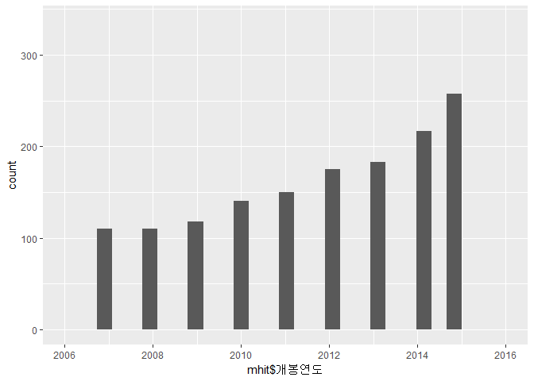

``` r
qplot(mhit$개봉월)
```

 개봉월별 흥행정도를 파악하기 전 2006년부터 2016까지의 개봉일을 연도별,월별로 파악해보았다. 연도별로 개봉한 영화 수를 파악한 것은 분석에 직접적인 영향을 미치지는 않으나, 한국영화로 한정하여 분석을 진행하고 있기에 전체적인 한국영화시장을 파악해보고자 진행하였다. (데이터를 연도를 설정해서 받았으나 결측치가 존재함을 파악할 수 있었고, 이로 인해 qplot으로 빠르게 데이터를 파악하려할 때 오류가 발생함을 확인할 수 있다. 이는 본격적인 분석에서 해결할 것이다.) 월별 개봉영화 수를 파악한 것은 흥행이 많은 영화개봉월이 단순히 개봉한 영화가 많아서일수도 있기때문에 상관관계를 추후에 알아보기 위해서이다.

``` r
mhit$개봉연도<-ifelse(mhit$개봉연도<2006|mhit$개봉연도>2016,NA,mhit$개봉연도)
mhit<-mhit %>% filter(!is.na(개봉연도))
table(is.na(mhit$개봉연도))
```

    ## 
    ## FALSE 
    ##  1905

앞서 진행한 데이터의 결측치를 제거하여 6개의 데이터가 소실되었으나 애초에 없어야 할 데이터였기에 꼭 필요한 작업이다.

``` r
mm<-ddply(mhit,'개봉월',summarise,monm=mean(전국관객수))
mm
```

    ##    개봉월      monm
    ## 1       1  882183.6
    ## 2       2  671205.3
    ## 3       3  242235.4
    ## 4       4  341230.8
    ## 5       5  398001.2
    ## 6       6  433693.7
    ## 7       7 1278830.5
    ## 8       8  683101.4
    ## 9       9  600977.9
    ## 10     10  381514.4
    ## 11     11  278174.6
    ## 12     12  677444.5

``` r
detach(package:plyr)
```

본격적으로 개봉월이 영화흥행에 미치는 영향을 파악하기 위해 각 월별 전국관객수를 평균내어 monthly\_mean의 약자인 mm에 할당하였다. 표로 구성되어 있는 자료를 보았을 때 눈에 띄는 것은 7월의 관객수이다. 그러나 한 눈에 잘 들어오지 않으므로 그래프를 통해 파악해보려 한다. 더하여 group\_by가 작동하지 않는 오류가 계속해서 발생하는 것은 plyr패키지 때문이라 하니 plyr의 사용이 끝난 직후, package의 설치를 무효화하는 작업을 거친다.

``` r
ggplot(data=mm,aes(x=개봉월, y=monm))+geom_col()
```

 연도를 구분하지 않고 개봉월만을 기준으로 파악하였을 때, 7월에 개봉한 영화의 흥행도가 유독 높고 12월과 1월이 그 다음을 차지한다는 것을 파악할 수 있다. 영화의 이러한 원인에 대해서 학생들의 방학 및 직장인의 휴가가 시작되는 7~8월 및 12월~1월에 문화생활을 즐길 여유가 생기는 것은 아닐까 추측해본다. 그러나 비율이나 평균으로부터 나오는 결과는 과장될 가능성이 존재한다. 따라서 연별로 묶어 개봉월별 영화 흥행정도를 다시금 파악해보한 한다.

``` r
fy<-mhit %>% filter(개봉연도==2006)
fy<-fy %>% group_by(개봉월) %>%  mutate(ymm=mean(전국관객수))
sy<-mhit %>% filter(개봉연도==2007)
sy<-sy %>% group_by(개봉월) %>% mutate(ymm=mean(전국관객수))
ty<-mhit %>% filter(개봉연도==2008)
ty<-ty %>% group_by(개봉월) %>% mutate(ymm=mean(전국관객수))
fry<-mhit %>% filter(개봉연도==2009)
fry<-fry %>% group_by(개봉월)%>% mutate(ymm=mean(전국관객수))
fiy<-mhit %>% filter(개봉연도==2010)
fiy<-fiy %>% group_by(개봉월) %>% mutate(ymm=mean(전국관객수))
siy<-mhit %>% filter(개봉연도==2011)
siy<-siy %>% group_by(개봉월) %>% mutate(ymm=mean(전국관객수))
sey<-mhit %>% filter(개봉연도==2012)
sey<-sey %>% group_by(개봉월) %>% mutate(ymm=mean(전국관객수))
ey<-mhit %>% filter(개봉연도==2013)
ey<-ey %>% group_by(개봉월) %>% mutate(ymm=mean(전국관객수))
ny<-mhit %>% filter(개봉연도==2014)
ny<-ny %>% group_by(개봉월) %>% mutate(ymm=mean(전국관객수))
tey<-mhit %>% filter(개봉연도==2015)
tey<-tey %>% group_by(개봉월) %>% mutate(ymm=mean(전국관객수))
ely<-mhit %>% filter(개봉연도==2016)
ely<-ely %>% group_by(개봉월) %>% mutate(ymm=mean(전국관객수))
```

각 연도별로 개봉월별로 흥행정도를 파악하여 firstyear(fy),secondyear(sy),thirdyear(ty)와 같은 방식으로 할당하였다. 그에 대한 그래프들을 그려 7월 개봉작과 12월/1월 개봉작이 흥행정도가 매년 높았는지 확인하려 한다.

``` r
ggplot(data=fy,aes(x=개봉월,y=ymm))+geom_col()
```


``` r
ggplot(data=sy,aes(x=개봉월,y=ymm))+geom_col()
```

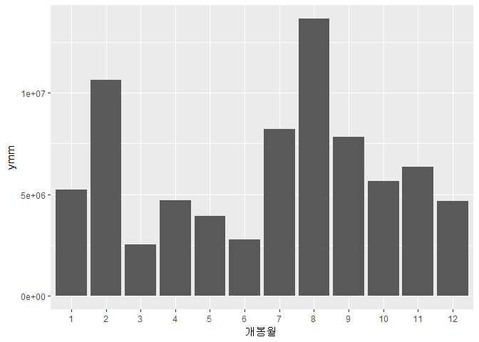

``` r
ggplot(data=ty,aes(x=개봉월,y=ymm))+geom_col()
```


``` r
ggplot(data=fry,aes(x=개봉월,y=ymm))+geom_col()
```

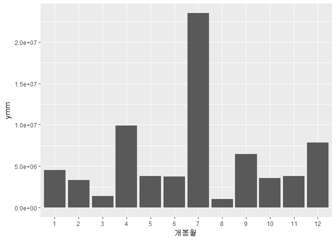

``` r
ggplot(data=fiy,aes(x=개봉월,y=ymm))+geom_col()
```

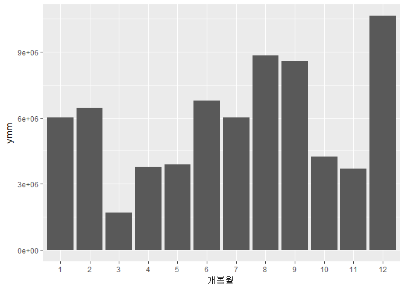

``` r
ggplot(data=sy,aes(x=개봉월,y=ymm))+geom_col()
```


``` r
ggplot(data=sey,aes(x=개봉월,y=ymm))+geom_col()
```

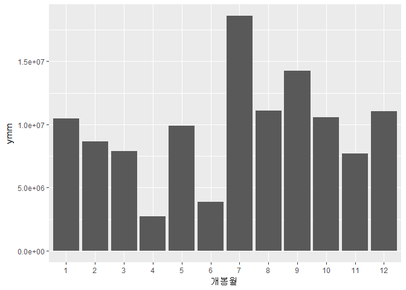

``` r
ggplot(data=ey,aes(x=개봉월,y=ymm))+geom_col()
```


``` r
ggplot(data=ny,aes(x=개봉월,y=ymm))+geom_col()
```


``` r
ggplot(data=tey,aes(x=개봉월,y=ymm))+geom_col()
```

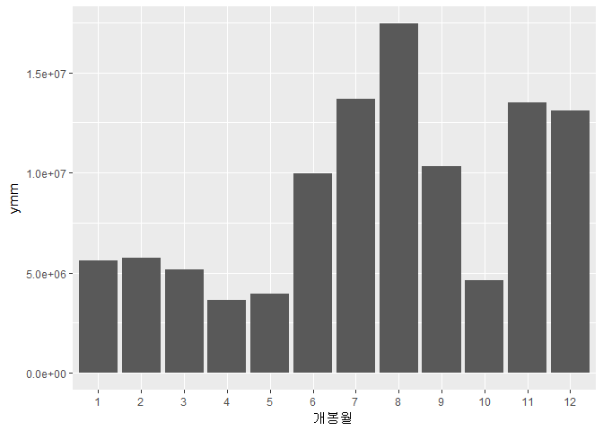

``` r
ggplot(data=ely,aes(x=개봉월,y=ymm))+geom_col()
```

 2012년, 2013년, 2015년의 경우 7월에 개봉하는 영화가 가장 흥행한다는 법칙이 적용되지 않았다. 그러나 11년간의 데이터 중 3년을 제외한 8년에 한해서는 적용되므로 전체적으로 7월에 개봉한 영화가 흥행할 확률이 약 72.7%라는 것이다. 또한 연말/연초에 대한 상대적으로 높은 흥행은 2016년을 제외하고는 대체로 높은 흥행을 보이고 있다.

위의 방식은 group\_by와 summarise 즉 dplyr 패키지가 제 역할을 하지 못했을 때 시도하였던 방법이다. 위의 방법에도 group\_by가 포함되어 있어 원하는 결과를 도출하지 못하였는데 원인을 알게 되어 조금 더 간단한 방법으로 같은 일을 수행해보려 한다.

``` r
a<-mhit %>% group_by(개봉연도, 개봉월) %>% mutate(ymm=mean(전국관객수)) %>% select(개봉연도,개봉월,ymm)
fy<-a %>% filter(개봉연도==2006) %>% group_by(개봉월) %>% summarise(ymm=mean(ymm))
sy<-a %>% filter(개봉연도==2007) %>% group_by(개봉월) %>% summarise(ymm=mean(ymm))
ty<-a %>% filter(개봉연도==2008) %>% group_by(개봉월) %>% summarise(ymm=mean(ymm))
fry<-a %>% filter(개봉연도==2009) %>% group_by(개봉월) %>% summarise(ymm=mean(ymm))
fiy<-a %>% filter(개봉연도==2010) %>% group_by(개봉월) %>% summarise(ymm=mean(ymm))
siy<-a %>% filter(개봉연도==2011) %>% group_by(개봉월) %>% summarise(ymm=mean(ymm))
sey<-a %>% filter(개봉연도==2012) %>% group_by(개봉월) %>% summarise(ymm=mean(ymm))
ey<-a %>% filter(개봉연도==2013) %>% group_by(개봉월) %>% summarise(ymm=mean(ymm))
ny<-a %>% filter(개봉연도==2014) %>% group_by(개봉월) %>% summarise(ymm=mean(ymm))
tey<-a %>% filter(개봉연도==2015) %>% group_by(개봉월) %>% summarise(ymm=mean(ymm))
ely<-a %>% filter(개봉연도==2016) %>% group_by(개봉월) %>% summarise(ymm=mean(ymm))
ggplot(data=a,aes(x=개봉월,y=ymm,fill=개봉연도))+geom_col(position="dodge")+scale_x_discrete(limits=c(1:12))
```


그래프를 좀 더 활용한다면, 다음과 같이 더욱 간단하게 표현 가능하다.

``` r
ggplot(data=a,aes(x=개봉월,y=ymm,fill=개봉연도))+geom_col(position="dodge")+scale_x_discrete(limits=c(1:12))
```


``` r
ggplot(data=a,aes(x=개봉연도,y=ymm,fill=개봉월))+geom_col()+scale_x_discrete(limits=c(2006:2016))
```

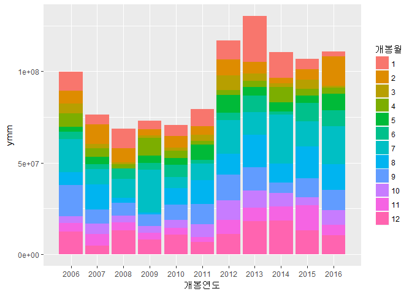

``` r
ggplot(data=a,aes(x=개봉연도,y=ymm,fill=개봉월))+geom_col(position = "dodge")+scale_x_discrete(limits=c(2006:2016))
```

 개봉연도별로 언제 개봉한 영화가 가장 흥행하였는지에 대해 색깔로 구분이 되었다. 그러나 x축의 범위가 넓어 비교하기 힘드니 x축의 범위 및 y축의 범위를 좀 더 나눠서 살펴볼 수도 있다.

``` r
ggplot(data=a,aes(x=개봉연도,y=ymm,fill=개봉월))+geom_col(position = "dodge")+scale_x_discrete(limits=c(2006:2010))+xlim(2006,2010)
```

    ## Scale for 'x' is already present. Adding another scale for 'x', which
    ## will replace the existing scale.


``` r
ggplot(data=a,aes(x=개봉연도,y=ymm,fill=개봉월))+geom_col(position = "dodge")+scale_x_discrete(limits=c(2011:2016))+xlim(2011,2016)+ylim(0,2300000)
```

    ## Scale for 'x' is already present. Adding another scale for 'x', which
    ## will replace the existing scale.

 결과적으로, 7월에 개봉하는 영화가 흥행할 가능성이 가장 높고 연말/연초 개봉되는 영화가 버금간다는 것을 파악할 수 있다.

##### 1-2. 개봉월별 흥행하는 영화의 장르

``` r
jfy<-mhit %>% filter(개봉월==1)
jsy<-mhit %>% filter(개봉월==2)
jty<-mhit %>% filter(개봉월==3)
jfry<-mhit %>% filter(개봉월==4)
jfiy<-mhit %>% filter(개봉월==5)
jsiy<-mhit %>% filter(개봉월==6)
jsey<-mhit %>% filter(개봉월==7)
jey<-mhit %>% filter(개봉월==8)
jny<-mhit %>% filter(개봉월==9)
jtey<-mhit %>% filter(개봉월==10)
jely<-mhit %>% filter(개봉월==11)
jtwy<-mhit %>% filter(개봉월==12) 
ggplot(data=jfy,aes(x=장르,y=mean(전국관객수)))+geom_col()
```

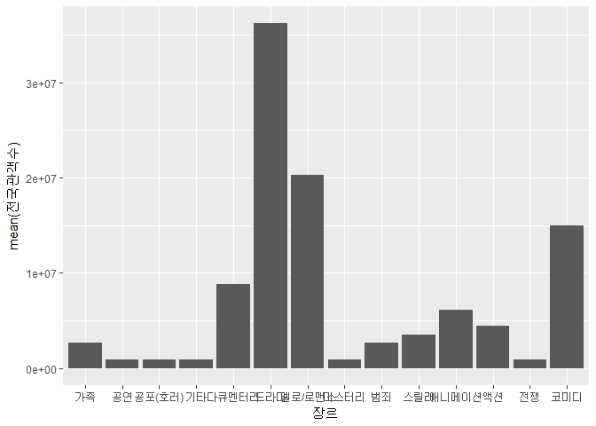

``` r
ggplot(data=jsy,aes(x=장르,y=mean(전국관객수)))+geom_col()
```


``` r
ggplot(data=jty,aes(x=장르,y=mean(전국관객수)))+geom_col()
```

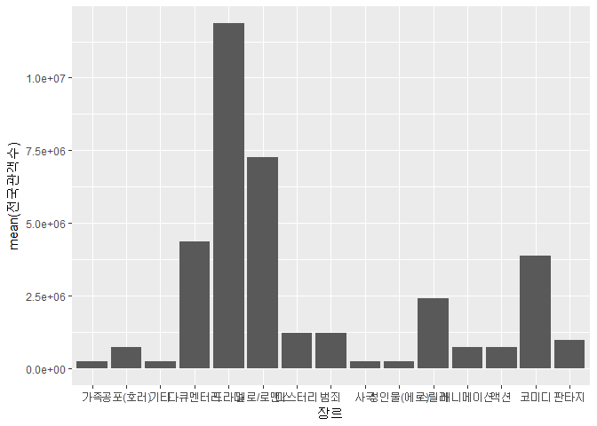

``` r
ggplot(data=jfry,aes(x=장르,y=mean(전국관객수)))+geom_col()
```


``` r
ggplot(data=jfiy,aes(x=장르,y=mean(전국관객수)))+geom_col()
```

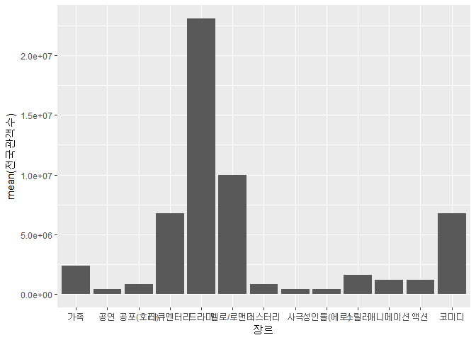

``` r
ggplot(data=jsiy,aes(x=장르,y=mean(전국관객수)))+geom_col()
```


``` r
ggplot(data=jsey,aes(x=장르,y=mean(전국관객수)))+geom_col()
```


``` r
ggplot(data=jey,aes(x=장르,y=mean(전국관객수)))+geom_col()
```

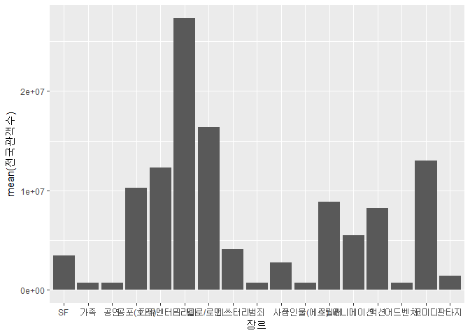

``` r
ggplot(data=jny,aes(x=장르,y=mean(전국관객수)))+geom_col()
```

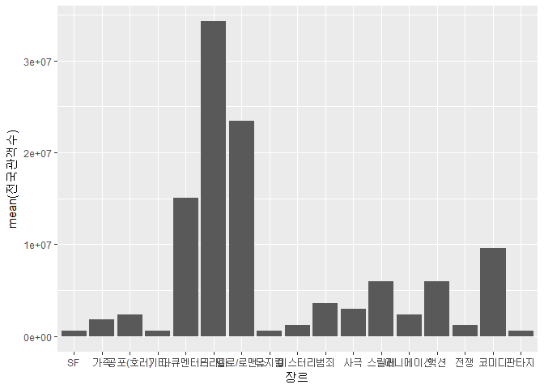

``` r
ggplot(data=jtey,aes(x=장르,y=mean(전국관객수)))+geom_col()
```


``` r
ggplot(data=jely,aes(x=장르,y=mean(전국관객수)))+geom_col()
```

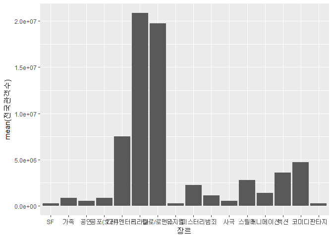

``` r
ggplot(data=jtwy,aes(x=장르,y=mean(전국관객수)))+geom_col()
```

 개봉월별로 어떠한 장르의 영화가 흥행하는지 알아보기 위해 우선 개봉월/장르별로 묶어 전국관객수의 평균을 구하였다. 이 중 가장 큰 흥행을 이룬 영화의 장르를 알아보았다.

이 또한 dplyr 함수의 활용을 통해 간단하게 표현이 가능하다.

``` r
t<-mhit %>% group_by(개봉월, 장르) %>% summarise(t=mean(전국관객수))
ggplot(data=t,aes(x=장르,y=t,fill=개봉월))+geom_col(position = "dodge")
```

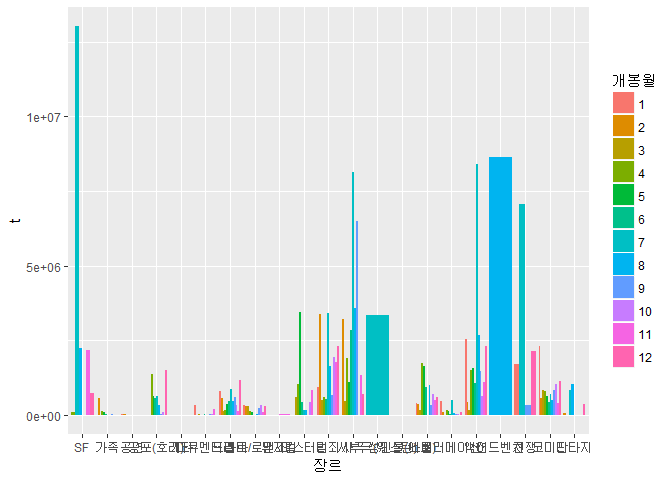

여름인 7~8월에 공포영화의 흥행도가 높다거나, 연말연시에 가족과 관련된 영화의 흥행도가 높으리라 예상하였으나 크게 빗나간 것을 확인할 수 있다. 더하여 11년간의 데이터를 묶어서 분석하여 상관관계조차 찾기 힘들다.따라서 연도별로 나눠 월별 흥행 장르를 알아본 후 관계에 대해 분석하는 것이 필요해보인다. 이러한 원인은 영화 장르를 세분화하지 않고 한 영화가 2가지 이상의 장르 성격을 지닐 수 있는데 이를 하나로만 파악한 것이라 생각된다.

#### 2. 연령제한등급과 흥행의 상관관계

``` r
ggplot(data=mhit,aes(x=등급,y=mean(전국관객수)))+geom_col()
```

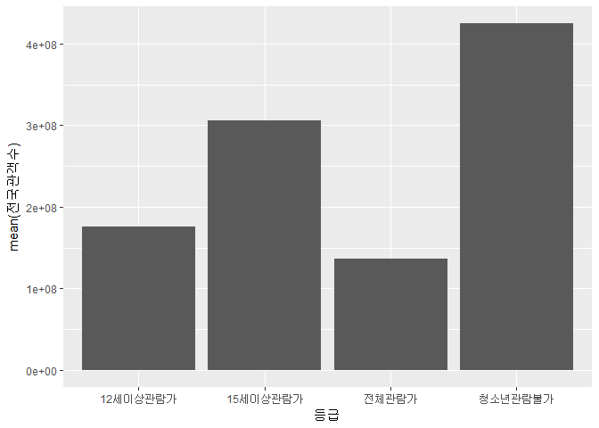

``` r
ggplot(data=mhit,aes(x=등급, y=전국관객수))+geom_point()
```

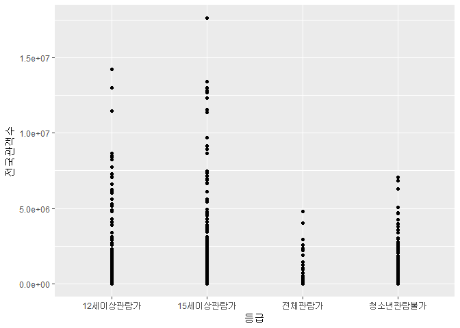 등급별 흥행정도에 대해 비교했으나 이는 개봉되는 영화 자체의 수를 고려하지 않았으므로, 흥행정도인 전국관객수를 개봉된 영화 수에 비례하도록 설정한 후 다시금 비교해보고자 한다.

``` r
str(mhit)
```

    ## Classes 'tbl_df', 'tbl' and 'data.frame':    1905 obs. of  20 variables:
    ##  $ 순번        : num  1 2 3 4 5 6 7 8 9 11 ...
    ##  $ 영화명      : chr  "명량" "국제시장" "베테랑" "괴물" ...
    ##  $ 감독        : chr  "김한민" "윤제균" "류승완" "봉준호" ...
    ##  $ 제작사      : chr  "(주)빅스톤픽쳐스" "(주)제이케이필름,씨제이이앤엠(주)" "(주)외유내강" "영화사청어람(주)" ...
    ##  $ 수입사      : chr  NA NA NA NA ...
    ##  $ 배급사      : chr  "씨제이이앤엠(주)" "씨제이이앤엠(주)" "씨제이이앤엠(주)" "(주)쇼박스" ...
    ##  $ 개봉일      : chr  "2014-07-30" "2014-12-17" "2015-08-05" "2006-07-27" ...
    ##  $ 영화유형    : chr  "개봉영화" "개봉영화" "개봉영화" "개봉영화" ...
    ##  $ 영화형태    : chr  "장편" "장편" "장편" "장편" ...
    ##  $ 국적        : chr  "한국" "한국" "한국" "한국" ...
    ##  $ 전국스크린수: num  1587 966 1064 0 1072 ...
    ##  $ 전국매출액  : chr  "135748398910" "110828014630" "105024756250" "0" ...
    ##  $ 전국관객수  : num  17613682 14245998 13395400 13019740 12983330 ...
    ##  $ 서울매출액  : chr  "33121225810" "25842519330" "26766369950" "0" ...
    ##  $ 서울관객수  : num  4163666 3233946 3290366 3571254 3468906 ...
    ##  $ 장르        : chr  "사극" "드라마" "액션" "SF" ...
    ##  $ 등급        : chr  "15세이상관람가" "12세이상관람가" "15세이상관람가" "12세이상관람가" ...
    ##  $ 영화구분    : chr  "상업영화" "상업영화" "상업영화" "상업영화" ...
    ##  $ 개봉월      : Ord.factor w/ 12 levels "1"<"2"<"3"<"4"<..: 7 12 8 7 7 1 7 9 7 7 ...
    ##  $ 개봉연도    : num  2014 2014 2015 2006 2012 ...

``` r
table(mhit$등급)
```

    ## 
    ## 12세이상관람가 15세이상관람가     전체관람가 청소년관람불가 
    ##            321            558            250            776

``` r
tw<-mhit %>% filter(등급=="12세이상관람가")
ft<-mhit %>% filter(등급=="15세이상관람가")
ay<-mhit %>% filter(등급=="전체관람가")
nc<-mhit %>% filter(등급=="청소년관람불가")
mean(tw$전국관객수)
```

    ## [1] 878231.6

``` r
mean(ft$전국관객수)
```

    ## [1] 958324.3

``` r
mean(ay$전국관객수)
```

    ## [1] 164159.9

``` r
mean(nc$전국관객수)
```

    ## [1] 238205

``` r
bnm<-data.frame(영화수대비흥행도=c(878231.6/321,958324.3/558,164159.9/250,238205/776),등급=c("12세이상관람가","15세이상관람가","전체관람가","청소년관람불가"))
bnm    
```

    ##   영화수대비흥행도           등급
    ## 1        2735.9240 12세이상관람가
    ## 2        1717.4271 15세이상관람가
    ## 3         656.6396     전체관람가
    ## 4         306.9652 청소년관람불가

``` r
ggplot(data=bnm,aes(x=등급,y=영화수대비흥행도))+geom_col()
```

 개봉한 영화의 수를 고려하지 않았을 때는 청소년관람불가 영화가 가장 흥행을 하는 것으로 보였으나, 실제 개봉한 영화 수와 대비하여 보았을 때는 12세이상관람가&gt;15세이상관람가&gt;전체관람가&gt;청소년관람불가 순으로 흥행하는 것을 파악할 수 있다. 우선 12세 이상과 15세 이상의 경우 청소년관람불가 영화보다 관람 접근에 용이하기 때문에 발생한 결과라고 볼 수 있다. 물론, 전체관람가의 경우 더욱 접근이 용이하지만 실제 전체관람가의 영화가 많은 애니메이션과 같은 것은 영유아들의 수요가 가장 높을텐데 그들은 실질적으로 구매력을 지니고 있지 않아 12/15세이상 관람가보다 흥행이 적다고 볼 수 있다.

5. 논의
-------

### 1. 한계점, 비판점

#### 1-1. 개봉시기와 흥행의 상관관계

-   7월과 연말/연초에 개봉한 영화가 영화흥행의 정도가 높다는 것은 데이터상으로 보여지므로 관계가 있다고는 말할 수 있다. 그러나 그 원인 분석에 있어 논리적이라기보다는 보편적으로 적용될 수 있는 것들을 자의적으로 해석하였다. 'KOFIC 영화관 입장권 통합전산망'의 상영점유율을 통해 통상적인 영화 개봉기간 및 흥행영화의 영화개봉기간을 파악하여 방학이나 연휴기간과 겹친다는 것 보여주었으면 하는 아쉬움이 남는다.
-   평균을 통한 막대그래프가 아닌 박스그래프를 사용하였다면 전반적인 흥행정도를 조금 더 눈에 들어오기 쉽게 파악할 수 있었을 것이라는 아쉬움이 있다.

#### 1-2. 개봉월별 흥행하는 영화의 장르

-   영화의 장르라는 것이 딱 하나로 정해질 수 없는 것이다. 장르에 따라 유행하는 것을 분석한 것은 장르의 연속성을 고려하지 못한 것이다.
-   영화 흥행을 위해서 유의미한 결과를 도출하고자 하였는데 영화의 장르를 분석하는 것은 조금 생뚱맞은 것 같다. 영화의 내용 및 구성을 정한 후에 흥행을 고민하는 것이기 때문이다. 실제 장르와 흥행의 유의미한 상관관계를 도출하지는 못하였으나 어떠한 관계가 있더라도 이렇게 보여진다로 그칠 문제이지 이를 흥행요소로 파악하는 것은 무리가 있어 보인다.

#### 2. 연령제한등급과 흥행의 상관관계

-   연령제한은 영화를 만드는 입장에서 정할 수 있는 것이 아니고, 연령제한과 흥행의 관계를 파악할 수는 있으나 실질적으로 영화에 어떠한 내용을 어떻게 담을 것인가가 더 중요한 문제이기 때문에 적절한 분석은 아니라고 본다.

### 2. 추후 분석방향

-   영화의 개봉시기와 영화 흥행에 어느정도의 관계가 있는 것으로 파악하였으나 이에 대한 원인은 자의적인 추론에 불과하였다. 관객들의 문화수요에 대해 설문조사 등을 통하여 실제 어떠한 시기에 영화에 대한 수요가 증가하는 지를 파악할 수 있다면 좀 더 논리적이고 유의미한 분석이 될 것이다.
