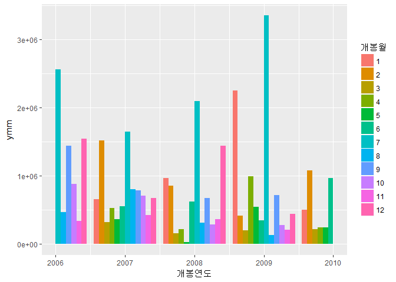
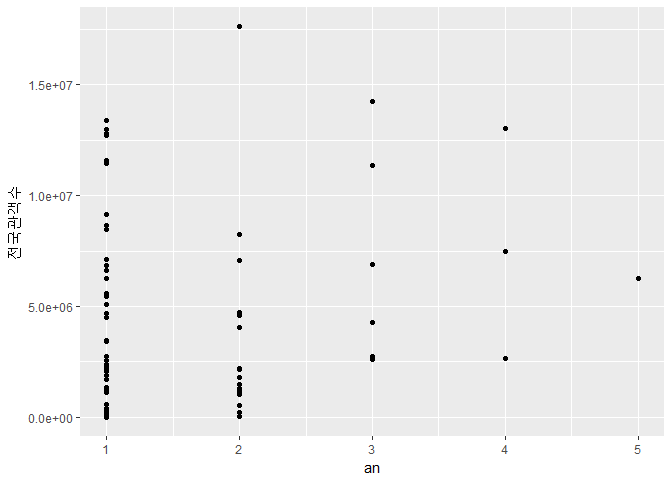
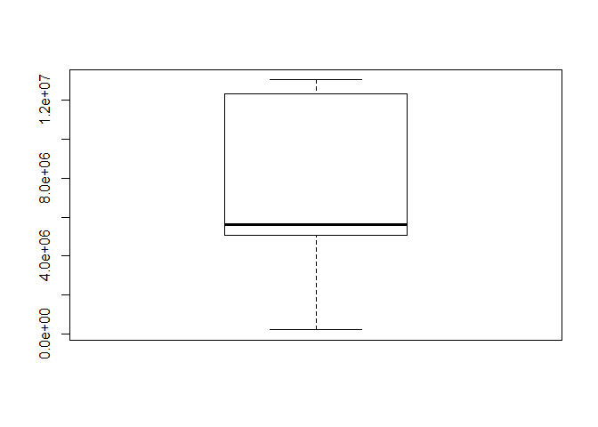
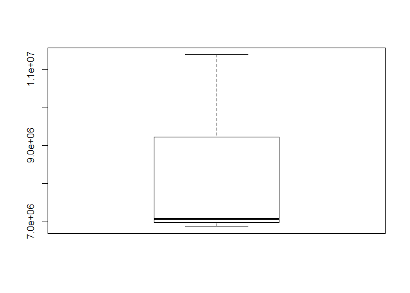

데이터사이언스개론 1조
================

1. 요약(초록)
-------------

영화흥행에 영향을 미치는 요소는 무엇일까? 라는 의문에서 시작된 분석으로 영화진흥원에서 다운받은 데이터 파일을 바탕으로 분석을 진행하였다. 데이터의 양이 많을수록 상관관계의 파악에는 긍정적인 영향을 미치지만 실제 데이터베이스화를 하기 시작한 시점 및 조원들의 연령대에 비례하여 분석 후 영화들의 특성을 체감할 수 있도록 2006년부터 2016년까지로 기간을 설정했다. 영화 흥행에 영향을 미치는 요소를 크게 4가지로 파악하고 그에 대한 분석을 팀원 간의 협력을 통해 이끌어 냈다. 영화 배급사가 흥행에 미치는 영향을 단순하게 영화 배급사의 독점률로 파악해본 후 객관적자 자료를 통해 배급사의 규모를 측정해보니 규모가 큰 배급사일수록 영화흥행의 가능성이 높음을 파악할 수 있었다. 다음은 개봉시기와 영화 흥행의 관계이다. 11년간의 데이터 결과 7월에 개봉한 영화 및 연말/연초에 개봉한 영화의 흥행 가능성이 더 높음을 파악할 수 있었다. 국내 이슈와 흥행하는 영화 장르 간의 관계에 대해서도 분석하였다. 사회의 분위기란 너무나도 다양하고 사건들은 각각 독립적이기에 상관관계를 도출해내지는 못하였으나 국내 핵심 이슈들로 영화의 흥행을 설명할 수 있다는 사실을 파악할 수 있었다. 마지막으로는 영화제 수상과 영화흥행의 관계를 분석하였다. 영화제 수상 횟수가 4번 이하일 때까지는 영화흥행과 뚜렷한 상관관계를 보이지 않지만, 수상횟수가 5번 이상일 때부터는 영화흥행과 양의 상관관계를 띔을 확인할 수 있다. 이는 영화 관객의 다양성 때문이라고 추정할 수 있다. 다양한 분야의 영화를, 서로 각자 다양한 시선에서 보기 때문에 어느 시점까지는 수상횟수와 유의미한 관계를 보이지 않지만 어느 한계점 이상의 흥행을 한 영화에 대해서는 수상횟수와 유의미한 관계를 보인다는 것이다. 결론적으로, 영화 흥행을 위해서는 배급사의 규모가 커야하며 개봉시기의 적절한 선택(데이터가 말해주는 흥행 가능성 및 국내외 이슈들을 고려한 개봉시기)이 필요하다는 결과를 도출할 수 있다. 이러한 영화 흥행은 영화제 수상과도 관계를 맺고 있다는 것 또한 볼 수 있었다. 이러한 분석을 필두로 저예산영화나 독립영화들이 취할 수 있는 전략을 고려해볼 수 있다. 배급사의 규모가 크면 클수록 좋지만 실질적으로 예산의 장벽에 부딪혀 실현할 수는 없을 것이다. 그렇다면 영화의 개봉일 선정을 통해 영화 흥행을 이끌 수 있을 것이다. 물론 영화의 가치가 흥행정도에 있는 것은 분명 아니지만, 특히 상업영화가 아닌 경우 논외의 분석일 수도 있으나 경제적인 측면을 배제하고는 무엇도 이끌어내기 힘들다는 것을 상기해야 할 것이다.

2. 분석 주제 : 영화 흥행에 영향을 미치는 요소
---------------------------------------------

### 1.문제의식

영화가 개봉되면 흥행여부에 대해서 논하는 자료를 쉽게 접할 수 있다. 보통 그 기준은 예매율이라든가, 관객수이다. 소위 말하는 대박이 난 영화들은 천만관객을 넘기는 걸 말하고 500만이나 100만을 돌파하여도 기사가 나곤 한다. 소위 스크린 쿼터제로 불리우는 '자국영화 의무상영제도'를 축소하면 한국영화 산업이 망하지 않을까 걱정하던 예전과 다르게 한국영화는 한국영화시장의 절반 이상의 점유율을 보이고 있다. 최근에는 스크린쿼터제가 아닌 스크린 독과점에 대한 문제가 제기되고 있는 것이 현실이다. 국내 대기업에서 지원한 영화의 배급을 밀어주어 다양한 영화의 컨텐츠를 누릴 수 없다는 것이다. 한국영화의 성장세는 긍정적인 신호지만 큰 규모의 배급사의 영향으로 빛을 발하지 못하는 영화가 많다는 어두운 측면을 간과할 수 없을 것이다. 외국에수 수입해오는 영화가 될 수도 있고 저예산영화나 독립영화도 그 예가 될 수 있을 것이다.

### 2. 알아보고자 하는 것

배급사의 규모가 커야 영화의 흥행을 바랄 수 있는 대한민국 영화문화의 현실에서 영화가 흥행하기 위해서는 어떠한 요소들이 고려되야 하는지 분석함을 통해 독립영화나 저예산영화등의 활성화를 꾀할 방법을 찾아보고자 한다.

3. 데이터 선정 : 영화진흥위원회의 DB자료
----------------------------------------

### 1.데이터 선정 이유

영화에 대한 데이터가 다른 통계자료에 비해 잘 정제되어 있는 편이며 분석주제와 일맥상통하는 부분이 있었다. 우선, 영화의 흥행이라는 큰 틀을 다루기 때문에 영화의 흥행정도를 파악할 수 있는 자료들을 수집해야 했다. 영화의 흥행정도를 전국관객수로 파악하기로 하고 관련된 데이터들을 수집하였다. 영화와 관련된 데이터의 분석을 위해 영화의 기본적인 정보(개봉일, 배급사,장르 등)들에 대해서 알 수 있는 자료가 필요하였고 영화제 수상과 관련한 자료 또한 필요했다. 이를 바탕으로 영화진흥위원회의 DB의 자료를 선정하였다. 더하여, 방대한 양의 자료를 버리고 2006년부터 2016년이라 제한된 기간을 설정한 것은 분석결과들을 체감할 있도록 조원들의 연령대를 고려한 것이다.

### 2.데이터 소개(출처, 특성, 구성)

-   영화 관련 자료 출처 : 영화진흥위원회 DB검색 특성 : 2006년부터 2016년까지의 데이터 구성 : 개봉영화 흥행순위정보, 영화상영관정보조회, 지역별 영화상영관현황, 부산국제영화제, 청룡영화제
-   배급사 관련 자료 크레딧잡, 사람인 채용사이트, 오픈고(opengo)를 이용한 배급사의 규모 정보 수집

4. 분석
-------

### 1-1. 배급사와 영화흥행의 상관관계

#### 배급사별 영화 점유 정도

``` r
library(dplyr)
```

    ## 
    ## Attaching package: 'dplyr'

    ## The following objects are masked from 'package:stats':
    ## 
    ##     filter, lag

    ## The following objects are masked from 'package:base':
    ## 
    ##     intersect, setdiff, setequal, union

``` r
load("moviehit.rda")
mhit %>% 
  group_by(배급사) %>% 
  summarise(nn=n()) %>% 
  arrange(desc(nn)) %>% 
  head(10)
```

    ## # A tibble: 10 x 2
    ##                             배급사    nn
    ##                              <chr> <int>
    ##  1      롯데쇼핑㈜롯데엔터테인먼트   128
    ##  2              씨제이엔터테인먼트   111
    ##  3                      (주)쇼박스   108
    ##  4                  (주)케이알씨지   102
    ##  5                씨제이이앤엠(주)   101
    ##  6                    ㈜인디스토리    75
    ##  7 (주)넥스트엔터테인먼트월드(NEW)    64
    ##  8            (주)씨타마운틴픽쳐스    62
    ##  9            골든타이드픽처스(주)    44
    ## 10                (주)시네마서비스    34

먼저 2006년부터 2016년까지 개봉된 영화들 중 어느 회사가 가장 많이 영화 배급을 맡았는지 살펴보았다. 2위, 3위를 차지 하고 있는 씨제이이엔엠과 씨제이엔터테인먼트를 같은 씨제이로 묶으면 366편으로,씨제이가 배급한 영화가 가장 많은 것을 알 수 있다. 다음으로 2위는 롯데엔터테인먼먼트로 255편, 유니버셜픽쳐스코리아가 3위로 150편, 쇼박스가 143편으로 5위를 차지하고 있음을 알 수 있습니다.

#### 배급사별 관객 수 정도 비교

``` r
mhit %>% 
  select(영화명, 배급사, 전국관객수) %>%
  group_by(배급사) %>% 
  summarise(aud=sum(전국관객수)) %>% 
  arrange(desc(aud)) %>% 
  head(10)
```

    ## # A tibble: 10 x 2
    ##                             배급사       aud
    ##                              <chr>     <dbl>
    ##  1                      (주)쇼박스 243367634
    ##  2                씨제이이앤엠(주) 224977394
    ##  3              씨제이엔터테인먼트 146672928
    ##  4      롯데쇼핑㈜롯데엔터테인먼트 134902840
    ##  5 (주)넥스트엔터테인먼트월드(NEW) 122593574
    ##  6                (주)시네마서비스  33067487
    ##  7                    (주)싸이더스  11330026
    ##  8          이십세기폭스코리아(주)  10535167
    ##  9         워너브러더스 코리아(주)   7487545
    ## 10            메가박스(주)플러스엠   7022179

다음으로 2006년부터 2016년까지 개봉된 영화 중에 배급사별 총 관객 수를 알아보았다. 1위는 CJ E&M으로, 2억 9천만 관객, 2위는 쇼박스로 2억 5천만, 3위는 CJ Ent로 2억 1천만, 4위는 롯데엔터테인먼트로 2억 1백만, 5위는 넥스트(NEW)로 1억 4천만을 차지하고 있음을 알 수 있다. 관객 수는 영화 흥행도의 중요한 지표로 작용하는데 한국 영화의 관객 수가 한국 4대 배급사인 대기업들이 이를 차지 하고 있음을 알 수 있다.

#### 역대 천만 관객 돌파한 영화들의 배급사

``` r
mhit %>% 
  filter(전국관객수 >= 10000000) %>% 
  select(영화명, 배급사)
```

    ## # A tibble: 12 x 2
    ##                영화명                          배급사
    ##                 <chr>                           <chr>
    ##  1               명량                씨제이이앤엠(주)
    ##  2           국제시장                씨제이이앤엠(주)
    ##  3             베테랑                씨제이이앤엠(주)
    ##  4               괴물                      (주)쇼박스
    ##  5             도둑들                      (주)쇼박스
    ##  6       7번방의 선물 (주)넥스트엔터테인먼트월드(NEW)
    ##  7               암살                      (주)쇼박스
    ##  8 광해, 왕이 된 남자                씨제이이앤엠(주)
    ##  9             부산행 (주)넥스트엔터테인먼트월드(NEW)
    ## 10          왕의 남자                (주)시네마서비스
    ## 11             해운대              씨제이엔터테인먼트
    ## 12             변호인 (주)넥스트엔터테인먼트월드(NEW)

마지막으로 천만 관객을 돌파한 영화들의 배급사에 대해 알아보았다. 이 결과치를 통해서도 특정 배급사들의 독과점을 엿볼 수 있었다. 한국에서 2006년부터 2016년까지 개봉된 영화 중 천만 관객을 넘은 영화는 총 12편으로, 왕의 남자를 제외하고는 모두 앞서 언급한 4대 배급사의 영화들이었다. 왕의 남자를 배급한 회사는 시네마 서비스인데 시네마 서비스의 경우 왕의 남자가 개봉된 2005년 당시 흥행하던 배급사이며 이후에 지속적으로 흥행에 실패하며 뒤처진 회사이다. 일반적으로 한국에서 '천만 관객'을 돌파하면 흥행작이라고 평가하기 때문에 천만 관객 이상의 작품들만으로 분류하여 보았는데, 흥행작들의 배급사들도 예외없이 모두 규모가 큰 회사들이었다.

-   규모가 큰 특정 배급사들이 한국 영화의 대부분 배급을 도맡고 있고, 규모가 큰 배급사가 배급한 영화일 수록 흥행한다는 결론이 도출된다.

### 1-2. 배급사의 규모

06년도에서 16년도까지 영화 배급사의 비중을 측정하기 위해 어떤 배급사가 얼마나 많이 영화를 배급하였는지 살펴본다.

``` r
library(dplyr)
load("moviehit.rda")
```

``` r
#상위 10개
mhit2 <- mhit %>% 
  group_by(mhit$배급사) %>%
  summarise(count = n()) %>%
  arrange(desc(count)) %>%
  head(10)

mhit2
```

    ## # A tibble: 10 x 2
    ##                      `mhit$배급사` count
    ##                              <chr> <int>
    ##  1      롯데쇼핑㈜롯데엔터테인먼트   128
    ##  2              씨제이엔터테인먼트   111
    ##  3                      (주)쇼박스   108
    ##  4                  (주)케이알씨지   102
    ##  5                씨제이이앤엠(주)   101
    ##  6                    ㈜인디스토리    75
    ##  7 (주)넥스트엔터테인먼트월드(NEW)    64
    ##  8            (주)씨타마운틴픽쳐스    62
    ##  9            골든타이드픽처스(주)    44
    ## 10                (주)시네마서비스    34

``` r
#하위 10개
mhit3 <- mhit %>%
  group_by(mhit$배급사) %>%
  summarise(count = n()) %>%
  arrange(count) %>%
  head(10)

mhit3
```

    ## # A tibble: 10 x 2
    ##                                               `mhit$배급사` count
    ##                                                       <chr> <int>
    ##  1                             (사)필레마,필름포럼,홀리가든     1
    ##  2                                             (유)쏘아필름     1
    ##  3                                 (유)씨에이치엔터테인먼트     1
    ##  4                                        (유)영화사 화수분     1
    ##  5                              (재)CBS,(주)영화사 안다미로     1
    ##  6                                      (주) 루스이소니도스     1
    ##  7                                    (주)H.F.G엔터테인먼트     1
    ##  8                                               (주)KW비젼     1
    ##  9                                         (주)갑종무비필름     1
    ## 10 (주)넥스트엔터테인먼트월드(NEW),(주)에스비에스콘텐츠허브     1

해당 배급사에 대한 정보를 수집한다. 다만, 10위까지의 배급사 중 정보가 없는 배급사가 각각 2개가 있어 12위까지 살펴보게 되었다.

``` r
mhit2 <- mhit %>% 
  group_by(mhit$배급사) %>%
  summarise(count = n()) %>%
  arrange(desc(count)) %>%
  head(12)

mhit3 <- mhit %>%
  group_by(mhit$배급사) %>%
  summarise(count = n()) %>%
  arrange(count) %>%
  head(12)

load("top.rda")
load("topl.rda")
top_10
```

    ## # A tibble: 12 x 5
    ##                      배급사명       연매출 평균연봉 직원수  업력
    ##                         <chr>        <dbl>    <dbl>  <dbl> <dbl>
    ##  1 롯데쇼핑㈜롯데엔터테인먼트           NA 21120000   4089    18
    ##  2                     CJ E&M 1.290532e+12 51650000   1832     7
    ##  3                   ㈜쇼박스 1.259000e+11 48120000     56    18
    ##  4               ㈜케이알씨지           NA 45430000      8     7
    ##  5                     CJ E&M           NA       NA     NA    NA
    ##  6                 인디스토리           NA 22370000      5    14
    ##  7     넥스트엔터테인먼트월드 1.039000e+11 38670000     68     9
    ##  8          씨타마운틴 픽쳐스           NA       NA     NA    NA
    ##  9          골든타이드 픽쳐스           NA 51430000      5     5
    ## 10               시네마서비스 1.000000e+09 52280000      4    13
    ## 11                영화사 진진           NA 36190000      8    11
    ## 12              소나무 픽쳐스           NA 33920000      6     6

``` r
top_10_l
```

    ## # A tibble: 12 x 5
    ##                                       배급사명  X__1  X__2 사원수  업력
    ##                                          <chr> <lgl> <lgl>  <dbl> <dbl>
    ##  1                                    필름포럼    NA    NA     NA     3
    ##  2                                    쏘아필름    NA    NA     NA     2
    ##  3                        씨에이치엔터테인먼트    NA    NA     NA     3
    ##  4                               영화사 화수분    NA    NA     NA     4
    ##  5                                    안다미로    NA    NA     NA     2
    ##  6                              루스이소니도스    NA    NA     NA     9
    ##  7                             HFG엔터테인먼트    NA    NA     NA    NA
    ##  8                                      KW비전    NA    NA     NA    NA
    ##  9                                갑종무비필름    NA    NA     NA     8
    ## 10 넥스트엔터테인먼트월드,에스비에스콘텐츠허브    NA    NA     NA     8
    ## 11                                  노리픽쳐스    NA    NA     NA    12
    ## 12          대명문화공장, 나이너스엔터테인먼트    NA    NA     12    NA

결측치를 제거한 후, 상위 10위까지의 업력을 조사한다.

``` r
is.na(top_10)
```

    ##       배급사명 연매출 평균연봉 직원수  업력
    ##  [1,]    FALSE   TRUE    FALSE  FALSE FALSE
    ##  [2,]    FALSE  FALSE    FALSE  FALSE FALSE
    ##  [3,]    FALSE  FALSE    FALSE  FALSE FALSE
    ##  [4,]    FALSE   TRUE    FALSE  FALSE FALSE
    ##  [5,]    FALSE   TRUE     TRUE   TRUE  TRUE
    ##  [6,]    FALSE   TRUE    FALSE  FALSE FALSE
    ##  [7,]    FALSE  FALSE    FALSE  FALSE FALSE
    ##  [8,]    FALSE   TRUE     TRUE   TRUE  TRUE
    ##  [9,]    FALSE   TRUE    FALSE  FALSE FALSE
    ## [10,]    FALSE  FALSE    FALSE  FALSE FALSE
    ## [11,]    FALSE   TRUE    FALSE  FALSE FALSE
    ## [12,]    FALSE   TRUE    FALSE  FALSE FALSE

``` r
mean(top_10$업력, na.rm = T)
```

    ## [1] 10.8

하위 10위의 평균 업력을 조사한다.

``` r
mean(top_10_l$업력, na.rm = T)
```

    ## [1] 5.666667

상위 10위와 하위 10위의 업력을 비교한다.

``` r
a <- data.frame(mean(top_10$업력, na.rm = T),
                mean(top_10_l$업력, na.rm = T))
a
```

    ##   mean.top_10.업력..na.rm...T. mean.top_10_l.업력..na.rm...T.
    ## 1                         10.8                       5.666667

즉, 영화를 더 많이 배급한 배급사일 수록 업력이 높다.

또한 상위 10위의 평균연봉과 2016년 대졸 전체평균초봉(3228만원)을 비교하였다.

``` r
b <- mean(top_10$연매출, na.rm = T)
c <- ifelse(b>32280000, "good", "bad")
c
```

    ## [1] "good"

즉, 상위 10위 기업들은 평균연봉이 전체평균보다 높다는 것을 알 수 있다.

다음은 흥행영화와 배급사의 관계이다. 우선 전국매출액이 높은 영화 10개를 나열한다.

``` r
mhit$전국매출액 <- ifelse(mhit$전국매출액 == 0, NA, mhit$전국매출액)
table(is.na(mhit$전국매출액))
```

    ## 
    ## FALSE  TRUE 
    ##  1687   225

``` r
d <- mhit %>% 
  filter(!is.na(mhit$전국매출액)) %>%
  head(10)
d
```

    ## # A tibble: 10 x 18
    ##     순번             영화명   감독                                제작사
    ##    <dbl>              <chr>  <chr>                                 <chr>
    ##  1     1               명량 김한민                      (주)빅스톤픽쳐스
    ##  2     2           국제시장 윤제균     (주)제이케이필름,씨제이이앤엠(주)
    ##  3     3             베테랑 류승완                          (주)외유내강
    ##  4     5             도둑들 최동훈                        (주)케이퍼필름
    ##  5     6       7번방의 선물 이환경     (주)화인웍스,(주)씨엘엔터테인먼트
    ##  6     7               암살 최동훈                        (주)케이퍼필름
    ##  7     8 광해, 왕이 된 남자 추창민 리얼라이즈픽쳐스(주),씨제이이앤엠(주)
    ##  8     9             부산행 연상호                    (주)영화사레드피터
    ##  9    11             해운대 윤제균                      (주)제이케이필름
    ## 10    12             변호인 양우석                        위더스필름(주)
    ## # ... with 14 more variables: 수입사 <chr>, 배급사 <chr>, 개봉일 <chr>,
    ## #   영화유형 <chr>, 영화형태 <chr>, 국적 <chr>, 전국스크린수 <dbl>,
    ## #   전국매출액 <chr>, 전국관객수 <dbl>, 서울매출액 <chr>,
    ## #   서울관객수 <dbl>, 장르 <chr>, 등급 <chr>, 영화구분 <chr>

배급사의 수를 세어 많은 순으로 나열한다.

``` r
d %>%
  group_by(d$배급사) %>%
  summarise(count = n()) %>%
  arrange(desc(count))
```

    ## # A tibble: 4 x 2
    ##                        `d$배급사` count
    ##                             <chr> <int>
    ## 1                씨제이이앤엠(주)     4
    ## 2 (주)넥스트엔터테인먼트월드(NEW)     3
    ## 3                      (주)쇼박스     2
    ## 4              씨제이엔터테인먼트     1

씨제이엔터테인먼트는 씨에이이앤엠(이하 CJ E&M)으로 합병되었다. 따라서 매출액 상위 10위 중 가장 많은 비중을 차지하는 배급사는 CJ E&M이다.

스크린 수 또한 비교해보았다.

``` r
e <- mhit %>% 
  arrange(desc(mhit$전국스크린수)) %>%
  head(10)
e
```

    ## # A tibble: 10 x 18
    ##     순번            영화명   감독
    ##    <dbl>             <chr>  <chr>
    ##  1    13          검사외전 이일형
    ##  2     9            부산행 연상호
    ##  3     1              명량 김한민
    ##  4     7              암살 최동훈
    ##  5    51            마스터 조의석
    ##  6    32              곡성 나홍진
    ##  7    22              밀정 김지운
    ##  8    55 군도: 민란의 시대 윤종빈
    ##  9    31 은밀하게 위대하게 장철수
    ## 10   111            아수라 김성수
    ## # ... with 15 more variables: 제작사 <chr>, 수입사 <chr>, 배급사 <chr>,
    ## #   개봉일 <chr>, 영화유형 <chr>, 영화형태 <chr>, 국적 <chr>,
    ## #   전국스크린수 <dbl>, 전국매출액 <chr>, 전국관객수 <dbl>,
    ## #   서울매출액 <chr>, 서울관객수 <dbl>, 장르 <chr>, 등급 <chr>,
    ## #   영화구분 <chr>

``` r
e %>%
  group_by(e$배급사) %>%
  summarise(count = n()) %>%
  arrange(desc(count))
```

    ## # A tibble: 5 x 2
    ##                        `e$배급사` count
    ##                             <chr> <int>
    ## 1                      (주)쇼박스     4
    ## 2                씨제이이앤엠(주)     3
    ## 3 (주)넥스트엔터테인먼트월드(NEW)     1
    ## 4         워너브러더스 코리아(주)     1
    ## 5          이십세기폭스코리아(주)     1

스크린 수에서 가장 많은 비중을 차지한 것은 (주)쇼박스였다.

즉, 영화의 흥행기준을 매출액으로 본다면 CJ E&M, 스크린 수가 많은 것으로 본다면 (주)쇼박스가 우위를 차지한다.

그렇다면 CJ E&M과 (주)쇼박스의 비교를 해보자.

단순히 매출액만 비교해본다면,

``` r
library(ggplot2)
f <- data.frame(com = c("CJ","SHOW"),
                sales = c(1.290532e+12,1.259000e+11),
                salary = c(51650000,48120000),
                member = c(1832,56),
                year = c(7,18))
ggplot(data = f, aes( x = f$com, y = f$sales)) + geom_col()
```


하지만 1인당 매출액 비교시에는 이런 값이 나온다.

``` r
ggplot(data = f, aes( x = f$com, y = f$sales/f$member)) + geom_col()
```


평균연봉을 인원 수만큼 나눠서 비교해 볼때는 이런 값이 나온다.

``` r
ggplot(data = f, aes( x = f$com, y = f$salary/f$member)) + geom_col()
```


즉, (주)쇼박스가 인원 수에 비해 더 이득을 본다는 것을 의미한다.

-   배급사의 규모를 매출액, 사원수, 업력을 통해 파악하여보니 규모가 큰 배급사를 단순히 영화점유율로 파악하였던 것을 실질적인 수치로 표현해줄 수 있는 자료라는 것을 알 수 있었다.

### 2. 개봉시기와 영화흥행의 상관관계

-   개봉시기와 흥행의 상관관계에 대해 분석하기 위해 필요한 변수  
    개봉일에서 추출한 개봉월과 개봉연도, 흥행의 기준인 전국관객수, 영화별 장르

``` r
head(mhit$개봉일)
```

    ## [1] "2014-07-30" "2014-12-17" "2015-08-05" "2006-07-27" "2012-07-25"
    ## [6] "2013-01-23"

영화 개봉일에 대한 정보가 어떻게 구성되어 있는지 확인하기 위해 데이터를 일부 확인해보았다. 개봉일은 <개봉연도-개봉월-개봉일자>로 구성되어 있음을 확인할 수 있다. 개봉월과 개봉연도가 각각 필요하므로 이를 추출하기 위한 작업을 진행한다.

``` r
library(lubridate)
```

    ## 
    ## Attaching package: 'lubridate'

    ## The following object is masked from 'package:base':
    ## 
    ##     date

``` r
t<-mhit$개봉일
mhit<-mhit %>%
  mutate(개봉월=month(개봉일,label=T),개봉연도=year(개봉일))
table(is.na(mhit$개봉월))
```

    ## 
    ## FALSE  TRUE 
    ##  1911     1

``` r
table(is.na(mhit$개봉연도))
```

    ## 
    ## FALSE  TRUE 
    ##  1911     1

``` r
table(is.na(mhit$전국관객수))
```

    ## 
    ## FALSE 
    ##  1912

``` r
mhit<-mhit %>%
  filter(!is.na(개봉월)&!is.na(개봉연도)&!is.na(전국관객수))
```

결측치가 개봉일에 1개 존재하여 개봉일에서 파생된 개봉월과 개봉연도에서도 1개의 결측치가 존재하는 것을 확인할 수 있다. 1개의 값은 제외하여도 전체 분석에 큰 영향을 주지 않을 것이기에 결측치를 제외한 값으로 분석을 진행하기로 한다.

``` r
table(is.na(mhit$장르))
```

    ## 
    ## FALSE 
    ##  1911

개봉일과 전국관객수에 대해 결측치가 없는 데이터를 mhit에 덮어씌워 mhit은 현재 총 1911개의 데이터가 존재하는 상황이다. 이는 장르에 대한 정상데이터의 개수와 동일하므로, 장르에는 결측치가 없음을 확인할 수 있다. \#\#\#\# 개봉월과 흥행의 관계

``` r
mhit$개봉연도<-ifelse(mhit$개봉연도<2006|mhit$개봉연도>2016,NA,mhit$개봉연도)
mhit<-mhit %>% filter(!is.na(개봉연도))
table(is.na(mhit$개봉연도))
```

    ## 
    ## FALSE 
    ##  1905

앞서 진행한 데이터의 결측치를 제거하여 6개의 데이터가 소실되었으나 애초에 없어야 할 데이터였기에 꼭 필요한 작업이다.

``` r
library(plyr)
```

    ## -------------------------------------------------------------------------

    ## You have loaded plyr after dplyr - this is likely to cause problems.
    ## If you need functions from both plyr and dplyr, please load plyr first, then dplyr:
    ## library(plyr); library(dplyr)

    ## -------------------------------------------------------------------------

    ## 
    ## Attaching package: 'plyr'

    ## The following object is masked from 'package:lubridate':
    ## 
    ##     here

    ## The following objects are masked from 'package:dplyr':
    ## 
    ##     arrange, count, desc, failwith, id, mutate, rename, summarise,
    ##     summarize

``` r
mm<-ddply(mhit,'개봉월',summarise,monm=mean(전국관객수))
mm
```

    ##    개봉월      monm
    ## 1       1  882183.6
    ## 2       2  671205.3
    ## 3       3  242235.4
    ## 4       4  341230.8
    ## 5       5  398001.2
    ## 6       6  433693.7
    ## 7       7 1278830.5
    ## 8       8  683101.4
    ## 9       9  600977.9
    ## 10     10  381514.4
    ## 11     11  278174.6
    ## 12     12  677444.5

``` r
detach(package:plyr)
```

본격적으로 개봉월이 영화흥행에 미치는 영향을 파악하기 위해 각 월별 전국관객수를 평균내어 monthly\_mean의 약자인 mm에 할당하였다. 표로 구성되어 있는 자료를 보았을 때 눈에 띄는 것은 7월의 관객수이다. 그러나 한 눈에 잘 들어오지 않으므로 그래프를 통해 파악해보려 한다. 더하여 group\_by가 작동하지 않는 오류가 계속해서 발생하는 것은 plyr패키지 때문이라 하니 plyr의 사용이 끝난 직후, package의 설치를 무효화하는 작업을 거친다.

``` r
ggplot(data=mm,aes(x=개봉월, y=monm))+geom_col()
```

 연도를 구분하지 않고 개봉월만을 기준으로 파악하였을 때, 7월에 개봉한 영화의 흥행도가 유독 높고 12월과 1월이 그 다음을 차지한다는 것을 파악할 수 있다. 영화의 이러한 원인에 대해서 학생들의 방학 및 직장인의 휴가가 시작되는 7~8월 및 12월~1월에 문화생활을 즐길 여유가 생기는 것은 아닐까 추측해본다. 그러나 비율이나 평균으로부터 나오는 결과는 과장될 가능성이 존재한다. 따라서 연별로 묶어 개봉월별 영화 흥행정도를 다시금 파악해보한 한다.

``` r
a<-mhit %>% group_by(개봉연도, 개봉월) %>% mutate(ymm=mean(전국관객수)) %>% select(개봉연도,개봉월,ymm)
fy<-a %>% filter(개봉연도==2006) %>% group_by(개봉월) %>% summarise(ymm=mean(ymm))
sy<-a %>% filter(개봉연도==2007) %>% group_by(개봉월) %>% summarise(ymm=mean(ymm))
ty<-a %>% filter(개봉연도==2008) %>% group_by(개봉월) %>% summarise(ymm=mean(ymm))
fry<-a %>% filter(개봉연도==2009) %>% group_by(개봉월) %>% summarise(ymm=mean(ymm))
fiy<-a %>% filter(개봉연도==2010) %>% group_by(개봉월) %>% summarise(ymm=mean(ymm))
siy<-a %>% filter(개봉연도==2011) %>% group_by(개봉월) %>% summarise(ymm=mean(ymm))
sey<-a %>% filter(개봉연도==2012) %>% group_by(개봉월) %>% summarise(ymm=mean(ymm))
ey<-a %>% filter(개봉연도==2013) %>% group_by(개봉월) %>% summarise(ymm=mean(ymm))
ny<-a %>% filter(개봉연도==2014) %>% group_by(개봉월) %>% summarise(ymm=mean(ymm))
tey<-a %>% filter(개봉연도==2015) %>% group_by(개봉월) %>% summarise(ymm=mean(ymm))
ely<-a %>% filter(개봉연도==2016) %>% group_by(개봉월) %>% summarise(ymm=mean(ymm))
ggplot(data=a,aes(x=개봉월,y=ymm,fill=개봉연도))+geom_col(position="dodge")+scale_x_discrete(limits=c(1:12))
```


그래프를 좀 더 활용한다면, 다음과 같이 더욱 간단하게 표현 가능하다.개봉연도별로 언제 개봉한 영화가 가장 흥행하였는지에 대해 색깔로 구분이 되지만 x축의 범위가 넓어 비교하기 힘드니 x축의 범위 및 y축의 범위를 좀 더 나눠서 살펴볼 수도 있다.

``` r
ggplot(data=a,aes(x=개봉연도,y=ymm,fill=개봉월))+geom_col(position = "dodge")+scale_x_discrete(limits=c(2006:2010))+xlim(2006,2010)
```

    ## Scale for 'x' is already present. Adding another scale for 'x', which
    ## will replace the existing scale.

    ## Warning: Removed 1442 rows containing missing values (geom_col).



``` r
ggplot(data=a,aes(x=개봉연도,y=ymm,fill=개봉월))+geom_col(position = "dodge")+scale_x_discrete(limits=c(2011:2016))+xlim(2011,2016)+ylim(0,2300000)
```

    ## Scale for 'x' is already present. Adding another scale for 'x', which
    ## will replace the existing scale.

    ## Warning: Removed 838 rows containing missing values (geom_col).

 2012년, 2013년, 2015년의 경우 7월에 개봉하는 영화가 가장 흥행한다는 법칙이 적용되지 않았다. 그러나 11년간의 데이터 중 3년을 제외한 8년에 한해서는 적용되므로 전체적으로 7월에 개봉한 영화가 흥행할 확률이 약 72.7%라는 것이다. 또한 연말/연초에 대한 상대적으로 높은 흥행은 2016년을 제외하고는 대체로 높은 흥행을 보이고 있다.

-7월에 개봉하는 영화가 흥행할 가능성이 가장 높고 연말/연초 개봉되는 영화가 버금간다는 것을 파악할 수 있다.

### 3. 국내외 사회적 분위기(이슈)와 영화 흥행의 상관관계

#### 3-1. 핵심이슈로 설명하는 연도별 흥행영화 장르

우선, 영화 진흥위원회(kobis)에서 제공한 자료에서 연도별로 전국관객수, 영화명, 영화 장르 그리고 개봉일을 추출하였다.

``` r
library(dygraphs)
library(xts)
```

    ## Loading required package: zoo

    ## 
    ## Attaching package: 'zoo'

    ## The following objects are masked from 'package:base':
    ## 
    ##     as.Date, as.Date.numeric

    ## 
    ## Attaching package: 'xts'

    ## The following objects are masked from 'package:dplyr':
    ## 
    ##     first, last

``` r
library(dplyr)

load("moviehit.rda")

mhit2<-mhit %>% select(전국관객수, 장르, 개봉일, 영화명)

#2016년 흥행 영화 장르
mhit<-mhit %>% filter(!is.na(개봉일))
Sys.setlocale("LC_TIME", "C")
```

    ## [1] "C"

``` r
mhit2$개봉일 <- as.Date(mhit2$개봉일, "%Y-%m-%d")
mhit2$year <- factor(format(mhit2$개봉일, "%y"))
mhit_16<- mhit2 %>% filter(year==16)
head(mhit_16)
```

    ## # A tibble: 6 x 5
    ##   전국관객수   장르     개봉일       영화명   year
    ##        <dbl>  <chr>     <date>        <chr> <fctr>
    ## 1   11565078   액션 2016-07-20       부산행     16
    ## 2    9699092   범죄 2016-02-03     검사외전     16
    ## 3    7487545   액션 2016-09-07         밀정     16
    ## 4    7118592 드라마 2016-08-10         터널     16
    ## 5    7049643   전쟁 2016-07-27 인천상륙작전     16
    ## 6    6965706 코미디 2016-10-13         럭키     16

위 코드는 2016년 흥행한 영화 장르를 알아보기 위한 통계 자료다. mhit은 moviehit.rda를 로드한 통계 자료를 의미하고 이를 가공하여 전국관객수, 장르, 개봉일, 영화명 만을 추출한 통계 자룔르 mhit2라고 정의하였다. 그리고 mhit2에서 2016년 만의 통계 자료만을 분석하기 위해 mhit2에 year라는 칼럼을 새로 정의 하여 각 영화의 개봉년도를 표시하게 하였다. 그리고 mhit\_16 를 2016년도에 개봉한 영화만을 필터링한 자료로 저료로 새로 정의하여 2016년에 흥행한 1위부터 6위까지의 영화 자료를 나타내는 통계 자료를 만들었다.

그리고 이와 같이 동일한 기법을 이용하여 2015년도, 2014년도, 2013년도, 2012년도의 통계 자료를 만들 수 있었다.

``` r
library(dygraphs)
library(xts)
library(dplyr)

load("moviehit.rda")


#2015년 흥행 영화 장르
mhit<-mhit %>% filter(!is.na(개봉일))
Sys.setlocale("LC_TIME", "C")
```

    ## [1] "C"

``` r
mhit2$개봉일 <- as.Date(mhit2$개봉일, "%Y-%m-%d")
mhit2$year <- factor(format(mhit2$개봉일, "%y"))
mhit_15<- mhit2 %>% filter(year==15)
head(mhit_15)
```

    ## # A tibble: 6 x 5
    ##   전국관객수   장르     개봉일   영화명   year
    ##        <dbl>  <chr>     <date>    <chr> <fctr>
    ## 1   13395400   액션 2015-08-05   베테랑     15
    ## 2   12705700   액션 2015-07-22     암살     15
    ## 3    7759473 드라마 2015-12-16 히말라야     15
    ## 4    7071763   범죄 2015-11-19 내부자들     15
    ## 5    6246849   사극 2015-09-16     사도     15
    ## 6    6043458 드라마 2015-06-24 연평해전     15

``` r
#2014년 흥행 영화 장르
mhit<-mhit %>% filter(!is.na(개봉일))
Sys.setlocale("LC_TIME", "C")
```

    ## [1] "C"

``` r
mhit2$개봉일 <- as.Date(mhit2$개봉일, "%Y-%m-%d")
mhit2$year <- factor(format(mhit2$개봉일, "%y"))
mhit_14<- mhit2 %>% filter(year==14)
head(mhit_14)
```

    ## # A tibble: 6 x 5
    ##   전국관객수       장르     개봉일                    영화명   year
    ##        <dbl>      <chr>     <date>                     <chr> <fctr>
    ## 1   17613682       사극 2014-07-30                      명량     14
    ## 2   14245998     드라마 2014-12-17                  국제시장     14
    ## 3    8656397     드라마 2014-01-22               수상한 그녀     14
    ## 4    8646758   어드벤처 2014-08-06      해적: 바다로 간 산적     14
    ## 5    4801355 다큐멘터리 2014-11-27 님아, 그 강을 건너지 마오     14
    ## 6    4774895       사극 2014-07-23         군도: 민란의 시대     14

``` r
#2013년 흥행 영화 장르
mhit<-mhit %>% filter(!is.na(개봉일))
Sys.setlocale("LC_TIME", "C")
```

    ## [1] "C"

``` r
mhit2$개봉일 <- as.Date(mhit2$개봉일, "%Y-%m-%d")
mhit2$year <- factor(format(mhit2$개봉일, "%y"))
mhit_13<- mhit2 %>% filter(year==13)
head(mhit_13)
```

    ## # A tibble: 6 x 5
    ##   전국관객수   장르     개봉일            영화명   year
    ##        <dbl>  <chr>     <date>             <chr> <fctr>
    ## 1   12811206 코미디 2013-01-23      7번방의 선물     13
    ## 2   11372451 드라마 2013-12-18            변호인     13
    ## 3    9134586   사극 2013-09-11              관상     13
    ## 4    8914845     SF 2013-08-01          설국열차     13
    ## 5    7166199   액션 2013-01-30            베를린     13
    ## 6    6953800   액션 2013-06-05 은밀하게 위대하게     13

``` r
#2012년 흥행 영화 장르
mhit<-mhit %>% filter(!is.na(개봉일))
Sys.setlocale("LC_TIME", "C")
```

    ## [1] "C"

``` r
mhit2$개봉일 <- as.Date(mhit2$개봉일, "%Y-%m-%d")
mhit2$year <- factor(format(mhit2$개봉일, "%y"))
mhit_12<- mhit2 %>% filter(year==12)
head(mhit_12)
```

    ## # A tibble: 6 x 5
    ##   전국관객수        장르     개봉일                           영화명
    ##        <dbl>       <chr>     <date>                            <chr>
    ## 1   12983330        액션 2012-07-25                           도둑들
    ## 2   12319542        사극 2012-09-13               광해, 왕이 된 남자
    ## 3    6654837 멜로/로맨스 2012-10-31                         늑대소년
    ## 4    5181014      드라마 2012-12-25                             타워
    ## 5    4897551      코미디 2012-08-08             바람과 함께 사라지다
    ## 6    4710454        범죄 2012-02-02 범죄와의 전쟁: 나쁜놈들 전성시대
    ## # ... with 1 more variables: year <fctr>

2016년 통계 분석 자료와 국내 핵심 이슈들을 비교한 결과는 다음과 같았다. huffingtonpost 에 따르면 2016년 1월 1일부터 12월 13일까지 블로그, 트위터에서 가장 많이 언급된 키워드를 중심으로 분석한 결과 2016년 가장 많이 언급된 키워드가 박근혜 대통령, 최순실 국정농단 사태 , 세월호 순으로 정치적인 이슈들이 국내 핵심 이슈였다는 것을 알 수 있었다. 그리고 분석한 통계 자료에 따르면 1위부터 6위 중 액션 장르가 1위 그리고 3위를 차지하여 정치적인 이슈가 뜨거웠던 해에 액션 장르가 유행 했다는 것을 알 수 있었다.

2015년 통계 분석 자료와 국내 핵심 이슈들을 비교한 결과는 다음과 같았다. huffingtonpost 에 따르면 2015년도에 가장 많이 언급된 키워드가 세월호, 메르스 그리고 역사 교과서 국정화 순으로 재난 관련 키워드가 주를 이었다. 그리고 2015년 통계 분석 자료에 따르면, 1위부터 6위 중 액션 장르가 1위 그리고 2위를 차지하여 재난관련 이슈가 뜨거웠던 해에 액션 장르가 유행 했다는 것을 알 수 있었다.

2014년 통계 분석 자료와 국내 핵심 이슈들을 비교한 결과는 다음과 같았다. hankooki 에 따르면 2014년 국내 핵심 이슈는 세월호 사건으로 안전 및 국정과 관련된 사건들이 2014년 국내 핵심 이슈였다고 분석하였다. 그리고 그 해에는 드라마 장르 영화가 2,3위를 관객수 순위 차지하여 드라마 장르 영화가 흥행 하였다는 것을 알 수 있었다.

2013년 통계 분석 자료와 국내 핵심 이슈들을 비교한 결과는 다음과 같았다. 2013년에는 연합뉴스에 따르면 국정원 댓글 관련 뉴스 그리고 북한의 장성택 처형 등이 국내 중심 이슈였다고 한다. 정치적인 논란이 국내 이슈였던 가운데 당해 흥행 장르는 코미디가 1위로 5,6윌를 차지한 액션 장르와 전국 관객 수에 있어서 큰 차이가 나지 않았다.

마지막으로 2012년 통계 분석 자료와 국내 핵심 이슈들을 비교한 결과는 다음과 같았다. 2012년은 다른 해와 비교하였을 때 상대적으로 정치적 논란거리가 적은 해였다. 당 해 대선이 있어서 정치적인 이벤트들이 많았지만, 싸이 강남 스타일 10억 유튜브뷰 달성이 국내 이슈에 들어갈 만큼 상대적으로 정치적 논란거리가 적은 해였다. 그리고 분석 결과 당 해 액션 장르가 1위 관객 수 를 차지하여 다른 해와 비슷 한 추세를 보였지만 사극 장르와 비교하였을 때 관객 수에 있어서 크게 차이가 적게 났다는 특징이 있었다.

#### 3-2. 장르의 흥행과 국내 이슈의 관계

다음으로는 2006년 부터 2016년도까지 각 영화 장르별 가장 흥행했던 연도를 분석하여 그 해 있었던 국내 이슈와 영화간의 상관관계를 조사하였다.

우선 각 장르별로 어느 해에 가장 영화가 흥행했는 지 알아보기 위해 mhit(연도별로 개봉한 영화에 대한 통계가 담긴 자료)에서 장르별로 전국 관객 수가 시간에 따라 어떻게 변화했는 지 알아보았다. 이를 위해 시계열 그래프를 이용하는 library를 사용하였다. 다음은 각각 액션, 사극, 드라마, 범죄, SF, 코미디가 시간별로 전국 관객 수가 어떻게 변화했는지를 나타내주는 코드다.

``` r
library(dplyr)
library(dygraphs)
library(xts)
#액션
mhit2<-mhit %>% filter(!is.na(개봉일)) 
Sys.setlocale("LC_TIME", "C")
```

    ## [1] "C"

``` r
mhit2$개봉일 <- as.Date(mhit2$개봉일, "%Y-%m-%d")
mhit_액션<- mhit2 %>% filter(장르=="액션")
mhit_액션_추이<-xts(mhit_액션$전국관객수, order.by=mhit_액션$개봉일)
dygraph(mhit_액션_추이) %>% dyRangeSelector()
```

<!--html_preserve-->

<script type="application/json" data-for="htmlwidget-415cc85f8d23ccd212e0">{"x":{"attrs":{"labels":["month","V1"],"legend":"auto","retainDateWindow":false,"axes":{"x":{"pixelsPerLabel":60}},"showRangeSelector":true,"rangeSelectorHeight":40,"rangeSelectorPlotFillColor":" #A7B1C4","rangeSelectorPlotStrokeColor":"#808FAB","interactionModel":"Dygraph.Interaction.defaultModel"},"scale":"monthly","annotations":[],"shadings":[],"events":[],"format":"date","data":[["2006-01-12T00:00:00.000Z","2006-04-27T00:00:00.000Z","2006-05-25T00:00:00.000Z","2006-06-15T00:00:00.000Z","2006-06-22T00:00:00.000Z","2006-06-23T00:00:00.000Z","2006-08-24T00:00:00.000Z","2006-09-07T00:00:00.000Z","2006-10-19T00:00:00.000Z","2006-11-23T00:00:00.000Z","2006-12-21T00:00:00.000Z","2006-12-28T00:00:00.000Z","2007-03-22T00:00:00.000Z","2007-04-05T00:00:00.000Z","2007-08-01T00:00:00.000Z","2008-01-31T00:00:00.000Z","2008-03-06T00:00:00.000Z","2008-08-14T00:00:00.000Z","2008-08-28T00:00:00.000Z","2008-09-11T00:00:00.000Z","2008-11-06T00:00:00.000Z","2009-02-05T00:00:00.000Z","2009-07-15T00:00:00.000Z","2009-07-22T00:00:00.000Z","2009-08-06T00:00:00.000Z","2009-10-15T00:00:00.000Z","2009-11-26T00:00:00.000Z","2009-12-03T00:00:00.000Z","2009-12-10T00:00:00.000Z","2009-12-23T00:00:00.000Z","2010-01-21T00:00:00.000Z","2010-08-04T00:00:00.000Z","2010-09-09T00:00:00.000Z","2011-02-24T00:00:00.000Z","2011-04-14T00:00:00.000Z","2011-05-26T00:00:00.000Z","2011-08-31T00:00:00.000Z","2011-11-03T00:00:00.000Z","2011-11-24T00:00:00.000Z","2012-06-21T00:00:00.000Z","2012-07-25T00:00:00.000Z","2012-08-15T00:00:00.000Z","2012-10-11T00:00:00.000Z","2012-10-23T00:00:00.000Z","2012-11-08T00:00:00.000Z","2012-11-22T00:00:00.000Z","2012-11-29T00:00:00.000Z","2013-01-30T00:00:00.000Z","2013-03-28T00:00:00.000Z","2013-04-04T00:00:00.000Z","2013-06-05T00:00:00.000Z","2013-08-05T00:00:00.000Z","2013-09-05T00:00:00.000Z","2013-10-09T00:00:00.000Z","2013-10-30T00:00:00.000Z","2013-11-06T00:00:00.000Z","2013-11-14T00:00:00.000Z","2013-11-14T00:00:00.000Z","2013-12-24T00:00:00.000Z","2014-04-30T00:00:00.000Z","2014-05-29T00:00:00.000Z","2014-06-04T00:00:00.000Z","2014-06-05T00:00:00.000Z","2014-06-11T00:00:00.000Z","2014-06-12T00:00:00.000Z","2014-11-27T00:00:00.000Z","2015-01-21T00:00:00.000Z","2015-06-18T00:00:00.000Z","2015-07-09T00:00:00.000Z","2015-07-22T00:00:00.000Z","2015-08-05T00:00:00.000Z","2015-08-27T00:00:00.000Z","2015-09-03T00:00:00.000Z","2015-09-03T00:00:00.000Z","2015-09-10T00:00:00.000Z","2015-12-10T00:00:00.000Z","2016-06-29T00:00:00.000Z","2016-07-20T00:00:00.000Z","2016-08-31T00:00:00.000Z","2016-09-07T00:00:00.000Z","2016-09-08T00:00:00.000Z","2016-09-22T00:00:00.000Z","2016-11-29T00:00:00.000Z","2016-12-21T00:00:00.000Z"],[1016152,2104716,1196520,2047808,361155,255,904802,418445,29110,1543429,1531220,1690465,218314,1025781,8426973,1562486,265323,628508,45290,1307688,94993,837059,1799356,11453338,160,160741,616654,29223,995,6136928,742475,6282774,1873327,43947,168049,61414,771699,48396,1118258,611685,12983330,1201640,1110523,77,2721903,23390,2963449,7166199,1258,1416053,6953800,4738,3423920,2391963,192347,1044522,2971475,16859,4131248,2841788,3450143,599050,166,592041,17631,1177438,2192172,1377,257,12705700,13395400,346483,34,1,10710,109,645922,11565078,31640,7487545,241,32278,269,4935320]]},"evals":["attrs.interactionModel"],"jsHooks":[]}</script>
<!--/html_preserve-->
``` r
#사극
mhit2<-mhit %>% filter(!is.na(개봉일)) 
Sys.setlocale("LC_TIME", "C")
```

    ## [1] "C"

``` r
mhit2$개봉일 <- as.Date(mhit2$개봉일, "%Y-%m-%d")
mhit_사극<- mhit2 %>% filter(장르=="사극")
mhit_사극_추이<-xts(mhit_사극$전국관객수, order.by=mhit_사극$개봉일)
dygraph(mhit_사극_추이) %>% dyRangeSelector()
```

<!--html_preserve-->

<script type="application/json" data-for="htmlwidget-e915bf8d59bd513ac89b">{"x":{"attrs":{"labels":["quarter","V1"],"legend":"auto","retainDateWindow":false,"axes":{"x":{"pixelsPerLabel":60}},"showRangeSelector":true,"rangeSelectorHeight":40,"rangeSelectorPlotFillColor":" #A7B1C4","rangeSelectorPlotStrokeColor":"#808FAB","interactionModel":"Dygraph.Interaction.defaultModel"},"scale":"quarterly","annotations":[],"shadings":[],"events":[],"format":"date","data":[["2006-02-23T00:00:00.000Z","2008-09-04T00:00:00.000Z","2008-11-13T00:00:00.000Z","2008-12-03T00:00:00.000Z","2010-04-28T00:00:00.000Z","2010-06-02T00:00:00.000Z","2011-08-10T00:00:00.000Z","2011-10-20T00:00:00.000Z","2012-06-06T00:00:00.000Z","2012-08-08T00:00:00.000Z","2012-09-13T00:00:00.000Z","2013-09-11T00:00:00.000Z","2014-04-30T00:00:00.000Z","2014-07-23T00:00:00.000Z","2014-07-30T00:00:00.000Z","2014-12-24T00:00:00.000Z","2015-02-11T00:00:00.000Z","2015-03-05T00:00:00.000Z","2015-05-21T00:00:00.000Z","2015-08-13T00:00:00.000Z","2015-09-16T00:00:00.000Z","2015-11-25T00:00:00.000Z","2015-12-16T00:00:00.000Z","2015-12-17T00:00:00.000Z","2016-04-13T00:00:00.000Z","2016-07-06T00:00:00.000Z","2016-08-03T00:00:00.000Z","2016-09-07T00:00:00.000Z"],[2576022,3726134,2325715,286657,1407681,3035116,7466976,11547,2621436,768971,12319542,9134586,3849433,4774895,17613682,790158,3872015,465492,1110246,431310,6246849,317505,1762742,551,485083,2044564,5593551,971194]]},"evals":["attrs.interactionModel"],"jsHooks":[]}</script>
<!--/html_preserve-->
``` r
#드라마
mhit2<-mhit %>% filter(!is.na(개봉일)) 
Sys.setlocale("LC_TIME", "C")
```

    ## [1] "C"

``` r
mhit2$개봉일 <- as.Date(mhit2$개봉일, "%Y-%m-%d")
mhit_드라마<- mhit2 %>% filter(장르=="드라마")
mhit_드라마_추이<-xts(mhit_드라마$전국관객수, order.by=mhit_드라마$개봉일)
dygraph(mhit_드라마_추이) %>% dyRangeSelector()
```

<!--html_preserve-->

<script type="application/json" data-for="htmlwidget-4fef221169e4bd1506e1">{"x":{"attrs":{"labels":["week","V1"],"legend":"auto","retainDateWindow":false,"axes":{"x":{"pixelsPerLabel":60}},"showRangeSelector":true,"rangeSelectorHeight":40,"rangeSelectorPlotFillColor":" #A7B1C4","rangeSelectorPlotStrokeColor":"#808FAB","interactionModel":"Dygraph.Interaction.defaultModel"},"scale":"weekly","annotations":[],"shadings":[],"events":[],"format":"date","data":[["2005-12-14T00:00:00.000Z","2005-12-22T00:00:00.000Z","2005-12-29T00:00:00.000Z","2005-12-29T00:00:00.000Z","2006-01-19T00:00:00.000Z","2006-02-16T00:00:00.000Z","2006-02-23T00:00:00.000Z","2006-02-23T00:00:00.000Z","2006-03-24T00:00:00.000Z","2006-03-24T00:00:00.000Z","2006-03-30T00:00:00.000Z","2006-04-13T00:00:00.000Z","2006-04-21T00:00:00.000Z","2006-04-26T00:00:00.000Z","2006-05-04T00:00:00.000Z","2006-05-18T00:00:00.000Z","2006-05-25T00:00:00.000Z","2006-06-22T00:00:00.000Z","2006-07-13T00:00:00.000Z","2006-07-13T00:00:00.000Z","2006-08-03T00:00:00.000Z","2006-08-10T00:00:00.000Z","2006-08-24T00:00:00.000Z","2006-08-24T00:00:00.000Z","2006-08-31T00:00:00.000Z","2006-08-31T00:00:00.000Z","2006-09-14T00:00:00.000Z","2006-09-21T00:00:00.000Z","2006-09-28T00:00:00.000Z","2006-09-28T00:00:00.000Z","2006-09-29T00:00:00.000Z","2006-10-19T00:00:00.000Z","2006-10-26T00:00:00.000Z","2006-11-02T00:00:00.000Z","2006-11-09T00:00:00.000Z","2006-11-15T00:00:00.000Z","2006-11-16T00:00:00.000Z","2006-11-23T00:00:00.000Z","2006-11-30T00:00:00.000Z","2006-12-14T00:00:00.000Z","2007-01-04T00:00:00.000Z","2007-01-11T00:00:00.000Z","2007-01-25T00:00:00.000Z","2007-02-01T00:00:00.000Z","2007-02-08T00:00:00.000Z","2007-02-14T00:00:00.000Z","2007-02-22T00:00:00.000Z","2007-03-01T00:00:00.000Z","2007-03-22T00:00:00.000Z","2007-03-22T00:00:00.000Z","2007-04-12T00:00:00.000Z","2007-04-19T00:00:00.000Z","2007-04-19T00:00:00.000Z","2007-04-26T00:00:00.000Z","2007-04-26T00:00:00.000Z","2007-05-01T00:00:00.000Z","2007-05-01T00:00:00.000Z","2007-05-10T00:00:00.000Z","2007-05-10T00:00:00.000Z","2007-05-10T00:00:00.000Z","2007-05-17T00:00:00.000Z","2007-05-23T00:00:00.000Z","2007-05-31T00:00:00.000Z","2007-06-06T00:00:00.000Z","2007-06-21T00:00:00.000Z","2007-06-21T00:00:00.000Z","2007-07-25T00:00:00.000Z","2007-08-02T00:00:00.000Z","2007-08-06T00:00:00.000Z","2007-08-15T00:00:00.000Z","2007-08-30T00:00:00.000Z","2007-08-30T00:00:00.000Z","2007-08-30T00:00:00.000Z","2007-09-06T00:00:00.000Z","2007-09-06T00:00:00.000Z","2007-09-07T00:00:00.000Z","2007-09-13T00:00:00.000Z","2007-10-03T00:00:00.000Z","2007-10-18T00:00:00.000Z","2007-10-25T00:00:00.000Z","2007-10-25T00:00:00.000Z","2007-11-01T00:00:00.000Z","2007-11-01T00:00:00.000Z","2007-11-08T00:00:00.000Z","2007-11-08T00:00:00.000Z","2007-11-14T00:00:00.000Z","2007-11-29T00:00:00.000Z","2007-12-27T00:00:00.000Z","2008-01-10T00:00:00.000Z","2008-01-11T00:00:00.000Z","2008-01-17T00:00:00.000Z","2008-01-17T00:00:00.000Z","2008-01-31T00:00:00.000Z","2008-01-31T00:00:00.000Z","2008-02-05T00:00:00.000Z","2008-02-14T00:00:00.000Z","2008-02-21T00:00:00.000Z","2008-02-22T00:00:00.000Z","2008-02-28T00:00:00.000Z","2008-02-28T00:00:00.000Z","2008-03-20T00:00:00.000Z","2008-04-03T00:00:00.000Z","2008-04-10T00:00:00.000Z","2008-04-11T00:00:00.000Z","2008-04-24T00:00:00.000Z","2008-04-30T00:00:00.000Z","2008-04-30T00:00:00.000Z","2008-06-05T00:00:00.000Z","2008-06-12T00:00:00.000Z","2008-06-12T00:00:00.000Z","2008-06-19T00:00:00.000Z","2008-06-26T00:00:00.000Z","2008-07-10T00:00:00.000Z","2008-07-11T00:00:00.000Z","2008-07-24T00:00:00.000Z","2008-08-07T00:00:00.000Z","2008-08-14T00:00:00.000Z","2008-08-21T00:00:00.000Z","2008-09-04T00:00:00.000Z","2008-09-11T00:00:00.000Z","2008-09-25T00:00:00.000Z","2008-09-25T00:00:00.000Z","2008-10-02T00:00:00.000Z","2008-10-03T00:00:00.000Z","2008-10-09T00:00:00.000Z","2008-10-16T00:00:00.000Z","2008-10-16T00:00:00.000Z","2008-10-16T00:00:00.000Z","2008-10-23T00:00:00.000Z","2008-10-23T00:00:00.000Z","2008-10-23T00:00:00.000Z","2008-11-06T00:00:00.000Z","2008-11-13T00:00:00.000Z","2008-11-13T00:00:00.000Z","2008-11-20T00:00:00.000Z","2008-11-27T00:00:00.000Z","2008-12-04T00:00:00.000Z","2008-12-26T00:00:00.000Z","2008-12-30T00:00:00.000Z","2009-02-19T00:00:00.000Z","2009-03-12T00:00:00.000Z","2009-03-12T00:00:00.000Z","2009-03-12T00:00:00.000Z","2009-04-09T00:00:00.000Z","2009-04-16T00:00:00.000Z","2009-04-23T00:00:00.000Z","2009-04-29T00:00:00.000Z","2009-04-30T00:00:00.000Z","2009-05-14T00:00:00.000Z","2009-05-21T00:00:00.000Z","2009-05-28T00:00:00.000Z","2009-05-28T00:00:00.000Z","2009-06-04T00:00:00.000Z","2009-06-04T00:00:00.000Z","2009-06-04T00:00:00.000Z","2009-06-11T00:00:00.000Z","2009-06-11T00:00:00.000Z","2009-06-11T00:00:00.000Z","2009-06-18T00:00:00.000Z","2009-06-25T00:00:00.000Z","2009-07-01T00:00:00.000Z","2009-07-09T00:00:00.000Z","2009-07-09T00:00:00.000Z","2009-07-15T00:00:00.000Z","2009-07-29T00:00:00.000Z","2009-08-20T00:00:00.000Z","2009-08-27T00:00:00.000Z","2009-09-03T00:00:00.000Z","2009-09-09T00:00:00.000Z","2009-09-10T00:00:00.000Z","2009-09-24T00:00:00.000Z","2009-09-24T00:00:00.000Z","2009-09-24T00:00:00.000Z","2009-10-08T00:00:00.000Z","2009-10-22T00:00:00.000Z","2009-10-22T00:00:00.000Z","2009-10-28T00:00:00.000Z","2009-10-28T00:00:00.000Z","2009-10-29T00:00:00.000Z","2009-10-29T00:00:00.000Z","2009-11-05T00:00:00.000Z","2009-11-05T00:00:00.000Z","2009-11-05T00:00:00.000Z","2009-11-12T00:00:00.000Z","2009-11-12T00:00:00.000Z","2009-11-13T00:00:00.000Z","2009-11-19T00:00:00.000Z","2009-11-26T00:00:00.000Z","2009-11-26T00:00:00.000Z","2009-12-10T00:00:00.000Z","2009-12-10T00:00:00.000Z","2009-12-10T00:00:00.000Z","2009-12-10T00:00:00.000Z","2009-12-17T00:00:00.000Z","2009-12-24T00:00:00.000Z","2010-01-14T00:00:00.000Z","2010-01-14T00:00:00.000Z","2010-01-21T00:00:00.000Z","2010-01-21T00:00:00.000Z","2010-01-28T00:00:00.000Z","2010-01-28T00:00:00.000Z","2010-02-04T00:00:00.000Z","2010-02-18T00:00:00.000Z","2010-02-25T00:00:00.000Z","2010-03-18T00:00:00.000Z","2010-03-18T00:00:00.000Z","2010-04-01T00:00:00.000Z","2010-04-01T00:00:00.000Z","2010-04-15T00:00:00.000Z","2010-04-15T00:00:00.000Z","2010-04-22T00:00:00.000Z","2010-04-22T00:00:00.000Z","2010-04-22T00:00:00.000Z","2010-04-29T00:00:00.000Z","2010-04-29T00:00:00.000Z","2010-05-04T00:00:00.000Z","2010-05-05T00:00:00.000Z","2010-05-05T00:00:00.000Z","2010-05-06T00:00:00.000Z","2010-05-13T00:00:00.000Z","2010-05-13T00:00:00.000Z","2010-05-20T00:00:00.000Z","2010-05-20T00:00:00.000Z","2010-05-20T00:00:00.000Z","2010-05-20T00:00:00.000Z","2010-05-27T00:00:00.000Z","2010-06-16T00:00:00.000Z","2010-06-24T00:00:00.000Z","2010-06-24T00:00:00.000Z","2010-06-24T00:00:00.000Z","2010-07-01T00:00:00.000Z","2010-07-01T00:00:00.000Z","2010-07-01T00:00:00.000Z","2010-07-14T00:00:00.000Z","2010-07-21T00:00:00.000Z","2010-08-19T00:00:00.000Z","2010-09-02T00:00:00.000Z","2010-09-16T00:00:00.000Z","2010-09-16T00:00:00.000Z","2010-09-16T00:00:00.000Z","2010-09-16T00:00:00.000Z","2010-09-30T00:00:00.000Z","2010-09-30T00:00:00.000Z","2010-10-14T00:00:00.000Z","2010-10-28T00:00:00.000Z","2010-10-28T00:00:00.000Z","2010-11-03T00:00:00.000Z","2010-11-18T00:00:00.000Z","2010-11-18T00:00:00.000Z","2010-11-25T00:00:00.000Z","2010-11-25T00:00:00.000Z","2010-12-02T00:00:00.000Z","2010-12-30T00:00:00.000Z","2011-01-05T00:00:00.000Z","2011-01-20T00:00:00.000Z","2011-02-17T00:00:00.000Z","2011-02-17T00:00:00.000Z","2011-02-24T00:00:00.000Z","2011-03-03T00:00:00.000Z","2011-03-03T00:00:00.000Z","2011-03-07T00:00:00.000Z","2011-03-10T00:00:00.000Z","2011-03-10T00:00:00.000Z","2011-03-17T00:00:00.000Z","2011-03-17T00:00:00.000Z","2011-03-17T00:00:00.000Z","2011-03-24T00:00:00.000Z","2011-03-24T00:00:00.000Z","2011-03-31T00:00:00.000Z","2011-04-07T00:00:00.000Z","2011-04-07T00:00:00.000Z","2011-04-14T00:00:00.000Z","2011-04-14T00:00:00.000Z","2011-04-14T00:00:00.000Z","2011-04-20T00:00:00.000Z","2011-04-27T00:00:00.000Z","2011-04-28T00:00:00.000Z","2011-05-04T00:00:00.000Z","2011-05-19T00:00:00.000Z","2011-05-26T00:00:00.000Z","2011-06-01T00:00:00.000Z","2011-06-02T00:00:00.000Z","2011-06-09T00:00:00.000Z","2011-06-23T00:00:00.000Z","2011-06-23T00:00:00.000Z","2011-07-07T00:00:00.000Z","2011-07-20T00:00:00.000Z","2011-07-28T00:00:00.000Z","2011-07-28T00:00:00.000Z","2011-08-25T00:00:00.000Z","2011-08-25T00:00:00.000Z","2011-09-01T00:00:00.000Z","2011-09-01T00:00:00.000Z","2011-09-01T00:00:00.000Z","2011-09-07T00:00:00.000Z","2011-09-08T00:00:00.000Z","2011-09-15T00:00:00.000Z","2011-09-22T00:00:00.000Z","2011-09-22T00:00:00.000Z","2011-09-29T00:00:00.000Z","2011-09-29T00:00:00.000Z","2011-10-06T00:00:00.000Z","2011-10-13T00:00:00.000Z","2011-10-13T00:00:00.000Z","2011-10-20T00:00:00.000Z","2011-10-27T00:00:00.000Z","2011-11-03T00:00:00.000Z","2011-11-10T00:00:00.000Z","2011-11-17T00:00:00.000Z","2011-11-17T00:00:00.000Z","2011-11-24T00:00:00.000Z","2011-12-01T00:00:00.000Z","2011-12-08T00:00:00.000Z","2011-12-15T00:00:00.000Z","2011-12-21T00:00:00.000Z","2012-01-05T00:00:00.000Z","2012-01-12T00:00:00.000Z","2012-01-18T00:00:00.000Z","2012-01-18T00:00:00.000Z","2012-02-23T00:00:00.000Z","2012-03-01T00:00:00.000Z","2012-03-08T00:00:00.000Z","2012-03-08T00:00:00.000Z","2012-03-08T00:00:00.000Z","2012-03-15T00:00:00.000Z","2012-03-15T00:00:00.000Z","2012-03-15T00:00:00.000Z","2012-03-15T00:00:00.000Z","2012-03-22T00:00:00.000Z","2012-04-19T00:00:00.000Z","2012-04-26T00:00:00.000Z","2012-04-26T00:00:00.000Z","2012-04-26T00:00:00.000Z","2012-05-03T00:00:00.000Z","2012-05-10T00:00:00.000Z","2012-05-10T00:00:00.000Z","2012-05-17T00:00:00.000Z","2012-05-24T00:00:00.000Z","2012-05-24T00:00:00.000Z","2012-05-31T00:00:00.000Z","2012-05-31T00:00:00.000Z","2012-06-21T00:00:00.000Z","2012-06-28T00:00:00.000Z","2012-07-12T00:00:00.000Z","2012-08-02T00:00:00.000Z","2012-08-10T00:00:00.000Z","2012-08-30T00:00:00.000Z","2012-09-06T00:00:00.000Z","2012-09-06T00:00:00.000Z","2012-09-13T00:00:00.000Z","2012-09-20T00:00:00.000Z","2012-10-11T00:00:00.000Z","2012-10-25T00:00:00.000Z","2012-11-08T00:00:00.000Z","2012-11-08T00:00:00.000Z","2012-11-22T00:00:00.000Z","2012-11-22T00:00:00.000Z","2012-11-22T00:00:00.000Z","2012-11-22T00:00:00.000Z","2012-11-29T00:00:00.000Z","2012-11-29T00:00:00.000Z","2012-12-06T00:00:00.000Z","2012-12-13T00:00:00.000Z","2012-12-25T00:00:00.000Z","2013-01-03T00:00:00.000Z","2013-01-03T00:00:00.000Z","2013-01-09T00:00:00.000Z","2013-01-17T00:00:00.000Z","2013-02-04T00:00:00.000Z","2013-02-21T00:00:00.000Z","2013-02-28T00:00:00.000Z","2013-02-28T00:00:00.000Z","2013-03-07T00:00:00.000Z","2013-03-14T00:00:00.000Z","2013-03-14T00:00:00.000Z","2013-03-14T00:00:00.000Z","2013-03-21T00:00:00.000Z","2013-03-21T00:00:00.000Z","2013-03-21T00:00:00.000Z","2013-04-10T00:00:00.000Z","2013-04-18T00:00:00.000Z","2013-04-18T00:00:00.000Z","2013-05-09T00:00:00.000Z","2013-05-16T00:00:00.000Z","2013-05-30T00:00:00.000Z","2013-05-30T00:00:00.000Z","2013-05-30T00:00:00.000Z","2013-06-06T00:00:00.000Z","2013-06-20T00:00:00.000Z","2013-07-04T00:00:00.000Z","2013-07-11T00:00:00.000Z","2013-07-11T00:00:00.000Z","2013-08-14T00:00:00.000Z","2013-08-15T00:00:00.000Z","2013-08-22T00:00:00.000Z","2013-09-05T00:00:00.000Z","2013-09-05T00:00:00.000Z","2013-09-12T00:00:00.000Z","2013-09-12T00:00:00.000Z","2013-09-19T00:00:00.000Z","2013-10-02T00:00:00.000Z","2013-10-02T00:00:00.000Z","2013-10-04T00:00:00.000Z","2013-10-17T00:00:00.000Z","2013-10-24T00:00:00.000Z","2013-10-24T00:00:00.000Z","2013-10-24T00:00:00.000Z","2013-10-24T00:00:00.000Z","2013-10-30T00:00:00.000Z","2013-11-06T00:00:00.000Z","2013-11-07T00:00:00.000Z","2013-11-07T00:00:00.000Z","2013-11-14T00:00:00.000Z","2013-11-21T00:00:00.000Z","2013-11-21T00:00:00.000Z","2013-11-28T00:00:00.000Z","2013-12-05T00:00:00.000Z","2013-12-11T00:00:00.000Z","2013-12-12T00:00:00.000Z","2013-12-18T00:00:00.000Z","2013-12-19T00:00:00.000Z","2013-12-26T00:00:00.000Z","2014-01-02T00:00:00.000Z","2014-01-09T00:00:00.000Z","2014-01-09T00:00:00.000Z","2014-01-22T00:00:00.000Z","2014-02-06T00:00:00.000Z","2014-02-13T00:00:00.000Z","2014-02-13T00:00:00.000Z","2014-02-13T00:00:00.000Z","2014-03-13T00:00:00.000Z","2014-03-27T00:00:00.000Z","2014-03-27T00:00:00.000Z","2014-04-10T00:00:00.000Z","2014-04-16T00:00:00.000Z","2014-04-17T00:00:00.000Z","2014-04-24T00:00:00.000Z","2014-04-24T00:00:00.000Z","2014-05-15T00:00:00.000Z","2014-05-22T00:00:00.000Z","2014-05-22T00:00:00.000Z","2014-05-29T00:00:00.000Z","2014-05-29T00:00:00.000Z","2014-05-29T00:00:00.000Z","2014-06-12T00:00:00.000Z","2014-06-12T00:00:00.000Z","2014-06-12T00:00:00.000Z","2014-06-26T00:00:00.000Z","2014-07-09T00:00:00.000Z","2014-07-10T00:00:00.000Z","2014-07-24T00:00:00.000Z","2014-07-24T00:00:00.000Z","2014-08-13T00:00:00.000Z","2014-08-14T00:00:00.000Z","2014-08-21T00:00:00.000Z","2014-08-28T00:00:00.000Z","2014-09-03T00:00:00.000Z","2014-09-03T00:00:00.000Z","2014-09-04T00:00:00.000Z","2014-09-04T00:00:00.000Z","2014-09-25T00:00:00.000Z","2014-09-25T00:00:00.000Z","2014-10-02T00:00:00.000Z","2014-10-02T00:00:00.000Z","2014-10-02T00:00:00.000Z","2014-10-16T00:00:00.000Z","2014-10-30T00:00:00.000Z","2014-10-30T00:00:00.000Z","2014-10-30T00:00:00.000Z","2014-11-06T00:00:00.000Z","2014-11-12T00:00:00.000Z","2014-11-13T00:00:00.000Z","2014-11-13T00:00:00.000Z","2014-11-13T00:00:00.000Z","2014-11-20T00:00:00.000Z","2014-11-20T00:00:00.000Z","2014-11-27T00:00:00.000Z","2014-12-04T00:00:00.000Z","2014-12-04T00:00:00.000Z","2014-12-11T00:00:00.000Z","2014-12-17T00:00:00.000Z","2014-12-18T00:00:00.000Z","2014-12-18T00:00:00.000Z","2014-12-31T00:00:00.000Z","2014-12-31T00:00:00.000Z","2015-01-14T00:00:00.000Z","2015-01-28T00:00:00.000Z","2015-02-04T00:00:00.000Z","2015-02-12T00:00:00.000Z","2015-02-12T00:00:00.000Z","2015-02-26T00:00:00.000Z","2015-02-26T00:00:00.000Z","2015-04-09T00:00:00.000Z","2015-04-23T00:00:00.000Z","2015-04-30T00:00:00.000Z","2015-04-30T00:00:00.000Z","2015-05-07T00:00:00.000Z","2015-05-21T00:00:00.000Z","2015-05-28T00:00:00.000Z","2015-06-11T00:00:00.000Z","2015-06-18T00:00:00.000Z","2015-06-24T00:00:00.000Z","2015-06-24T00:00:00.000Z","2015-06-25T00:00:00.000Z","2015-06-25T00:00:00.000Z","2015-06-25T00:00:00.000Z","2015-07-02T00:00:00.000Z","2015-07-02T00:00:00.000Z","2015-07-09T00:00:00.000Z","2015-07-16T00:00:00.000Z","2015-07-18T00:00:00.000Z","2015-08-03T00:00:00.000Z","2015-08-07T00:00:00.000Z","2015-08-13T00:00:00.000Z","2015-08-20T00:00:00.000Z","2015-09-10T00:00:00.000Z","2015-09-10T00:00:00.000Z","2015-09-15T00:00:00.000Z","2015-09-24T00:00:00.000Z","2015-10-15T00:00:00.000Z","2015-10-22T00:00:00.000Z","2015-10-22T00:00:00.000Z","2015-10-22T00:00:00.000Z","2015-10-22T00:00:00.000Z","2015-10-23T00:00:00.000Z","2015-10-28T00:00:00.000Z","2015-10-29T00:00:00.000Z","2015-11-05T00:00:00.000Z","2015-11-12T00:00:00.000Z","2015-11-19T00:00:00.000Z","2015-11-19T00:00:00.000Z","2015-11-19T00:00:00.000Z","2015-11-25T00:00:00.000Z","2015-11-26T00:00:00.000Z","2015-11-26T00:00:00.000Z","2015-11-26T00:00:00.000Z","2015-12-14T00:00:00.000Z","2015-12-16T00:00:00.000Z","2015-12-16T00:00:00.000Z","2015-12-17T00:00:00.000Z","2015-12-24T00:00:00.000Z","2015-12-25T00:00:00.000Z","2015-12-30T00:00:00.000Z","2015-12-31T00:00:00.000Z","2016-01-07T00:00:00.000Z","2016-01-13T00:00:00.000Z","2016-01-14T00:00:00.000Z","2016-01-21T00:00:00.000Z","2016-01-21T00:00:00.000Z","2016-01-21T00:00:00.000Z","2016-01-27T00:00:00.000Z","2016-01-28T00:00:00.000Z","2016-01-28T00:00:00.000Z","2016-02-16T00:00:00.000Z","2016-02-17T00:00:00.000Z","2016-02-24T00:00:00.000Z","2016-02-24T00:00:00.000Z","2016-02-26T00:00:00.000Z","2016-02-27T00:00:00.000Z","2016-03-03T00:00:00.000Z","2016-03-10T00:00:00.000Z","2016-03-17T00:00:00.000Z","2016-03-24T00:00:00.000Z","2016-03-27T00:00:00.000Z","2016-03-28T00:00:00.000Z","2016-03-31T00:00:00.000Z","2016-04-07T00:00:00.000Z","2016-04-13T00:00:00.000Z","2016-04-21T00:00:00.000Z","2016-04-21T00:00:00.000Z","2016-04-28T00:00:00.000Z","2016-05-04T00:00:00.000Z","2016-05-12T00:00:00.000Z","2016-05-12T00:00:00.000Z","2016-05-12T00:00:00.000Z","2016-05-12T00:00:00.000Z","2016-05-12T00:00:00.000Z","2016-05-19T00:00:00.000Z","2016-06-02T00:00:00.000Z","2016-06-02T00:00:00.000Z","2016-06-09T00:00:00.000Z","2016-06-09T00:00:00.000Z","2016-06-09T00:00:00.000Z","2016-06-16T00:00:00.000Z","2016-06-16T00:00:00.000Z","2016-06-23T00:00:00.000Z","2016-06-23T00:00:00.000Z","2016-07-14T00:00:00.000Z","2016-07-21T00:00:00.000Z","2016-07-28T00:00:00.000Z","2016-08-10T00:00:00.000Z","2016-08-10T00:00:00.000Z","2016-08-18T00:00:00.000Z","2016-08-22T00:00:00.000Z","2016-08-24T00:00:00.000Z","2016-08-25T00:00:00.000Z","2016-09-01T00:00:00.000Z","2016-09-22T00:00:00.000Z","2016-10-06T00:00:00.000Z","2016-10-06T00:00:00.000Z","2016-10-13T00:00:00.000Z","2016-10-17T00:00:00.000Z","2016-10-20T00:00:00.000Z","2016-10-20T00:00:00.000Z","2016-10-25T00:00:00.000Z","2016-11-09T00:00:00.000Z","2016-11-10T00:00:00.000Z","2016-11-16T00:00:00.000Z","2016-11-17T00:00:00.000Z","2016-11-25T00:00:00.000Z","2016-11-29T00:00:00.000Z","2016-11-30T00:00:00.000Z","2016-12-07T00:00:00.000Z","2016-12-08T00:00:00.000Z","2016-12-29T00:00:00.000Z"],[370643,7134,11461335,283644,1458896,1508,172693,1630,4703,2871,6300,2536,25,2347311,252457,221925,544656,759,3880308,13124,510604,1446820,516492,28414,678930,225388,3132320,70969,6847777,1879501,1856,1744677,1042166,1856,570059,3201,43348,3811,1956,178434,296532,1406199,4552,3143247,1847875,2750457,6977,321654,135261,5587,145271,285825,2355,12293,6999,488221,11206,4025,840,790,3500,1710364,918,1270644,80248,579,7307993,597,316,1095119,470548,1813,561,902090,73034,1285,1263835,1239789,301153,38254,2551,3038868,19734,1702,973,315187,350204,312459,4044582,373,590409,84015,559705,209,272890,1612,112,342,974554,13940,858215,199151,13016,372,378,727409,272648,249114,4254,4162,4300670,907255,47557,375,1706576,3201,435551,2036,2083,651439,390741,7414,758473,581468,87963,532324,57525,1351,337,149,103,1144,1173310,2277,2778,3586,1855,247,3779553,8569,494,395,304,219962,123046,21212,1206101,252,39914,2529,3013523,13904,1495,806,537,3059812,8986,4707,1071,7774,1277800,443462,4,24498,8487894,265,7808,1019,1922634,3779,2160265,20599,502,323,8417,293,132657,18059,18797,3487,395865,144070,196,32986,2079,167,4555,101197,7505,514052,521,216,85,5014,63,146148,27521,67167,1161,3068544,471103,5507106,3434,2253,163334,1207,52597,4029,47160,23605,478822,754,374,916,393,1689,447569,57234,91,222017,172,699973,6109,3149,477,733,3385706,338080,6090,1693,1030285,1706,175,3408144,707748,229610,1854,1571432,170446,37086,2456,948,694,4728,8036,885,16356,2800,1589,165,47,813,7070,1006947,1888100,1640351,10843,214,20041,335,166,1316,614,57186,2270,74,313953,73729,523,4213,163,11085,1491,678,316788,243094,1729,7328820,74765,9998,222731,2913,3089,714102,12536,521,2945137,90562,677,1247,713,858,785,375,528149,44824,338,4662822,9488,471547,1290,193724,109019,256,5310510,131896,67001,36,1222,72,2492,568,508,809,1507084,977470,2731,3450941,467697,1873,2692,3402,1380,216,270602,864,730,297,5851,1081,22870,144,86,1857392,17362,363,1165488,3432,943,30590,570,1664,228,393,75,75,45454,602967,1600,188,1310895,934,2355,17403,2068,332619,92404,11655,582,222,7,6627,219,5181014,1603,287,183650,606,313,3289,34876,5284,519,1713891,1991,517,143490,294,222,1737253,169054,14461,1139250,334323,47105,2002,1199,2754,1699,13118,16828,496,3119023,1024,1565,34740,572,68770,1130,5722,2663170,1204666,283,1571,175152,111927,31048,6287,451669,3192,3823,981,52852,20063,1327,429141,5067,1854625,5530,11372451,4991,4438,138,632299,561,8656397,489409,773996,423026,202,1613392,764,10,1116,12694,224452,3158,385,5187,106511,10141,1816,228,1,62754,3048,569,2898,1697,841,4770,300,1466830,1124,898,9157,4001813,1611519,38313,1774,1565,2,1735640,1159787,112,659,385934,3051,820,372,130,799275,22893,2855,13234,2313,16,23926,4266,1161,14245998,4555,776,306119,50514,955175,387409,54,4087,10,2640,831,140616,43562,592,406,916,3829,1008,35907,2860786,6043458,383332,419,50,37,16385,435,961,10094,135,490,616,43964,772,3089,286,1,80614,152,100543,1611,86,73,518,51207,5043,663,4687,675,588,562,654407,9566,2090,380,136,7759473,93,1518,388,329,628576,339,37,1,4881,1069436,1049,538,476665,2951,858,1,1168427,3586523,229059,10,469,4959,21687,94767,189047,254,248,1851,2168,37943,3714,340,465,1426873,782,190,6,6,2,1011,4934,1,1961,250,14,47769,292,3243,431,291,2,2,7118592,703024,179,145,169,66883,242,1652,119964,55342,14423,135,95542,597,183,757430,17884,510878,664,136,165,1839,4301361,168,256]]},"evals":["attrs.interactionModel"],"jsHooks":[]}</script>
<!--/html_preserve-->
``` r
#범죄
mhit2<-mhit %>% filter(!is.na(개봉일)) 
Sys.setlocale("LC_TIME", "C")
```

    ## [1] "C"

``` r
mhit2$개봉일 <- as.Date(mhit2$개봉일, "%Y-%m-%d")
mhit_범죄<- mhit2 %>% filter(장르=="범죄")
mhit_범죄_추이<-xts(mhit_범죄$전국관객수, order.by=mhit_범죄$개봉일)
dygraph(mhit_범죄_추이) %>% dyRangeSelector()
```

<!--html_preserve-->

<script type="application/json" data-for="htmlwidget-d433906bc35fe1495be6">{"x":{"attrs":{"labels":["quarter","V1"],"legend":"auto","retainDateWindow":false,"axes":{"x":{"pixelsPerLabel":60}},"showRangeSelector":true,"rangeSelectorHeight":40,"rangeSelectorPlotFillColor":" #A7B1C4","rangeSelectorPlotStrokeColor":"#808FAB","interactionModel":"Dygraph.Interaction.defaultModel"},"scale":"quarterly","annotations":[],"shadings":[],"events":[],"format":"date","data":[["2006-06-01T00:00:00.000Z","2006-09-14T00:00:00.000Z","2007-11-22T00:00:00.000Z","2008-01-10T00:00:00.000Z","2008-02-14T00:00:00.000Z","2008-07-31T00:00:00.000Z","2008-09-25T00:00:00.000Z","2009-02-12T00:00:00.000Z","2009-03-19T00:00:00.000Z","2009-09-10T00:00:00.000Z","2010-01-07T00:00:00.000Z","2010-09-02T00:00:00.000Z","2010-10-28T00:00:00.000Z","2011-02-17T00:00:00.000Z","2012-02-02T00:00:00.000Z","2012-02-16T00:00:00.000Z","2012-03-29T00:00:00.000Z","2012-08-29T00:00:00.000Z","2012-11-01T00:00:00.000Z","2013-02-21T00:00:00.000Z","2013-07-03T00:00:00.000Z","2013-07-31T00:00:00.000Z","2013-09-26T00:00:00.000Z","2014-01-16T00:00:00.000Z","2014-02-20T00:00:00.000Z","2014-04-03T00:00:00.000Z","2014-04-10T00:00:00.000Z","2014-04-10T00:00:00.000Z","2014-06-03T00:00:00.000Z","2014-07-03T00:00:00.000Z","2014-07-10T00:00:00.000Z","2014-12-24T00:00:00.000Z","2015-03-05T00:00:00.000Z","2015-03-12T00:00:00.000Z","2015-04-29T00:00:00.000Z","2015-06-25T00:00:00.000Z","2015-10-08T00:00:00.000Z","2015-11-19T00:00:00.000Z","2015-12-31T00:00:00.000Z","2016-02-03T00:00:00.000Z","2016-02-18T00:00:00.000Z","2016-03-30T00:00:00.000Z","2016-06-16T00:00:00.000Z","2016-09-28T00:00:00.000Z","2016-11-30T00:00:00.000Z"],[394935,270779,8321,1613728,5071619,2058764,540485,1534407,654587,537075,1144238,30,2766436,1864408,4710454,1612554,986547,1646142,1008,4682492,5496547,5583596,481,3996,1221420,1479,987420,364,339844,3562123,404456,2564340,1359,855980,1472006,133553,1124918,7071763,2083999,9699092,14,19405,1225142,2594028,60365]]},"evals":["attrs.interactionModel"],"jsHooks":[]}</script>
<!--/html_preserve-->
``` r
#SF
mhit2<-mhit %>% filter(!is.na(개봉일)) 
Sys.setlocale("LC_TIME", "C")
```

    ## [1] "C"

``` r
mhit2$개봉일 <- as.Date(mhit2$개봉일, "%Y-%m-%d")
mhit_SF<- mhit2 %>% filter(장르=="SF")
mhit_SF_추이<-xts(mhit_SF$전국관객수, order.by=mhit_SF$개봉일)
dygraph(mhit_SF_추이) %>% dyRangeSelector()
```

<!--html_preserve-->

<script type="application/json" data-for="htmlwidget-105a732f6035f91b37fb">{"x":{"attrs":{"labels":["year","V1"],"legend":"auto","retainDateWindow":false,"axes":{"x":{"pixelsPerLabel":60}},"showRangeSelector":true,"rangeSelectorHeight":40,"rangeSelectorPlotFillColor":" #A7B1C4","rangeSelectorPlotStrokeColor":"#808FAB","interactionModel":"Dygraph.Interaction.defaultModel"},"scale":"yearly","annotations":[],"shadings":[],"events":[],"format":"date","data":[["1977-04-08T00:00:00.000Z","2006-07-27T00:00:00.000Z","2006-08-31T00:00:00.000Z","2006-12-07T00:00:00.000Z","2010-09-30T00:00:00.000Z","2010-11-10T00:00:00.000Z","2011-08-04T00:00:00.000Z","2011-08-25T00:00:00.000Z","2012-04-11T00:00:00.000Z","2012-08-30T00:00:00.000Z","2013-08-01T00:00:00.000Z"],[705207,13019740,502,739481,2792,2164805,2232179,1028,97555,957,8914845]]},"evals":["attrs.interactionModel"],"jsHooks":[]}</script>
<!--/html_preserve-->
``` r
#코미디
mhit2<-mhit %>% filter(!is.na(개봉일)) 
Sys.setlocale("LC_TIME", "C")
```

    ## [1] "C"

``` r
mhit2$개봉일 <- as.Date(mhit2$개봉일, "%Y-%m-%d")
mhit_코미디<- mhit2 %>% filter(장르=="코미디")
mhit_코미디_추이<-xts(mhit_코미디$전국관객수, order.by=mhit_코미디$개봉일)
dygraph(mhit_코미디_추이) %>% dyRangeSelector()
```

<!--html_preserve-->

<script type="application/json" data-for="htmlwidget-f5cf925bef9e3454526f">{"x":{"attrs":{"labels":["month","V1"],"legend":"auto","retainDateWindow":false,"axes":{"x":{"pixelsPerLabel":60}},"showRangeSelector":true,"rangeSelectorHeight":40,"rangeSelectorPlotFillColor":" #A7B1C4","rangeSelectorPlotStrokeColor":"#808FAB","interactionModel":"Dygraph.Interaction.defaultModel"},"scale":"monthly","annotations":[],"shadings":[],"events":[],"format":"date","data":[["2005-12-21T00:00:00.000Z","2006-01-05T00:00:00.000Z","2006-01-19T00:00:00.000Z","2006-02-09T00:00:00.000Z","2006-02-09T00:00:00.000Z","2006-02-16T00:00:00.000Z","2006-03-16T00:00:00.000Z","2006-03-16T00:00:00.000Z","2006-03-23T00:00:00.000Z","2006-03-30T00:00:00.000Z","2006-04-20T00:00:00.000Z","2006-05-11T00:00:00.000Z","2006-05-25T00:00:00.000Z","2006-05-31T00:00:00.000Z","2006-08-10T00:00:00.000Z","2006-08-24T00:00:00.000Z","2006-09-21T00:00:00.000Z","2006-09-28T00:00:00.000Z","2006-09-28T00:00:00.000Z","2006-11-02T00:00:00.000Z","2006-11-16T00:00:00.000Z","2006-11-16T00:00:00.000Z","2006-12-21T00:00:00.000Z","2007-01-04T00:00:00.000Z","2007-01-18T00:00:00.000Z","2007-01-25T00:00:00.000Z","2007-02-08T00:00:00.000Z","2007-02-14T00:00:00.000Z","2007-02-22T00:00:00.000Z","2007-03-14T00:00:00.000Z","2007-03-29T00:00:00.000Z","2007-04-19T00:00:00.000Z","2007-05-10T00:00:00.000Z","2007-07-26T00:00:00.000Z","2007-08-08T00:00:00.000Z","2007-08-08T00:00:00.000Z","2007-08-15T00:00:00.000Z","2007-08-22T00:00:00.000Z","2007-09-12T00:00:00.000Z","2007-09-19T00:00:00.000Z","2007-10-18T00:00:00.000Z","2007-11-14T00:00:00.000Z","2007-11-15T00:00:00.000Z","2007-11-29T00:00:00.000Z","2007-12-12T00:00:00.000Z","2008-01-31T00:00:00.000Z","2008-02-14T00:00:00.000Z","2008-05-22T00:00:00.000Z","2008-08-14T00:00:00.000Z","2008-12-03T00:00:00.000Z","2009-01-22T00:00:00.000Z","2009-02-05T00:00:00.000Z","2009-02-26T00:00:00.000Z","2009-04-22T00:00:00.000Z","2009-05-14T00:00:00.000Z","2009-05-14T00:00:00.000Z","2009-06-04T00:00:00.000Z","2009-10-08T00:00:00.000Z","2009-10-22T00:00:00.000Z","2009-11-26T00:00:00.000Z","2009-12-10T00:00:00.000Z","2010-03-18T00:00:00.000Z","2010-03-25T00:00:00.000Z","2010-04-08T00:00:00.000Z","2010-04-08T00:00:00.000Z","2010-05-27T00:00:00.000Z","2010-05-27T00:00:00.000Z","2010-08-26T00:00:00.000Z","2010-09-16T00:00:00.000Z","2010-09-30T00:00:00.000Z","2010-09-30T00:00:00.000Z","2010-10-28T00:00:00.000Z","2010-11-04T00:00:00.000Z","2010-11-18T00:00:00.000Z","2010-11-24T00:00:00.000Z","2010-12-01T00:00:00.000Z","2010-12-22T00:00:00.000Z","2010-12-29T00:00:00.000Z","2011-01-20T00:00:00.000Z","2011-01-27T00:00:00.000Z","2011-02-17T00:00:00.000Z","2011-03-10T00:00:00.000Z","2011-03-31T00:00:00.000Z","2011-04-14T00:00:00.000Z","2011-05-04T00:00:00.000Z","2011-07-20T00:00:00.000Z","2011-09-07T00:00:00.000Z","2011-10-27T00:00:00.000Z","2011-11-17T00:00:00.000Z","2011-11-17T00:00:00.000Z","2011-12-01T00:00:00.000Z","2011-12-07T00:00:00.000Z","2012-01-18T00:00:00.000Z","2012-01-18T00:00:00.000Z","2012-02-29T00:00:00.000Z","2012-03-08T00:00:00.000Z","2012-04-11T00:00:00.000Z","2012-05-17T00:00:00.000Z","2012-05-30T00:00:00.000Z","2012-06-07T00:00:00.000Z","2012-06-21T00:00:00.000Z","2012-06-21T00:00:00.000Z","2012-07-12T00:00:00.000Z","2012-07-12T00:00:00.000Z","2012-07-19T00:00:00.000Z","2012-08-02T00:00:00.000Z","2012-08-08T00:00:00.000Z","2012-08-30T00:00:00.000Z","2012-09-06T00:00:00.000Z","2012-10-03T00:00:00.000Z","2012-10-25T00:00:00.000Z","2012-11-15T00:00:00.000Z","2012-12-19T00:00:00.000Z","2013-01-09T00:00:00.000Z","2013-01-23T00:00:00.000Z","2013-02-06T00:00:00.000Z","2013-02-14T00:00:00.000Z","2013-05-01T00:00:00.000Z","2013-06-27T00:00:00.000Z","2013-07-17T00:00:00.000Z","2013-08-14T00:00:00.000Z","2013-08-29T00:00:00.000Z","2013-09-05T00:00:00.000Z","2013-10-17T00:00:00.000Z","2013-12-18T00:00:00.000Z","2013-12-19T00:00:00.000Z","2014-01-22T00:00:00.000Z","2014-01-29T00:00:00.000Z","2014-03-20T00:00:00.000Z","2014-04-03T00:00:00.000Z","2014-04-17T00:00:00.000Z","2014-08-07T00:00:00.000Z","2014-08-21T00:00:00.000Z","2014-08-28T00:00:00.000Z","2014-09-11T00:00:00.000Z","2014-10-16T00:00:00.000Z","2014-10-16T00:00:00.000Z","2014-10-23T00:00:00.000Z","2014-11-06T00:00:00.000Z","2014-11-20T00:00:00.000Z","2014-12-04T00:00:00.000Z","2014-12-04T00:00:00.000Z","2014-12-30T00:00:00.000Z","2014-12-31T00:00:00.000Z","2015-01-07T00:00:00.000Z","2015-02-26T00:00:00.000Z","2015-03-05T00:00:00.000Z","2015-03-25T00:00:00.000Z","2015-05-21T00:00:00.000Z","2015-05-21T00:00:00.000Z","2015-05-28T00:00:00.000Z","2015-07-15T00:00:00.000Z","2015-08-13T00:00:00.000Z","2015-09-10T00:00:00.000Z","2015-09-24T00:00:00.000Z","2015-09-24T00:00:00.000Z","2015-10-01T00:00:00.000Z","2015-10-08T00:00:00.000Z","2015-11-11T00:00:00.000Z","2016-01-07T00:00:00.000Z","2016-02-25T00:00:00.000Z","2016-03-03T00:00:00.000Z","2016-03-30T00:00:00.000Z","2016-04-21T00:00:00.000Z","2016-05-05T00:00:00.000Z","2016-06-29T00:00:00.000Z","2016-08-08T00:00:00.000Z","2016-08-18T00:00:00.000Z","2016-09-22T00:00:00.000Z","2016-10-13T00:00:00.000Z","2016-11-23T00:00:00.000Z","2016-12-08T00:00:00.000Z","2016-12-08T00:00:00.000Z"],[669370,1313727,6105431,1824822,46239,1858668,891417,691735,2066354,102742,122098,191061,264525,164606,561803,508285,3464516,275739,202990,429546,593277,434877,856090,174543,1560297,1952,1025618,1611192,237183,365684,1269142,566498,1304431,110905,541236,6854,1306434,192686,1619190,947510,2190250,123770,498,5841,2088134,214946,212854,31522,67626,8245523,1534911,24595,127226,4088799,733931,20975,2483,322459,2583294,305,283,1233582,9236,599176,26319,103627,10618,105,583183,989021,941,488,491207,200123,605224,2080574,2897477,2316099,215,4786259,12696,397923,2595625,1059350,831804,3125069,2363955,484,89526,10091,844,60944,4057546,283449,0,201,1246185,4598583,1346754,1463,497880,50905,217493,993,104736,2,4897551,96079,19569,900054,233211,210278,1160021,3893216,12811206,821918,507257,963634,3522,1328890,656,14188,3344,270148,492773,631,1676040,480361,1861,36792,434,1660,45701,1,2116,2595,72,970373,591125,172445,206953,1074,92,54,149181,166,519983,3044134,2410,1,894,77621,984265,412,2625686,473,520,303,1,54450,275,556,169855,308180,53,2108273,25,1159,171,6965706,2979659,5140,1677]]},"evals":["attrs.interactionModel"],"jsHooks":[]}</script>
<!--/html_preserve-->
우선 mhit2&lt;-mhit %&gt;% filter(!is.na(개봉일)) 는 결측치 즉 null 값을 제거하기위해 설정조 조건이다. 그리고 각 장르별로 데이터를 추출한 다음 이를 시간배열 순으로 정열하 하였다. 마지막으로 이를 xts, dygraphs library를 활용하여 그래프로 나타나게 하였다.

분석결과 액션 영화는 2006년과 2016년 사이에서 2015년 7월 중순에 가장 흥행 했다는 것을 알 수 있었다. 당시에 국내에서 가장 이슈되 되었던 점은 메르스 관련 뉴스로 안전, 재해, 질병 관련 이슈가 있었을 때 액영 영화가 가장 흥행했다는 것을 알 있었다.

사극 영화는 2006년과 2016년 사이에서 2014년 8월 초순에 가장 흥행 했다는 것을 알 수 있었다. 당시에 국내에서 가장 이슈되 되었던 점은 지방선거로 국내 선거기간에 사극 영화가 흥행했다는 것을 알 있었다.

드라마 영화는 2006년과 2016년 사이에서 2014년 12월에 가장 흥행 했다는 것을 알 수 있었다. 당시에 국내에서 가장 이슈되 되었던 점은 에볼라로 안전, 재해, 질병관련 이슈가 있었을 때 드라마 영화가 흥행했다는 것을 알 있었다.

범죄 영화는 2006년과 2016년 사이에서 2016년 2월에 가장 흥행 했다는 것을 알 수 있었다. 당시에 국내에서 가장 이슈되 되었던 점은 개성공단 가동 전면중단 등 북한 관이 이슈가 있었다.

SF 영화는 2006년과 2016년 사이에서 2006년 7월에 가장 흥행 했다는 것을 알 수 있었다. 당시에 국내에서 가장 이슈되 되었던 점은 일본 고이즈미 총리의 야스쿠니신사 참배관련 이슈가 있었을 때 SF 영화가 흥행했다는 것을 알 있었다.

코미디 영화는 2006년과 2016년 사이에서 2013년 1월에 가장 흥행 했다는 것을 알 수 있었다. 당시에 국내에서 가장 이슈되 되었던 점은 나로호발사관련 이슈가 있었을 때 코미디 영화가 흥행했다는 것을 알 있었다.

### 3. 영화제 수상작품과 흥행의 상관관계

#### 데이터전처리

``` r
library(dplyr)
library(ggplot2)
load("moviehit.rda")
load("movietheater.rda")
load("movietype.rda")
load("dj.rda")
load("Cheongnyong.rda")

mhit_c<-mhit
mt_c<-mt
mtype_C<-mtype
dj_c<-dj
cm_c<-cm


dj_c<-dj_c %>% filter(!is.na(감독)&!is.na(수상내역))
cm_c<-cm_c %>% filter(!is.na(감독)&!is.na(수상내역))

dj_c <- rename(dj_c, "영화명"="출품작")
cm_c<-rename(cm_c, "영화명"="출품작")


a<-left_join(mhit_c,cm_c,by="영화명")
b<-left_join(mhit_c,dj_c,by="영화명")

table(is.na(a$"수상내역"))
```

    ## 
    ## FALSE  TRUE 
    ##   117  1837

``` r
table(is.na(b$"수상내역"))
```

    ## 
    ## FALSE  TRUE 
    ##   133  1844

``` r
a1<- a %>% filter(!is.na(수상내역))
b1<- b %>% filter(!is.na(수상내역))
```

#### 영화관객수와 수상개수의 상관관계

``` r
a2<- a1 %>% 
  group_by(연도,영화명,전국관객수) %>% 
  summarise(an=n())
ggplot(data = a2,aes(x= an, y= 전국관객수))+geom_point()
```



``` r
b2<-b1 %>% 
  group_by(연도,영화명, 전국관객수) %>% 
  summarise(bn=n())
ggplot(data = b2,aes(x= bn, y= 전국관객수))+geom_point()
```


``` r
c3<- mhit_c %>% 
  select(영화명,전국관객수)
a2_c<-a2 %>% select(-전국관객수)
b2_c<-b2 %>% select(-전국관객수)
c3<-left_join(c3,a2_c,by="영화명")
c3<-left_join(c3,b2_c,by="영화명")  
c3$연도.x <- ifelse(is.na(c3$연도.x),0,c3$연도.x)
c3$연도.y <- ifelse(is.na(c3$연도.y),0,c3$연도.y)
c3$an <- ifelse(is.na(c3$an),0,c3$an)
c3$bn <- ifelse(is.na(c3$bn),0,c3$bn)
c3<- c3 %>% 
  mutate(k=연도.x+연도.y , cn=an+bn) %>% 
  filter(k!=0) %>% 
  select(영화명,전국관객수,cn)

ggplot(data = c3,aes(x= cn, y= 전국관객수))+geom_point()
```


2006년부터 2016년까지 청룡영화제와 대종상영화제에서 수상작품들의 영화제에서의 수상수와 전국관객수의 상관관계를 분석하여 산점도 그래프로 나타내었다. 첫번째는 청룡영화제 수상작품 두번째는 대종상영화제 수상작품 세번째는 두영화제의 수상수를 합하여 분석하였다. 그래프를 보면 점 분포를 보면 수상횟수가 많고 적음과 관객수는 상관관계가 없다는 것을 알 수 있다.

수상개수에 따른 관객수분포
--------------------------

``` r
table(c3$cn)
```

    ## 
    ##  1  2  3  4  5  6  7  8 10 15 
    ## 44 33 13  5  5  1  3  1  1  1

``` r
c3_1<-c3 %>% filter(cn==1) 
boxplot(c3_1$전국관객수)$stats
```


    ##         [,1]
    ## [1,]    5732
    ## [2,]  311550
    ## [3,] 1736553
    ## [4,] 4300913
    ## [5,] 7328820

``` r
c3_2<-c3 %>% filter(cn==2) 
boxplot(c3_2$전국관객수)$stats
```


    ##         [,1]
    ## [1,]     196
    ## [2,] 1168427
    ## [3,] 2304487
    ## [4,] 4598583
    ## [5,] 8487894

``` r
c3_3<-c3 %>% filter(cn==3) 
boxplot(c3_3$전국관객수)$stats
```


    ##          [,1]
    ## [1,]   595872
    ## [2,]  2594028
    ## [3,]  3408144
    ## [4,]  8245523
    ## [5,] 12811206

``` r
c3_4<-c3 %>% filter(cn==4) 
boxplot(c3_4$전국관객수)$stats
```


    ##         [,1]
    ## [1,]   20041
    ## [2,] 2160265
    ## [3,] 2663170
    ## [4,] 6619498
    ## [5,] 6619498

``` r
c3_5<-c3 %>% filter(cn==5) 
boxplot(c3_5$전국관객수)$stats
```



    ##          [,1]
    ## [1,]   221925
    ## [2,]  5071619
    ## [3,]  5593551
    ## [4,] 12319542
    ## [5,] 13019740

``` r
c3_7<-c3 %>% filter(cn==7) 
boxplot(c3_7$전국관객수)$stats
```



    ##          [,1]
    ## [1,]  6878264
    ## [2,]  6975014
    ## [3,]  7071763
    ## [4,]  9222107
    ## [5,] 11372451

두번째로 2006년부터 2016년까지 두개의 영화제에서 수상개수별 작품들의 관객수분포를 알아보았다. 그중 수상개수의 빈도가 둘이상인 작품들만 추출하여 분석하였다. 흥행정도를 관객수가 5백만일때로 가정한다면, 수상개수가 4개이하인 작품들의 관객수분포 중간값은 5백만을 넘지 못한다. 따라서 비교적 적은 관객수의 영화들이 많다고 할 수 있다. 수상개수가 7개인 영화들은 하위분포부터 5백만을 넘는것을 보아 흥행정도와 수상개수가 관련이 있다고 있다.

-   수상횟수와 영화관람객(흥행정도)수는 큰 틀에서유의미한 상관관계의 부재, 그러나 영화제 수상횟수가 4번 이상일 경우에는 영화관람객과 양의 상관관계 지님을 알 수 있음.

5. 논의
-------

### 한계점 및 비판점

-   제한된 기간을 설정하여 분석의 신뢰도가 다소 떨어질 수 있다. 그러나, 변화가 빠른 사회에서 옛 자료를 포함한 데이터 분석이 가져올 수 있는 부작용도 고려해보아야 할 것이다.
-   결과의 해석에 있어 자의적인 추론을 한 것은 객관성이 떨어진다고 볼 수 있다. 자의적인 추론이 아닌 다양한 방면에서의 데이터 정보를 통해 데이터가 이렇게 말한다고 말할 수 있는 것이 더욱 좋은 분석일 것이다.
-   영화제라는 주제선정했을 때는 영화흥행과 유의미한 관계가 있으면 영화의 실질적 가치가 배제되는 것 아닌가 생각하였는데 실제 상영관에서 개봉한 영화에 대해서 상을 주는 영화제에서는 영화관객의 참여를 반영하니 이는 잘못된 추론이였다. 또한 흥행이 아닌 영화의 다양한 가치들을 반영하는 부산국제영화제와 같은 경우에는 흥행정도를 파악하기 힘들다는 한계가 있었다.
-   국내외 이슈와 영화 흥행의 관계를 분석할 때 당시의 국민 감성을 보여줄 수 있는 데이터를 가져왔다면 조금 더 탄탄한 상관 관계를 보여줄 수 있었을 것이라는 아쉬움이 든다. 구글 트렌드나, 텍스트 마이닝 등을 통하여 어떠한 국민적 여론이 형성되었으며 그러한 반응이 영화의 흥행으로 영향을 줬다는 것을 파악하면 더욱 좋을 것 같다.
-   영화의 성공/실패를 흥행의 정도로 따진다는 것은 너무나 자본적이고 영화를 수단적 가치로만 바라보는 것이다. 그러나 영화라는 것은 감독이나 작가 배우들의 자기만족을 위해 이뤄지는 것이라고 보기엔 너무나도 큰 일이라 생각한다. 생계유지의 목적도 간과할 수 없기에 적절한 분석이라 생각된다.
-   저예산영화나 독립영화를 위해 국가에서 지원하는 정책들이 분명 존재하는데 이에 대한 언급 없이 일반 상업영화와 동일선 상에서 경쟁을 한다고 가정한 것은 현실과 동떨어진 분석일 수도 있다. 지원책을 포함하여 분석하는 것이 필요해보인다.

### 추후 분석 방향

: 우리 조의 처음 영화에 대해서 분석을 하기로 하게 된 계기인 저예산영화나 독립영화의 흥행과 관련된 분석을 추가적으로 진행하면 좋을 것이다. 현재 우리 조에서 분석한 것은 영화의 종류나 목적을 배제한 채, 상영관에서 상영하는 영화만을 대상으로 하였기에 이를 바탕으로 다양한 영화계의 현실을 반영한 분석을 진행해야 할 것이다.
