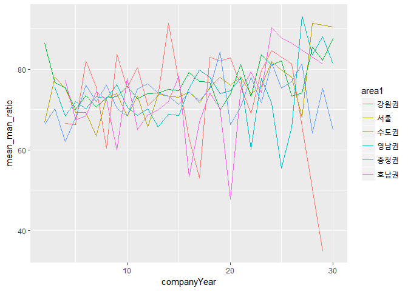
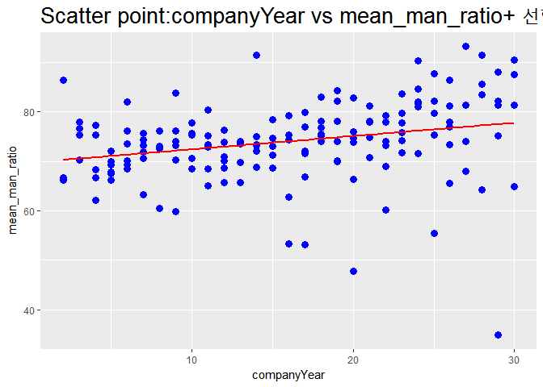

지역별 회사 설립후 년수에 따른 성비 변화
================

1. 요약
-------

기업의 설립 후 경과년수에 따른 성비변화는 지역별로 차이가 있었지만 대부분 오래된 회사일수록 남성 비율이 높아지는 패턴을 동일하게 갖고 있었다. 변동폭 차이의 원인을 추가적으로 알아본 결과, 지역별 남성종사자의 비율과 경과년수 요인이 복합적으로 영향을 미치고 있었다.

2. 분석 주제
------------

설립 후 경과년수에 따른 성비 변화가 모든 지역에서 동일하게 일어나는가?

시사저널 e &lt; <http://www.sisajournal-e.com/biz/article/166951> &gt; 의 자료에 따르면 30대 기업 10명 중 8명이 남성일 정도로 성비 불균형이 심각하다고 한다. 이에 문제의식을 갖고, 벤처기업에서도 같은 현상이 나타나는지에 대해 알아보고자 했다. 또한 그런 현상이 나타난다면 어떤 요인들이 성비에 영향을 주는지 조사하고자 이 주제를 선정하게 되었다.

3. 데이터 선정
--------------

### 데이터 선정 이유

취업에 관심이 없을 수 없는 대학생으로서, 벤처 기업에 취업할 가능성이 충분히 있으므로 이 데이터가 분석할 가치가 있다고 판단했다. 대학생 및 취준생에게 참고가 될 수 있는 분석이며, 벤처 기업 여건 개선의 근거가 될 여지가 있다고 생각한다. 젠더 문제로 여러 이슈가 끊이지 않고 있는 지금, 기업의 성비에 대한 분석은 높은 시의성을 가진다.

### 데이터 소개(출처, 특성, 구성)

데이터 : 2016년벤처기업정밀실태조사 출처 - 공공데이터포털 - <https://www.data.go.kr/dataset/3043469/fileData.do>

특성 - 본 통계는 2015년 12월말 기준 벤처확인기업의 일반현황과 경영성과 등에 관한 기초 통계자료를 조사․분석한 것임 - 본 보고서는 2,049개 벤처확인기업의 표본조사 결과를 모수(31,189개, 예비벤처제외) 추정한 결과임

구성 - 매출규모나 기술, 브랜드 등 벤처 기업과 관련된 255개의 변수가 있는 데이터이나, 분석에 필요한 설립년도, 남성 종사자 수, 여성 종사자 수, 지역, 대표이사 성별 등의 변수를 이용하였다.

4. 분석
-------

### 분석 목적 및 방법

'2016년 벤처기업정밀실태조사' 데이터를 이용해 기업의 연수에 따른 성비 변화가 한 지역에 국한되어있는지, 여러 지역에서 동일하게 나타나는 현상인지를 분석하고자 한다. 즉, 설립한 지 오래된 회사일수록 성비 불균형 현상이 크다는 분석결과를 토대로 그 분석이 지역별로 어떻게 차이가 나는지, 차이가 나는 원인은 무엇인지 분석하는것을 그 목적으로 한다.

방법: 회사 연수에 따른 성비 변화가 각 지역별로 동일하게 나타나는지를 알아보기 위해 각 지역별로 데이터를 나누어 각각의 수치들이 어떤 경향을 드러내는지 파악한다.

### 변수 검토 및 전처리

##### 패키지 로드

``` r
library(dplyr)
library(ggplot2)
```

##### 데이터 불러오기

``` r
raw<-read.csv("teamraw.csv",stringsAsFactors = F)
```

##### 데이터 파악

데이터의 특성상 보고서가 너무 길어질 수 있기에 임시로 비활성화

``` r
#head(raw)
#tail(raw)
#View(raw)
#str(raw)
#summary(raw)
dim(raw)
```

    ## [1] 2049  593

##### 변수명 수정

필요한 변수만 추출한 후, 변수명을 보기쉽게 바꾸기

``` r
data<-raw %>%
  select(6,11,89,90,91)
data<-rename(data,area=A1.5..회사주소...시.도.,
             year=A2.1..창업년도,
             man=C1.3..2015년.총.종사자.수...남성,
             woman=C1.3..2015년.총.종사자.수...여성,
             total=C1.3..2015년.총.종사자.수...합계) 
head(data)
```

    ##   area year man woman total
    ## 1 서울 2011   6     8    14
    ## 2 충남 1997  65    13    78
    ## 3 대구 2006  30    18    48
    ## 4 서울 2002  35    11    46
    ## 5 서울 2001  26     3    29
    ## 6 충북 2009  19     6    25

##### 데이터 클린징

woman변수가 문자형 데이터인것을 확인 후, 숫자형으로 변환

``` r
str(data)
```

    ## 'data.frame':    2049 obs. of  5 variables:
    ##  $ area : chr  "서울" "충남" "대구" "서울" ...
    ##  $ year : int  2011 1997 2006 2002 2001 2009 2010 1999 2010 2005 ...
    ##  $ man  : int  6 65 30 35 26 19 12 38 21 47 ...
    ##  $ woman: chr  "8" "13" "18" "11" ...
    ##  $ total: chr  "14" "78" "48" "46" ...

``` r
data$woman <-as.numeric(data$woman)
```

    ## Warning: 강제형변환에 의해 생성된 NA 입니다

##### 데이터 정제

결측치 확인후 제거

``` r
table(is.na(data$total))
```

    ## 
    ## FALSE 
    ##  2049

``` r
table(is.na(data$man))
```

    ## 
    ## FALSE 
    ##  2049

``` r
table(is.na(data$woman))
```

    ## 
    ## FALSE  TRUE 
    ##  2048     1

``` r
data<-data %>% filter(!is.na(woman))
```

##### 필요한 변수 생성

``` r
#경과년수(설립한지 얼마나 됐는지) 변수 생성
data<- data %>% mutate(companyYear = as.integer(format(Sys.Date(),"%Y")) - strtoi(data$year))

#성비 변수 생성
data<-data %>% mutate(man_ratio=man/(man+woman)*100) 
data<-data %>% mutate(woman_ratio=woman/(man+woman)*100)

#5년단위 그룹 변수 생성 - 그래프를 단순화해서 보기 위한 방법
data<-data %>% mutate(companyYearBy5=ifelse(companyYear<5,"00~05",    
                                            ifelse(companyYear<10,"06~10",
                                                   ifelse(companyYear<15,"11~15",
                                                          ifelse(companyYear<20,"16~20",
                                                                 ifelse(companyYear<25,"21~25","26~30"))))))

#남성비율 그룹화 해서 변수 생성 - 그래프를 단순화해서 보기 위한 방법
data<-data %>% 
  mutate(man_ratio1=ifelse(man_ratio<=25,"0~25%",    
                           ifelse(man_ratio>25&man_ratio<=50,"26~50%",
                                  ifelse(man_ratio>50&man_ratio<=75,"51~75%","76~100%"))))
head(data)
```

    ##   area year man woman total companyYear man_ratio woman_ratio
    ## 1 서울 2011   6     8    14           6  42.85714    57.14286
    ## 2 충남 1997  65    13    78          20  83.33333    16.66667
    ## 3 대구 2006  30    18    48          11  62.50000    37.50000
    ## 4 서울 2002  35    11    46          15  76.08696    23.91304
    ## 5 서울 2001  26     3    29          16  89.65517    10.34483
    ## 6 충북 2009  19     6    25           8  76.00000    24.00000
    ##   companyYearBy5 man_ratio1
    ## 1          06~10     26~50%
    ## 2          21~25    76~100%
    ## 3          11~15     51~75%
    ## 4          16~20    76~100%
    ## 5          16~20    76~100%
    ## 6          06~10    76~100%

##### 데이터 유효성 검사

데이터 표본개수의 차이로 인한 결과해석의 오류를 줄이고자 범위 축소

``` r
table(data$companyYear)
```

    ## 
    ##   2   3   4   5   6   7   8   9  10  11  12  13  14  15  16  17  18  19 
    ##   5  24  53 146 149 134 144 104  92  88 103  97  80  96  91 153 102  56 
    ##  20  21  22  23  24  25  26  27  28  29  30  31  32  33  34  35  36  37 
    ##  53  37  37  29  23  24  22  17  11  13   8  12   5   5   4   4   3   1 
    ##  38  39  40  41  42  43  45  49  58  62 
    ##   2   3   2   4   3   3   3   1   1   1

``` r
data<-data %>% filter(companyYear<=30)
table(data$companyYear)
```

    ## 
    ##   2   3   4   5   6   7   8   9  10  11  12  13  14  15  16  17  18  19 
    ##   5  24  53 146 149 134 144 104  92  88 103  97  80  96  91 153 102  56 
    ##  20  21  22  23  24  25  26  27  28  29  30 
    ##  53  37  37  29  23  24  22  17  11  13   8

지역또한 데이터 표본개수의 차이로 인한 결과해석의 오류가 생길 수 있음. 이를 줄이고자 지역권을 통합한 새로운 변수생성

``` r
table(data$area) 
```

    ## 
    ## 강원 경기 경남 경북 광주 대구 대전 부산 서울 세종 울산 인천 전남 전북 제주 
    ##   55  544   76   76   41   76  164  106  432    7   31   76   24   20    3 
    ## 충남 충북 
    ##  130  130

``` r
data <- data %>% mutate(area1 = ifelse(area %in% c("서울"), "서울",
                                       ifelse(area %in% c("경기","인천"), "수도권",
                                              ifelse(area %in% c("충남","대전","세종","충북"), "충청권",
                                                     ifelse(area %in% c("강원"), "강원권",
                                                            ifelse(area %in% c("대구","부산","경남", "경북","울산"), "영남권",
                                                                   ifelse(area %in% c("전북", "전남","광주","제주"), "호남권","기타")))))))
table(data$area1)
```

    ## 
    ## 강원권   서울 수도권 영남권 충청권 호남권 
    ##     55    432    620    365    431     88

### 분석 및 해석

##### 지역별 회사 경과년수변화에 따른 남성비율의 변화 차이

``` r
testG <- data %>% 
  group_by(companyYear,area1) %>% 
  summarise(mean_man_ratio=mean(man_ratio)) %>% 
  arrange(companyYear)
ggplot(data=testG, aes(x=companyYear,y=mean_man_ratio,colour=area1,group=area1)) +
  geom_line()
```

 •지역별 회사 경과년수에 따른 남성비율의 변화 그래프이다.

•지역별로 변동폭이 존재하는 선그래프지만, 전체적인 흐름은 회사가 오래될 수록 남성의 비율이 높아지고 있음을 보인다.

##### 지역별 경과년수가 성비에 미치는 영향 회귀분석

``` r
ggplot(testG,aes(x=companyYear,y=mean_man_ratio))+
  geom_point(shape=19,size=3,colour="blue")+
  stat_smooth(method=lm,
              level=95, colour="red")+
  ggtitle("Scatter point:companyYear vs mean_man_ratio+ 선형회귀선")+
  theme(plot.title = element_text(size=20))
```

    ## Warning in qt((1 - level)/2, df): NaN이 생성되었습니다

 •대부분의 그래프가 우상향하고 있다는걸 회귀분석을 통해 더욱 분명하게 확인 할 수 있다.

##### 지역별 회사 경과년수변화(5년단위로 그룹화)에 따른 남성비율의 변화 차이

``` r
testG1 <- data %>% 
  group_by(companyYearBy5,area1) %>% 
  summarise(mean_man_ratio=mean(man_ratio)) %>% 
  arrange(companyYearBy5)
ggplot(data=testG1, aes(x=companyYearBy5,y=mean_man_ratio,colour=area1,group=area1)) +
  geom_line()
```

 •5년 단위로 그룹화한 그래프를 보면 더욱 직관적으로 알 수 있다.

•결과적으로 지역에 따라 약간의 차이가 존재 했지만 대체적으로는 경과년수의 증가에 따른 남성종사자의 비율이 증가하는 성향을 보였다. 이는 회사가 오래될수록 남초현상이 심화된다는 것을 드러낸다.

•강원권을 제외하고 대부분 우상향 곡선을 그리는 그래프를 가진다.

•지역별 변동폭의 차이는 강원권이 제일 컸으며, 수도권, 영남권, 충청권등은 비교적 작았다.

•지역별로 변동폭의 차이가 존재하는 원인을 알아보기 위해 추가적으로 분석을 해보았다.

##### 지역별 남성종사자 비율

``` r
region_man<-data %>%
  filter(!is.na(man_ratio1)) %>% 
  group_by(area1,man_ratio1) %>% 
  summarise(n=n()) %>% 
  mutate(tot_group=sum(n)) %>% 
  mutate(pct=round(n/tot_group*100,2))
region_man
```

    ## # A tibble: 22 x 5
    ## # Groups:   area1 [6]
    ##     area1 man_ratio1     n tot_group   pct
    ##     <chr>      <chr> <int>     <int> <dbl>
    ##  1 강원권     26~50%     7        55 12.73
    ##  2 강원권     51~75%    20        55 36.36
    ##  3 강원권    76~100%    28        55 50.91
    ##  4   서울      0~25%     6       432  1.39
    ##  5   서울     26~50%    40       432  9.26
    ##  6   서울     51~75%   172       432 39.81
    ##  7   서울    76~100%   214       432 49.54
    ##  8 수도권      0~25%     2       620  0.32
    ##  9 수도권     26~50%    52       620  8.39
    ## 10 수도권     51~75%   216       620 34.84
    ## # ... with 12 more rows

``` r
ggplot(region_man,aes(x="",y=pct,fill=man_ratio1))+
  facet_grid(facet=.~area1)+
  geom_bar(stat="identity",width=1)+
  coord_polar(theta="y")
```


•수도권,충청권, 영남권에 대체로 남성 종사자의 비율이 높게 나온다.

•앞선 분석에서 수도권, 충청권, 영남권은 변동폭이 작은 그래프를 보였다. 즉, 남성비율이 많았기에 변동폭이 작다는 인과관계를 찾을 수 있다.

##### 지역별 회사 경과년수(5년단위로 그룹화)에 따른 비율

``` r
data<-data %>% 
  mutate(companyYearBy10=ifelse(companyYear<10,"00~10",    
                                ifelse(companyYear<20,"11~20","21~30")))
region_man1<-data %>%
  filter(!is.na(man_ratio1)) %>% 
  group_by(area1,companyYearBy10) %>% 
  summarise(n=n()) %>% 
  mutate(tot_group=sum(n)) %>% 
  mutate(pct=round(n/tot_group*100,2))
region_man1
```

    ## # A tibble: 18 x 5
    ## # Groups:   area1 [6]
    ##     area1 companyYearBy10     n tot_group   pct
    ##     <chr>           <chr> <int>     <int> <dbl>
    ##  1 강원권           00~10    25        55 45.45
    ##  2 강원권           11~20    21        55 38.18
    ##  3 강원권           21~30     9        55 16.36
    ##  4   서울           00~10   144       432 33.33
    ##  5   서울           11~20   238       432 55.09
    ##  6   서울           21~30    50       432 11.57
    ##  7 수도권           00~10   239       620 38.55
    ##  8 수도권           11~20   291       620 46.94
    ##  9 수도권           21~30    90       620 14.52
    ## 10 영남권           00~10   153       365 41.92
    ## 11 영남권           11~20   160       365 43.84
    ## 12 영남권           21~30    52       365 14.25
    ## 13 충청권           00~10   167       431 38.75
    ## 14 충청권           11~20   206       431 47.80
    ## 15 충청권           21~30    58       431 13.46
    ## 16 호남권           00~10    31        88 35.23
    ## 17 호남권           11~20    42        88 47.73
    ## 18 호남권           21~30    15        88 17.05

``` r
ggplot(region_man1,aes(x="",y=pct,fill=companyYearBy10))+
  facet_grid(facet=.~area1)+
  geom_bar(stat="identity",width=1)+
  coord_polar(theta="y")
```


•강원권의 경우 남성비율에 있어서는 별다른 차이가 없었지만 지역별 회사연수를 비교해보았을때 새로 지어진 회사비율이 많았다. 따라서 강원권의 큰 변동폭의 원인을 회사의 경과년수에서 찾을 수 있다.

5. 논의
-------

### 한계점, 비판점

•지역별로 변동폭의 차이가 나는 요인이 한정적이다.

•사내에서 여성보다 남성을 선호하는 경향이 데이터 상에서 보이는데, 그에 대한 이유가 기업 내부적 이유인지, 사회적 편견에 의해서인지, 구성원(사원, 지원자 등)의 문제인지 파악할 수 없다.

•남성종사자 비율이 더 많은 근거를 명확히 밝혀내지 못했다.

### 추후 분석 방향

•데이터가 더 많다면 지역별로 변동폭의 차이가 나는 원인을 더 조사해보고 싶다.

•지역별 말고도 다른 요인을 가지고 데이터를 분석해보고 싶다.
