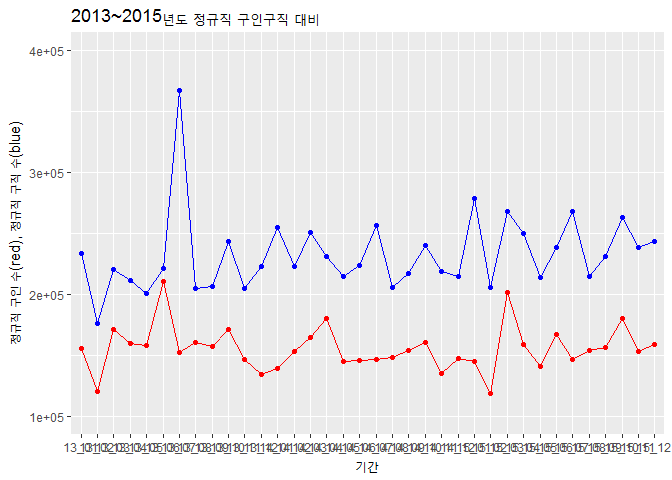

고용형태별 구인구직 3년 비교(2013~2015)
================

### 1. 요약(초록) : 전체 분석 절차와 결론

#### 2013~2015 워크넷 고용시장 자료 중 고용형태별 자료가 담겨있는 시트를 활용하여 연도별로 자료를 합치고, R을 통해 정제한 뒤 다시 불러와 필요한 자료를 선택하여 통계를 냈다.

#### 그래프1를 통해 정규직 구직 인원에 대한 구인 자리 수를 비교해 부족한 일자리 문제가 얼마나 심각한지를 알아보았고, 흐름이 있는지 발견하고자 하였다. 그래프2를 통해 구직 인원 대비 구인 자리 비율을 전체 통계에 따라 일반 취업 가능률, 정규직 부분만 추려 정규직 취업 가능률 2가지를 나타내었다.

#### 결과적으로 정규직 희망자에 비해 일자리가 적다는 결론이 나왔으며, 당연하다고 볼 수도 있겠지만 취직을 원하는 사람들이 모두 제 일자리를 찾을 수 있도록 일자리 시장의 확대에 힘써야할 것이다. 정규직 취업 가능률은 의외로 일반 취업 가능률보다 높은 추세를 보였다.

### 2. 분석 주제 : 문제의식, 알아보고자 하는 것

#### 2013~2015 3년 간의 구인구직 통계를 이용하여, 정규직과 비정규직의 구인과 구직 인원의 차이를 알아보고 변동 추이를 알아본다. 일자리 부족 문제와 정규직 비정규직 비율에 따른 문제를 발견할 수 있다.

### 3. 데이터 선정

#### 서울연구소데이터서비스의 산업경제 일자리 구인구직 및 취업현황의 2013년~2015년 자료

### -데이터 선정 이유

#### 한국고용정보원이라는 국가공인기관의 자료로서 조사과정과 분류항목을 비교적 신뢰할 수 있으며, 대중의 접근성이 확보된 ‘워크넷’이라는 홈페이지의 측정량을 데이터 출처로 하기 때문에 데이터가 비교적 균질하다고 할 수 있다. 월 단위 조사자료를 바탕으로 연도별 동향분석과 월별 동향분석이 가능하다. 이로써 워크넷 노동시장의 최신 동향을 정확하고 세밀하게 평가하는 데 적합하다.

### -출처

#### 서울연구소데이터서비스(<http://data.si.re.kr/node/38>)

### -특성

#### 본 데이터는 매월 말~초에 워크넷에 구인 및 구직을 신청한 구인업체 및 구직자로서 등록이 마감된 자들을 대상으로 한다. 또한 명확한 항목분류를 바탕으로 인문계열의 일자리 질과 양을 평가하기에 적합하다.

#### 워크넷 구인자는 대체로 전문직 자격증이나 대학, 대학원 같은 고학력 구직자들만을 요구하지 않는다. 그러므로 이 데이터는 일반적인 서민들의 노동시장과 밀접한 연관을 가진다고 볼 수 있다.

### -구성

#### 구인인원: 학력대별, 규모별, 산업별, 직종별, 근무지역별 구인인원

#### 구직건수: 성별, 연령별, 학력대별, 희망직종별, 희망근무지역별 \#\#\#\#구직건수 및 취업건수

#### 임금관련: 학력별, 종사상지위별, 직종별 제시임금 및 희망임금

### 4. 분석(코드, 표, 그래프, 해석 포함)

### -분석 목적 및 방법

### -변수 검토 및 전처리

``` r
#1.특정 연도의 수요측면 전처리

##원본 엑셀파일 불러오기
library(readxl)
```

    ## Warning: package 'readxl' was built under R version 3.4.2

``` r
library(dplyr)
```

    ## Warning: package 'dplyr' was built under R version 3.4.2

    ## 
    ## Attaching package: 'dplyr'

    ## The following objects are masked from 'package:stats':
    ## 
    ##     filter, lag

    ## The following objects are masked from 'package:base':
    ## 
    ##     intersect, setdiff, setequal, union

``` r
library(ggplot2)
```

    ## Warning: package 'ggplot2' was built under R version 3.4.2

``` r
a1 <- read_excel("14_1.xls",sheet = 1)
a2 <- read_excel("14_2.xls",sheet = 1)
a3 <- read_excel("14_3.xls",sheet = 1)
a4 <- read_excel("14_4.xls",sheet = 1)
a5 <- read_excel("14_5.xls",sheet = 1)
a6 <- read_excel("14_6.xls",sheet = 1)
a7 <- read_excel("14_7.xls",sheet = 1)
a8 <- read_excel("14_8.xls",sheet = 1)
a9 <- read_excel("14_9.xls",sheet = 1)
a10 <- read_excel("14_10.xls",sheet = 1)
a11 <- read_excel("14_11.xls",sheet = 1)
a12 <- read_excel("14_12.xls",sheet = 1)

##하나의 데이터 프레임으로
A <- bind_rows(a1,a2,a3,a4,a5,a6,a7,a8,a9,a10,a11,a12)

##혹시 모를 결측치 제거
A2 <- na.omit(A)

##월별 정규+비정규 토탈
A2_total <- A2 %>% 
  group_by(date) %>% 
  summarise(TD = sum(total))

##월별 정규 토탈
A2_re <- A2 %>% 
  filter(employ == 'regular') %>% 
  group_by(date) %>% 
  summarise(TreD = sum(total))

##위의 두 표 합침
A2_toto <- left_join(A2_total, A2_re, by = 'date')

##비율 항목 추가
A2_toto <- A2_toto %>% 
  group_by(date) %>% 
  mutate(reRD = TreD/T, irreRD = 1- reRD)

##정리
write.csv(A2_toto, "14_re_all2.csv")
```

#### 위와 같은 방법으로 2013~2015 연도별 수요, 공급 측면 자료를 정리하고 연도 별로 left\_join을 통해 하나의 파일로 묶음

### -분석 및 해석

#### 고용형태별 구인구직 3년 비교(2013~2015)

``` r
###연도별 구인구직 합침 자료 불러옴
all13 <- read.csv("13_re_all.csv")
all14 <- read.csv("14_re_all.csv")
all15 <- read.csv("15_labor_all.csv")
```

#### 변수명이 각자 다름

##### 13년도 정규직구인(RD) 구직(Tre)

##### 13년도 전체구인(TD) 구직(T)

##### 14년도 정규직구인(TreD) 구직(Tre)

##### 14년도 전체구인(TD) 구직(T)

##### 15년도 정규직구인(re) 구직(S\_re)

##### 15년도 전체구인(to) 구직(S\_to)

#### 본 분석에서 다룰 자료만 선택, 변수 이름 통일

##### 정규직 구인(TreD)

##### 정규직 구직(Tre)

##### 전체 구인(TD)

##### 전구 구직(T)

``` r
all13 <- all13 %>% 
  select(date, RD, Tre, TD, T) %>%
  rename(TreD=RD) %>% 
  mutate(employ=TreD/Tre, re.employ=TD/T)

all14 <- all14 %>% 
  select(date, TreD, Tre, TD, T) %>% 
  mutate(employ=TreD/Tre, re.employ=TD/T)

all15 <- all15 %>% 
  select(date, re, S_to, to, S_re) %>%
  rename(TreD=re, Tre=S_re, TD=to, T=S_to) %>% 
  mutate(employ=TreD/Tre, re.employ=TD/T)
```

#### 3년치 통합비교 자료 만들기

``` r
group_all <- rbind(all13, all14, all15)
```

#### 그래프 추출

##### 1. 정규직 구인(red), 구직(blue) 수 대비 시계열

``` r
ggplot(group_all, aes(x=date,y=TreD, group=1))+geom_line(colour="red")+geom_point(colour="red")+geom_line(aes(x=date, y=Tre), colour="blue", )+geom_point(aes(x=date,y=Tre, group=1),colour="blue") + ylim(100000, 400000) + xlab('기간') +
  ylab('정규직 구인 수(red), 정규직 구직 수(blue)') +
  ggtitle('2013~2015년도 정규직 구인구직 대비')
```



##### 최근 3개년 정규직 구인 구직 수를 살펴보았을 때, 일정한 패턴을 가지고 있다고 하기에는 힘들다. 하지만 비이상적인 증가, 감소 폭을 보이는 월을 찾아낼 수있었다. 예를 들면, 2013년 7월 구직자 수가 크게 증가하였는데 이는 검색 결과 2013년 7월부터 구직자 수당 인상으로 인해 워크넷에 구직자들이 대거 등록한 이유 때문이라는 것을 알 수 있었다. 이렇듯, 자료를 통해 특정한 패턴보다는 이상적인 주기에 주목하여 추가적인 탐색을 이끌었다.

##### 2. 전체 취업 가능률(구인/구직자 비율) = employ(green), 정규직 취업 가능률(정규직구인/구직자 비율) = re.employ(blue)

``` r
ggplot(group_all, aes(x=date,y=employ, group=1))+geom_line(colour="blue")+geom_point(colour="blue")+geom_line(aes(x=date, y=re.employ), colour="green", )+geom_point(aes(x=date,y=re.employ, group=1),colour="green")+ylim(0,1) + xlab('기간') +
  ylab('정규직취업가능률(blue), 전체취업가능률(green)') +
  ggtitle('2013~2015년도 취업가능률')
```


##### 2013~2015 취업 가능률은, 구직자 수와 구인 자리를 비교하여 구직자들이 얼마나 취업이 가능할 지를 가늠해보았다. 정규직 취업 가능률이 전체 취업 가능률보다 낮을 것이라고 예상한 것과 달리 결과적으로 정규직 희망자들이 더 취업하기 쉽다는 결론이 나왔다.

### 5. 논의 : 한계점, 비판점, 추후 분석 방향

#### 본 조사는 2013~2015년 총 3년의 자료를 바탕으로 한 결과이다. 3개년 자료를 분석하며 이 기간에 따라서는 전체적인 흐름분석이 어렵다는 것을 알 수 있었다. 데이터가 큰 것이 부담이었는데 오히려 10년 단위로 한 연도씩 분석하는 것이 흐름 분석에는 더 도움이 될 것 같다. 그래프 2부분에서 의외의 결과를 얻을 수 있었는데 이 이유에 대한 추가분석이 필요하다고 생각한다. 본 구인구직 자료는 ‘워크넷’에 등록된 고용시장만을 한정하고 있다. ‘워크넷’ 내에 정규직으로 등록된 일자리가 명목상이 아니라 다른 조건들을 만족하고 있는지 아닌지에 대한 추가적인 연구가 필요하다고 생각한다.
