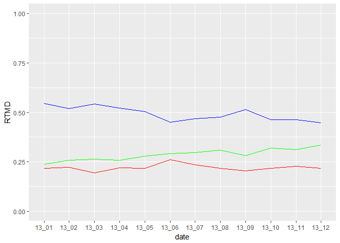
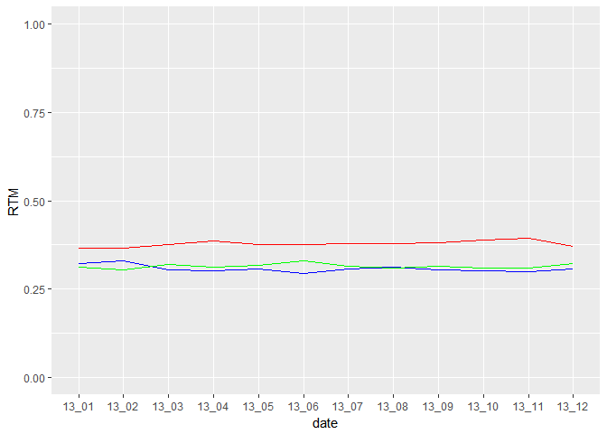
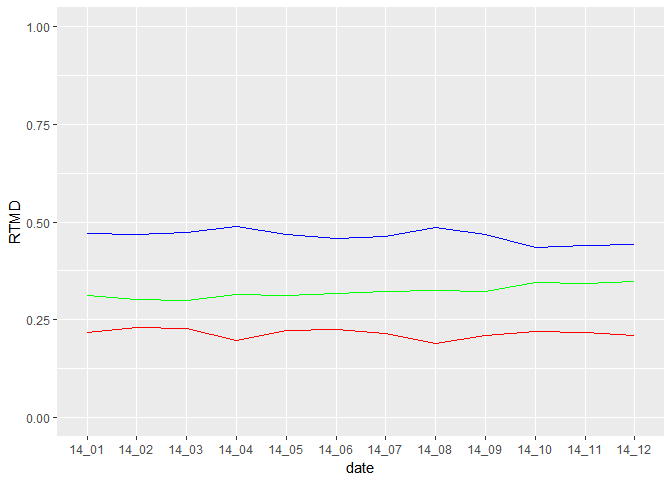
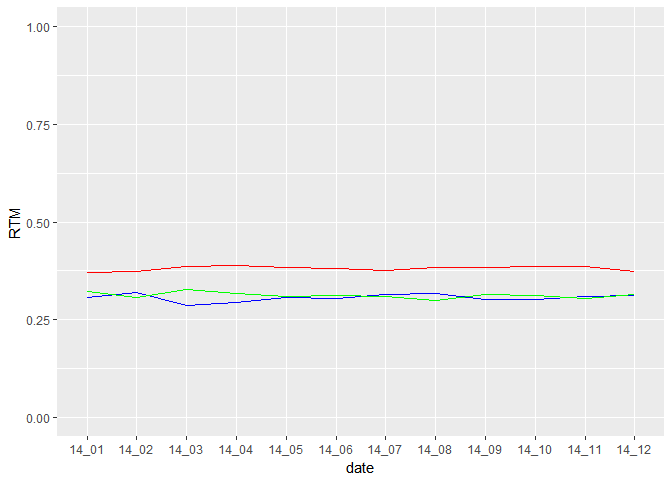
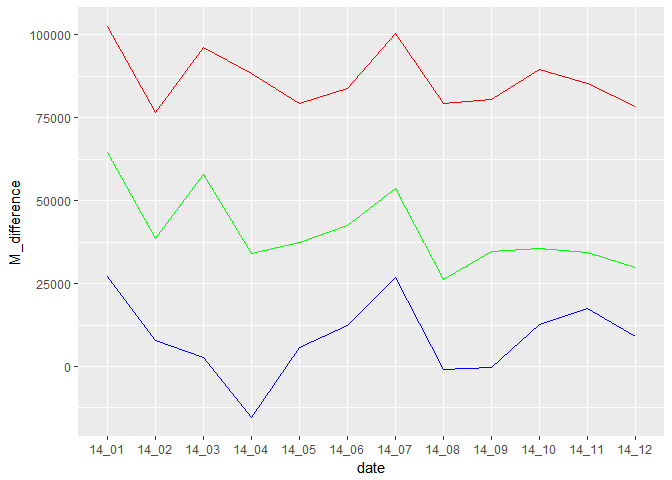
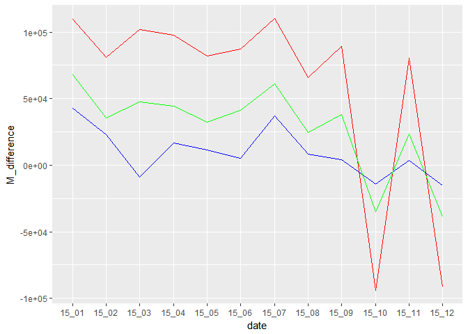

계열별(문과,이과)구인구직 비교(2013~2015)
================
김재헌
2017년 11월 28일

### 1.요약(초록) : 전체분석 절차와 결론

본 보고서의 목적은 계열별(문과, 이과)구인, 구직비율 분석을 통해 계열별 수요 공급의 차이는 어느 정도인지 파악하는 것이다. 분석 이유는 우선 첫째, 최근 들어 계속되는 경기침체현상과 비정규직 양산문제 등과 같은 사회·경제적인 문제와 두 번째로는 21C 정보화 사회의 발전으로 기업에서 인문·사회계열을 전공한 사람들보다는, 실용적인 이공계열을 전공한 사람들을 선호하는 경향을 보여 왔기 때문이다. 본격적인 분석을 진행하기에 앞서서, 우선 워크넷을 통해 다운받은 2013~2015년 구인구직통계 데이터를 고용형태, 학력, 임금, 계열, 직종별로 정제하였으며, 이후 데이터를 분석하는 과정에서 추가적으로 필요한 변수들을 R stuido 프로그램 dplyr 패키지의 mutate를 이용해 변수를 추가하여 분석하였다. 추가한 변수로는 계열별 수요와 공급의 차이를 나타내주는 변수였으며, 해당 변수를 통해 2015년 10월과 12월 계열별 데이터를 제외한 나머지 데이터들에서 일정한 흐름을 발견할 수 있었다. 2013년41월부터 2015년 9월까지, 그리고 2015년 11월 데이터는 문과계열의 총수요가 이과계열의 총수요보다 적고, 문과계열의 총공급이 이과계열의 총공급보다 많아서 문과계열은 초과공급이, 이과계열은 초과수요가 빈번하게 발생하였다. 하지만, 2015년 10월과 12월의 데이터에서는 비율로만 따졌을 때 문과 계열의 총수요가 이과계열의 총수요보다 더 높아졌고, 총공급도 마찬가지로, 이과계열의 총공급이 문과계열의 총공급보다 더 높아지게 된다. 여기서 한 가지 재미있는 사실은 2015년 10월과 12월의 문과와 이과계열 모두 초과수요가 발생하였다는 것이다. 이것은 분석을 좀 더 진행해봐야 알게 되겠지만 대체적인 흐름으로 비춰보았을 때 해당 분석을 통해 내가 도출해낸 최선의 결론은 기업은 인문·사회계열을 전공한 사람들 보다는 실용적인 이공계열을 전공한 사람을 여전히 선호하고 있다는 사실을 알 수 있었다.

### 2. 분석주제: 문제의식, 알아보고자 하는 것

최근 몇 년간 우리나라는 계속되는 경기침체와 이로 인한 실업률 증가, 비정규직 증가 등의 경제적인 문제가 나타나고 있다. 또한 21C 사회는 정보화가 진전되고, 대량생산체계가 확립되면서 기업에서는 인문·사회계열을 전공한 사람들보다는 조금 더 실용적이고, 다양한 분야를 공부함으로써, 적은 비용으로 직원의 노동 숙련도를 향상시킬 수 있고, 현장에 즉시 투입 가능한 이공계열을 전공한 사람들을 더 선호함으로써 점차 인문·사회계열을 전공한 사람들은 취업시장에서 밀려나고 있는 실정이다. 따라서 2013~2015년 계열별 구인·구직 비율 통계를 통해 노동시장에서 인문·사회계열(문과), 이공계열(이과)의 총수요, 총공급의 차이를 파악하여, 기업들이 노동시장에서 이공계열을 인문·사회계열(문과)보다 얼마나 더 선호하는지 파악하고자 하였다.

### 3. 데이터 선정

-데이터 선정 이유
-----------------

우리 팀은 우선 2013~2015년 구인·구직 통계를 가지고 고용형태, 임금, 학력, 계열, 직종별로 데이터를 정제하여 분석하였는데, 내가 계열별 구인·구직비율을 선택한 이유는, 첫 째 내가 생각하기에, 고용형태, 임금, 학력, 직종별로의 구인·구직 비율은 이미 언론을 통해 그 실상이 어느 정도 알려졌다고 생각했기 때문이다. 두 번째로, 이것은 나의 경험과 관련된 것인데, 고등학교 3년 동안 문과에서 생활하면서, 이과에 친한 친구가 나에게 “문과 나와서 뭐할래?, 문과 나와서 할 수 있는 게 있을 것 같니?”라고 물어본 적이 있었는데, 그 당시에는 그 말 자체가 문과를 매우 무시하는 말 같아서 매우 기분이 나빴다. 하지만 취업과 관련된 정보나 뉴스를 접하고, 대학생이 된 이후에는 친구의 말을 기분 나빠하던 내가 전적으로 동의한 것은 아니지만, 일정 부분 공감하고 있었기 때문이다. 따라서 이번 기회에 문·이과 총수요, 총공급 비율, 총수요, 총공급 차이 분석을 통해 우리 문과생들이 어떠한 상황에 처해있는지 파악해보고 싶었다.

-데이터소개(출처, 특성, 구성)
-----------------------------

출처 :서울연구소데이터서비스(<http://data.si.re.kr/node/38>)

특성

본 데이터는 매월 말~초에 워크넷에 구인 및 구직을 신청한 구인업체 및 구직자로서 등록이 마감된 자들을 대상으로 한다. 또한 명확한 항목분류를 바탕으로 인문계열의 일자리 질과 양을 평가하기에 적합하다. 워크넷 구인자는 대체로 전문직 자격증이나 대학, 대학원 같은 고학력 구직자들만을 요구하지 않는다. 그러므로 이 데이터는 일반적인 서민들의 노동시장과 밀접한 연관을 가진다고 볼 수 있다.

구성

구인인원: 학력대별, 규모별, 산업별, 직종별, 근무지역별 구인인원 구직건수: 성별, 연령별, 학력대별, 희망직종별, 희망근무지역별 구직건수 및 취업건수 임금관련: 학력별, 종사상지위별, 직종별 제시임금 및 희망임금

### 4.분석(코드, 표, 그래프 해석 포함)

분석 목적 및 방법
-----------------

해당 분석을 통해 계열별 총수요, 총공급의 차이를 분석하고자 하였으며, 분석을 진행하기 위해 2013~2015년 구인구직통계 원본데이터의 구인\_직업 중 분류, 구직\_직업 중 분류의 데이터를 계열별로 나누어 데이터를 정제하였으며(m = 문과, e = 이과, na = 무관), 이를 통해 문과, 이과의 총수요, 총공급 비율, 문과, 이과의 총수요 총공급의 차이의 추이를 파악하고자 한다.

변수 검토 및 전처리
-------------------

원본데이터를 정제한 후, 계열별 일자리의 총수요, 총공급의 비율을 구하고 계열별 총수요 총공급의 차이 변수를 추가해 그래프를 도출한다.

전체 코드
---------

2013 ~2014년도

2013년~2014년 총수요 비율(문) : RTMD, 2013년~2014년 총수요 비율(이) ; RTED, 2013년~2014년 총공급 비율(문) : RTM, 2013년~2014년 총공급 비율(이) : RTE, 2013년~2014년 총수요 총공급의 차이(문) : M\_difference, 2013년~2014년 총수요 총공급의 차이(이) : E\_difference,

2015년도

2015년 총수요 비율(문) : m\_rt 2015년 총수요 비율(이) : e\_rt 2015년 총공급 비율(문) : S\_RTM 2015년 총공급 비율(이) : S\_RTE 2015년 총수요 총공급의 차이(문) : M\_difference 2015년 총수요 총공급의 차이(이) : E\_difference

2013년도 표 도출하기

1.패키지를 로드한다. 2.2013년도 자료를 합친 것을 csv파일로 불러들인다. 3.필요한 변수를 추가한다.

``` r
library(ggplot2)
```

    ## Warning: package 'ggplot2' was built under R version 3.4.2

``` r
library(dplyr)
```

    ## Warning: package 'dplyr' was built under R version 3.4.2

    ## 
    ## Attaching package: 'dplyr'

    ## The following objects are masked from 'package:stats':
    ## 
    ##     filter, lag

    ## The following objects are masked from 'package:base':
    ## 
    ##     intersect, setdiff, setequal, union

``` r
library(readxl)
```

    ## Warning: package 'readxl' was built under R version 3.4.2

``` r
A <- read.csv("13total(amend).csv") %>% 
  group_by(date) %>% 
  mutate(M_difference = TM - TMD, E_difference = TE - TED, N_difference = TNA - TNAD)
A
```

    ## # A tibble: 12 x 20
    ## # Groups:   date [12]
    ##        X   date     TD   TMD    TED  TNAD      RTMD      RTED     RTNAD
    ##    <int> <fctr>  <int> <int>  <int> <int>     <dbl>     <dbl>     <dbl>
    ##  1     1  13_01 208270 45247 113292 49731 0.2172516 0.5439670 0.2387814
    ##  2     2  13_02 170078 37956  88411 43711 0.2231682 0.5198262 0.2570056
    ##  3     3  13_03 221216 42882 120264 58070 0.1938467 0.5436496 0.2625036
    ##  4     4  13_04 208033 45713 108487 53833 0.2197392 0.5214894 0.2587714
    ##  5     5  13_05 211102 45995 106437 58670 0.2178805 0.5041970 0.2779225
    ##  6     6  13_06 292608 75909 131428 85271 0.2594222 0.4491607 0.2914172
    ##  7     7  13_07 206006 48472  96299 61235 0.2352941 0.4674573 0.2972486
    ##  8     8  13_08 212687 46010 101040 65637 0.2163273 0.4750643 0.3086084
    ##  9     9  13_09 206292 42155 105962 58175 0.2043463 0.5136506 0.2820032
    ## 10    10  13_10 229596 49948 106379 73269 0.2175473 0.4633312 0.3191214
    ## 11    11  13_11 195406 44216  90233 60957 0.2262776 0.4617719 0.3119505
    ## 12    12  13_12 190028 41508  85004 63516 0.2184310 0.4473236 0.3342455
    ## # ... with 11 more variables: TS <int>, TM <int>, TE <int>, TNA <int>,
    ## #   RTM <dbl>, RTE <dbl>, RTNA <dbl>, ratejob <dbl>, M_difference <int>,
    ## #   E_difference <int>, N_difference <int>

2014년도 표 도출하기(2013년과 동일과정) 1.패키지를 로드한다. 2.2014년도 자료를 합친 것을 csv파일로 불러들인다. 3.필요한 변수를 추가한다.

``` r
library(ggplot2)
library(dplyr)
library(readxl)

B <- read.csv("14_total.csv")
B <- B %>% 
  group_by(date) %>% 
  mutate(M_difference = TM-TMD, E_difference = TE-TED, N_difference = TNA - TNAD )
B
```

    ## # A tibble: 12 x 22
    ## # Groups:   date [12]
    ##      X.1     X   date     TD   TMD    TED  TNAD      RTMD      RTED
    ##    <int> <int> <fctr>  <int> <int>  <int> <int>     <dbl>     <dbl>
    ##  1     1     1  14_01 196881 42695  92922 61264 0.2168569 0.4719704
    ##  2     2     2  14_02 211741 48857  99174 63710 0.2307394 0.4683741
    ##  3     3     3  14_03 226510 51419 107348 67743 0.2270054 0.4739217
    ##  4     4     4  14_04 241296 47365 117999 75932 0.1962942 0.4890218
    ##  5     5     5  14_05 198084 43818  92608 61658 0.2212092 0.4675188
    ##  6     6     6  14_06 197054 44390  90168 62496 0.2252682 0.4575802
    ##  7     7     7  14_07 203410 43808  94097 65505 0.2153680 0.4625977
    ##  8     8     8  14_08 202303 38216  98485 65602 0.1889048 0.4868193
    ##  9     9     9  14_09 211677 44548  98848 68281 0.2104527 0.4669756
    ## 10    10    10  14_10 220046 48267  95697 76082 0.2193496 0.4348954
    ## 11    11    11  14_11 189816 41152  83532 65132 0.2167994 0.4400683
    ## 12    12    12  14_12 210922 44345  93103 73474 0.2102436 0.4414096
    ## # ... with 13 more variables: RTNAD <dbl>, T <int>, TM <int>, TE <int>,
    ## #   TNA <int>, RTM <dbl>, RTE <dbl>, RTNA <dbl>, Employmentrate <dbl>,
    ## #   UNEmploymentrate <dbl>, M_difference <int>, E_difference <int>,
    ## #   N_difference <int>

2015년도 표 도출하기(2013년과 동일과정) 1.패키지를 로드한다. 2.2015년도 자료를 합친 것을 csv파일로 불러들인다. 3.필요한 변수를 추가한다.

``` r
library(dplyr)
library(ggplot2)
a1 <- read.csv("D_total_7.csv")
a1
```

    ##     X  date     mt     et    ant      t      m_rt      e_rt     na_rt
    ## 1   1 15_01  47796  93522  67641 208959 0.2287339 0.4475615 0.3237047
    ## 2   2 15_02  34962  75861  63145 173968 0.2009680 0.4360630 0.3629691
    ## 3   3 15_03  54124 128815  87712 270651 0.1999771 0.4759450 0.3240779
    ## 4   4 15_04  44855  97985  74025 216865 0.2068337 0.4518249 0.3413414
    ## 5   5 15_05  39098  88232  65900 193230 0.2023392 0.4566165 0.3410444
    ## 6   6 15_06  45991 106737  76691 229419 0.2004673 0.4652492 0.3342836
    ## 7   7 15_07  41036  90780  67252 199068 0.2061406 0.4560251 0.3378343
    ## 8   8 15_08  54991  94040  73776 222807 0.2468100 0.4220693 0.3311207
    ## 9   9 15_09  43628 100823  72252 216703 0.2013262 0.4652589 0.3334149
    ## 10 10 15_10 146272 119528 123624 389424 0.3756112 0.3069354 0.3174535
    ## 11 11 15_11  52197 105291  88543 246031 0.2121562 0.4279583 0.3598855
    ## 12 12 15_12 137628 112372 122135 372135 0.3698335 0.3019657 0.3282008

``` r
a2<- read.csv("S_total_8.csv")
a2
```

    ##     X  date    S_T   S_TM   S_TE  S_TNA     S_RTM     S_RTE    S_RTNA
    ## 1   1 15_01 429964 157769 136527 135668 0.3669354 0.3175312 0.3155334
    ## 2   2 15_02 313121 115719  98888  98514 0.3695664 0.3158140 0.3146196
    ## 3   3 15_03 411154 156249 119844 135061 0.3800255 0.2914820 0.3284925
    ## 4   4 15_04 375832 142677 114670 118485 0.3796297 0.3051097 0.3152605
    ## 5   5 15_05 319248 120929  99821  98498 0.3787933 0.3126754 0.3085313
    ## 6   6 15_06 363496 133402 112085 118009 0.3669972 0.3083528 0.3246501
    ## 7   7 15_07 407396 151144 127645 128607 0.3710002 0.3133192 0.3156806
    ## 8   8 15_08 321330 120686 102303  98341 0.3755827 0.3183736 0.3060436
    ## 9   9 15_09 348251 133035 104701 110515 0.3820090 0.3006481 0.3173430
    ## 10 10 15_10 246031  52197 105291  88543 0.2121562 0.4279583 0.3598855
    ## 11 11 15_11 353672 132703 108841 112128 0.3752149 0.3077456 0.3170395
    ## 12 12 15_12 226509  45966  97081  83462 0.2029323 0.4285967 0.3684710

``` r
A1 <- left_join(a1, a2, by = "date")

A1 <- A1 %>% 
  group_by(date) %>% 
  mutate(M_difference = S_TM-mt, E_difference = S_TE-et,  N_difference = S_TNA-ant)
A1
```

    ## # A tibble: 12 x 20
    ## # Groups:   date [12]
    ##      X.x   date     mt     et    ant      t      m_rt      e_rt     na_rt
    ##    <int> <fctr>  <int>  <int>  <int>  <int>     <dbl>     <dbl>     <dbl>
    ##  1     1  15_01  47796  93522  67641 208959 0.2287339 0.4475615 0.3237047
    ##  2     2  15_02  34962  75861  63145 173968 0.2009680 0.4360630 0.3629691
    ##  3     3  15_03  54124 128815  87712 270651 0.1999771 0.4759450 0.3240779
    ##  4     4  15_04  44855  97985  74025 216865 0.2068337 0.4518249 0.3413414
    ##  5     5  15_05  39098  88232  65900 193230 0.2023392 0.4566165 0.3410444
    ##  6     6  15_06  45991 106737  76691 229419 0.2004673 0.4652492 0.3342836
    ##  7     7  15_07  41036  90780  67252 199068 0.2061406 0.4560251 0.3378343
    ##  8     8  15_08  54991  94040  73776 222807 0.2468100 0.4220693 0.3311207
    ##  9     9  15_09  43628 100823  72252 216703 0.2013262 0.4652589 0.3334149
    ## 10    10  15_10 146272 119528 123624 389424 0.3756112 0.3069354 0.3174535
    ## 11    11  15_11  52197 105291  88543 246031 0.2121562 0.4279583 0.3598855
    ## 12    12  15_12 137628 112372 122135 372135 0.3698335 0.3019657 0.3282008
    ## # ... with 11 more variables: X.y <int>, S_T <int>, S_TM <int>,
    ## #   S_TE <int>, S_TNA <int>, S_RTM <dbl>, S_RTE <dbl>, S_RTNA <dbl>,
    ## #   M_difference <int>, E_difference <int>, N_difference <int>

그래프 도출하기

2013년

``` r
ggplot(A, aes(x=date,y= RTMD, group=1))+geom_line(colour="red")+geom_line(colour="red")+geom_line(aes(x=date, y=RTED), colour="blue", )+geom_line(aes(x=date,y=RTED, group=1),colour="blue") + geom_line(aes(x=date, y=RTNAD),colour="green",)+geom_line(aes(x=date, y=RTNAD, group=1), colour="green")+ ylim(0,1)
```

 "2013년도 총수요비율"

그래프를 분석해봤을 때 이과측 총수요 비율이 문과측보다 월등히 높다는 것을 알 수 있고, 문·이과 총수요 변화비율 역시 큰 변화 없이 일정하게 유지되고 있다는 것을 알 수 있다.

``` r
ggplot(A, aes(x=date,y= RTM, group=1))+geom_line(colour="red")+geom_line(colour="red")+geom_line(aes(x=date, y=RTE), colour="blue", )+geom_line(aes(x=date,y=RTE, group=1),colour="blue") + geom_line(aes(x=date, y=RTNA),colour="green",)+geom_line(aes(x=date, y=RTNA, group=1), colour="green")+ ylim(0,1)
```

 "2013년도 총공급 비율"

그래프를 분석해봤을 때, 문·이과 총공급 비율은 별 차이가 없다. 하지만 앞서 분석한 2013년도 문·이과 총수요 비율과 대조해 대략적으로 분석해보면, 문과는 총수요보다 총공급이 많은 초과공급 상태가 빈번하게 발생하며, 이과는 총수요가 총공급보다 많은 초과수요 상태가 빈번하게 발생함을 알 수 있다.

``` r
ggplot(A, aes(x=date,y= M_difference, group=1))+geom_line(colour="red")+geom_line(colour="red")+geom_line(aes(x=date, y=E_difference), colour="blue", )+geom_line(aes(x=date,y=E_difference, group=1),colour="blue") + geom_line(aes(x=date, y=N_difference),colour="green",)+geom_line(aes(x=date, y=N_difference, group=1), colour="green")
```

 "2013년도 총수요 총공급 차이"

그래프를 분석해 보면, 앞서 언급하였듯이 문과는 1~12월까지 계속해서 초과공급이 발생하고 있으며, 가장 많은 초과공급이 발생한 달은 2013년 10월이다. 이과의 경우 2013년 2월과 11월에 수요와 공급이 거의 일치하였고, 1, 7,10,12월은 초과공급이, 3, 4, 5, 6, 8, 9월은 초과수요가 발생하였다. 또한 그래프를 통해 가장 많은 초과공급과 초과수요가 발생한 달이 12월과 6월이라는 것이 파악가능하다.

2014년

``` r
ggplot(B, aes(x=date,y= RTMD, group=1))+geom_line(colour="red")+geom_line(colour="red")+geom_line(aes(x=date, y=RTED), colour="blue", )+geom_line(aes(x=date,y=RTED, group=1),colour="blue") + geom_line(aes(x=date, y=RTNAD),colour="green",)+geom_line(aes(x=date, y=RTNAD, group=1), colour="green")+ ylim(0,1)
```

 "2014년도 총수요비율"

2014년도 문과측 총수요 비율을 분석해보면 2013년과 비교했을 때 3월 달에는 총수요비율이 조금 상승하였으며, 4, 6, 7, 8월의 경우에는 조금 하락하는 형태를 확인할 수 있었다. 이과측 총수요 비율을 분석해 보면 2013년과 비교해서 이과측 총 수요비율이 6월만 동일하고, 나머지 달에는 총수요 비율이 2013년보다 하락하였다.

``` r
ggplot(B, aes(x=date,y= RTM, group=1))+geom_line(colour="red")+geom_line(colour="red")+geom_line(aes(x=date, y=RTE), colour="blue", )+geom_line(aes(x=date,y=RTE, group=1),colour="blue") + geom_line(aes(x=date, y=RTNA),colour="green",)+geom_line(aes(x=date, y=RTNA, group=1), colour="green")+ ylim(0,1)
```

 "2014년도 총공급 비율"

2014년도 문과측 총공급 비율을 분석해보면 2013년과 비교했을 때 총공급 비율이 8,9월 조금 상승하였으며, 마찬가지로 이과측 총공급비율은 대체적으로 2013년과 비슷하였지만, 3월에는 2013년과 비교해 조금 하락하였고, 6월에느 상승하는 모습을 보여주었다.

``` r
ggplot(B, aes(x=date,y= M_difference, group=1))+geom_line(colour="red")+geom_line(colour="red")+geom_line(aes(x=date, y=E_difference), colour="blue", )+geom_line(aes(x=date,y=E_difference, group=1),colour="blue") + geom_line(aes(x=date, y=N_difference),colour="green",)+geom_line(aes(x=date, y=N_difference, group=1), colour="green")
```

 "2014년도 총수요 총공급 차이"

2014년도 문과의 총수요 총공급 차이를 비교해보면 2014년에는 2013년과 비교해 전체적으로 상승하였다.(초과공급이 더 늘어났다.) 이과의 총수요 총공급의 차이를 비교해보면 2013년에는 초과수요가 많이 발생하였는데, 2014년에는 반대로 초과공급이 더 많이 발생하였다.

2015년

``` r
ggplot(A1, aes(x=date,y= m_rt, group=1))+geom_line(colour="red")+geom_line(colour="red")+geom_line(aes(x=date, y=e_rt), colour="blue", )+geom_line(aes(x=date,y=e_rt, group=1),colour="blue") + geom_line(aes(x=date, y=na_rt),colour="green",)+geom_line(aes(x=date, y=na_rt, group=1), colour="green")+ ylim(0,1)
```

 "2015년도 총수요비율"

2015년 문과의 총수요 비율을 2014년과 비교해 분석해보면 1~9월, 11월의 총수요비율은 2014년과 비슷한 흐름인데, 10월과 12월에는 2014년과 비교해 급격하게 총수요비율이 상승하는 것을 확인할 수 있다. 문과의 10월과 12월의 총수요 비율이 높아짐으로써, 반대로 이과의 10월과 12월의 총수요 비율이 2014년과 비교했을 때 하락하는 것을 확인할 수 있다.

``` r
ggplot(A1, aes(x=date,y= S_RTM, group=1))+geom_line(colour="red")+geom_line(colour="red")+geom_line(aes(x=date, y=S_RTE), colour="blue", )+geom_line(aes(x=date,y=S_RTE, group=1),colour="blue") + geom_line(aes(x=date, y=S_RTNA),colour="green",)+geom_line(aes(x=date, y=S_RTNA, group=1), colour="green")+ ylim(0,1)
```

 "2015년도 총공급 비율"

2015년 문과의 총공급 비율을 분석해보면 2014년과 비교했을 때 앞서 말한 것처럼, 1~9월, 11월은 총공급 비율이 비슷한 흐름으로 진행되었고, 10월과 12월에만 총공급 비율이 급격하게 감소하였다. 이과는 이와 반대로, 10월과 12월의 총공급 비율이 상승하는 양상을 보였다.

``` r
ggplot(A1, aes(x=date,y= M_difference, group=1))+geom_line(colour="red")+geom_line(colour="red")+geom_line(aes(x=date, y=E_difference), colour="blue", )+geom_line(aes(x=date,y=E_difference, group=1),colour="blue") + geom_line(aes(x=date, y=N_difference),colour="green",)+geom_line(aes(x=date, y=N_difference, group=1), colour="green")
```

 "2015년도 총수요 총공급 차이"

2015년 문과의 총수요 총공급 차이를 분석해보면 2014년과 비교해서 10월과 12월에 초과수요가 발생하였다는 것을 알 수 있다. 이과의 경우 전년과 다르게 10월과 12월에 초과수요가 발생하였고, 2014년에는 4월에 초과수요가 발생하였다면, 2015년에는 3월에 초과수요가 발생하였다.

### 5. 논의(팀)

한계점과 비판점
---------------

데이터 특성의 조사대상 한계로 표본에서 제외되는 집합이 불가피하게 발생한다. 대체로 해당 홈페이지의 구인자들은 전문직 자격증이나 대학, 대학원 졸업증을 요구하지 않는다. 이에 따라 대학, 대학원을 졸업한 고학력 구직자에게는 유의미한 계측량이 되기 어렵다. 전처리된 데이터는 3년이란 단기 데이터로 장기적인 경향을 분석하는 데는 한계가 있다. 어떤 경제적 이슈에 의한 결과론적인 해석 도출은 가능하더라도, 그러한 경제적 이슈를 특정짓고 추론하기에는 데이터상의 한계가 있다. 보고서의 취업률 정의는 경제학의 취업률 정의와 상의하다. 주어진 일자리에 대해 구직자가 필히 받아들이는 것이 아니기 때문에 경제학적 취업률은 더욱 낮을 것이다. 또한 보다 한정된 경제학적 분석능력에 따라 해석에 한계가 있다.

추후분석방향
------------

노동시장에 대해 보다 긴 기간 데이터를 바탕으로 보다 본질적이고 장기적인 분석과 평가를 해야 한다. 또한 더욱 다양하고 균질한 표본을 추가하여 노동시장에 대한 다각적이고 다층적인 비교평가가 필요하다. 그리고 매해 중대한 경제적 이슈에 의해 매우 불규칙한 변화가 측정되므로 이에 대한 추가적인 정보수집과 평가가 요구된다. 더불어 보다 많은 경제학적 전 지식과 함께 학계의 단어 정의와 호환가능한 단어를 사용해야 한다.
