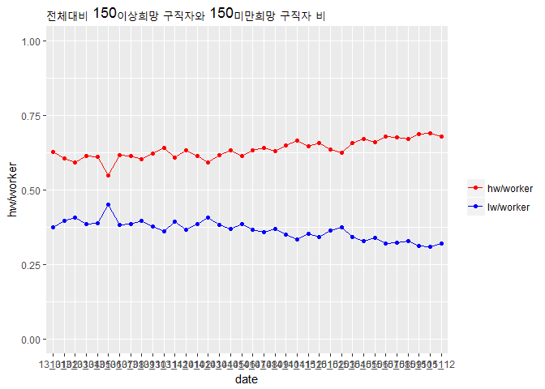
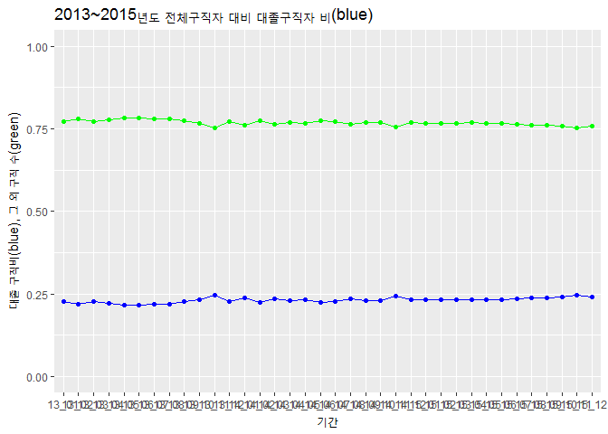
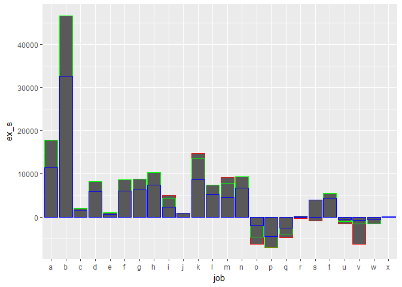
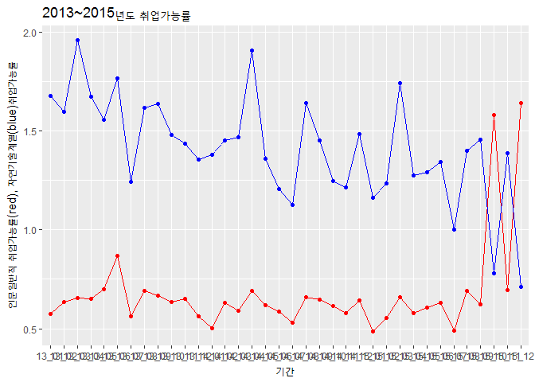

Datasciencereport:워크넷노동시장의 일자리 특성 분석 및 해석
================

1.초록
======

국가와 개인에게 있어 노동시장의 특성은 정책, 직업설정에 관련하여 공통의 중요요소이다. 그러므로 여러 노동시장 중 다수의 이용자가 있는 국가공인 구인구직사이트 "워크넷"의 계측량들을 분석 및 평가할 필요가 있다. "워크넷"에 대한 서울연구소데이터의 2013~2015년 데이터를 바탕으로 개괄적인 양적 분석과 함께 세부적으로 워크넷 노동시장의 고용형태별, 임금대별, 대졸자, 계열별의 일자리의 수와 증감을 분석하여 노동시장의 질적인 특성을 평가한다. 데이터 조사 해석에 따르면, 전반적인 노동과잉공급 현상 가운데, 워크넷 노동시장의 노동공급자들은 대체로 4인기준 최저생계비에 못미치는 임금을 받으며 법과 제도의 도움을 받지 못하는 노동시장으로 해석할 수 있다. 또한 과도한 고학력 인플레와 편향된 교육체계가 이러한 문제를 더욱 심화하고 있다고 볼 수 있다. 이에 따라 워크넷 노동시장의 노동자들이 충분히 법과 제도의 보호를 충분히 받는지 점검하는 한편, 교육체계를 바로잡고 개선시키기 위한 정책입안이 필요하다.

2. 분석 주제
============

해당기간\_2013년~2015년\_동안의 워크넷 노동시장의 양적 특성과 함께 세부적으로는 고용형태별, 임금대별, 대졸자,계열별의 일자리 양과 증감을 분석하여 노동시장의 질적인 특성 및 현황과 전망을 평가한다.

3. 데이터 선정
==============

서울연구소데이터서비스의 산업경제 일자리 구인구직 및 취업현황의 2013년~2015년 자료

데이터 선정 이유
----------------

한국고용정보원이라는 국가공인기관의 자료로서 조사과정과 분류항목을 비교적 신뢰할 수 있으며, 대중의 접근성이 확보된 ‘워크넷’이라는 홈페이지의 측정량을 데이터 출처로 하기 때문에 데이터가 비교적 균질하다고 할 수 있다. 월 단위 조사자료를 바탕으로 연도별 동향분석과 월별 동향분석이 가능하다. 이로써 워크넷 노동시장의 특성과 전망을 정확하고 세밀하게 평가하는 데 적합하다.

데이터 소개
-----------

### 출처

서울연구소데이터서비스(<http://data.si.re.kr/node/38>)

### 특성

본 데이터는 매월 말~초에 워크넷에 구인 및 구직을 신청한 구인업체 및 구직자로서 등록이 마감된 자들을 대상으로 한다. 또한 명확한 항목분류를 바탕으로 인문계열의 일자리 질과 양을 평가하기에 적합하다. 워크넷 구인자는 대체로 전문직 자격증이나 대학, 대학원 같은 고학력 구직자들만을 요구하지 않는다. 그러므로 이 데이터는 일반적인 서민들의 노동시장과 밀접한 연관을 가진다고 볼 수 있다.

### 구성

#### 구인인원: 학력대별, 규모별, 산업별, 직종별, 근무지역별 구인인원

#### 구직건수: 성별, 연령별, 학력대별, 희망직종별, 희망근무지역별 구직건수 및 취업건수

#### 임금관련: 학력별, 종사상지위별, 직종별 제시임금 및 희망임금

4. 분석
=======

분석 목적 및 방법
-----------------

원본데이터의 월별, 연도별 구직수와 구인수를 분석하여 개괄적인 ‘노동시장 양적 동향’을 평가한다. 세부적으로 고용형태별, 임금별, 학력별(대졸자중심)으로 분류한 뒤 구인수과 구직수을 비교분석하여 ‘노동시장의 질적인 측면’을 평가한다. 또한 직업중분류를 인문계열과 자연계열로 새로이 분류한 뒤 위 시장에서의 ‘인문계열의 일자리 증감과 추이’를 평가한다.

변수 검토 및 전처리
-------------------

원본 데이터의 신규구인\_개괄, 신규구직\_개괄에서 해당기간 동안의 전체 ‘노동수요량(TD)’과 ‘노동공급량(TS)’을 구할 수 있다. 또한 고용형태별, 임금대별, 학력별 항목 속에서 ‘계약 기간이 없는 정규직(re)과 계약기간이 있는 계약직(irre) 수와 비율’과 ‘임금이 150만원 미만의 일자리(150dw)와 이상(150up)의 일자리 수와 비율’ 그리고 ‘대졸자(u)의 일자리 수와 비율’을 구한다. 구인\_직업중분류와 구직\_직업중분류에서는 일자리 분류를 인문계열(m), 자연계열(e) 그리고 무관(na)로 새롭게 분류한 뒤 각각의 수와 비율을 구할 수 있다.

``` r
#1.특정 연도의 수요측면 전처리

##원본 엑셀파일 불러오기
library(readxl)
library(dplyr)
library(ggplot2)

a1 <- read_excel("14_1.xls",sheet = 1)
a2 <- read_excel("14_2.xls",sheet = 1)
a3 <- read_excel("14_3.xls",sheet = 1)
a4 <- read_excel("14_4.xls",sheet = 1)
a5 <- read_excel("14_5.xls",sheet = 1)
a6 <- read_excel("14_6.xls",sheet = 1)
a7 <- read_excel("14_7.xls",sheet = 1)
a8 <- read_excel("14_8.xls",sheet = 1)
a9 <- read_excel("14_9.xls",sheet = 1)
a10 <- read_excel("14_10.xls",sheet = 1)
a11 <- read_excel("14_11.xls",sheet = 1)
a12 <- read_excel("14_12.xls",sheet = 1)


##하나의 데이터 프레임으로
A <- bind_rows(a1,a2,a3,a4,a5,a6,a7,a8,a9,a10,a11,a12)
##혹시 모를 결측치 제거
A2 <- na.omit(A)
##월별 정규+비정규 토탈
A2_total <- A2 %>% 
  group_by(date) %>% 
  summarise(TD = sum(total))
##월별 정규 토탈
A2_re <- A2 %>% 
  filter(employ == 'regular') %>% 
  group_by(date) %>% 
  summarise(TreD = sum(total))
##위의 두 표 합침
A2_toto <- left_join(A2_total, A2_re, by = 'date')
##비율 항목 추가
A2_toto <- A2_toto %>% 
  group_by(date) %>% 
  mutate(reRD = TreD/T, irreRD = 1- reRD)

##정리
write.csv(A2_toto, "14_re_all2.csv")

#책에는 없는 패키지를 통한 정리;엑셀저장 install.pakages("xlsx")->library("xlsx")->write.xls(A2_toto, "14_re_all.xls")

#2.동일과정 공급에도 적용 후 다 해에도 적용.

#3.변수 통합 후 자료 종합
all13 <- read.csv("13_re_all.csv")
all14 <- read.csv("14_re_all.csv")
all15 <- read.csv("15_labor_all.csv")

all13 <- all13 %>% 
  select(date, RD, Tre, TD, T) %>%
  rename(TreD=RD) %>% 
  mutate(employ=TreD/Tre, re.employ=TD/T)

all14 <- all14 %>% 
  select(date, TreD, Tre, TD, T) %>% 
  mutate(employ=TreD/Tre, re.employ=TD/T)

all15 <- all15 %>% 
  select(date, re, S_to, to, S_re) %>%
  rename(TreD=re, Tre=S_to, TD=to, T=S_re) %>% 
  mutate(employ=TreD/Tre, re.employ=TD/T)

#책에는 없는 함수
group_all <- rbind(all13, all14, all15)
```

분석 및 해석
------------

### 1.워크넷 노동시장의 개괄적인 양적 분석 및 해석

``` r
ggplot(group_all, aes(x=date,y=TD,group=1))+geom_line(colour="red")+geom_point(colour="red")+geom_line(aes(x=date,y=T),colour="blue")+geom_point(aes(x=date,y=T,group=1),colour="blue") + ylim(100000, 650000) + xlab('기간') +
  ylab('전체 구인 수(red), 정규직 구직 수(blue)') +
  ggtitle('2013~15년도 전체 구인구직 대비')
```


전반적으로 노동공급량은 평균 35만명으로 노동수요의 1.5배가량으로 과잉공급현상이 발생하고 있다. 13년 6~7월의 경우, 정부의 워크넷구직자 국가전략산업직종훈련정책보조금이 크게 증가하여 유달리 가파른 구직자 증가세를 보인다. 또한 구직자의 변동폭에 비해 구인수의 변동폭이 전반적으로 작다.

이로부터 전반적으로 워크넷 시장에 일자리가 충분하지 않으며 노동수요는 비교적 비탄력적이라고 해석할 수 있다., 한편 정부의 보조금정책이 일시적으로나마 구직활동을 견인하나 본질적으로 새로운 일자리 창출에는 큰 의미가 없다고 해석할 수 있다.

### 2.워크넷 노동시장의 세부요소 분석 및 해석

#### 1고용형태별 구인구직

##### 1).고용형태별 구인구직 3년 그래프(2013~2015)

###### (1). 일반취업가능률(구인/구직자 비율) = employ(green), 정규직취업가능률(정규직 구인/정규직 구직자 비율) = re.employ(blue) ==&gt; 정규직 취업가능률 &gt; 일반 취업가능률 ...

``` r
ggplot(group_all, aes(x=date,y=employ, group=1))+geom_line(colour="blue")+geom_point(colour="blue")+geom_line(aes(x=date, y=re.employ), colour="green", )+geom_point(aes(x=date,y=re.employ, group=1),colour="green")+ylim(0,1) + xlab('기간') +
  ylab('정규직희망자 취업가능률(blue), 전체 취업가능률(green)') +
  ggtitle('2013~2015년도 취업가능률')
```


#### 2.고용형태별 구인구직 3년 분석 및 해석(2013~2015)

전체 구직자의 취업가능률에 비해 정규직희망자의 취업가능률이 더 높다.이는 정규직희망자의 취업률이 비정규 혹은 무관 희망자의 취업가능률보다 상대적으로 높음을 의미한다.

이러한 현상은 노동시장에서 노동자의 권익이 매우 잘지켜지거나 그렇지 않다면 워크넷 노동시장의 일자리특성에 기인한다고 볼 수있다. 워크넷 노동시장의 일자리가 정규직으로서 오랜기간 일하기에 노동강도가 강하면 이러한 현상이 일어날 수 있다.

#### 2임금별 구인구직

``` r
#변수설정
w13_raw<- read.csv("13_w.csv")
w14_raw <- read.csv("14_w.csv")
w15_raw <- read.csv("15_w.csv")

w13 <- w13_raw %>%
  select(date,un150D, up150D, un150, totD, up150, tot) %>% 
  rename(lowjob=un150D, highjob=up150D, lw=un150, job=totD, hw=up150, worker=tot) %>% 
  mutate(rate=job/worker, r_low = lowjob/lw, r_high = highjob/hw)

w14 <- w14_raw %>%
  select(date, T150dwD, T150upD, TD, T150dw, T150up, T) %>% 
  rename(lowjob=T150dwD, highjob=T150upD, job=TD, lw=T150dw, hw=T150up, worker=T) %>% 
  mutate(rate=job/worker, r_low = lowjob/lw, r_high = highjob/hw)

w15 <- w15_raw %>%
  select(date, dlw_m, dhw__m, dW_to, slw_m, shw__m, sW_to) %>% 
  rename(lowjob=dlw_m, highjob=dhw__m, job=dW_to, lw=slw_m, hw=shw__m, worker=sW_to) %>% 
  mutate(rate=job/worker, r_low = lowjob/lw, r_high = highjob/hw)

w <- rbind(w13, w14, w15)
w<-w %>% 
  mutate(lw.employ=lowjob/lw, hw.employ=highjob/hw)
```

##### 1).임금별 구인구직 그래프(2013~2015)

###### (1)임금별 구인구직 3년 그래프(2013~2015)

``` r
ggplot(w,aes(x=date)) +
  geom_line(aes(y=hw/worker, group=2,colour = "hw/worker")) +
  geom_line(aes(y=lw/worker,group=1, colour = "lw/worker")) +
  geom_point(aes(y=hw/worker, colour = "hw/worker")) +
  geom_point(aes(y=lw/worker, colour = "lw/worker")) +
  scale_colour_manual("",
                      breaks = c("hw/worker", "lw/worker"),
                      values = c("red", "blue")) +ylim(0,1)+
  ggtitle("전체 대비 150이상희망 구직자와 150미만희망 구직자 비")
```



###### (2))임금별 구인구직 3년 그래프(2013~2015)

``` r
ggplot(w,aes(x=date)) +
  geom_line(aes(y=lw.employ, group=2,colour = "lw.employ")) +
  geom_line(aes(y=hw.employ,group=1, colour = "hw.employ")) +
  geom_point(aes(y=lw.employ, colour = "lw.employ")) +
  geom_point(aes(y=hw.employ, colour = "hw.employ")) +
  scale_colour_manual("",
                      breaks = c("lw.employ", "hw.employ"),
                      values = c("red", "blue")) +
  ggtitle("각각 임금 월 150미만(blue), 150이상 희망의 취업가능률")
```


##### 2).임금별 구인구직 분석 및 해석(2013~2015)

전체 구직희망자 중에 60~70%이상이 150만원 이상의 임금을 받고자 하나, 이들 중 절반 정도만이 그러한 직장에 취업이가능하며, 그들 중 나머지는 4인기준최저생계비(155<sub>165만원.</sub>20132015년)에 못받는다.

4인기준 최저생계비를 기대하지 않는 구직자의 취업가능률이 월등히 높다는 것은 워크넷 노동시장의 임금이 충분히 노동자의 삶의 질을 고려하않았다고 해석할 수 있다.

#### 3대졸 구인구직

``` r
#종합보고서의 rename,na.omit,group_by,summarise 등 전처리 및 파생변수생성을 전제합니다.

#수요공급종합 자료 불러들이기

a <- read.csv("13_U_All.csv")
a1 <- read.csv("141ALL.u.csv")
a2 <- read.csv("15_labor_all.csv")

#변수설정
a <- a %>% 
  select(date, UD, US, TD, TS)%>% 
  mutate(employ=UD/US, u.employ=TD/TS)

a1 <- a1 %>% 
  select(date, UD, U, TD, T) %>%
  rename(US=U,TS=T) %>% 
  mutate(employ=UD/US, u.employ=TD/TS)

a2 <- a2 %>% 
  select(date, uni_to, S_uni, edu_to, S_edu) %>%
  rename(UD=uni_to, US=S_uni, TD=edu_to, TS=S_edu) %>% 
  mutate(employ=UD/US, u.employ=TD/TS)

all<-rbind(a,a1,a2)
all<-all %>% mutate(UR=US/TS, unUR=1-UR)
```

###### (1)대졸 구직자 비(red), 그외 구직(blue) 수 시계열

``` r
ggplot(all, aes(x=date,y=UR,group=1))+geom_line(colour="blue")+geom_point(colour="blue")+geom_line(aes(x=date,y=unUR),colour="green")+geom_point(aes(x=date,y=unUR,group=1),colour="green") + ylim(0,1) + xlab('기간') +
  ylab('대졸 구직비(blue), 그 외 구직 수(green)') +
  ggtitle('2013~2015년도 전체구직자 대비 대졸구직자 비(blue)')
```



###### 2. 전체취업가능률(전체 구인/전체 구직자 비율) = employ(green), 대졸취업가능률(대졸 구인/대졸구직자 비율) = re.employ(blue)

``` r
ggplot(all, aes(x=date,y=employ, group=1))+geom_line(colour="blue")+geom_point(colour="blue")+geom_line(aes(x=date, y=u.employ), colour="green", )+geom_point(aes(x=date,y=u.employ, group=1),colour="green")+ylim(0,1) + xlab('기간') +
  ylab('대졸 취업가능률(blue), 전체 취업가능률(green)') +
  ggtitle('2013~2015년도 취업가능률')
```


##### 2.대졸 구인구직 3년 분석 및 해석(2013~2015)

구직자 중에 대졸자가 평균 약 10만명으로 전체 구직자의 25%가량을 차지함에도 대졸 구직희망자의 취업률은 전체 취업률이 50% to 70%에 분포한데 반해 3 to 5%에 머문다. 워크넷 노동시장에서 대졸 일자리에 대한 심각한 공급과잉현상이 발생하고 있다.

이는 워크넷 노동시장의 일자리가 대졸이상의 고학력 일자리보단 생산직이나 비숙련일자리임을 의미한다고 해석할 수 있다. 한편 우리나라의 교육인플레 문제가 이러한 노동시장에서 대졸자 과잉공급현상으로 드러났다고 해석할 수 있으며 정상적인 경제 균형 형성이 불가능하다고 볼 수있다.

근원적으로 산업의 고도화와 자동화 경향을 고려할 때, 모든 노동시장에서 이런 과잉노동공급이 발생한다면 과잉인간사회가 문제라고 할 수 있다.

#### 4직종별 구인구직

##### 1)직종 구인구직 3년 그래프(2013~2015)

``` r
#변수설정
D_13 <- read.csv("2013_D.csv")   #13년도 구인 자료를 불러온다.
D_13_1 <- D_13 %>%               #직종별 구인 평균치를 구한다.  
  group_by(job) %>% 
  summarise(D_M = mean(total))

S_13 <- read.csv("2013_S.csv")   #13년도 구직 자료를 불러온다.
S_13_1 <- S_13 %>%               #직종별 구직 평균치를 구한다.
  group_by(job) %>% 
  summarise(S_M = mean(total))

DS_13 <- left_join(D_13_1, S_13_1, by = 'job')       # 직종별 구인/구직 평균치를 하나의 데이터를 만든다.
DS_13 <- DS_13 %>%                # 구인 평균치에서 구직 평균치를 빼서 초과 수요치를 파생변수로 추가한다.
  group_by(job) %>% 
  mutate(ex_s = S_M - D_M)

D_14 <- read.csv("2014_D.csv")
D_14_1 <- D_14 %>%
  group_by(job) %>% 
  summarise(D_M = mean(total))

S_14 <- read.csv("2014_S.csv")
S_14_1 <- S_14 %>% 
  group_by(job) %>% 
  summarise(S_M = mean(total))

DS_14 <- left_join(D_14_1, S_14_1, by = 'job')
DS_14 <- DS_14 %>%
  group_by(job) %>% 
  mutate(ex_s14 = S_M - D_M)

D_15 <- read.csv("2015_D.csv")
D_15_1 <- D_15 %>%
  group_by(job) %>% 
  summarise(D_M = mean(total))

S_15 <- read.csv("2015_S.csv")
S_15_1 <- S_15 %>% 
  group_by(job) %>% 
  summarise(S_M = mean(total))

DS_15 <- left_join(D_15_1, S_15_1, by = 'job')
DS_15 <- DS_15 %>%
  group_by(job) %>% 
  mutate(ex_s15 = S_M - D_M)


ggplot(data = DS_13, aes(x = job, y = ex_s)) +   # 직종별 구인 평균치를 그래프로 나타낸다.
  geom_col(colour="red")+
  geom_col(data=DS_14,aes(x = job, y = ex_s14), colour="green")+
  geom_col(data=DS_15,aes(x = job, y = ex_s15), colour="blue")
```



##### 2.직종별 구인구직 3년 분석 및 해석(2013~2015)

대다수의 직종에서 노동초과공급이 발생하는 와중에 일부 직종에서 초과수요현상이 발생한다. 한편, 해가 갈수록 공급량과 수요량의 차이가 작아지는 현상이 나타난다.

이는 전반적인 노동초과현상과 관련하여 특정직종에 한하여 초과공급 또는 초과수요가 있음을 증명할 수있다. 또한 시간의 흐름에 따라 노동시장에서 '보이지 않는 손'에 의해 균형점을 찾아가는 것이라고해석할 수 있다.

#### 4직군별 구인구직

##### 1)직군별 구인구직 3년 그래프(2013~2015)

``` r
AD <- read.csv("2013_D.csv")   #3년치 직종별 구인 자료를 통합합니다.
BD <- read.csv("2014_D.csv")
CD <- read.csv("2015_D.csv")
TD <- bind_rows(AD,BD,CD)

AS <- read.csv("2013_S.csv")   #3년치 직종별 구직 자료를 통합합니다.
BS <- read.csv("2014_S.csv")
CS <- read.csv("2015_S.csv")
TS <- bind_rows(AS,BS,CS)
#직종의 수요, 공급 직군화

##자연기술계열={기계관련직o,재료관련직p, 화확관련직q,식품가공관련직u, 생산단순직v,농림어업관련직w}
TTD <- TD  %>% 
  filter(job %in% c("o","p","q","u","v","w")) %>%
  group_by(date) %>%
  summarise(TsumD=sum(total))

##인문일반직={ 그 외 직종들}
TMD <- TD  %>%
  group_by(date) %>%
  summarise(MsumD=sum(total))

##동일과정 

TTS <- TS  %>% 
  filter(job %in% c("o","p","q","u","v","w")) %>%
  group_by(date) %>%
  summarise(TsumS=sum(total))
##인문일반직={ 그 외 직종들}
TMS <- TS  %>%
  group_by(date) %>%
  summarise(MsumS=sum(total))

re.TS<-left_join(TMS,TTS, by="date")
re.TD<-left_join(TMD,TTD, by="date")
re.all<-left_join(re.TD, re.TS, by="date")

re.all<-re.all %>% 
  mutate(TD=MsumD+TsumD,TS=MsumS+TsumS, MRS=MsumS/TS,TRS=1-MRS,m.empoly=MsumD/MsumS, t.employ=TsumD/TsumS)
```

``` r
ggplot(re.all, aes(x=date,y=MRS,group=1,))+geom_line(colour="red")+geom_point(colour="red")+geom_line(aes(x=date, y=TRS), colour="blue" )+geom_point(aes(x=date,y=TRS, group=1),colour="blue")+ylim(0,1)+ xlab('기간') +
  ylab('전체대비 자연기술구직자,인문일반구직자 비')
```


``` r
ggplot(re.all, aes(x=date,y=m.empoly,group=1,))+geom_line(colour="red")+geom_point(colour="red")+geom_line(aes(x=date, y= t.employ), colour="blue" )+geom_point(aes(x=date,y=t.employ, group=1),colour="blue")+ xlab('기간') +
  ylab('인문일반직 취업가능률(red), 자연기술계열(blue)취업가능률') +
  ggtitle('2013~2015년도 취업가능률')
```



#####2)직군별 구인구직 3년 분석 및 해석(2013 to 2015)

전체 구직자의 약 75%를 차지하는 인문일반 직군 구직자의 취업가능률은 대개 50 to 60%인데 반해 전체의 25%를 차지하는 자연기술계열 직군 구직자의 취업가능률은 대게 150%를 유지한다. 또한 다른 그래프와 비교하여 직군별 비중은 매우 일정하게 유지된다. 15년 말에 급격한 변동은 16년 초부터 청년고용 기업에게 세재혜택을 주는 정책에 기인한다고 볼 수 있다.

이러한 현상의 배경에는 워크넷 구직시장의 일자리 특성과 함께, 현 우리나라의 교육이 인문일반직에 치중되었기 때문이라고 해석할 수 있다. 관습적으로 블루칼라에 대한 차별이 자연스러운 경제 흐름을 막는 것이다. 또한 현재 인문일반직군을 재교육할 국가적 차원의 시설이 없다고 해석할 수 있다.

한편, 13년 7월의 정책과 비교할 때, 노동시장의 전반적인 과잉공급현상의 원인인 인문일반직의 낮은취업가능률은 노동수요자 중심의 정책을 통해 효과적으로 해소할 수 있다고 볼 수 있다. 구직자 전반에 대한 지원정책보다 노동수요자중심의 직군별 정책입안이 필요한 것이다.

#### 5종합 해석

전반적인 노동과잉공급 현상 가운데, 두가지 상반되어 보이는 현상이 양립한다. 그러나 정규직이 사업자에겐 결국 더 높고 많은 임금을 의미한다는 점에서 정규직 희망자의 높은 취업가능률은 명목적이고 사실상 최저생계비에 못미치는 임금을 받으며 법과 제도의 도움을 받지 못하는 노동시장으로 해석할 수 있다.

이러한 노동시장의 질 적 개선과 수요와 공급 사이의 경제적 균형 형성은 과도한 고학력 구직자에 의해 방해받으며 이들에 대한 새로운 재교육이나 동기가 제공되지 않는 한 불가능하다고 해석할 수 있다.

한편, 편향된 교육체계가 직종사이의 수급 불균형을 낳고 있다고 해석할 수 있다. 그러나 직군별 노동공급량의 추이가 고정적이라는 점에서 새로운 재교육 기반이 절대적으로 부족하다고 해석할 수 있다.

현 워크넷 노동자들의 권익이 잘 보호되는지 확인해보고 노동공급자보단 수요자 측면 중심으로 보조금을 지원해야 한다. 한편, 편향된 교육체계를 바로잡고 현재의 노동공급자들을 재교육할 정책이 요구된다.

5. 논의
=======

한계점과 비판점
---------------

데이터 특성의 조사대상 한계로 표본에서 제외되는 집합이 불가피하게 발생한다. 대체로 이 홈페이지의 구인자들은 전문직 자격증이나 대학, 대학원 졸업증을 요구하지 않는다. 이에 따라 대학, 대학원을 졸업한 고학력 구직자에게는 유의미한 계측량이 되기 어렵다. 전처리된 데이터는 3년이란 단기 데이터로 장기적인 경향을 분석하는 데는 한계가 있다. 어떤 경제적 이슈에 의한 결과론적인 해석 도출은 가능하더라도, 그러한 경제적 이슈를 특정짓고 추론하기에는 데이터상의 한계가 있다. 보고서의 취업가능률 정의는 경제학의 취업률 정의와 상의하다. 주어진 일자리에 대해 구직자가 필히 받아들이는 것이 아니기 때문에 경제학적 취업률은 더욱 낮을 것이다. 또한 한정된 경제학적 분석능력에 따라 해석에 한계가 있다.

추후분석방향
------------

노동시장에 대해 보다 긴 기간 데이터를 바탕으로 보다 본질적이고 장기적인 분석과 평가를 해야 한다. 또한 더욱 다양하고 균질한 표본을 추가하여 노동시장에 대한 다각적이고 다층적인 비교평가가 필요하다. 그리고 매해 중대한 경제적 이슈에 의해 매우 불규칙한 변화가 측정되므로 이에 대한 추가적인 정보수집과 평가가 요구된다. 더불어 보다 많은 경제학적 전문지식과 함께 학계의 단어 정의와 호환가능한 단어를 사용해야 한다.
