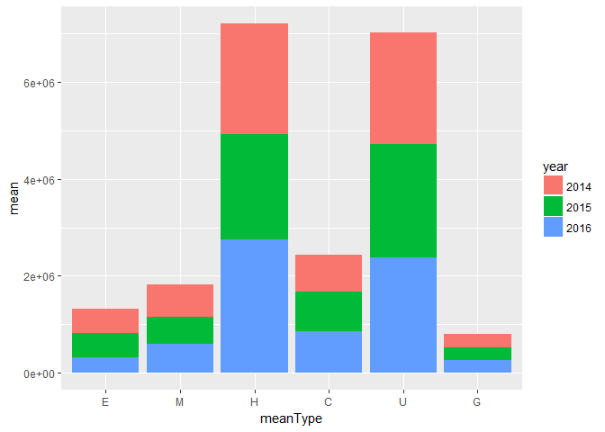

&lt;2014~2016년 연도 및 지역별 학력-여행자 수의 관계 분석&gt;
================

### <서론>

#### 초록

근래의 국내 여행 시장 약화 추세로 인해 국내 여행 진흥을 위한 다양한 시도가 이루어지고 있다. 그만큼 실질적인 국내 여행 참가자들의 데이터의 중요성도 높아졌기에 이를 알아봄으로써 국내 여행자들의 특성에 대해 파악을 할 수 있다. 특히나 학력을 중요시하는 대한민국에서 "여행" 이라는 여가를 어떤 학력을 가진 사람들이 많이 즐기는 지를 분석한다면 여행 홍보 타겟을 정하여 홍보 할 수 있을 것이다. 본 보고서는 "연도 및 지역별"을 기준으로 "학력-여행자 수의 관계"의 순서로 분석하였다. 분석의 결과로는 "고등학교"를 졸업한 여행자의 수가 가장높게 나타났고, 그 다음으로는 "대학교"를 졸업한 여행자의 수가 높게 나타났다. 이 두개의 학력이 다른 학력에 비해 현저히 높은 수치를 보였다.

### <본론_분석>

데이터 불러오기
---------------

먼저 분석에 필요한 패키지를 로드한다. 데이터를 불러오기 위한 `readxl` 패키지와 구문 작성 및 그래프 작성에 필요한 `dplyr`, `ggplot2` 패키지를 로드한다.

``` r
library(ggplot2)
```

    ## Warning: package 'ggplot2' was built under R version 3.4.2

``` r
library(dplyr)
```

    ## 
    ## Attaching package: 'dplyr'

    ## The following objects are masked from 'package:stats':
    ## 
    ##     filter, lag

    ## The following objects are masked from 'package:base':
    ## 
    ##     intersect, setdiff, setequal, union

``` r
library(readxl)
```

    ## Warning: package 'readxl' was built under R version 3.4.2

다음으로 데이터를 불러온다. `read_excel()`을 이용해 데이터를 불러온 뒤, 데이터 sheet를 사용하고, 첫 번째 행이 변수명이었으므로 `col_names`는 `T`로 입력한다.

``` r
travel <- read_excel("travel2.xlsx", sheet=1, col_names = T)
travel
```

    ## # A tibble: 476 x 6
    ##    `통계분류(1)` `통계분류(2)`  항목   `2014`   `2015`   `2016`
    ##            <chr>         <chr> <chr>    <dbl>    <dbl>    <dbl>
    ##  1          전체          소계  서울 12580581 12451891 13237854
    ##  2          <NA>          <NA>  부산  6665173  7158553  7414157
    ##  3          <NA>          <NA>  대구  3554687  3163161  3137687
    ##  4          <NA>          <NA>  인천  4464192  4407063  5420706
    ##  5          <NA>          <NA>  광주  2263117  2135332  2401244
    ##  6          <NA>          <NA>  대전  3123627  2984929  3497887
    ##  7          <NA>          <NA>  울산  1787673  1632410  2043956
    ##  8          <NA>          <NA>  세종   366885   333329   740710
    ##  9          <NA>          <NA>  경기 15283727 15451755 16826706
    ## 10          <NA>          <NA>  강원 12282959 11559005 11683223
    ## # ... with 466 more rows

불러온 데이터가 어떤 속성을 가지고 있는지, 결측치가 있는지 `str()`함수와 `table(is.na())`를 이용하여 확인한 후 데이터 훼손을 막기 위해 복사한다.

``` r
str(travel)
```

    ## Classes 'tbl_df', 'tbl' and 'data.frame':    476 obs. of  6 variables:
    ##  $ 통계분류(1): chr  "전체" NA NA NA ...
    ##  $ 통계분류(2): chr  "소계" NA NA NA ...
    ##  $ 항목       : chr  "서울" "부산" "대구" "인천" ...
    ##  $ 2014       : num  12580581 6665173 3554687 4464192 2263117 ...
    ##  $ 2015       : num  12451891 7158553 3163161 4407063 2135332 ...
    ##  $ 2016       : num  13237854 7414157 3137687 5420706 2401244 ...

``` r
travel_new4 <- travel
```

#### 1. 학력별 연도에 따른 국내 여행자수 평균 비교

분석을 위해 필요한 항목들만 추출해 새로운 변수를 만든다.

``` r
total <- travel_new4[1:17,3:6]

man <- travel_new4[18:34,3:6]

woman <- travel_new4[35:51, 3:6]

elementary <- travel_new4[375:391, 3:6]

middle <- travel_new4[392:408, 3:6]

high <- travel_new4[409:425, 3:6]

college <- travel_new4[426:442, 3:6]        ##전문대 재/졸

university <- travel_new4[443:459, 3:6]     ##대학교 재/졸

graduate <- travel_new4[460:476, 3:6]    ##대학원 재/졸
```

`cbind()`를 이용해 각 항목에서 연도별 데이터를 추출해서 합친다.

``` r
#2014년 데이터 
school_2014 <- cbind(man[,c(1,2)], woman[,2], elementary[,2], middle[,2], high[,2], college[,2], university[,2], graduate[,2])
school_2014
```

    ##    항목    2014    2014    2014    2014    2014    2014    2014   2014
    ## 1  서울 5679692 6900889  909563 1192116 4037674 1383303 4464100 593825
    ## 2  부산 3186234 3478939  356630  776539 2244970  601823 2424072 261139
    ## 3  대구 1704851 1849836  241968  254429 1315601  321217 1253267 168205
    ## 4  인천 2085968 2378224  380649  519750 1417499  561373 1447582 137339
    ## 5  광주 1158819 1104298  276381  231901  785654  199995  698658  70528
    ## 6  대전 1508478 1615149  206209  255856  955981  396924 1120097 188560
    ## 7  울산  830784  956889   99799  184725  710560  123221  622894  46474
    ## 8  세종  209194  157691   22309   31096  110208   85268  101560  16444
    ## 9  경기 7186353 8097374 1024549 1463648 5106450 1960861 5094471 633748
    ## 10 강원 5990236 6292723  737541 1038769 4020030 1475777 4481816 529026
    ## 11 충북 2368343 2843721  441024  633695 1808258  589276 1615261 124550
    ## 12 충남 4799826 4958422  785716 1009643 3024432 1429567 3058462 450428
    ## 13 전북 3622001 4209072  624407  782041 2515914  902871 2674081 331759
    ## 14 전남 3445811 3884633  801291  749418 2541055  837386 2125310 275984
    ## 15 경북 4684999 4943875  590924 1019150 3540494  926838 3222662 328806
    ## 16 경남 4670726 5018457  826095  820776 3395200  892694 3439108 315310
    ## 17 제주 1651470 2026254  207310  357735 1174346  365683 1332486 240164

추출한 데이터의 칼럼의 이름을 통일하기위해 변경한다.

``` r
names(school_2014) <- c("city", "man", "woman", "elementary", "middle", "high", "college", "university", "graduate")
school_2014   
```

    ##    city     man   woman elementary  middle    high college university
    ## 1  서울 5679692 6900889     909563 1192116 4037674 1383303    4464100
    ## 2  부산 3186234 3478939     356630  776539 2244970  601823    2424072
    ## 3  대구 1704851 1849836     241968  254429 1315601  321217    1253267
    ## 4  인천 2085968 2378224     380649  519750 1417499  561373    1447582
    ## 5  광주 1158819 1104298     276381  231901  785654  199995     698658
    ## 6  대전 1508478 1615149     206209  255856  955981  396924    1120097
    ## 7  울산  830784  956889      99799  184725  710560  123221     622894
    ## 8  세종  209194  157691      22309   31096  110208   85268     101560
    ## 9  경기 7186353 8097374    1024549 1463648 5106450 1960861    5094471
    ## 10 강원 5990236 6292723     737541 1038769 4020030 1475777    4481816
    ## 11 충북 2368343 2843721     441024  633695 1808258  589276    1615261
    ## 12 충남 4799826 4958422     785716 1009643 3024432 1429567    3058462
    ## 13 전북 3622001 4209072     624407  782041 2515914  902871    2674081
    ## 14 전남 3445811 3884633     801291  749418 2541055  837386    2125310
    ## 15 경북 4684999 4943875     590924 1019150 3540494  926838    3222662
    ## 16 경남 4670726 5018457     826095  820776 3395200  892694    3439108
    ## 17 제주 1651470 2026254     207310  357735 1174346  365683    1332486
    ##    graduate
    ## 1    593825
    ## 2    261139
    ## 3    168205
    ## 4    137339
    ## 5     70528
    ## 6    188560
    ## 7     46474
    ## 8     16444
    ## 9    633748
    ## 10   529026
    ## 11   124550
    ## 12   450428
    ## 13   331759
    ## 14   275984
    ## 15   328806
    ## 16   315310
    ## 17   240164

2014년 데이터와 마찬가지로 2015년, 2016년 데이터를 생성한다.

``` r
#2015년 데이터
school_2015 <- cbind(man[,c(1,3)], woman[,3], elementary[,3], middle[,3], high[,3], college[,3], university[,3], graduate[,3])

names(school_2015) <- c("city", "man", "woman", "elementary", "middle", "high", "college", "university", "graduate")
school_2015
```

    ##    city     man   woman elementary  middle    high college university
    ## 1  서울 5936500 6515391     792923 1084871 3736953 1607589    4612037
    ## 2  부산 3480070 3678483     465601  456272 2334988  787368    2891224
    ## 3  대구 1507886 1655275     231858  241007 1276014  330049     983759
    ## 4  인천 1990424 2416639     323815  376882 1553712  605234    1389756
    ## 5  광주  985757 1149575     296543  147531  663647  134717     794544
    ## 6  대전 1433309 1551620     265163  228277 1009265  433292     938939
    ## 7  울산  781214  851196     109191  157185  689420  109094     524485
    ## 8  세종   94068  239261       3980    8626  117947   84049      96907
    ## 9  경기 7334898 8116857    1119285 1185164 4800301 2152311    5553566
    ## 10 강원 5663455 5895550     620481 1010486 3578682 1683112    4130685
    ## 11 충북 2322692 2818418     320340  536646 1585478  645895    1784890
    ## 12 충남 4783462 5161154     847986  914330 3398760 1386878    3066999
    ## 13 전북 3230798 3530032     643980  665065 2157609  785134    2280672
    ## 14 전남 3834223 4229315     880238  719751 2596413  879574    2707903
    ## 15 경북 4191480 4630721     618508  754952 3283174  956098    2960158
    ## 16 경남 4148802 4330765     724508  651469 2752229  788830    3240968
    ## 17 제주 2074122 2658372     221336  281540 1437805  579718    1863308
    ##    graduate
    ## 1    617518
    ## 2    223100
    ## 3    100474
    ## 4    157664
    ## 5     98350
    ## 6    109993
    ## 7     43035
    ## 8     21820
    ## 9    641128
    ## 10   535559
    ## 11   267861
    ## 12   329663
    ## 13   228370
    ## 14   279659
    ## 15   249311
    ## 16   321563
    ## 17   348787

``` r
#2016년 데이터
school_2016 <- cbind(man[,c(1,4)], woman[,4], elementary[,4], middle[,4], high[,4], college[,4], university[,4], graduate[,4])

names(school_2016) <- c("city", "man", "woman", "elementary", "middle", "high", "college", "university", "graduate")
school_2016
```

    ##    city     man   woman elementary  middle    high college university
    ## 1  서울 6153648 7084206     584814  982458 4993175 1598282    4601552
    ## 2  부산 3481215 3932941     249218  556956 2787763  851490    2710281
    ## 3  대구 1600432 1537255     121981  293940 1281150  323791    1014026
    ## 4  인천 2566923 2853783     257725  519754 2078446  621790    1715958
    ## 5  광주 1163528 1237716     131004  231437 1030666  231711     688799
    ## 6  대전 1682066 1815821     161870  293537 1084069  484112    1296526
    ## 7  울산  995151 1048806      47338  178753 1047914  173053     553827
    ## 8  세종  362288  378422      24424   98701  294546  141046     142485
    ## 9  경기 7985308 8841398     695309 1185643 6434884 2226997    5702575
    ## 10 강원 5747317 5935906     352344  936762 4160171 1506372    4233534
    ## 11 충북 2583590 2995599     256895  497745 2227586  657304    1727715
    ## 12 충남 4865165 5327268     562498  904596 4091917 1275852    2994257
    ## 13 전북 3501966 4209060     470828  713939 2954739  897754    2424823
    ## 14 전남 4232213 4847903     562489  836969 3642815 1044901    2757855
    ## 15 경북 3961299 4698537     370032  894413 3381974  933230    2818818
    ## 16 경남 4538624 4943734     448106  803200 3691254  957025    3321922
    ## 17 제주 2208882 2621070     181580  315809 1681889  608686    1861651
    ##    graduate
    ## 1    477572
    ## 2    258448
    ## 3    102799
    ## 4    227033
    ## 5     87628
    ## 6    177772
    ## 7     43072
    ## 8     39508
    ## 9    581298
    ## 10   494040
    ## 11   211943
    ## 12   363313
    ## 13   248944
    ## 14   235087
    ## 15   261368
    ## 16   260852
    ## 17   180337

`mutate()`함수를 이용해 위에서 만든 연도별 데이터에 "연도" 변수 추가한 뒤 `bind_rows()`를 이용해 다시 합쳐준다.

``` r
school_2014 <- school_2014 %>% 
  mutate(year="2014")

school_2015 <- school_2015 %>% 
  mutate(year="2015")

school_2016 <- school_2016 %>% 
  mutate(year="2016")

school <- bind_rows(school_2014, school_2015, school_2016)
school
```

    ##    city     man   woman elementary  middle    high college university
    ## 1  서울 5679692 6900889     909563 1192116 4037674 1383303    4464100
    ## 2  부산 3186234 3478939     356630  776539 2244970  601823    2424072
    ## 3  대구 1704851 1849836     241968  254429 1315601  321217    1253267
    ## 4  인천 2085968 2378224     380649  519750 1417499  561373    1447582
    ## 5  광주 1158819 1104298     276381  231901  785654  199995     698658
    ## 6  대전 1508478 1615149     206209  255856  955981  396924    1120097
    ## 7  울산  830784  956889      99799  184725  710560  123221     622894
    ## 8  세종  209194  157691      22309   31096  110208   85268     101560
    ## 9  경기 7186353 8097374    1024549 1463648 5106450 1960861    5094471
    ## 10 강원 5990236 6292723     737541 1038769 4020030 1475777    4481816
    ## 11 충북 2368343 2843721     441024  633695 1808258  589276    1615261
    ## 12 충남 4799826 4958422     785716 1009643 3024432 1429567    3058462
    ## 13 전북 3622001 4209072     624407  782041 2515914  902871    2674081
    ## 14 전남 3445811 3884633     801291  749418 2541055  837386    2125310
    ## 15 경북 4684999 4943875     590924 1019150 3540494  926838    3222662
    ## 16 경남 4670726 5018457     826095  820776 3395200  892694    3439108
    ## 17 제주 1651470 2026254     207310  357735 1174346  365683    1332486
    ## 18 서울 5936500 6515391     792923 1084871 3736953 1607589    4612037
    ## 19 부산 3480070 3678483     465601  456272 2334988  787368    2891224
    ## 20 대구 1507886 1655275     231858  241007 1276014  330049     983759
    ## 21 인천 1990424 2416639     323815  376882 1553712  605234    1389756
    ## 22 광주  985757 1149575     296543  147531  663647  134717     794544
    ## 23 대전 1433309 1551620     265163  228277 1009265  433292     938939
    ## 24 울산  781214  851196     109191  157185  689420  109094     524485
    ## 25 세종   94068  239261       3980    8626  117947   84049      96907
    ## 26 경기 7334898 8116857    1119285 1185164 4800301 2152311    5553566
    ## 27 강원 5663455 5895550     620481 1010486 3578682 1683112    4130685
    ## 28 충북 2322692 2818418     320340  536646 1585478  645895    1784890
    ## 29 충남 4783462 5161154     847986  914330 3398760 1386878    3066999
    ## 30 전북 3230798 3530032     643980  665065 2157609  785134    2280672
    ## 31 전남 3834223 4229315     880238  719751 2596413  879574    2707903
    ## 32 경북 4191480 4630721     618508  754952 3283174  956098    2960158
    ## 33 경남 4148802 4330765     724508  651469 2752229  788830    3240968
    ## 34 제주 2074122 2658372     221336  281540 1437805  579718    1863308
    ## 35 서울 6153648 7084206     584814  982458 4993175 1598282    4601552
    ## 36 부산 3481215 3932941     249218  556956 2787763  851490    2710281
    ## 37 대구 1600432 1537255     121981  293940 1281150  323791    1014026
    ## 38 인천 2566923 2853783     257725  519754 2078446  621790    1715958
    ## 39 광주 1163528 1237716     131004  231437 1030666  231711     688799
    ## 40 대전 1682066 1815821     161870  293537 1084069  484112    1296526
    ## 41 울산  995151 1048806      47338  178753 1047914  173053     553827
    ## 42 세종  362288  378422      24424   98701  294546  141046     142485
    ## 43 경기 7985308 8841398     695309 1185643 6434884 2226997    5702575
    ## 44 강원 5747317 5935906     352344  936762 4160171 1506372    4233534
    ## 45 충북 2583590 2995599     256895  497745 2227586  657304    1727715
    ## 46 충남 4865165 5327268     562498  904596 4091917 1275852    2994257
    ## 47 전북 3501966 4209060     470828  713939 2954739  897754    2424823
    ## 48 전남 4232213 4847903     562489  836969 3642815 1044901    2757855
    ## 49 경북 3961299 4698537     370032  894413 3381974  933230    2818818
    ## 50 경남 4538624 4943734     448106  803200 3691254  957025    3321922
    ## 51 제주 2208882 2621070     181580  315809 1681889  608686    1861651
    ##    graduate year
    ## 1    593825 2014
    ## 2    261139 2014
    ## 3    168205 2014
    ## 4    137339 2014
    ## 5     70528 2014
    ## 6    188560 2014
    ## 7     46474 2014
    ## 8     16444 2014
    ## 9    633748 2014
    ## 10   529026 2014
    ## 11   124550 2014
    ## 12   450428 2014
    ## 13   331759 2014
    ## 14   275984 2014
    ## 15   328806 2014
    ## 16   315310 2014
    ## 17   240164 2014
    ## 18   617518 2015
    ## 19   223100 2015
    ## 20   100474 2015
    ## 21   157664 2015
    ## 22    98350 2015
    ## 23   109993 2015
    ## 24    43035 2015
    ## 25    21820 2015
    ## 26   641128 2015
    ## 27   535559 2015
    ## 28   267861 2015
    ## 29   329663 2015
    ## 30   228370 2015
    ## 31   279659 2015
    ## 32   249311 2015
    ## 33   321563 2015
    ## 34   348787 2015
    ## 35   477572 2016
    ## 36   258448 2016
    ## 37   102799 2016
    ## 38   227033 2016
    ## 39    87628 2016
    ## 40   177772 2016
    ## 41    43072 2016
    ## 42    39508 2016
    ## 43   581298 2016
    ## 44   494040 2016
    ## 45   211943 2016
    ## 46   363313 2016
    ## 47   248944 2016
    ## 48   235087 2016
    ## 49   261368 2016
    ## 50   260852 2016
    ## 51   180337 2016

연도별로 학력 대비 여행자 수의 평균을 비교해보려 한다. `group_by()`를 이용해 year을 나누고 각 학력 별 평균을 구해 새로운 변수를 생성한다.

``` r
school_year <- school %>% 
  group_by(year) %>% 
  summarise(mean_e = mean(elementary),
            mean_m = mean(middle),
            mean_h = mean(high),
            mean_c = mean(college),
            mean_u = mean(university),
            mean_g = mean(graduate)) 

school_year
```

    ## # A tibble: 3 x 7
    ##    year   mean_e   mean_m  mean_h   mean_c  mean_u   mean_g
    ##   <chr>    <dbl>    <dbl>   <dbl>    <dbl>   <dbl>    <dbl>
    ## 1  2014 501903.8 665958.1 2276725 767886.9 2304464 277193.5
    ## 2  2015 499160.9 554120.8 2174847 820526.0 2342400 269050.3
    ## 3  2016 322262.1 602624.2 2756762 854905.6 2386271 250059.6

그래프를 만들기 위한 데이터 구성을 변경한다. 학력별 데이터를 추출한 뒤 `mutate()`와 `names()` 함수를 이용해 변수명을 새로 설정한다.

``` r
school_yearE <- school_year[,1:2]
school_yearE <- school_yearE %>% 
  mutate(meanType="E")
names(school_yearE) <- c("year",  "mean",   "meanType")
school_yearE  ##초등학교를 졸업한 사람들의 연도별 평균 
```

    ## # A tibble: 3 x 3
    ##    year     mean meanType
    ##   <chr>    <dbl>    <chr>
    ## 1  2014 501903.8        E
    ## 2  2015 499160.9        E
    ## 3  2016 322262.1        E

``` r
school_yearM <- school_year[,c(1,3)]
school_yearM <- school_yearM %>% 
  mutate(meanType="M")
names(school_yearM) <- c("year",  "mean",   "meanType")
school_yearM  ##중학교를 졸업한 사람들의 연도별 평균
```

    ## # A tibble: 3 x 3
    ##    year     mean meanType
    ##   <chr>    <dbl>    <chr>
    ## 1  2014 665958.1        M
    ## 2  2015 554120.8        M
    ## 3  2016 602624.2        M

``` r
school_yearH <- school_year[,c(1,4)]
school_yearH <- school_yearH %>% 
  mutate(meanType="H")
names(school_yearH) <- c("year",  "mean",   "meanType")
school_yearH  ##고등학교를 졸업한 사람들의 연도별 평균
```

    ## # A tibble: 3 x 3
    ##    year    mean meanType
    ##   <chr>   <dbl>    <chr>
    ## 1  2014 2276725        H
    ## 2  2015 2174847        H
    ## 3  2016 2756762        H

``` r
school_yearC <- school_year[,c(1,5)]
school_yearC <- school_yearC %>% 
  mutate(meanType="C")
names(school_yearC) <- c("year",  "mean",   "meanType")
school_yearC  ##전문대학을 졸업한 사람들의 연도별 평균
```

    ## # A tibble: 3 x 3
    ##    year     mean meanType
    ##   <chr>    <dbl>    <chr>
    ## 1  2014 767886.9        C
    ## 2  2015 820526.0        C
    ## 3  2016 854905.6        C

``` r
school_yearU <- school_year[,c(1,6)]
school_yearU <- school_yearU %>% 
  mutate(meanType="U")
names(school_yearU) <- c("year",  "mean",   "meanType")
school_yearU  ##대학교를 졸업한 사람들의 연도별 평균
```

    ## # A tibble: 3 x 3
    ##    year    mean meanType
    ##   <chr>   <dbl>    <chr>
    ## 1  2014 2304464        U
    ## 2  2015 2342400        U
    ## 3  2016 2386271        U

``` r
school_yearG <- school_year[,c(1,7)]
school_yearG <- school_yearG %>% 
  mutate(meanType="G")
names(school_yearG) <- c("year",  "mean",   "meanType")
school_yearG  ##대학원을 졸업한 사람들의 연도별 평균
```

    ## # A tibble: 3 x 3
    ##    year     mean meanType
    ##   <chr>    <dbl>    <chr>
    ## 1  2014 277193.5        G
    ## 2  2015 269050.3        G
    ## 3  2016 250059.6        G

`bind_rows()`를 이용해 데이터를 합친다.

``` r
totalYear <- bind_rows(school_yearE, school_yearM, school_yearH, school_yearC, school_yearU, school_yearG)  ##데이터 합치기 
totalYear
```

    ## # A tibble: 18 x 3
    ##     year      mean meanType
    ##    <chr>     <dbl>    <chr>
    ##  1  2014  501903.8        E
    ##  2  2015  499160.9        E
    ##  3  2016  322262.1        E
    ##  4  2014  665958.1        M
    ##  5  2015  554120.8        M
    ##  6  2016  602624.2        M
    ##  7  2014 2276725.1        H
    ##  8  2015 2174846.9        H
    ##  9  2016 2756762.2        H
    ## 10  2014  767886.9        C
    ## 11  2015  820526.0        C
    ## 12  2016  854905.6        C
    ## 13  2014 2304463.9        U
    ## 14  2015 2342400.0        U
    ## 15  2016 2386270.8        U
    ## 16  2014  277193.5        G
    ## 17  2015  269050.3        G
    ## 18  2016  250059.6        G

위에서 만든 데이터를 이용한 막대그래프를 만든다. `x축`은 meanType, `y축`은 mean으로 설정하고 `scale_x_discrete(limits=c())` 함수를 이용해 `x축` 변수의 순서를 설정해준다.

``` r
##막대그래프 만들어서 비교하기 
ggplot(data=totalYear, aes(x=meanType, y= mean, fill=year)) +
  geom_col()+
  scale_x_discrete(limits=c("E", "M","H","C","U","G"))
```



위의 그래프는 학력별 년도에 따른 평균 여행자 수를 파악할 수 있다. 전체 그래프의 순서대로는 "고등학교", "대학교", "전문대", "중학교", "초등학교","대학원" 졸업 순으로 여행자 수가 많은 것으로 나타났다. 그 안에서 연도별로 파악했을때, 대체적으로 비슷한 크기의 평균 여행 횟수가 나타난다는 것을 파악할 수 있었다. 결과적으로 이 그래프를 통해서는 고등학교를 졸업한 학력의 여행자수와 대학교를 졸업한 학력의 여행자의 수가 다른 학력에 비해 현저히 높은 수치를 보이고 있다는 것을 알수있으며, 가장 높은 사람의 수는 고등학교를 졸업한 학력의 여행자였고, 가장 낮은 사람의 수는 대학원을 졸업한 학력의 여행자이다.

#### 2. 학력별 여행지에 따른 국내 여행자수 평균 비교

지역별로 각 학력을 졸업한 사람의 수의 합을 구한다. `group_by()`를 이용해 `city`를 분류하고 `mutate()`를 통해 남녀 수를 합한 `total` 변수를 생성한다. 이후 총 인원 및 각 학력별 여행자 수의 총합을 구한 뒤 `arrange()`를 이용해 오름차순으로 정렬한다.

``` r
##1. 지역별로 각 학력을 졸업한 사람의 수의 합계 구하기
school_sum <- school %>% 
  group_by(city) %>% 
  mutate(total=man+woman) %>% 
  summarise(sum_t=sum(total),
            sum_e=sum(elementary),
            sum_m=sum(middle),
            sum_h=sum(high),
            sum_c=sum(college),
            sum_u=sum(university),
            sum_g=sum(graduate)) %>% 
  arrange((city)) 

school_sum
```

    ## # A tibble: 17 x 8
    ##     city    sum_t   sum_e   sum_m    sum_h   sum_c    sum_u   sum_g
    ##    <chr>    <dbl>   <dbl>   <dbl>    <dbl>   <dbl>    <dbl>   <dbl>
    ##  1  강원 35525187 1710366 2986017 11758883 4665261 12846035 1558625
    ##  2  경기 47562188 2839143 3834455 16341635 6340169 16350612 1856174
    ##  3  경남 27651108 1998709 2275445  9838683 2638549 10001998  897725
    ##  4  경북 27110911 1579464 2668515 10205642 2816166  9001638  839485
    ##  5  광주  6799693  703928  610869  2479967  566423  2182001  256506
    ##  6  대구  9855535  595807  789376  3872765  975057  3251052  371478
    ##  7  대전  9606443  633242  777670  3049315 1314328  3355562  476325
    ##  8  부산 21237882 1071449 1789767  7367721 2240681  8025577  742687
    ##  9  서울 38270326 2287300 3259445 12767802 4589174 13677689 1688915
    ## 10  세종  1440924   50713  138423   522701  310363   340952   77772
    ## 11  울산  5464040  256328  520663  2447894  405368  1701206  132581
    ## 12  인천 14291961  962189 1416386  5049657 1788397  4553296  522036
    ## 13  전남 24474098 2244018 2306138  8780283 2761861  7591068  790730
    ## 14  전북 22302929 1739215 2161045  7628262 2585759  7379576  809073
    ## 15  제주 13240170  610226  955084  4294040 1554087  5057445  769288
    ## 16  충남 29895297 2196200 2828569 10515109 4092297  9119718 1143404
    ## 17  충북 15932363 1018259 1668086  5621322 1892475  5127866  604354

지역별로 각 학력을 졸업한 사람의 비율을 구한다. 위에서 구한 `school_sum`을 이용해 지역별로 분류하고 각 학력별 인원의 비율을 구한 뒤 오름차순으로 정렬한다.

``` r
school_ratio <- school_sum %>% 
  group_by(city) %>% 
  summarise(ratio_e = sum_e/sum_t*100,
            ratio_m = sum_m/sum_t*100,
            ratio_h = sum_h/sum_t*100,
            ratio_c = sum_c/sum_t*100,
            ratio_u = sum_u/sum_t*100,
            ratio_g = sum_g/sum_t*100) %>% 
  arrange((city)) 

school_ratio
```

    ## # A tibble: 17 x 7
    ##     city   ratio_e   ratio_m  ratio_h   ratio_c  ratio_u  ratio_g
    ##    <chr>     <dbl>     <dbl>    <dbl>     <dbl>    <dbl>    <dbl>
    ##  1  강원  4.814517  8.405352 33.10013 13.132263 36.16036 4.387380
    ##  2  경기  5.969328  8.061982 34.35846 13.330272 34.37733 3.902625
    ##  3  경남  7.228314  8.229128 35.58151  9.542290 36.17214 3.246615
    ##  4  경북  5.825935  9.842956 37.64404 10.387574 33.20301 3.096484
    ##  5  광주 10.352350  8.983773 36.47175  8.330126 32.08970 3.772317
    ##  6  대구  6.045405  8.009469 39.29533  9.893496 32.98707 3.769232
    ##  7  대전  6.591847  8.095296 31.74239 13.681734 34.93033 4.958391
    ##  8  부산  5.044990  8.427239 34.69141 10.550398 37.78897 3.496992
    ##  9  서울  5.976693  8.516899 33.36215 11.991468 35.73967 4.413119
    ## 10  세종  3.519478  9.606544 36.27540 21.539165 23.66204 5.397370
    ## 11  울산  4.691181  9.528902 44.80007  7.418833 31.13458 2.426428
    ## 12  인천  6.732379  9.910368 35.33215 12.513307 31.85914 3.652655
    ## 13  전남  9.168951  9.422770 35.87582 11.284833 31.01674 3.230885
    ## 14  전북  7.798146  9.689512 34.20296 11.593809 33.08792 3.627654
    ## 15  제주  4.608899  7.213533 32.43191 11.737667 38.19773 5.810258
    ## 16  충남  7.346306  9.461585 35.17312 13.688765 30.50553 3.824695
    ## 17  충북  6.391136 10.469797 35.28241 11.878182 32.18522 3.793248

그래프를 만들기 위한 데이터 구성을 변경한다. 지역별 데이터를 추출한 뒤 `mutate()`와 `names()` 함수를 이용해 변수명을 새로 설정한다.

``` r
school_ratioE <- school_ratio[,1:2]
school_ratioE <- school_ratioE %>% 
  mutate(ratio="ratio_e")
names(school_ratioE) <- c("city",  "ratio",   "ratioType")
school_ratioE
```

    ## # A tibble: 17 x 3
    ##     city     ratio ratioType
    ##    <chr>     <dbl>     <chr>
    ##  1  강원  4.814517   ratio_e
    ##  2  경기  5.969328   ratio_e
    ##  3  경남  7.228314   ratio_e
    ##  4  경북  5.825935   ratio_e
    ##  5  광주 10.352350   ratio_e
    ##  6  대구  6.045405   ratio_e
    ##  7  대전  6.591847   ratio_e
    ##  8  부산  5.044990   ratio_e
    ##  9  서울  5.976693   ratio_e
    ## 10  세종  3.519478   ratio_e
    ## 11  울산  4.691181   ratio_e
    ## 12  인천  6.732379   ratio_e
    ## 13  전남  9.168951   ratio_e
    ## 14  전북  7.798146   ratio_e
    ## 15  제주  4.608899   ratio_e
    ## 16  충남  7.346306   ratio_e
    ## 17  충북  6.391136   ratio_e

``` r
school_ratioM <- school_ratio[,c(1,3)]
school_ratioM <- school_ratioM %>% 
  mutate(ratio="ratio_m")
names(school_ratioM) <- c("city",  "ratio",   "ratioType")
school_ratioM
```

    ## # A tibble: 17 x 3
    ##     city     ratio ratioType
    ##    <chr>     <dbl>     <chr>
    ##  1  강원  8.405352   ratio_m
    ##  2  경기  8.061982   ratio_m
    ##  3  경남  8.229128   ratio_m
    ##  4  경북  9.842956   ratio_m
    ##  5  광주  8.983773   ratio_m
    ##  6  대구  8.009469   ratio_m
    ##  7  대전  8.095296   ratio_m
    ##  8  부산  8.427239   ratio_m
    ##  9  서울  8.516899   ratio_m
    ## 10  세종  9.606544   ratio_m
    ## 11  울산  9.528902   ratio_m
    ## 12  인천  9.910368   ratio_m
    ## 13  전남  9.422770   ratio_m
    ## 14  전북  9.689512   ratio_m
    ## 15  제주  7.213533   ratio_m
    ## 16  충남  9.461585   ratio_m
    ## 17  충북 10.469797   ratio_m

``` r
school_ratioH <- school_ratio[,c(1,4)]
school_ratioH <- school_ratioH %>% 
  mutate(ratio="ratio_h")
names(school_ratioH) <- c("city",  "ratio",   "ratioType")
school_ratioH
```

    ## # A tibble: 17 x 3
    ##     city    ratio ratioType
    ##    <chr>    <dbl>     <chr>
    ##  1  강원 33.10013   ratio_h
    ##  2  경기 34.35846   ratio_h
    ##  3  경남 35.58151   ratio_h
    ##  4  경북 37.64404   ratio_h
    ##  5  광주 36.47175   ratio_h
    ##  6  대구 39.29533   ratio_h
    ##  7  대전 31.74239   ratio_h
    ##  8  부산 34.69141   ratio_h
    ##  9  서울 33.36215   ratio_h
    ## 10  세종 36.27540   ratio_h
    ## 11  울산 44.80007   ratio_h
    ## 12  인천 35.33215   ratio_h
    ## 13  전남 35.87582   ratio_h
    ## 14  전북 34.20296   ratio_h
    ## 15  제주 32.43191   ratio_h
    ## 16  충남 35.17312   ratio_h
    ## 17  충북 35.28241   ratio_h

``` r
school_ratioC <- school_ratio[,c(1,5)]
school_ratioC <- school_ratioC %>% 
  mutate(ratio="ratio_c")
names(school_ratioC) <- c("city",  "ratio",   "ratioType")
school_ratioC
```

    ## # A tibble: 17 x 3
    ##     city     ratio ratioType
    ##    <chr>     <dbl>     <chr>
    ##  1  강원 13.132263   ratio_c
    ##  2  경기 13.330272   ratio_c
    ##  3  경남  9.542290   ratio_c
    ##  4  경북 10.387574   ratio_c
    ##  5  광주  8.330126   ratio_c
    ##  6  대구  9.893496   ratio_c
    ##  7  대전 13.681734   ratio_c
    ##  8  부산 10.550398   ratio_c
    ##  9  서울 11.991468   ratio_c
    ## 10  세종 21.539165   ratio_c
    ## 11  울산  7.418833   ratio_c
    ## 12  인천 12.513307   ratio_c
    ## 13  전남 11.284833   ratio_c
    ## 14  전북 11.593809   ratio_c
    ## 15  제주 11.737667   ratio_c
    ## 16  충남 13.688765   ratio_c
    ## 17  충북 11.878182   ratio_c

``` r
school_ratioU <- school_ratio[,c(1,6)]
school_ratioU <- school_ratioU %>% 
  mutate(ratio="ratio_u")
names(school_ratioU) <- c("city",  "ratio",   "ratioType")
school_ratioU
```

    ## # A tibble: 17 x 3
    ##     city    ratio ratioType
    ##    <chr>    <dbl>     <chr>
    ##  1  강원 36.16036   ratio_u
    ##  2  경기 34.37733   ratio_u
    ##  3  경남 36.17214   ratio_u
    ##  4  경북 33.20301   ratio_u
    ##  5  광주 32.08970   ratio_u
    ##  6  대구 32.98707   ratio_u
    ##  7  대전 34.93033   ratio_u
    ##  8  부산 37.78897   ratio_u
    ##  9  서울 35.73967   ratio_u
    ## 10  세종 23.66204   ratio_u
    ## 11  울산 31.13458   ratio_u
    ## 12  인천 31.85914   ratio_u
    ## 13  전남 31.01674   ratio_u
    ## 14  전북 33.08792   ratio_u
    ## 15  제주 38.19773   ratio_u
    ## 16  충남 30.50553   ratio_u
    ## 17  충북 32.18522   ratio_u

``` r
school_ratioG <- school_ratio[,c(1,7)]
school_ratioG <- school_ratioG %>% 
  mutate(ratio="ratio_g")
names(school_ratioG) <- c("city",  "ratio",   "ratioType")
school_ratioG
```

    ## # A tibble: 17 x 3
    ##     city    ratio ratioType
    ##    <chr>    <dbl>     <chr>
    ##  1  강원 4.387380   ratio_g
    ##  2  경기 3.902625   ratio_g
    ##  3  경남 3.246615   ratio_g
    ##  4  경북 3.096484   ratio_g
    ##  5  광주 3.772317   ratio_g
    ##  6  대구 3.769232   ratio_g
    ##  7  대전 4.958391   ratio_g
    ##  8  부산 3.496992   ratio_g
    ##  9  서울 4.413119   ratio_g
    ## 10  세종 5.397370   ratio_g
    ## 11  울산 2.426428   ratio_g
    ## 12  인천 3.652655   ratio_g
    ## 13  전남 3.230885   ratio_g
    ## 14  전북 3.627654   ratio_g
    ## 15  제주 5.810258   ratio_g
    ## 16  충남 3.824695   ratio_g
    ## 17  충북 3.793248   ratio_g

`bind_rows()`를 이용해 데이터를 추가한다.

``` r
totalRatio <- bind_rows(school_ratioE, school_ratioM, school_ratioH, school_ratioC, school_ratioU, school_ratioG)

totalRatio
```

    ## # A tibble: 102 x 3
    ##     city     ratio ratioType
    ##    <chr>     <dbl>     <chr>
    ##  1  강원  4.814517   ratio_e
    ##  2  경기  5.969328   ratio_e
    ##  3  경남  7.228314   ratio_e
    ##  4  경북  5.825935   ratio_e
    ##  5  광주 10.352350   ratio_e
    ##  6  대구  6.045405   ratio_e
    ##  7  대전  6.591847   ratio_e
    ##  8  부산  5.044990   ratio_e
    ##  9  서울  5.976693   ratio_e
    ## 10  세종  3.519478   ratio_e
    ## # ... with 92 more rows

위에서 만든 데이터를 이용한 막대그래프를 만든다. `x축`은 city, `y축`은 ratio, `fill`은 ratioType으로 설정한다.

``` r
ggplot(data=totalRatio, aes(x=city, y=ratio, fill=ratioType )) +
  geom_col()+
  coord_flip()
```


결과 그래프를 보면 지역에 따라 대체적으로 비숫한 학력별 여행 비율이 나타난다는 것을 확인할 수 있었다. 전체적인 모양은 고등학교를 졸업한사람과 대학교를 졸업한 사람들이 여행의 비율이 높은것으로 나타났다. 이러한 결과는 앞서 분석하였던 연도별과 유사한 결과이다. 세종시를 방문한 사람들의 비율에서는 전문대학을 졸업한 사람들의 비율이 2번째로 높게 나타났다. 이는 다른 지역과 비교해보았을때 높은 비율이라고 볼 수 있다.

### <결론_논의(한계점, 비판점), 추후 분석 방향>

본 보고서의 분석 결과중 크게 눈에 띄게 주목할만한 점은 고등학교를 졸업한 여행자의 수가 연도별, 지역별로 보았을때 대체적으로 많은 수치를 보이고 있다는 것이다. 이는 "대학입시"라는 커다란 장벽을 가지고있는 대한민국 고등학생들에게 대학 합격과 동시에 자유의 시간을 누리는 현상으로도 볼 수 있다. 또한 다른지역들은 비슷한 비율의 결과를 가져왔지만 세종시 방문자의 비율중 전문대학을 졸업한사람들의 비율이 다른 지역에 비해 높은 수치를 나타내었다. 우리나라 첫 특별자치시이자, 행정복합도시인 세종시는 특정분야의 전문성을 띤다고 볼 수 있다. 위의 분석에서의 한계점은 데이터의 구성을 변경하는데에 많은 코드를 작성했다는 것이다. 더 깊은 학습을 통하여 코드는 적게 사용하되 원하는 결과를 낼수 있어야 할 것이다. 또한 다양한 시각적 요소들을 보여줄수 없었다는 점이 아쉽다고 볼 수 있다. 추후에는 단순히 학력을 비교해보기보다는 대학전공자와 여행지 간의 관계로 더 나아가 분석해 볼 수 있을 것이다. 국내여행으로 한정짓지말고 어떤분야를 전공하고 공부한 사람들이 어떤 나라로 여행을 많이 가는지를 분석해 볼 수 있을 것이다.
