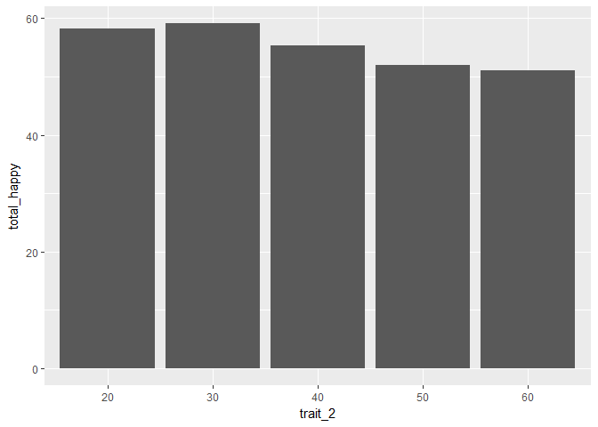

JWLEE
================

1. 요약(초록):
==============

### 2016년 세대별 스트레스 정도와 2016년 세대별 행복을 느끼는 정도를 그래프로 그려 변화의 추이를 확인하고 스트레스와 행복감의 상관관계를 추론해 보았다. 스트레스의 정도는 20대에서 30대로 넘어가면서 큰 폭으로 증가하고 50대부터 감소하는 모양을 보인다. 행복을 느끼는 정도 역시 20대에서 30대로 넘어가면서 증가하고 이후 감소하는 모양을 그린다. 행복감을 느끼는 정도와 스트레스의 정도의 모양이 비슷한 형태를 하는 것은 서로가 서로에게 1대 1로 대응하지 않음을 알 수 있다. 이를 통하여 세대별 스트레스 정도와 행복을 느끼는 정도는 서로 상관관계에 있다고 할 수 없다.

2. 분석 주제:
=============

### 스트레스의 유무는 행복을 느끼는 것에 대한 원인으로서의 독립변수가 될 수 있는가?

3. 데이터 선정
==============

데이터 선정 이유:
-----------------

### 통계청에서는 매년 국민들의 스트레스 정도와 행복감을 느끼는 정도에 관하여 설문을 통해 데이터를 수집하고 있다. 다년간 축적된 데이터를 통해 높은 신뢰수준을 가지고 있는 양질의 데이터를 제공할 것이라 생각되기에 통계청의 데이터를 선정하였다.

데이터 소개:
------------

### KOSIS에서 제공하는 우리나라 사회조사로, 전반적인 생활 스트레스 정도와 행복을 느끼는 정도에 관한 데이터이다. 전국을 대상으로 하며, 변수로는 지역, 성별, 연령, 교육정도, 혼인상태, 경제활동, 산업, 직업, 가구소득, 흡연량 등 매우 다양하게 존재한다.

4. 분석
=======

분석 목적 및 방법
-----------------

### 분석 목적

### 스트레스의 정도는 과연 행복을 느끼는 것에 영향을 미치는가?

### 방법

### 2016년의 세대별 스트레스 정도와 행복을 느끼는 정도의 분포 그래프를 통해 확인하고 그래프의 형태에 따른 상관관계 분석

#### 페키지 로드하기

``` r
library(dplyr) #전처리
```

    ## 
    ## Attaching package: 'dplyr'

    ## The following objects are masked from 'package:stats':
    ## 
    ##     filter, lag

    ## The following objects are masked from 'package:base':
    ## 
    ##     intersect, setdiff, setequal, union

``` r
library(ggplot2) #시각화
library(readxl) #엑셀 파일 불러오기
```

#### 데이터 불러오기

``` r
raw_stress <- read_excel("team_06_16.xlsx", col_names = T) #2016년 스트레스를 느끼는 정도
raw_happy <- read_excel("happy.xlsx", col_names = T) #2016년 행복을 느끼는 정도 
```

#### 복사본 만들기

``` r
stress <- raw_stress
happy <- raw_happy
```

#### 데이터 검토하기

``` r
head(stress)
```

    ## # A tibble: 6 x 5
    ##     trait_1 trait_2        high_stress stress  rate
    ##       <chr>   <chr>              <chr>  <dbl> <dbl>
    ## 1       sex    male 4.0999999999999996   48.0  52.1
    ## 2       sex  female                5.7   51.6  57.3
    ## 3 age_group      10                2.4   40.4  42.8
    ## 4 age_group      20 4.9000000000000004   47.2  52.1
    ## 5 age_group      30                  5   57.4  62.4
    ## 6 age_group      40                5.2   57.2  62.4

``` r
tail(stress)
```

    ## # A tibble: 6 x 5
    ##   trait_1        trait_2 high_stress stress  rate
    ##     <chr>          <chr>       <chr>  <dbl> <dbl>
    ## 1 age_adu      60_middle           6   40.9  46.9
    ## 2 age_adu        60_high         4.8   43.2  48.0
    ## 3 age_adu        60_univ         3.4   38.8  42.2
    ## 4 age_adu over_65_middle         6.2   38.6  44.8
    ## 5 age_adu   over_65_high         5.2   39.5  44.7
    ## 6 age_adu   over_65_univ         4.3   34.0  38.3

``` r
View(stress)
dim(stress)
```

    ## [1] 45  5

``` r
str(stress)
```

    ## Classes 'tbl_df', 'tbl' and 'data.frame':    45 obs. of  5 variables:
    ##  $ trait_1    : chr  "sex" "sex" "age_group" "age_group" ...
    ##  $ trait_2    : chr  "male" "female" "10" "20" ...
    ##  $ high_stress: chr  "4.0999999999999996" "5.7" "2.4" "4.9000000000000004" ...
    ##  $ stress     : num  48 51.6 40.4 47.2 57.4 57.2 52.4 41.2 38.3 39.9 ...
    ##  $ rate       : num  52.1 57.3 42.8 52.1 62.4 62.4 57.5 46.6 44.1 45.8 ...

``` r
summary(stress)
```

    ##    trait_1            trait_2          high_stress            stress     
    ##  Length:45          Length:45          Length:45          Min.   :34.00  
    ##  Class :character   Class :character   Class :character   1st Qu.:40.90  
    ##  Mode  :character   Mode  :character   Mode  :character   Median :50.10  
    ##                                                           Mean   :48.25  
    ##                                                           3rd Qu.:54.80  
    ##                                                           Max.   :61.00  
    ##       rate      
    ##  Min.   :38.00  
    ##  1st Qu.:46.00  
    ##  Median :55.00  
    ##  Mean   :53.43  
    ##  3rd Qu.:59.90  
    ##  Max.   :68.10

``` r
head(happy)
```

    ## # A tibble: 6 x 13
    ##   trait_1 trait_2 unhappy     a     b     c     d normal     e     f     g
    ##     <chr>   <chr>   <dbl> <dbl> <dbl> <dbl> <dbl>  <dbl> <dbl> <dbl> <dbl>
    ## 1     sex    male     0.9   1.1   2.5   3.8   3.8   29.2  12.0  21.3  15.8
    ## 2     sex  female     0.6   1.2   2.6   3.3   4.1   27.3  11.9  19.9  17.9
    ## 3     age      20     0.9   1.3   2.0   3.9   4.5   24.5  10.7  24.3  18.7
    ## 4     age      30     0.7   1.3   2.5   3.1   2.9   25.3  12.0  20.9  18.9
    ## 5     age      40     1.0   1.5   2.8   3.2   4.3   27.1  13.0  19.4  16.5
    ## 6     age      50     0.6   0.8   2.7   4.1   3.9   33.2  11.2  19.4  15.2
    ## # ... with 2 more variables: h <dbl>, happy <dbl>

``` r
tail(happy)
```

    ## # A tibble: 6 x 13
    ##   trait_1          trait_2 unhappy     a     b     c     d normal     e
    ##     <chr>            <chr>   <dbl> <dbl> <dbl> <dbl> <dbl>  <dbl> <dbl>
    ## 1  income              500     0.1   0.5   1.7   3.2   2.2   23.5  15.0
    ## 2  income              600     0.6   0.8   1.0   2.0   3.3   24.0  13.2
    ## 3   level under_elementary     1.6   0.7   8.7   6.6   3.3   34.8   9.1
    ## 4   level           middle     1.2   2.2   3.0   4.2   5.4   42.3   9.8
    ## 5   level             high     0.9   1.3   2.3   3.7   4.1   29.1  12.5
    ## 6   level             univ     0.5   0.9   1.9   2.8   3.7   23.9  12.0
    ## # ... with 4 more variables: f <dbl>, g <dbl>, h <dbl>, happy <dbl>

``` r
View(happy)
dim(happy)
```

    ## [1] 23 13

``` r
str(happy)
```

    ## Classes 'tbl_df', 'tbl' and 'data.frame':    23 obs. of  13 variables:
    ##  $ trait_1: chr  "sex" "sex" "age" "age" ...
    ##  $ trait_2: chr  "male" "female" "20" "30" ...
    ##  $ unhappy: num  0.9 0.6 0.9 0.7 1 0.6 0.5 0.5 0.4 1 ...
    ##  $ a      : num  1.1 1.2 1.3 1.3 1.5 0.8 0.8 0.7 0.6 1.7 ...
    ##  $ b      : num  2.5 2.6 2 2.5 2.8 2.7 3.1 1.1 1.1 2.9 ...
    ##  $ c      : num  3.8 3.3 3.9 3.1 3.2 4.1 3.5 4.3 1.7 3.6 ...
    ##  $ d      : num  3.8 4.1 4.5 2.9 4.3 3.9 4.4 6.4 2.3 3.4 ...
    ##  $ normal : num  29.2 27.3 24.5 25.3 27.1 33.2 33 27.4 21.3 29.5 ...
    ##  $ e      : num  12 11.9 10.7 12 13 11.2 12.8 8 14.7 12.8 ...
    ##  $ f      : num  21.3 19.9 24.3 20.9 19.4 19.4 18.9 19.1 23.9 22.6 ...
    ##  $ g      : num  15.8 17.9 18.7 18.9 16.5 15.2 14.1 19.2 22.2 13.9 ...
    ##  $ h      : num  5.4 6.6 4.5 7.3 6.4 6.1 5.2 7 7.8 5 ...
    ##  $ happy  : num  4 4.6 4.7 5.1 4.7 2.9 3.8 6.4 4 3.6 ...

``` r
summary(happy)
```

    ##    trait_1            trait_2             unhappy             a        
    ##  Length:23          Length:23          Min.   :0.1000   Min.   :0.000  
    ##  Class :character   Class :character   1st Qu.:0.5000   1st Qu.:0.700  
    ##  Mode  :character   Mode  :character   Median :0.9000   Median :0.900  
    ##                                        Mean   :0.8217   Mean   :1.109  
    ##                                        3rd Qu.:1.0000   3rd Qu.:1.300  
    ##                                        Max.   :2.1000   Max.   :3.300  
    ##        b               c              d             normal     
    ##  Min.   :1.000   Min.   :1.70   Min.   :2.000   Min.   :21.30  
    ##  1st Qu.:1.800   1st Qu.:3.05   1st Qu.:3.300   1st Qu.:24.90  
    ##  Median :2.500   Median :3.60   Median :3.900   Median :27.40  
    ##  Mean   :2.839   Mean   :3.63   Mean   :3.787   Mean   :29.23  
    ##  3rd Qu.:2.950   3rd Qu.:4.00   3rd Qu.:4.250   3rd Qu.:33.45  
    ##  Max.   :9.100   Max.   :6.60   Max.   :6.400   Max.   :42.30  
    ##        e               f               g               h       
    ##  Min.   : 5.80   Min.   :13.00   Min.   :10.70   Min.   :4.50  
    ##  1st Qu.:10.55   1st Qu.:18.50   1st Qu.:14.15   1st Qu.:5.15  
    ##  Median :12.00   Median :20.20   Median :16.70   Median :5.80  
    ##  Mean   :11.85   Mean   :20.03   Mean   :16.45   Mean   :6.07  
    ##  3rd Qu.:12.95   3rd Qu.:22.95   3rd Qu.:18.80   3rd Qu.:6.90  
    ##  Max.   :17.20   Max.   :27.90   Max.   :22.20   Max.   :8.20  
    ##      happy      
    ##  Min.   :2.500  
    ##  1st Qu.:3.500  
    ##  Median :3.900  
    ##  Mean   :4.196  
    ##  3rd Qu.:4.900  
    ##  Max.   :6.400

#### 변수 검토하기

``` r
class(stress$rate)
```

    ## [1] "numeric"

``` r
class(happy$e)
```

    ## [1] "numeric"

``` r
class(happy$f)
```

    ## [1] "numeric"

``` r
class(happy$g)
```

    ## [1] "numeric"

``` r
class(happy$h)
```

    ## [1] "numeric"

``` r
class(happy$happy)
```

    ## [1] "numeric"

#### 전처리

``` r
#결측지 빈도 확인
table(is.na(stress$rate))
```

    ## 
    ## FALSE 
    ##    45

``` r
table(is.na(happy$e))
```

    ## 
    ## FALSE 
    ##    23

``` r
table(is.na(happy$f))
```

    ## 
    ## FALSE 
    ##    23

``` r
table(is.na(happy$g))
```

    ## 
    ## FALSE 
    ##    23

``` r
table(is.na(happy$h))
```

    ## 
    ## FALSE 
    ##    23

``` r
table(is.na(happy$happy))
```

    ## 
    ## FALSE 
    ##    23

#### 분석

``` r
#2016년 세대별 스트레스 정도
stress_16 <- stress %>% 
  select(-trait_1) %>%
  filter(trait_2 %in% c(20, 30, 40, 50, 60, "over_65"))
```

``` r
ggplot(data = stress_16, aes(x = trait_2, y = rate)) + geom_col()
```


``` r
#2016년 세대별 행복을 느끼는 정도
happy <- 
  happy %>% 
  mutate(total_happy = e + f + g + h) #총 행복을 느끼는 정도 변수 추

happy_age <- happy %>% 
  select(-trait_1) %>%
  filter(trait_2 %in% c(20, 30, 40, 50, 60))
```

``` r
ggplot(data = happy_age, aes(x = trait_2, y = total_happy)) + geom_col()
```



해석
----

### 두 그래프 모두 30대에 증가하고 50대부터 감소하는 모양을 보인다. 만약 스트레스와 행복이 음의 상관관계에 있었다면 서로의 그래프 형태가 반대로 그려져야 하지만 그렇지 않음을 통해 스트레스의 유무는 행복의 유무와 상관관계가 없다고 추론해볼 수 있다.

5. 논의
=======

한계점, 비판점
--------------

### ⅰ.같은 사람으로부터 스트레스와 행복을 조사한 것이 아님으로 측정 대상이 같을 경우의 스트레스와 행복의 정도를 수집한 데이터로 분석을 해야한다.

### ⅱ.매개변수 또는 외생변수를 고려하지 않았기 때문에 스트레스와 행복 사이에 영향을 줄 수 있는 외재변수를 찾아내여 통제변수화 하는 변수의 내재회를 하지 않았다.

추후 분석 방향
--------------

### ⅰ.세대별 스트레스의 정도와 행복을 느끼는 정도가 비슷한 형태의 그래프를 그리는 요인을 찾아 분석해본다.
