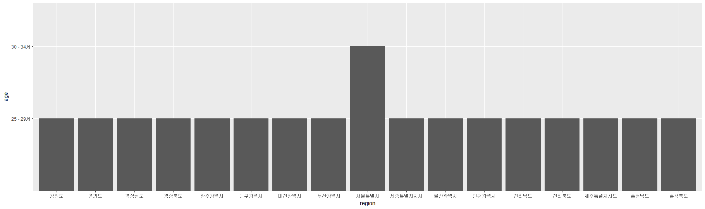
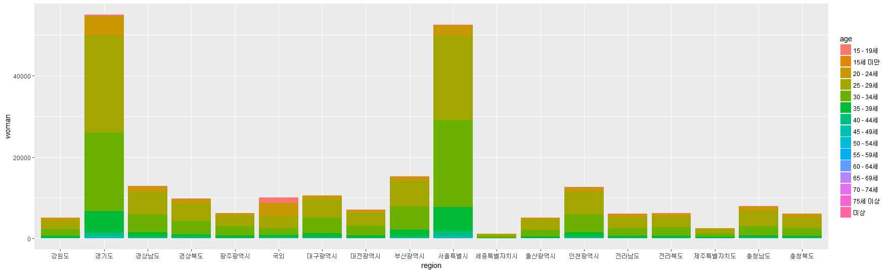
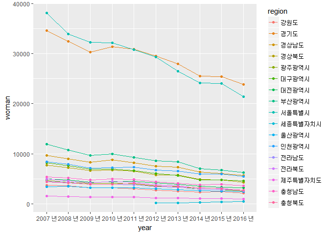

아내 초혼 건수에 대한 다각적 접근
=================================

초록
----

------------------------------------------------------------------------

이 연구의 목적은 '초혼 건수에 대한 연도별, 지역별, 연령별로 다양한 시각으로 접근'하는 것이다. 연구에 사용된 자료는 국가통계포털에 공개된 '시도/초혼연령별 혼인'자료이다. 실증분석자료는 8개의 광역시(서울특별시, 부산광역시, 인천광역시, 대구광역시, 대전광역시, 광주광역시, 울산광역시, 세종특별자치시)와 9개의 도(경기도, 경상남도, 경상북도, 충청남도, 충청북도, 전라남도, 전라북도, 강원도, 제주특별자치도)를 표본으로 2007년~2016년의 10개년 통계자료를 통합하여 구축됐다. 또한 지역별로 연도별, 연령별의 다양한 데이터를 사용했다.
이러한 데이터를 바탕으로, '아내의 혼인건이 제일 많은 연령대'를 2016년 전국으로 한정지어 분석하였고,'지역별 아내 혼인건이 제일 많은 연령대'를 2016년으로 한정지어 분석했다. 마지막으로 앞에서 분석한 내용들이 근 10년간 어떤 변화가 있는지를 분석하여 기본적으로 최신 년도 아내 혼인 건수에서 어느 연령대가 가장 많은 건수를 갖고 있었는지 알아보고자 했다. 또한 10년간의 아내의 단순 초혼 건수로 아내의 초혼 건수 증감이 있는지를 알아보고자 하였지만 단순 건수는 감소하였지만 연령별 변화는 거의 없었다.

서론
----

------------------------------------------------------------------------

### 분석주제

최근 사회는 청년층 세대를 흔히 결혼,연애,출산을 포기한다는 3포세대라고 일컫고 있다. 취업난으로 인한 부양인들까지 짊어질 수 있는 능력이 하락하여 세가지를 포기하고 있다는 것이다. 특히 법적으로 부양의 의무를 지니게 되는 시발점인 결혼 중 초혼에 대한 건수가 실질적으로 예년보다 현재 더 줄어들고 있는 지가 궁금하였다. 그리고 경제적 준비가 되었을 때 결혼을 하여 그 연령대가 높아졌는지 확인하고자 하였다.

### 데이터 선정

초혼 건수에 대한 다양한 변수값이 존재하여 다양한 접근 방식으로 초혼 건수를 분석할 수 있는 데이터를 찾고자 했고 이에 국가통계포털에 공개된 '시도/초혼연령별 혼인'자료를 선택하게 되었다. 1990년부터 2016년까지 있는 자료를 2007년부터 2016년까지로 한정하여 csv 파일로 구성하였다. 자료의 항목은 시도별, 연령별, 시점, 남편 건수, 아내 건수, 총 다섯개로 구성되었다. 시도별로는 전국, 읍부, 면부, 동부, 8개의 광역시(서울특별시, 부산광역시, 인천광역시, 대구광역시, 대전광역시, 광주광역시, 울산광역시, 세종특별자치시)와 9개의 도(경기도, 경상남도, 경상북도, 충청남도, 충청북도, 전라남도, 전라북도, 강원도, 제주특별자치도)를 표본으로 하였다.

본론
----

------------------------------------------------------------------------

1.  분석에 앞서 필요한 패키지들을 로드하였고, 파일을 다운받은 후, 데이터 항목명을 영어로 바꾸었다.
    그 후 데이터의 속성과 결측치를 파악하였다.

``` r
marry<-read.csv("marrycsv.csv")
library(dplyr)
```

    ## Warning: package 'dplyr' was built under R version 3.4.2

    ## 
    ## Attaching package: 'dplyr'

    ## The following objects are masked from 'package:stats':
    ## 
    ##     filter, lag

    ## The following objects are masked from 'package:base':
    ## 
    ##     intersect, setdiff, setequal, union

``` r
library(ggplot2)
```

    ## Warning: package 'ggplot2' was built under R version 3.4.2

``` r
marry<-rename(marry,
              region="시도별",
              age="연령별",
              year="시점",
              man="남편",
              woman="아내")
str(marry)
```

    ## 'data.frame':    3440 obs. of  5 variables:
    ##  $ region: Factor w/ 22 levels "강원도","경기도",..: 17 17 17 17 17 17 17 17 17 17 ...
    ##  $ age   : Factor w/ 16 levels "15 - 19세","15세 미만",..: 15 15 15 15 15 15 15 15 15 15 ...
    ##  $ year  : Factor w/ 10 levels "2007 년","2008 년",..: 1 2 3 4 5 6 7 8 9 10 ...
    ##  $ man   : int  285413 270236 255751 272972 277369 275897 273789 257906 256372 238054 ...
    ##  $ woman : int  280738 264469 250674 268541 272551 270495 268422 251477 249978 232446 ...

``` r
table(is.na(marry))
```

    ## 
    ## FALSE 
    ## 17200

1.  2016년 전체적으로 아내의 혼인 건수가 제일 많이 포진한 연령대

``` r
womanmarry<-marry%>%
  select(region,age,year,woman)%>%
  filter(region=="전국"&age!="계"&year=="2016 년")%>%
  arrange(desc(woman))%>%
  head(1)
```

    ## Warning: package 'bindrcpp' was built under R version 3.4.2

``` r
womanmarry
```

    ##   region       age    year woman
    ## 1   전국 25 - 29세 2016 년 97440

현재 기본적으로 어느 연령대에서 아내의 혼인 건수가 많은지 파악하기 위해 2016년에 한정하여 구하였고, 25-29세 때의 혼인 건수가 가장 많았고, 서울만 30-34세에 가장 많았다.

1.  2016년 지역별 아내의 혼인 건수가 제일 많이 포진한 연령대

``` r
regionwoman<-marry%>%
  select(region,age,year,woman)%>%
  filter(region!="전국"&age!="계"&region!="면부"&region!="동부"&region!="읍부"&region!="국외"&year=="2016 년")%>%
  group_by(region)%>%
  summarise(new=max(woman))

regionwoman
```

    ## # A tibble: 17 x 2
    ##            region   new
    ##            <fctr> <dbl>
    ##  1         강원도  2167
    ##  2         경기도 23818
    ##  3       경상남도  5643
    ##  4       경상북도  4328
    ##  5     광주광역시  2577
    ##  6     대구광역시  4552
    ##  7     대전광역시  3209
    ##  8     부산광역시  6273
    ##  9     서울특별시 21433
    ## 10 세종특별자치시   501
    ## 11     울산광역시  2439
    ## 12     인천광역시  5475
    ## 13       전라남도  2716
    ## 14       전라북도  2666
    ## 15 제주특별자치도  1019
    ## 16       충청남도  3642
    ## 17       충청북도  2760

``` r
a<-marry%>%select(region,age,year,woman)%>%
  filter(woman=="2167"|woman=="23818"|woman=="5643"|woman=="4328"|woman=="2577"|woman== "4552"|woman=="3209"|woman== "6273"|woman=="21433"|woman=="501"|woman=="2439"|woman=="5475"|woman=="2716"|woman== "2666"|woman== "1019"|woman=="3642"|woman== "2760")%>%
  arrange(desc(woman))
a
```

    ##            region       age    year woman
    ## 1          경기도 25 - 29세 2016 년 23818
    ## 2      서울특별시 30 - 34세 2016 년 21433
    ## 3      부산광역시 25 - 29세 2016 년  6273
    ## 4        경상남도 25 - 29세 2016 년  5643
    ## 5      인천광역시 25 - 29세 2016 년  5475
    ## 6      대구광역시 25 - 29세 2016 년  4552
    ## 7        경상북도 25 - 29세 2016 년  4328
    ## 8        충청남도 25 - 29세 2016 년  3642
    ## 9      대전광역시 25 - 29세 2016 년  3209
    ## 10       충청북도 25 - 29세 2016 년  2760
    ## 11       전라남도 25 - 29세 2016 년  2716
    ## 12       전라북도 25 - 29세 2016 년  2666
    ## 13     광주광역시 25 - 29세 2016 년  2577
    ## 14     울산광역시 25 - 29세 2016 년  2439
    ## 15         강원도 25 - 29세 2016 년  2167
    ## 16 제주특별자치도 25 - 29세 2016 년  1019
    ## 17 세종특별자치시 25 - 29세 2016 년   501

``` r
table(a$age)
```

    ## 
    ## 15 - 19세 15세 미만 20 - 24세 25 - 29세 30 - 34세 35 - 39세 40 - 44세 
    ##         0         0         0        16         1         0         0 
    ## 45 - 49세 50 - 54세 55 - 59세 60 - 64세 65 - 69세 70 - 74세 75세 이상 
    ##         0         0         0         0         0         0         0 
    ##        계      미상 
    ##         0         0

``` r
ab<-ggplot(data=a, aes(x=region, y=age))+geom_col()
ab
```



``` r
cahi<-marry%>%select(year,region,age,woman)%>%
  filter(year=="2016 년"&region!="전국"&age!="계"&region!="면부"&region!="읍부"&region!="동부")
head(cahi)
```

    ##      year     region       age woman
    ## 1 2016 년 서울특별시 15세 미만     0
    ## 2 2016 년 서울특별시 15 - 19세   169
    ## 3 2016 년 서울특별시 20 - 24세  2621
    ## 4 2016 년 서울특별시 25 - 29세 20639
    ## 5 2016 년 서울특별시 30 - 34세 21433
    ## 6 2016 년 서울특별시 35 - 39세  5956

``` r
ggplot(data=cahi,aes(x=region,y=woman,fill=age))+geom_col()
```



    우리나라 세부지역을 묶어 표현한 시도별 속 값들과 시도별 속 국외 값을 제외하고 2016년으로 한정하였다. 그리고 세부지역별로 묶어 연령별 여성의 최댓값을 요약통계하였다. 그런 후 상위 marry데이터에서 앞에 나온 최댓값들만을 필터하여 그 연령대도 알 수 있도록 하였다.  
    빈도표로 지역별로 어느 연령대에서 최대의 혼인 건수가 나왔는지 파악하였는데 25~29세가 16건, 30~34세가 1건 나왔다. 해당 지역을 알아보기 위해 크기순으로 정렬하는 ggplot 패키지를 활용하여 서울특별시만 30~34세에 아내 초혼 건수가 가장 많은 것을 확인할 수 있었다. 색깔의 구분이 힘들긴 하지만 각 지역의 혼인 건수 연령대별 비율 그래프를 통해 서울특별시 혼자 30~34세의 색깔 비율이 25~29세보다 많이 차지하고 있음을 알 수 있었다.  

1.  근 10년 간의 변화 4-1. 10년 간 전국을 기준으로 어떤 연령대가 가장 다수를 차지했는지 구하기

``` r
nmarry<-marry%>%
  select(region,age,year,woman)%>%
  filter(region=="전국" & age!="계")%>%
  group_by(age)%>%
  arrange(desc(woman))

nmarry
```

    ## # A tibble: 150 x 4
    ## # Groups:   age [15]
    ##    region       age    year  woman
    ##    <fctr>    <fctr>  <fctr>  <int>
    ##  1   전국 25 - 29세 2007 년 161676
    ##  2   전국 25 - 29세 2008 년 150195
    ##  3   전국 25 - 29세 2010 년 142014
    ##  4   전국 25 - 29세 2009 년 139409
    ##  5   전국 25 - 29세 2011 년 137781
    ##  6   전국 25 - 29세 2012 년 128008
    ##  7   전국 25 - 29세 2013 년 120921
    ##  8   전국 25 - 29세 2014 년 108362
    ##  9   전국 25 - 29세 2015 년 106107
    ## 10   전국 25 - 29세 2016 년  97440
    ## # ... with 140 more rows

     marry데이터에서 모든 연령대를 합친 연령별 항목 속 '계' 항목을 지우고 연령대별로 구분하여 연령별 최댓값으로 정리하였다. 총 150행이 나왔는데 상위 10위 값이 해당 연도 최댓값이 되겠다. 그걸 바탕으로 연령대의 차이를 살펴보았으나 전부 25~29세에서 아내의 가장 많은 혼인 건수가 있었음을 확인할 수 있었다.   

4-2. 10년 간 최대 아내 혼인 건수를 차지한 지역, 연령대 비교

``` r
regionmarry<- marry%>%
  select(region,age,year,woman)%>%
  filter(region!="전국"&age!="계"&region!="면부"&region!="동부"&region!="읍부"&region!="국외")%>%
  group_by(year)%>%
  summarise(regionyear=max(woman))

regionmarry
```

    ## # A tibble: 10 x 2
    ##       year regionyear
    ##     <fctr>      <dbl>
    ##  1 2007 년      38126
    ##  2 2008 년      33906
    ##  3 2009 년      32282
    ##  4 2010 년      32171
    ##  5 2011 년      30935
    ##  6 2012 년      29496
    ##  7 2013 년      27988
    ##  8 2014 년      25560
    ##  9 2015 년      25432
    ## 10 2016 년      23818

``` r
c<-marry%>%select(region,age,year,woman)%>%
  filter(woman=="38126"|woman=="33906"|woman=="32282"|woman=="32171"|woman=="30935"|woman== "29496"|woman=="27988"|woman== "25560"|woman=="25432"|woman=="23818")%>%
  arrange(year)
c
```

    ##        region       age    year woman
    ## 1  서울특별시 25 - 29세 2007 년 38126
    ## 2  서울특별시 25 - 29세 2008 년 33906
    ## 3  서울특별시 25 - 29세 2009 년 32282
    ## 4  서울특별시 25 - 29세 2010 년 32171
    ## 5      경기도 25 - 29세 2011 년 30935
    ## 6      경기도 25 - 29세 2012 년 29496
    ## 7      경기도 25 - 29세 2013 년 27988
    ## 8      경기도 25 - 29세 2014 년 25560
    ## 9      경기도 25 - 29세 2015 년 25432
    ## 10     경기도 25 - 29세 2016 년 23818

``` r
table(c$age)
```

    ## 
    ## 15 - 19세 15세 미만 20 - 24세 25 - 29세 30 - 34세 35 - 39세 40 - 44세 
    ##         0         0         0        10         0         0         0 
    ## 45 - 49세 50 - 54세 55 - 59세 60 - 64세 65 - 69세 70 - 74세 75세 이상 
    ##         0         0         0         0         0         0         0 
    ##        계      미상 
    ##         0         0

``` r
table(c$region)
```

    ## 
    ##         강원도         경기도       경상남도       경상북도     광주광역시 
    ##              0              6              0              0              0 
    ##           국외     대구광역시     대전광역시           동부           면부 
    ##              0              0              0              0              0 
    ##     부산광역시     서울특별시 세종특별자치시     울산광역시           읍부 
    ##              0              4              0              0              0 
    ##     인천광역시           전국       전라남도       전라북도 제주특별자치도 
    ##              0              0              0              0              0 
    ##       충청남도       충청북도 
    ##              0              0

      10년간 여성의 연도별 최대 혼인 건수를 regionmarry로, 그 최대 혼인 건수로 지역과 연령대까지 끌고 온 것이 c이다.

따라서 c에서의 연령대 변수를 빈도표로 나타냈을 때 25~29세가 10년 간 꾸준히 최댓값으로 나왔고, c에서의 지역 변수를 빈도표로 나타냈을때 처음 4년은 서울이, 남은 6년은 경기도가 최대 아내 혼인 건수를 차지한 지역이었다. 이는 사람들이 차츰 서울 근교로 빠져나가 경기도에 많이 거주하고 있음을 뜻한다.

4-3.10년 간 각 지역별로 구분한 최대 아닌 혼인 건수 양상 파악하기.

``` r
nnmarry<-marry%>%filter(region!="전국"&age!="계"&region!="면부"&region!="동부"&region!="읍부"&region!="국외")
head(nnmarry)
```

    ##       region       age    year man woman
    ## 1 서울특별시 15세 미만 2007 년   0     0
    ## 2 서울특별시 15세 미만 2008 년   0     1
    ## 3 서울특별시 15세 미만 2009 년   0     0
    ## 4 서울특별시 15세 미만 2010 년   0     0
    ## 5 서울특별시 15세 미만 2011 년   0     1
    ## 6 서울특별시 15세 미만 2012 년   0     0

``` r
final<-aggregate(woman~region+year,nnmarry,max)
head(final)
```

    ##       region    year woman
    ## 1     강원도 2007 년  3714
    ## 2     경기도 2007 년 34630
    ## 3   경상남도 2007 년  9654
    ## 4   경상북도 2007 년  7756
    ## 5 광주광역시 2007 년  4706
    ## 6 대구광역시 2007 년  8193

``` r
x<-ggplot(data=final,aes(x=year, y=woman,col=region,group=region))+geom_line()+geom_point()
x
```



    10년 간 세부 지역별 여성 혼인 건수만 계산된값 nnmarry에 시도별과 연도를 기준으로 nnmarry의 최댓값을 살펴본 변수가 final이다.      

final은 각 지역의 10년 동안의 최대 혼인 건수를 나타낸 값으로 전체 165행으로 구성되어있다. 지역별 최대 혼인 건수의 증감을 살펴보기 위해 꺾은 선 그래프를 사용하였고, 전체적으로 혼인 건수가 10년 간 감소하는 양상이었고, 2012년부터 정식 도시가 된 세종시는 계속되는 직장인들의 유입으로 최대혼인건수가 미미하게 늘어나고 있었디. \#\#논의
\*\*\*
단순 건수만 비교하려했던 점이 도달하고자 하는 방향에 완벽한 근거가 되지 못했다. 현재 5060세대 인구수가 젊었을 시절 인구 수에 비해 현재 2030인구가 더 적기 때문에 결혼 건수가 준 이유가 단순 인구가 줄어들었다는 것으로 볼 수 있기 때문이다. 그에 따라 10년 간 5세로 끊은 연령별 총 인구 수에서 결혼 건수(명수)의 비율을 따로 구축하여 총 인구 수 속 초혼한 사람의 비율 증감을 따져보아야 보다 정확한 분석이 될 것이다. 또한 지역별로 봤을 때 서울특별시, 경기도 아내 혼인 건수가 높다는 결과값도 어찌 보면 우리나라 지역별 인구수에 대한 기본적인 상식이 있다면 인구가 많은 곳인 만큼 결혼할 사람도 많다는 것을 알 수 있을 것이다. 물론 그에 반한 결과가 나오지 않은 것이 상식적으로는 옳긴 하지만, 너무 당연한 결과를 나타낸 것이 아닌가 하는 아쉬움이 있다.
