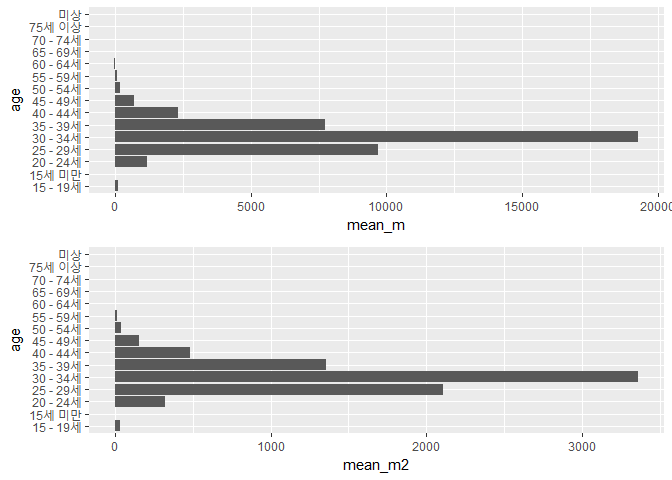
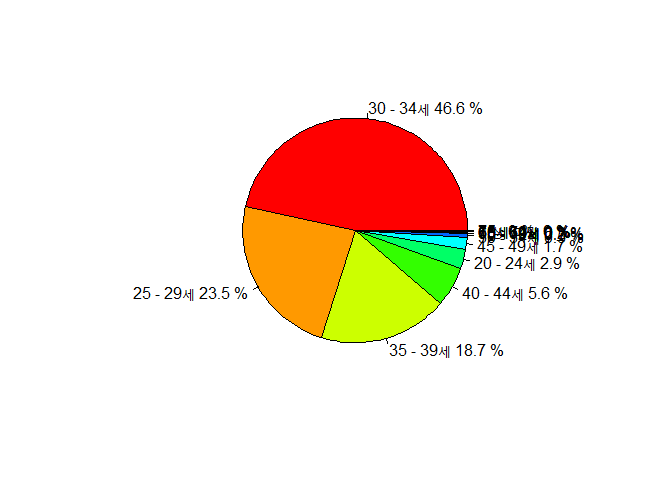
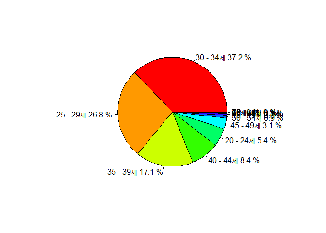
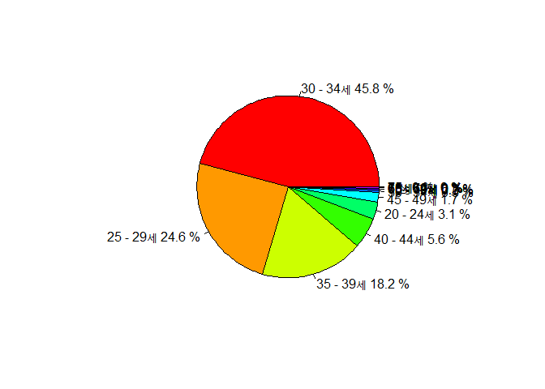
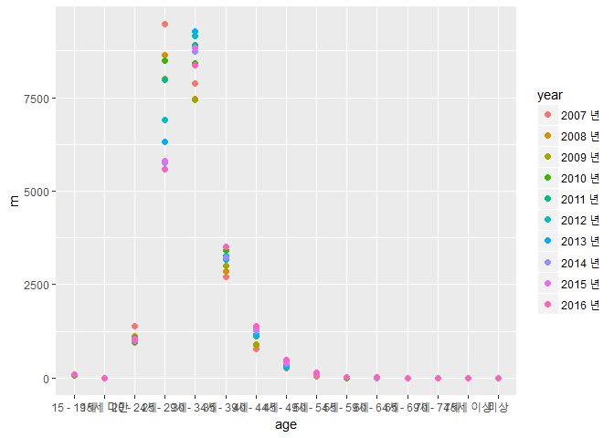
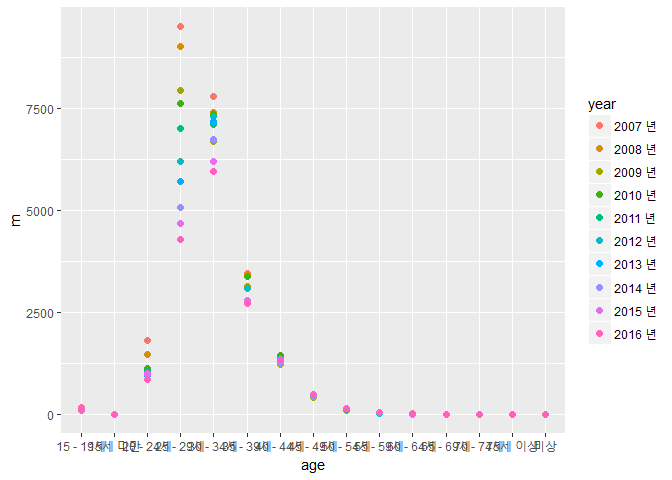

초록
====

이 연구는 대한민국의 초혼 건수를 지역별, 연도별, 연령대별 등으로 다양하게 접근하는 것을 목적으로 한다. 연구에 사용된 데이터는 국가통계포털에 게시되어 있는 '시도/초혼연령별 혼인' 자료로, 8개의 광역시(서울특별시, 부산광역시, 인천광역시, 대구광역시, 대전광역시, 광주광역시, 울산광역시, 세종특별자치시)와 9개의 도(경기도, 경상남도, 경상북도, 충청남도, 충청북도, 전라남도, 전라북도, 강원도, 제주특별자치도)를 표본으로 하고 있으며 2007년-2016년의 10개년 통계자료를 포함하고 있다. 또한 데이터 안에는 연도 외에도 지역별과 연령대, 성별에 따른 초혼 건수를 보여주고 있다. 서론에서는 연구를 위해 선택한 데이터의 선정 이유와 분석 주제가 무엇인지 알아볼 것이며, 또한 본격적인 분석에 들어가기 앞서 패키지 로드, 데이터를 불러오고 검토하는 과정을 다룰 것이다. 이러한 데이터를 바탕으로 본론의 분석에서는 먼저 가장 최신 자료인 2016년 자료를 바탕으로 지역을 수도권/비수도권으로 나누어 남성의 평균 초혼 건수가 얼마나 되는지 알아본 뒤, 초혼 건이 제일 많은 연령대를 알아볼 것이다. 두 번째로는 마찬가지로 2016년 자료에서 읍면동별로 남성의 평균 초혼 건수가 얼마나 되는지 알아본 뒤, 초혼 건이 제일 많은 나이대를 알아볼 것이다. 마지막으론 위의 두 분석을 통해 알아낸 초혼 건이 제일 많은 나이대인 30-34세가 근 10년(2007-2016)간 수도권/비수도권, 읍면동별로 같은 양상을 띠는지 알아볼 것이다.

서론
====

분석 주제
---------

대한민국 초혼 건수를 다양한 각도에서 보는 것을 큰 틀로 잡은 뒤에는 평균 초혼 연령이 해가 갈수록 높아지고 있는 이 시점에서 가장 먼저 근 10년 동안 남성의 평균 초혼 연령대가 어느 정도였는지 알아보고 싶었다. 또한 지역별로는 그 연령대에 있어 어떤 차이가 있는지, 보다 세부적으로는 수도권/비수도권으로 나눴을 때와 읍면동별로 살펴봤을 때 차이가 있는지 알아보고 싶어 분석 주제로 선정하게 되었다.

데이터 선정 이유
----------------

근 10년 동안 대한민국 남성의 초혼 연령대가 어느 정도였는지, 그리고 지역별로는 어떤 차이를 보였는지 알아보기 위해선 연도와 연령대, 성별이라는 변수가 들어가 있는 초혼 건수 데이터가 필요했기 때문에 이 데이터를 선정하게 되었다.

데이터 분석 준비
----------------

### 패키지 로드

``` r
library(dplyr)
library(ggplot2)
library(gridExtra)
```

### 데이터 불러오기

``` r
raw <- read.csv("marriage.csv")
marriage <- raw
```

### 데이터 검토

``` r
table(is.na(marriage))
```

    ## 
    ## FALSE 
    ## 17200

``` r
head(marriage)
```

    ##   시도별 연령별    시점   남편   아내
    ## 1   전국     계 2007 년 285413 280738
    ## 2   전국     계 2008 년 270236 264469
    ## 3   전국     계 2009 년 255751 250674
    ## 4   전국     계 2010 년 272972 268541
    ## 5   전국     계 2011 년 277369 272551
    ## 6   전국     계 2012 년 275897 270495

``` r
tail(marriage)
```

    ##      시도별 연령별    시점 남편 아내
    ## 3435   국외   미상 2011 년    0    0
    ## 3436   국외   미상 2012 년    0    0
    ## 3437   국외   미상 2013 년    0    0
    ## 3438   국외   미상 2014 년    0    0
    ## 3439   국외   미상 2015 년    0    0
    ## 3440   국외   미상 2016 년    0    0

``` r
View(marriage)
dim(marriage)
```

    ## [1] 3440    5

``` r
str(marriage)
```

    ## 'data.frame':    3440 obs. of  5 variables:
    ##  $ 시도별: Factor w/ 22 levels "강원도","경기도",..: 17 17 17 17 17 17 17 17 17 17 ...
    ##  $ 연령별: Factor w/ 16 levels "15 - 19세","15세 미만",..: 15 15 15 15 15 15 15 15 15 15 ...
    ##  $ 시점  : Factor w/ 10 levels "2007 년","2008 년",..: 1 2 3 4 5 6 7 8 9 10 ...
    ##  $ 남편  : int  285413 270236 255751 272972 277369 275897 273789 257906 256372 238054 ...
    ##  $ 아내  : int  280738 264469 250674 268541 272551 270495 268422 251477 249978 232446 ...

``` r
summary(marriage)
```

    ##         시도별           연령별          시점           남편       
    ##  강원도    : 160   15 - 19세: 215   2012 년: 352   Min.   :     0  
    ##  경기도    : 160   15세 미만: 215   2013 년: 352   1st Qu.:     1  
    ##  경상남도  : 160   20 - 24세: 215   2014 년: 352   Median :    51  
    ##  경상북도  : 160   25 - 29세: 215   2015 년: 352   Mean   :  4615  
    ##  광주광역시: 160   30 - 34세: 215   2016 년: 352   3rd Qu.:  1184  
    ##  국외      : 160   35 - 39세: 215   2007 년: 336   Max.   :285413  
    ##  (Other)   :2480   (Other)  :2150   (Other):1344                   
    ##       아내       
    ##  Min.   :     0  
    ##  1st Qu.:     1  
    ##  Median :    33  
    ##  Mean   :  4458  
    ##  3rd Qu.:  1052  
    ##  Max.   :280738  
    ## 

본론
====

### 분석1

#### 데이터 전처리

``` r
marriage <- rename(marriage, city=시도별, age=연령별, year=시점, m=남편, w=아내)
marriage <- marriage %>% 
  filter(city != "국외")
cap <- marriage %>% 
  filter(city %in% c("서울특별시", "인천광역시", "경기도") & year == "2016 년" & age != "계")
noncap <- marriage %>% 
  filter(city != "서울특별시" & city != "인천광역시" & city != "경기도" & city != "전국" & city != "읍부" & city != "면부" & city != "동부" & year == "2016 년" & age != "계")
```

cap은 2016년 서울특별시, 인천광역시, 경기도의 연령대별 남성 초혼 건수를, noncap은 2016년 위의 세 곳을 제외한 비수도권의 연련대별 남성 초혼 건수 데이터를 담고 있다.

#### 수도권/비수도권 남성의 평균 초혼 건수

``` r
cap %>% 
  summarise(mean_total=mean(m))
```

    ##   mean_total
    ## 1   2754.067

``` r
noncap %>% 
  summarise(mean_total2=mean(m))
```

    ##   mean_total2
    ## 1    524.9048

이를 통해 2016년 수도권 지역 남성의 평균 초혼 건수는 약 2754건, 비수도권 지역 남성의 평균 초혼 건수는 약 524건으로 수도권 지역 남성이 약 5배 이상 더 많이 혼인을 한다는 것을 알 수 있다.

##### 수도권/비수도권 남성의 초혼 건수가 가장 많은 연령대

``` r
cap_mean <- cap %>% 
  select(city, age, m) %>% 
  group_by(age) %>% 
  summarise(mean_m = mean(m)) %>% 
  arrange(desc(mean_m))
cap_mean
```

    ## # A tibble: 15 x 2
    ##          age       mean_m
    ##       <fctr>        <dbl>
    ##  1 30 - 34세 19264.333333
    ##  2 25 - 29세  9692.666667
    ##  3 35 - 39세  7733.666667
    ##  4 40 - 44세  2325.666667
    ##  5 20 - 24세  1180.000000
    ##  6 45 - 49세   704.666667
    ##  7 50 - 54세   201.000000
    ##  8 15 - 19세   104.333333
    ##  9 55 - 59세    69.000000
    ## 10 60 - 64세    18.666667
    ## 11 65 - 69세     7.666667
    ## 12 70 - 74세     5.333333
    ## 13 75세 이상     4.000000
    ## 14 15세 미만     0.000000
    ## 15      미상     0.000000

``` r
noncap_mean <- noncap %>% 
           select(city, age, m) %>% 
           group_by(age) %>% 
           summarise(mean_m2 = mean(m)) %>% 
           arrange(desc(mean_m2))
  
noncap_mean
```

    ## # A tibble: 15 x 2
    ##          age      mean_m2
    ##       <fctr>        <dbl>
    ##  1 30 - 34세 3358.9285714
    ##  2 25 - 29세 2105.8571429
    ##  3 35 - 39세 1356.8571429
    ##  4 40 - 44세  480.9285714
    ##  5 20 - 24세  321.2857143
    ##  6 45 - 49세  155.7857143
    ##  7 50 - 54세   40.7857143
    ##  8 15 - 19세   33.5714286
    ##  9 55 - 59세   13.9285714
    ## 10 60 - 64세    3.1428571
    ## 11 65 - 69세    1.4285714
    ## 12 75세 이상    0.5714286
    ## 13 70 - 74세    0.5000000
    ## 14 15세 미만    0.0000000
    ## 15      미상    0.0000000

먼저 수도권 지역 남성의 경우 30-34세, 25-29세, 35-39세 순으로 많은 초혼 건수를 보였는데, 비수도권 지역 남성의 경우도 마찬가지로 같은 순을 나타냈다. 이를 그래프로 비교해보면 다음과 같다.

``` r
col_cap <- ggplot(data = cap_mean, aes(x = age, y = mean_m)) + geom_col() + coord_flip()
col_ncap <- ggplot(data = noncap_mean, aes(x = age, y = mean_m2)) + geom_col() + coord_flip()
grid.arrange(col_cap, col_ncap ,nrow=2)
```



한편, 수도권과 비수도권 둘 다 초혼 건수가 많은 연령대 순서는 같지만, 그 연령대가 차지하는 비율은 다른 것 같아 파이 그래프를 만들어 비교해보기로 했다.

``` r
per1 <- round(cap_mean$mean_m/sum(cap_mean$mean_m)*100, 1)
lab1 <- paste(cap_mean$age, per1, "%")
pie(cap_mean$mean_m, col=rainbow(10), label=lab1)
```



``` r
per2 <- round(noncap_mean$mean_m2/sum(noncap_mean$mean_m2)*100, 1)
lab2 <- paste(noncap_mean$age, per2, "%")
pie(noncap_mean$mean_m2, col=rainbow(10), label=lab2)
```


첫번째는 수도권 남성의 연령대 비율, 두번째는 비수도권 남성의 연령대 비율이다. 파이 그래프를 보면 알 수 있다시피 수도권은 30-34세의 초혼 건수가 거의 절반 가까이를 차지하고 있는 반면, 비수도권은 30-34세의 초혼 건수가 43% 정도를 차지하고 있다. 그리고 25-29세의 초혼 건수는 비수도권이 수도권보다 3.2% 더 높았으며, 35-39세의 초혼 건수는 수도권이 비수도권보다 1.5% 더 높았다. 이를 통해 2016년 수도권 지역 남성들의 초혼은 비수도권 지역 남성들의 초혼에 비해 연령대가 비교적 더 높았다고 볼 수 있다.

### 분석2

#### 데이터 전처리

``` r
up <- marriage %>% 
  filter(city == "읍부" & year == "2016 년" & age != "계")
myeon <- marriage %>% 
  filter(city == "면부" & year == "2016 년" & age != "계")
dong <- marriage %>% 
  filter(city == "동부" & year == "2016 년" & age != "계")
```

up은 2016년 읍부의 남성 초혼 건수, myeon은 2016년 면부의 남성 초혼 건수, dong은 2016년 동부의 남성 초혼 건수를 각각 담고 있다.

#### 읍면동별 남성의 평균 초혼 건수

``` r
up %>% 
  summarise(mean_total=mean(m))
```

    ##   mean_total
    ## 1     1373.4

``` r
myeon %>% 
  summarise(mean_total2=mean(m))
```

    ##   mean_total2
    ## 1        1065

``` r
dong %>% 
  summarise(mean_total3=mean(m))
```

    ##   mean_total3
    ## 1    13172.47

2016년 읍부 남성의 평균 초혼 건수는 약 1373건, 면부 남성의 평균 초혼 건수는 1065건, 동부 남성의 평균 초혼 건수는 약 13172건으로 동부 남성의 평균 초혼 건수가 압도적으로 높게 나왔는데, 이는 동이 수도권인 시에 포함되는 반면 읍과 면은 비수도권인 도에 포함되어서 그런 것으로 보인다.

##### 읍면동별 남성의 초혼 건수가 가장 많은 연령대

``` r
up_mean <- up %>% 
  select(city, age, m) %>% 
  group_by(age) %>% 
  summarise(mean_m1 = mean(m)) %>% 
  arrange(desc(mean_m1))
up_mean
```

    ## # A tibble: 15 x 2
    ##          age mean_m1
    ##       <fctr>   <dbl>
    ##  1 30 - 34세    8368
    ##  2 25 - 29세    5584
    ##  3 35 - 39세    3515
    ##  4 40 - 44세    1383
    ##  5 20 - 24세     994
    ##  6 45 - 49세     477
    ##  7 50 - 54세     135
    ##  8 15 - 19세      97
    ##  9 55 - 59세      31
    ## 10 60 - 64세      12
    ## 11 65 - 69세       3
    ## 12 70 - 74세       1
    ## 13 75세 이상       1
    ## 14 15세 미만       0
    ## 15      미상       0

``` r
myeon_mean <- myeon %>% 
  select(city, age, m) %>% 
  group_by(age) %>% 
  summarise(mean_m2 = mean(m)) %>% 
  arrange(desc(mean_m2))
myeon_mean
```

    ## # A tibble: 15 x 2
    ##          age mean_m2
    ##       <fctr>   <dbl>
    ##  1 30 - 34세    5950
    ##  2 25 - 29세    4284
    ##  3 35 - 39세    2730
    ##  4 40 - 44세    1337
    ##  5 20 - 24세     868
    ##  6 45 - 49세     499
    ##  7 50 - 54세     148
    ##  8 15 - 19세      89
    ##  9 55 - 59세      51
    ## 10 60 - 64세      11
    ## 11 65 - 69세       3
    ## 12 70 - 74세       3
    ## 13 75세 이상       2
    ## 14 15세 미만       0
    ## 15      미상       0

``` r
dong_mean <- dong %>% 
  select(city, age, m) %>% 
  group_by(age) %>% 
  summarise(mean_m3 = mean(m)) %>% 
  arrange(desc(mean_m3))
dong_mean
```

    ## # A tibble: 15 x 2
    ##          age mean_m3
    ##       <fctr>   <dbl>
    ##  1 30 - 34세   90500
    ##  2 25 - 29세   48692
    ##  3 35 - 39세   35952
    ##  4 40 - 44세   10990
    ##  5 20 - 24세    6176
    ##  6 45 - 49세    3319
    ##  7 50 - 54세     891
    ##  8 15 - 19세     597
    ##  9 55 - 59세     320
    ## 10 60 - 64세      77
    ## 11 65 - 69세      37
    ## 12 70 - 74세      19
    ## 13 75세 이상      17
    ## 14 15세 미만       0
    ## 15      미상       0

읍면동 남성 모두 30-34세, 25-29세, 35-39세 순으로 많은 초혼 건수를 보이며 수도권, 비수도권과 같은 양상을 나타냈다. 이를 그래프로 비교해보면 다음과 같다.

``` r
col_up <- ggplot(data = up_mean, aes(x = age, y = mean_m1)) + geom_col() + coord_flip()
col_myeon <- ggplot(data = myeon_mean, aes(x = age, y = mean_m2)) + geom_col() + coord_flip()
col_dong <- ggplot(data = dong_mean, aes(x = age, y = mean_m3)) + geom_col() + coord_flip()
grid.arrange(col_up, col_myeon, col_dong, nrow=3)
```


마찬가지로 읍면동 모두 초혼 건수가 많은 연령대 순서는 같지만, 그 연령대가 차지하는 비율이 다른 것 같아 파이 그래프를 만들어 비교해보기로 했다.

``` r
per3 <- round(up_mean$mean_m1/sum(up_mean$mean_m1)*100, 1)
lab3 <- paste(up_mean$age, per3, "%")
pie(up_mean$mean_m1, col=rainbow(10), label=lab3)
```


``` r
per4 <- round(myeon_mean$mean_m2/sum(myeon_mean$mean_m2)*100, 1)
lab4 <- paste(myeon_mean$age, per4, "%")
pie(myeon_mean$mean_m2, col=rainbow(10), label=lab4)
```



``` r
per5 <- round(dong_mean$mean_m3/sum(dong_mean$mean_m3)*100, 1)
lab5 <- paste(dong_mean$age, per5, "%")
pie(dong_mean$mean_m3, col=rainbow(10), label=lab5)
```



파이 그래프를 보면 앞서 수도권이 그랬던 것처럼 동부의 30-34세와 35-39세 비율이 나머지 둘에 비해 높으며, 젊은 연령대의 비율은 비교적 낮은 것으로 나타났다.

### 분석3

#### 근 10년간 위의 두 분석이 같은 양상인가

앞의 두 분석을 바탕으로 전체적으로 30-34세인 남성의 평균 초혼 건수가 가장 높게 나타나는 모습이 근 10년간 같은 양상이었는지 알아보기 위해 산점도표를 만들어 분석해보기로 했다.

#### 수도권과 비수도권

``` r
cap_10 <- marriage %>% 
  filter(city %in% c("서울특별시", "인천광역시", "경기도") & age != "계")

a <- aggregate(m~age+year, cap_10, mean)
g <- ggplot(data=a, aes(x=age, y=m)) + geom_point()
g+geom_point(aes(color=year), size=2)
```


먼저 수도권 지역의 10년 간 양상을 살펴보자. 2007년인 붉은색 점이 가장 높이 있는 연령대를 보면 25-29세이다. 즉, 2007년에는 25-29세인 남성의 평균 초혼 건수가 가장 많았던 것이다. 하지만 2008년부터는 각각의 점들이 가장 높이 있는 연령대가 모두 30-34세이다. 2008년부터 2016년까지는 평균 초혼 건수가 가장 많은 연령대가 30-34세로 같은 양상을 보인 것이다. 다시 말해 2007년을 기점으로 남성의 평균 초혼 연령대가 높아졌다고 볼 수 있을 것 같다.

``` r
noncap_10 <- marriage %>% 
  filter(city != "서울특별시" & city != "인천광역시" & city != "경기도" & city != "전국" & city != "읍부" & city != "면부" & city != "동부" & age != "계")

b <- aggregate(m~age+year, noncap_10, mean)
gg <- ggplot(data=b, aes(x=age, y=m)) + geom_point()
gg+geom_point(aes(color=year), size=2)
```


다음으로 비수도권 지역의 10년 간 양상이다. 수도권과 마찬가지로 2007년인 붉은색 점이 가장 높이 있는 연령대가 25-29세인데, 2008년인 주황색 점 역시 가장 높은 위치에 있는 연령대가 25-29세이다. 이후 2009년부터는 각각의 점들이 가장 높이 있는 연령대가 모두 30-34세이므로, 평균 초혼 건수가 가장 많은 연령대인 30-34세와 같은 양상을 보였다. 비수도권 지역은 2008년을 기점으로 남성의 평균 초혼 연령대가 높아졌다고 볼 수 있다.

#### 읍면동

``` r
up_10 <- marriage %>% 
  filter(city == "읍부" & age != "계")
c <- aggregate(m~age+year, up_10, mean)
cg <- ggplot(data=c, aes(x=age, y=m)) + geom_point()
cg+geom_point(aes(color=year), size=2)
```



읍부의 10년간 양상이다. 앞서 본 수도권/비수도권의 양상과 달리 2007년부터 2010년까지의 점이 제일 높이 위치해 있는 연령대가 25-29세이다. 즉 읍부는 2010년까지만 해도 평균 초혼 연령대가 비교적 낮은 편이었으며, 2011년부터 그 연령대가 높아졌다고 볼 수 있다.

``` r
myeon_10 <- marriage %>% 
  filter(city == "면부" & age != "계")
d <- aggregate(m~age+year, myeon_10, mean)
dg <- ggplot(data=d, aes(x=age, y=m)) + geom_point()
dg+geom_point(aes(color=year), size=2)
```



면부의 10년간 양상이다. 읍부와 동일하게 2007년부터 2010년까지의 점들이 가장 높이 위치해 있는 연령대가 25~29세이다.

``` r
dong_10 <- marriage %>% 
  filter(city == "동부" & age != "계")
e <- aggregate(m~age+year, dong_10, mean)
eg <- ggplot(data=e, aes(x=age, y=m)) + geom_point()
eg+geom_point(aes(color=year), size=2)
```


동부의 10년간 양상은 앞서 본 수도권의 양상처럼 2007년만 25~29세에 점이 가장 높이 위치해 있고, 나머지는 모두 30-34세에 가장 높이 위치해 있다.

정리하자면 수도권과 동부는 2008년부터 평균 초혼 건수가 가장 많은 연령대가 30-34세로 앞선 분석과 같은 양상을 보였으며, 비수도권은 2009년부터 같은 양상을 보였다. 비교적 비수도권에 위치한 읍부와 면부는 2010년까지는 평균 초혼 건수가 가장 많은 연령대가 25-29세로 젊은 연령대에 속해있었으나, 2011년부터는 앞선 분석과 같은 양상을 보였다.

결론
====

결론적으로 근 10년간 수도권과 동부의 남성은 비교적 30-34세의 연령대에 초혼을 많이 한 것으로 보이지만, 비수도권을 포함한 읍부와 면부에서는 수년 전까지만 해도 보다 젊은 연령대에 초혼을 많이 한 것으로 보인다.

### 한계점과 비판점

1.  이 분석에서 대체적으로 읍부와 면부는 비수도권 취급을 했는데, 사실상 읍부와 면부는 수도권인 경기도에도 속해있기 때문에 과잉일반화를 한 면이 있다.
2.  연령별 초혼 건수가 아닌 연령대별 초혼 건수이기 때문에 정확한 연령을 볼 수 있는 것이 아니라서 결론이 두루뭉술하다고 볼 수 있다.
3.  수도권/비수도권으로 묶어버리면서 세부적으로 어느 지역의 연령대가 높고 낮았는지는 분석하지 못했다.

### 추후 분석 방향

근 10년간은 비교적 비슷한 양상이었기 때문에 연도를 조금 더 폭넓게 해서 분석을 한다면 차이가 나는 양상을 볼 수도 있지 않을까 싶다.
