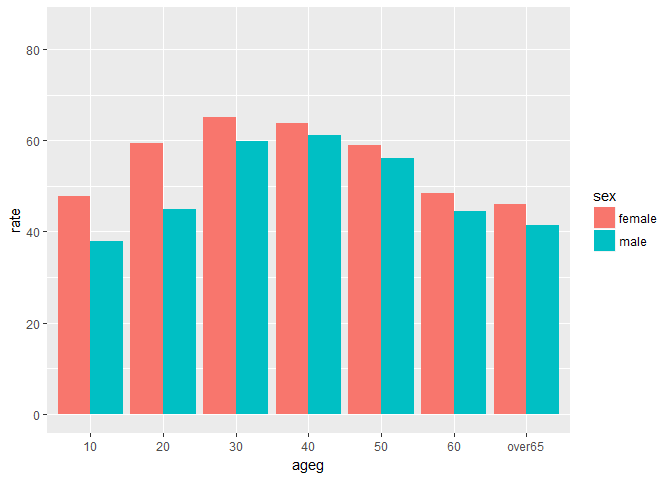
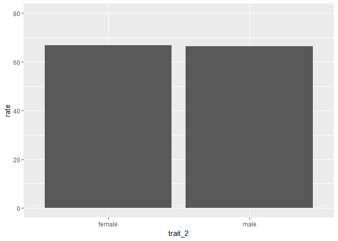
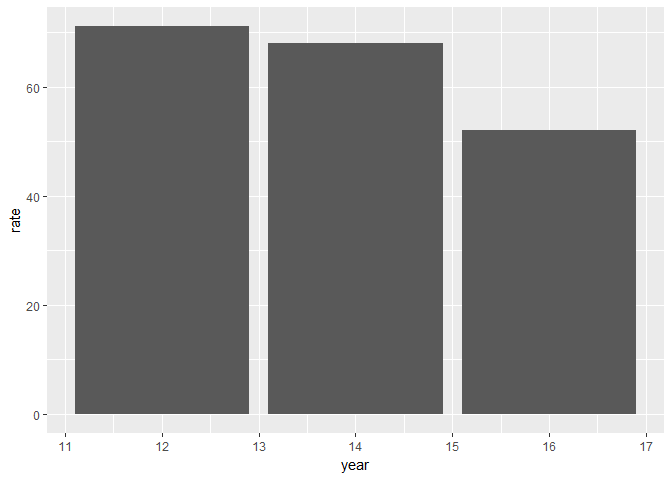
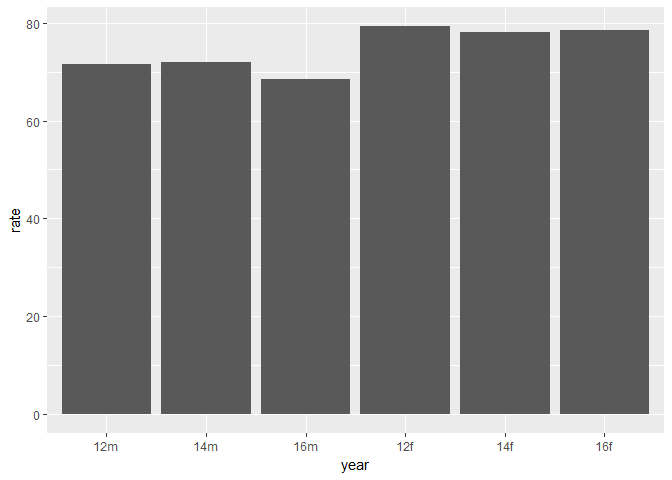

Team\_06\_Stress
================

1. 요약(초록):
==============

2012년부터 2016년까지 격년 동안 20대 부터 60대의 스트레스 정도의 추이를 성별, 학력별로 살펴보고 20대의 스트레스 정도가 시간에 흐름에 따라 감소함을 확인하였다. 다시 전반적으로 20대가 받는 스트레스의 정도가 시간의 흐름에 따라 감소하는지 확인하여 보았고 이를 분석을 통해 확인할 수 있었다. 이에 20대의 스트레스 정도의 감소 요인을 찾아보고자 직장생활에서의 스트레스, 가정생활에서의 전반적인 스트레스 정도와 각기 성별, 학력으로 다시 나누어 연도별 스트레스의 변동을 살펴보았다. 직장생활을 하는 20대는 2012년, 2014년, 2016년 동안 거의 균일한 스트레스 정도를 보인 반면 가정에서 20대가 받는 스트레스의 정도는 성별, 학력별로 모두 해가 지날수록 큰 폭으로 감소하는 양상을 보였다. 따라서 20대의 전반적 스트레스 정도가 해가 지날수록 감소하는 것은 가정에서 받는 스트레스의 정도와 상관관계가 있음을 추론해 볼 수 있다.
--------------------------------------------------------------------------------------------------------------------------------------------------------------------------------------------------------------------------------------------------------------------------------------------------------------------------------------------------------------------------------------------------------------------------------------------------------------------------------------------------------------------------------------------------------------------------------------------------------------------------------------------------------------------------------------------------------------------------------------------------------------------------------------------------------------------------------

2. 분석 주제:
=============

우리나라에서 사람들은 스트레스를 어느 정도로 인지하고 있는가를 연도별, 성별, 연령별, 학력별로 나누어 분석하고자 했다.
---------------------------------------------------------------------------------------------------------------------

3. 데이터 선정
==============

데이터 선정 이유: 우리가 분석하고자 하는 주제에 알맞았으며, 매우 다양한 변수가 존재하여 데이터간 상관관계 분석에 용이하다고 판단하였다.
---------------------------------------------------------------------------------------------------------------------------------------

데이터 소개: KOSIS에서 제공하는 우리나라 사회조사로, 전반적인 생활 스트레스 정도에 관한 데이터이다. 전국을 대상으로 하며, 변수로는 지역, 성별, 연령, 교육정도, 혼인상태, 경제활동, 산업, 직업, 가구소득, 흡연량 등 매우 다양하게 존재한다.
------------------------------------------------------------------------------------------------------------------------------------------------------------------------------------------------------------------------------------------

4. 분석
=======

분석 목적 및 방법
-----------------

### Ⅰ.성별 스트레스 정도 (정호윤,홍영화)

### Ⅱ.성별 + 연령별 스트레스 정도 (정호윤,홍영화)

### Ⅲ.학력별 스트레스 정도 (배성현,이진웅)

### Ⅳ.학력별 + 연령별 스트레스 정도 (배성현,이진웅)

### Ⅴ.20대의 연도별 스트레스 정도

### Ⅵ.연도별, 직장을 다니는 20대의 스트레스 정도

### Ⅶ.연도별, 20대가 가정에서 스트레스를 느끼는 정도

변수 검토 및 전처리: KOSIS에서 제공하는 데이터는 변수명이 모두 한글로 되어있어서 혹시 모를 오류를 방지하고자 부득이하게 미리 엑셀 파일 상에서 임의로 영어로 변경하였고, 검토 및 전처리 과정 따로 추가하지 않는 점을 양해구하고자 한다.
--------------------------------------------------------------------------------------------------------------------------------------------------------------------------------------------------------------------------------------

``` r
library(ggplot2) 
library(dplyr) 
```

    ## 
    ## Attaching package: 'dplyr'

    ## The following objects are masked from 'package:stats':
    ## 
    ##     filter, lag

    ## The following objects are masked from 'package:base':
    ## 
    ##     intersect, setdiff, setequal, union

``` r
library(readxl) 
```

분석 내용.
----------

Ⅰ.성별 스트레스 정도 (정호윤,홍영화) - 2016년
---------------------------------------------

``` r
raw_stress16 <- read_excel("team_06_16.xlsx")
stress16 <- raw_stress16
```

``` r
sex16 <- stress16 %>% filter(trait_1=="sex")
ggplot(data=sex16, aes(x=trait_2, y=rate)) + geom_col() + ylim(0,80)
```


Ⅱ.성별 + 연령별 스트레스 정도 (정호윤,홍영화)- 2016년
-----------------------------------------------------

``` r
age_sex16 <- stress16 %>% filter(trait_1=="age_sex")
age_sex16$ageg <- c(10,10,20,20,30,30,40,40,50,50,60,60,"over65","over65")
age_sex16$sex <- c("male","female","male","female","male","female","male","female","male","female","male","female","male","female")

ggplot(data = age_sex16, aes(x = ageg, y = rate, fill = sex)) + geom_col(position = "dodge") + ylim(0, 85)
```



2012년에 성별 스트레스 정도는 어떨까?
-------------------------------------

``` r
raw_stress12 <- read_excel("team_06_12.xlsx", col_names = T)
stress12 <- raw_stress12

sex12 <- stress12 %>% filter(trait_1=="sex")
ggplot(data=sex12, aes(x=trait_2, y=rate)) + geom_col() + ylim(0,80)
```


2012년 성별 + 연령별 스트레스 정도는 어떨까?
--------------------------------------------

``` r
age_sex12 <- stress12 %>% filter(trait_1=="age_sex")
age_sex12$ageg <- c(10,10,20,20,30,30,40,40,50,50,60,60,"over65","over65")
age_sex12$sex <- c("male","female","male","female","male","female","male","female","male","female","male","female","male","female")

ggplot(data = age_sex12, aes(x = ageg, y = rate, fill = sex)) + geom_col(position = "dodge") 
```


2014년 성별 스트레스 정도는 어떨까?
-----------------------------------

``` r
raw_stress14 <- read_excel("team_06_14.xlsx", col_names = T)
stress14 <- raw_stress14

sex14 <- stress14 %>% filter(trait_1=="sex")
ggplot(data=sex14, aes(x=trait_2, y=rate)) + geom_col() + ylim(0,80)
```



2014년 성별 + 연령별 스트레스 정도는 어떨까?
--------------------------------------------

``` r
age_sex14 <- stress14 %>% filter(trait_1=="age_sex")
age_sex14$ageg <- c(10,10,20,20,30,30,40,40,50,50,60,60,"over65","over65")
age_sex14$sex <- c("male","female","male","female","male","female","male","female","male","female","male","female","male","female")

ggplot(data = age_sex14, aes(x = ageg, y = rate, fill = sex)) + geom_col(position = "dodge") 
```


해석 : 2012, 2014, 2016년도 모두 여자의 스트레스 정도가 남자의 정도보다 높다. 2016년에서는 모든 연령에서 여자의 정도가 남자의 정도보다 높다. 하지만 2012년과 2014년에서는 특정 연령에서 남자의 정도가 여자의 정도보다 높다. 우리의 능력으로는 이러한 결과의 원인을 정확하게 밝혀 낼 수 없다. 두드러지는 현상으로는 20대의 스트레스 정도가 연도별로 점차 떨어진다는 것이다.
--------------------------------------------------------------------------------------------------------------------------------------------------------------------------------------------------------------------------------------------------------------------------------------------------------------------------------------------------------------------------

Ⅲ.학력별 스트레스 정도 (배성현,이진웅) - 2016년
-----------------------------------------------

``` r
raw_stress <- read_excel("team_06_16.xlsx", col_names = T)
stress <- raw_stress
```

### Ⅲ-1. 고졸 학력 세대별 스트레스 정도

``` r
stress_high <- stress %>% 
  select(-trait_1) %>%
  filter(trait_2 %in% c("20_high", "30_high", "40_high", "50_high", "60_high", "over_65_high"))
```

### Ⅲ-2. 대졸 학력 세대별 스트레스 정도

``` r
stress_univ <- stress %>% 
  select(-trait_1) %>%
  filter(trait_2 %in% c("20_univ", "30_univ", "40_univ", "50_univ", "60_univ", "over_65_univ"))
```

Ⅳ.학력별 + 연령별 스트레스 정도 (배성현,이진웅) - 2016년
--------------------------------------------------------

``` r
stress_adu <- stress %>% 
  select(-trait_1) %>%
  filter(trait_2 %in% c("20_high",
                        "30_high", 
                        "40_high", 
                        "50_high", 
                        "60_high", 
                        "over_65_high",
                        "20_univ", 
                        "30_univ", 
                        "40_univ", 
                        "50_univ", 
                        "60_univ",
                        "over_65_univ"))
stress_adu$ageg <- c(20, 20, 30, 30, 40, 40, 50, 50, 60, 60, 65, 65)
stress_adu$level <- c("high", "univ", "high", "univ", "high", "univ","high", "univ","high", "univ", "high", "univ")
ggplot(data = stress_adu, aes(x = ageg, y = rate, ylim(0, 90) , fill = level )) + 
  geom_col(position = "dodge") 
```


2012년 학력별 스트레스 정도는 어떠할까?
---------------------------------------

``` r
raw_stress_12 <- read_excel("team_06_12.xlsx", col_names = T)
stress_12 <- raw_stress_12
```

### 2012년 고졸 학력 스트레스 정도

``` r
stress_high_12 <- stress_12 %>% 
  select(-trait_1) %>%
  filter(trait_2 %in% c("20_high", "30_high", "40_high", "50_high", "60_high", "over_65_high"))
```

### 2012년 대졸 학력 스트레스 정도

``` r
stress_univ_12 <- stress_12 %>% 
  select(-trait_1) %>%
  filter(trait_2 %in% c("20_univ", "30_univ", "40_univ", "50_univ", "60_univ", "over_65_univ"))
```

2012년 학력별 + 연령별 스트레스 정도는 어떠할까?
------------------------------------------------

``` r
stress_adu_12 <- stress_12 %>% 
  select(-trait_1) %>%
  filter(trait_2 %in% c("20_high",
                        "30_high", 
                        "40_high", 
                        "50_high", 
                        "60_high", 
                        "over_65_high",
                        "20_univ", 
                        "30_univ", 
                        "40_univ", 
                        "50_univ", 
                        "60_univ",
                        "over_65_univ"))
stress_adu_12$ageg <- c(20, 20, 30, 30, 40, 40, 50, 50, 60, 60, 65, 65)
stress_adu_12$level <- c("high", "univ", "high", "univ", "high", "univ","high", "univ","high", "univ", "high", "univ")

ggplot(data = stress_adu_12, aes(x = ageg, y = rate, fill = level)) + 
  geom_col(position = "dodge") 
```


2014년 학력별 스트레스 정도는 어떠할까?
---------------------------------------

``` r
raw_stress_14 <- read_excel("team_06_14.xlsx", col_names = T)
stress_14 <- raw_stress_14
```

### 2014년 고졸 학력 스트레스 정도

``` r
stress_high_14 <- stress_14 %>% 
  select(-trait_1) %>%
  filter(trait_2 %in% c("20_high", "30_high", "40_high", "50_high", "60_high", "over_65_high"))
```

### 2014년 고졸 학력 스트레스 정도

``` r
stress_univ_14 <- stress_14 %>% 
  select(-trait_1) %>%
  filter(trait_2 %in% c("20_univ", "30_univ", "40_univ", "50_univ", "60_univ", "over_65_univ"))
```

2014년 학력별 + 연령별 스트레스 정도는 어떠할까?
------------------------------------------------

``` r
stress_adu_14 <- stress_14 %>% 
  select(-trait_1) %>%
  filter(trait_2 %in% c("20_high",
                        "30_high", 
                        "40_high", 
                        "50_high", 
                        "60_high", 
                        "over_65_high",
                        "20_univ", 
                        "30_univ", 
                        "40_univ", 
                        "50_univ", 
                        "60_univ",
                        "over_65_univ"))
stress_adu_14$ageg <- c(20, 20, 30, 30, 40, 40, 50, 50, 60, 60, 65, 65)
stress_adu_14$level <- c("high", "univ", "high", "univ", "high", "univ","high", "univ","high", "univ", "high", "univ")

ggplot(data = stress_adu_14, aes(x = ageg, y = rate, fill = level)) + 
  geom_col(position = "dodge") 
```


해석: 2012, 2014, 2016년도 모두 대체로 고졸학력자의 스트레스를 느끼는 정도가 대졸학력자의 스트레스를 느끼는 정도보다 높은 것을 알 수 있다. 2012년에는 학력에 관계없이 20대의 스트레스를 느끼는 정도가 가장 높지만 2014년과 2016년에는 20대의 스트레스를 느끼는 정도가 낮은 반면 30대와 40대의 스트레스를 느끼는 정도가 증가하고 다시 50대부터 줄어드는 경향을 보인다. 전체적으로 2012년부터 2016년까지 20대의 스트레스를 느끼는 정도가 점차 감소함을 알 수 있다.
----------------------------------------------------------------------------------------------------------------------------------------------------------------------------------------------------------------------------------------------------------------------------------------------------------------------------------------------------------------------------------------------------------------------------------------------------------------

### Ⅴ.20대의 연도별 스트레스 정도

``` r
raw_stress_12 <- read_excel("team_06_12.xlsx", col_names = T)
stress_12 <- raw_stress_12

stress_20_12 <- stress_12 %>%
  select(-trait_1) %>%
  filter(trait_2 == 20) %>%
  mutate(year = 12)
stress_20_12
```

    ## # A tibble: 1 x 5
    ##   trait_2 high_stress stress  rate  year
    ##     <chr>       <dbl>  <dbl> <dbl> <dbl>
    ## 1      20        12.7   58.4  71.1    12

``` r
raw_stress_14 <- read_excel("team_06_14.xlsx", col_names = T)
stress_14 <- raw_stress_14

stress_20_14 <- stress_14 %>%
  select(-trait_1) %>%
  filter(trait_2 == 20) %>%
  mutate(year = 14)
stress_20_14
```

    ## # A tibble: 1 x 5
    ##   trait_2 high_stress stress  rate  year
    ##     <chr>       <dbl>  <dbl> <dbl> <dbl>
    ## 1      20        10.9   57.1    68    14

``` r
raw_stress_16 <- read_excel("team_06_16.xlsx", col_names = T)
stress_16 <- raw_stress_16

stress_20_16 <- stress_16 %>%
  select(-trait_1) %>%
  filter(trait_2 == 20) %>%
  mutate(year = 16)
stress_20_16
```

    ## # A tibble: 1 x 5
    ##   trait_2        high_stress stress  rate  year
    ##     <chr>              <chr>  <dbl> <dbl> <dbl>
    ## 1      20 4.9000000000000004   47.2  52.1    16

``` r
stress_20_group <- rbind(stress_20_12, stress_20_14, stress_20_16)
stress_20_group
```

    ## # A tibble: 3 x 5
    ##   trait_2        high_stress stress  rate  year
    ##     <chr>              <chr>  <dbl> <dbl> <dbl>
    ## 1      20               12.7   58.4  71.1    12
    ## 2      20               10.9   57.1  68.0    14
    ## 3      20 4.9000000000000004   47.2  52.1    16

``` r
ggplot(stress_20_group, aes(x=year, y=rate)) + geom_col()
```



해석:연령, 학력과 상관없이 20대의 스트레스 정도가 지속적으로 감소하는 것을 확인할 수 있다.
------------------------------------------------------------------------------------------

### Ⅵ.연도별, 직장을 다니는 20대의 스트레스 정도

#### 직장을 다니는 20대의 전반적 스트레스 정도

``` r
raw_stress_work_12 <- read_excel("stress_work_12.xlsx", col_names = T)
stress_work_12 <- raw_stress_work_12

work_12_20 <- stress_work_12 %>%
  select(-trait_1) %>%
  filter(trait_2 == 20) %>%
  mutate(year = ifelse(trait_2 == 20, "12"))
work_12_20
```

    ## # A tibble: 1 x 5
    ##   trait_2 high_stress stress  rate  year
    ##     <chr>       <dbl>  <dbl> <dbl> <chr>
    ## 1      20        19.6   55.8  75.4    12

``` r
raw_stress_work_14 <- read_excel("stress_work_14.xlsx", col_names = T)
stress_work_14 <- raw_stress_work_14

work_14_20 <- stress_work_14 %>%
  select(-trait_1) %>%
  filter(trait_2 == 20) %>%
  mutate(year = ifelse(trait_2 == 20, "14"))
work_14_20
```

    ## # A tibble: 1 x 5
    ##   trait_2 high_stress stress  rate  year
    ##     <chr>       <dbl>  <dbl> <dbl> <chr>
    ## 1      20        20.8   54.3  75.1    14

``` r
raw_stress_work_16 <- read_excel("stress_work_16.xlsx", col_names = T)
stress_work_16 <- raw_stress_work_16

work_16_20 <- stress_work_16 %>%
  select(-trait_1) %>%
  filter(trait_2 == 20) %>%
  mutate(year = ifelse(trait_2 == 20, "16"))
View(work_16_20)

work_group <- rbind(work_12_20, work_14_20, work_16_20)
```

``` r
ggplot(work_group, aes(x=year, y=rate)) + geom_col()
```


#### 직장을 다니는 20대의 전반적 스트레스 정도(성별)

``` r
raw_stress_work_sex_12 <- read_excel("stress_work_12.xlsx", col_names = T)
stress_work_sex_12 <- raw_stress_work_sex_12

work_sex_12_20 <- stress_work_sex_12 %>%
  select(-trait_1) %>%
  filter(trait_2 %in% c("20_male", "20_female")) %>%
  mutate(year = c("12m", "12f"))
work_sex_12_20
```

    ## # A tibble: 2 x 5
    ##     trait_2 high_stress stress  rate  year
    ##       <chr>       <dbl>  <dbl> <dbl> <chr>
    ## 1   20_male        15.6   55.9  71.5   12m
    ## 2 20_female        23.6   55.7  79.3   12f

``` r
raw_stress_work_sex_14 <- read_excel("stress_work_14.xlsx", col_names = T)
stress_work_sex_14 <- raw_stress_work_sex_14

work_sex_14_20 <- stress_work_sex_14 %>%
  select(-trait_1) %>%
  filter(trait_2 %in% c("20_male", "20_female")) %>%
  mutate(year = c("14m", "14f"))
work_sex_14_20
```

    ## # A tibble: 2 x 5
    ##     trait_2 high_stress stress  rate  year
    ##       <chr>       <dbl>  <dbl> <dbl> <chr>
    ## 1   20_male        15.9   56.1  72.0   14m
    ## 2 20_female        25.5   52.6  78.1   14f

``` r
raw_stress_work_sex_16 <- read_excel("stress_work_16.xlsx", col_names = T)
stress_work_sex_16 <- raw_stress_work_sex_16

work_sex_16_20 <- stress_work_sex_16 %>%
  select(-trait_1) %>%
  filter(trait_2 %in% c("20_male", "20_female")) %>%
  mutate(year = c("16m", "16f"))
work_sex_16_20
```

    ## # A tibble: 2 x 5
    ##     trait_2 high_stress stress  rate  year
    ##       <chr>       <chr>  <dbl> <dbl> <chr>
    ## 1   20_male        15.9   52.5  68.4   16m
    ## 2 20_female          27   51.5  78.5   16f

``` r
work_sex_group <- rbind(work_sex_12_20, work_sex_14_20, work_sex_16_20)
work_sex_group
```

    ## # A tibble: 6 x 5
    ##     trait_2 high_stress stress  rate  year
    ##       <chr>       <chr>  <dbl> <dbl> <chr>
    ## 1   20_male        15.6   55.9  71.5   12m
    ## 2 20_female        23.6   55.7  79.3   12f
    ## 3   20_male        15.9   56.1  72.0   14m
    ## 4 20_female        25.5   52.6  78.1   14f
    ## 5   20_male        15.9   52.5  68.4   16m
    ## 6 20_female          27   51.5  78.5   16f

``` r
ggplot(work_sex_group, aes(x=year, y=rate)) + geom_col() +
  scale_x_discrete(limits = c("12m", "14m", "16m", "12f", "14f", "16f"))
```



해석: 직장을 다니는 20대가 받는 스트레스의 정도는 연도가 지남에도 크게 다르지 않기에 20대가 전체적으로 스트레스를 느끼는 정도와 상관관계가 있음을 알기 어렵다.
--------------------------------------------------------------------------------------------------------------------------------------------------------------

### Ⅶ.연도별, 20대가 가정에서 스트레스를 느끼는 정도

#### 연도별, 20대가 가정에서 전반적으로 스트레스를 느끼는 정도

``` r
raw_stress_home_12 <- read_excel("stress_home_12.xlsx", col_names = T)
stress_home_12 <- raw_stress_home_12

home_12_20 <- stress_home_12 %>%
  select(-trait_1) %>%
  filter(trait_2 == 20) %>%
  mutate(year = ifelse(trait_2 == 20, "12"))
home_12_20
```

    ## # A tibble: 1 x 5
    ##   trait_2 high_stress stress  rate  year
    ##     <chr>       <dbl>  <dbl> <dbl> <chr>
    ## 1      20         5.7   32.8  38.5    12

``` r
raw_stress_home_14 <- read_excel("stress_home_14.xlsx", col_names = T)
stress_home_14 <- raw_stress_home_14

home_14_20 <- stress_home_14 %>%
  select(-trait_1) %>%
  filter(trait_2 == 20) %>%
  mutate(year = ifelse(trait_2 == 20, "14"))
home_14_20
```

    ## # A tibble: 1 x 5
    ##   trait_2 high_stress stress  rate  year
    ##     <chr>       <dbl>  <dbl> <dbl> <chr>
    ## 1      20         4.4   31.7  36.1    14

``` r
raw_stress_home_16 <- read_excel("stress_home_16.xlsx", col_names = T)
stress_home_16 <- raw_stress_home_16

home_16_20 <- stress_home_16 %>%
  select(-trait_1) %>%
  filter(trait_2 == 20) %>%
  mutate(year = ifelse(trait_2 == 20, "16"))
home_16_20
```

    ## # A tibble: 1 x 5
    ##   trait_2 high_stress stress  rate  year
    ##     <chr>       <chr>  <dbl> <dbl> <chr>
    ## 1      20         3.6   29.4    33    16

``` r
home_group <- rbind(home_12_20, home_14_20, home_16_20)
```

``` r
ggplot(home_group, aes(x=year, y=rate)) + geom_col()
```


#### 연도별, 20대가 가정에서 전반적으로 스트레스를 느끼는 정도(성별)

``` r
raw_stress_home_sex_12 <- read_excel("stress_home_12.xlsx", col_names = T)
stress_home_sex_12 <- raw_stress_home_sex_12

home_sex_12_20 <- stress_home_sex_12 %>%
  select(-trait_1) %>%
  filter(trait_2 %in% c("20_male", "20_female")) %>%
  mutate(year = c("12m", "12f"))
home_sex_12_20
```

    ## # A tibble: 2 x 5
    ##     trait_2 high_stress stress  rate  year
    ##       <chr>       <dbl>  <dbl> <dbl> <chr>
    ## 1   20_male         4.3   28.3  32.6   12m
    ## 2 20_female         7.1   37.3  44.4   12f

``` r
raw_stress_home_sex_14 <- read_excel("stress_home_14.xlsx", col_names = T)
stress_home_sex_14 <- raw_stress_home_sex_14

home_sex_14_20 <- stress_home_sex_14 %>%
  select(-trait_1) %>%
  filter(trait_2 %in% c("20_male", "20_female")) %>%
  mutate(year = c("14m", "14f"))
home_sex_14_20
```

    ## # A tibble: 2 x 5
    ##     trait_2 high_stress stress  rate  year
    ##       <chr>       <dbl>  <dbl> <dbl> <chr>
    ## 1   20_male         3.1   26.9    30   14m
    ## 2 20_female         5.7   36.3    42   14f

``` r
raw_stress_home_sex_16 <- read_excel("stress_home_16.xlsx", col_names = T)
stress_home_sex_16 <- raw_stress_home_sex_16

home_sex_16_20 <- stress_home_sex_16 %>%
  select(-trait_1) %>%
  filter(trait_2 %in% c("20_male", "20_female")) %>%
  mutate(year = c("16m", "16f"))
home_sex_16_20
```

    ## # A tibble: 2 x 5
    ##     trait_2 high_stress stress  rate  year
    ##       <chr>       <chr>  <dbl> <dbl> <chr>
    ## 1   20_male         2.5   24.1  26.6   16m
    ## 2 20_female         4.7   34.8  39.5   16f

``` r
home_sex_group <- rbind(home_sex_12_20, home_sex_14_20, home_sex_16_20)
```

``` r
ggplot(home_sex_group, aes(x=year, y=rate)) + geom_col() +
  scale_x_discrete(limits = c("12m", "14m", "16m", "12f", "14f", "16f"))
```


#### 연도별, 20대가 가정에서 전반적으로 스트레스를 느끼는 정도(학력)

``` r
raw_stress_home_lh_12 <- read_excel("stress_home_12.xlsx", col_names = T)
stress_home_lh_12 <- raw_stress_home_lh_12

home_lh_12_20 <- stress_home_lh_12 %>%
  select(-trait_1) %>%
  filter(trait_2 %in% c("20_middle", "20_high", "20_univ")) %>%
  mutate(year = c("12m", "12h", "12u"))

raw_stress_home_lh_14 <- read_excel("stress_home_14.xlsx", col_names = T)
stress_home_lh_14 <- raw_stress_home_lh_14

home_lh_14_20 <- stress_home_lh_14 %>%
  select(-trait_1) %>%
  filter(trait_2 %in% c("20_middle", "20_high", "20_univ")) %>%
  mutate(year = c("14m", "14h", "14u"))

raw_stress_home_lh_16 <- read_excel("stress_home_16.xlsx", col_names = T)
stress_home_lh_16 <- raw_stress_home_lh_16

home_lh_16_20 <- stress_home_lh_16 %>%
  select(-trait_1) %>%
  filter(trait_2 %in% c("20_middle", "20_high", "20_univ")) %>%
  mutate(year = c("16m", "16h", "16u"))

home_lh_group <- rbind(home_lh_12_20, home_lh_14_20, home_lh_16_20)
```

``` r
ggplot(home_lh_group, aes(x=year, y=rate)) + geom_col() +
  scale_x_discrete(limits = c("12m", "14m", "16m", "12h", "14h", "16h", "12u", "14u", "16u"))
```


해석: 20대가 가정에서 받는 스트레스의 정도는 전체적 지표, 성별 지표, 학력 지표에 구분 없이 모두 시간이 흐를수록 감소하는 경향을 보이는 것을 알 수 있다. 이를 통해 시간이 흐를수록 20대가 스트레스를 느끼는 정도가 감소하는 것이 가정에서 받는 스트레스의 정도와 상관관계가 있음을 추론해 볼 수 있다.
----------------------------------------------------------------------------------------------------------------------------------------------------------------------------------------------------------------------------------------------------------------------------------------------------

5. 논의
=======

한계점, 비판점
--------------

### ⅰ.서로 다른 성별의 차이에서 다른 변수와의 수많은 인과관계가 존재하므로 스트레스 정도가 성별에 왜 영향을 받았는지 명확하게 밝혀내지 못한다.

### ⅱ.연령 별 구간을 일률적으로 자른 데이터를 활용하여 각각 특정 연령에서의 스트레스 요인을 밝혀내지 못한다.

### ⅲ.연도 추이의 표본이 총 2012, 2014, 2016년으로, 시계열 분석을 하기에 타 데이터와 비교해 상대적으로 다소 적은 구간을 지닌다.

### ⅳ.가공할 수 있는 내재된 데이터 내에서 의미가 있을 수 있는 다양한 변수를 고려하지 않고 데이터를 선택적으로 추출하여 가공하였다.

### ⅴ.모든 변수가 측정한 연령과 시점 등이 동일하지 않은 데이터이다.

### ⅵ.스트레스 정도는 객관적, 과학적으로 수치화 할 수 없기 때문에 개인의 주관적인 느낌에 영향을 받는다.

### ⅶ.년도 별 조사대상이 모든 구간에서 동일하지 않다.

### ⅷ.조사 시 '지난 2주일 동안의 스트레스 여부'를 조사한 것으로 기간설정에 따라 결과 값이 달라질 수 있다.

### ⅸ.데이터 내 조사한 지표 중 '직장' 처럼 개념이 확실하게 정의되지 않은 용어가 존재한다.

추후 분석 방향
--------------

### ⅰ.상관관계가 있어 보이는 흡연율이나 결혼여부 등을 추가로 분석하여 완성도를 높일 수 있다.

### ⅱ.시계열 분석 시 결론의 완성도를 위해 구간을 더 넓게 설정하여 분석해 볼 수 있다.

### ⅲ.20대가 가정에서 받는 스트레스의 종류(결혼, 취업, 가정 내 불화 등)를 유추할 수 있는 데이터를 찾아볼 수 있다.

### ⅳ. 1인 가구의 증가와 가정에서의 스트레스 정도의 감소에 대한 상관관계를 분석해볼 수 있다.
